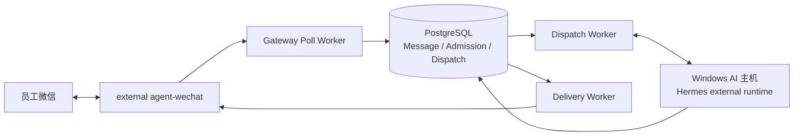

# 电商业务全自动化系统：项目总纲

- **文档版本：** V1.4
- **状态日期：** 2026-09-04
- **文档状态：** 当前基线
- **当前阶段：** 阶段 1 的企业消息 Runtime 里程碑已完成；文件基础链路仍在推进

## 总体目标

电商业务横跨微信沟通、文件收集、ERP、平台后台、仓储、物流和报表。本项目以 CFserver 为 Debian 部署宿主，以 `CF_agent-gateway` 与 PostgreSQL 为消息和控制状态权威，以 Windows AI 主机为 Agent 执行端：员工从原微信会话提交请求，系统先保存消息，再执行身份、权限、上下文和路由控制，由 Hermes 调用获准能力，并将可追踪结果返回原会话。

生产运行不持续依赖 GitHub 在线。消息、Checkpoint、身份、权限、路由、响应、投递、文件引用、日志和审计必须保留可恢复的权威状态。

## 当前总状态

> 企业消息与 AI 文本闭环基础已完成生产交付，项目进入文件服务、Skills 和业务系统集成阶段。

六阶段规划中的阶段 1 原本同时包含可靠消息链与文件基础链路。当前消息 Runtime 目标已经完成，但 FileBrowser 尚未部署和接入、完整媒体/文件链尚未交付，因此不把阶段 1 或整个项目标记为全部完成。

## 四层职责

| 层级 | 组件 | 当前职责与边界 |
| --- | --- | --- |
| 员工入口 | `CF_agent-wechat` | 外部微信通道 Runtime；维护登录、读取和发送，不决定企业身份、权限或 AI 路由 |
| 消息与控制 | `CF_agent-gateway` + PostgreSQL | Poll、Checkpoint、Message、Admission、Workspace、AI Thread、V2 Routing、Dispatch、Context、Response、Delivery、日志和审计权威状态 |
| Agent 执行 | Hermes external runtime | 在 Windows AI 主机执行 Agent 和模型调用；不覆盖 Gateway/PostgreSQL 权威记录 |
| 文件基础设施 | `CF_filebrowser-enterprise` | 唯一正式 File Service；当前 V1 Beta 已完成实现和自动化验证，但尚未在 CFserver 部署与生产验收 |

## 当前生产基线

### Gateway

- Repository branch authority：`main`；live tip 需动态查询。
- 2026-09-04 verified repository snapshot：`4f13039b86c60bc94340edb5468f0102d62d2dff`，仅表示 PR #8/#9 docs-only closeout 后的 dated snapshot。
- Production Release Git authority：`b488cf452584e73bc9b752564bf90ea153aa8d18`。
- Production-validated code：`f36c798294368263433f6132366ac9a864d9482b`。
- Release：`p1-observability-main-b488cf452584-20260903`。
- Database revision：`20260823_04`。
- 运行组件：PostgreSQL、Gateway API、Poll Worker、Dispatch Worker、Delivery Worker。
- P1 使用 Gateway 专属 `json-file 64m x 10` 日志策略。

### agent-wechat

- 生产行为采用 forced fresh QR、`restart: "no"`、loopback 6174、`cf-internal`、`ENABLE_VNC=0` 和只读 Token mount。
- agent-wechat 日志策略为 `json-file 20m x 3`，不得与 Gateway 混写。
- Repository branch authority：`main`；2026-09-04 promotion baseline 为 `02583fe76220916019ca961bb37dfa015640384e`，post-promotion docs snapshot 为 `69f07702b6ee16d8e9700b3a53d5ebbb8ee875f8`。
- PR #1/#4/#5/#6 均已合并，Fixture/CI 漂移和合并冲突已解决，main CI 通过。
- forced-QR R2 行为已经生产验证，但仓库合并没有重新构建或部署现场镜像；exact source/image mapping 仍未证明。
- Host、container 或 Runtime 重启后需要 fresh QR；Archive 只用于证据与审计，不自动恢复为 active Session。

### Hermes

- 当前生产文本链路已经真实调用 Hermes。
- AI 主机重启后，Hermes reachability 曾恢复一次，期间 CFserver 与微信 Session 未重启，不需要 fresh QR。
- 这不表示长期 watchdog、开机自启故障、告警、容量或高可用已经完整交付。

### FileBrowser

- `feat/v1-integration` 已完成 V1 Beta 核心实现与自动化验证。
- 尚未在 CFserver 部署，未完成迁移、备份恢复、回滚和真实 WebDAV/OnlyOffice 联调。
- 尚未接入微信、Gateway、Hermes 或企业资料主链。

## 当前生产文本链路

私聊与真正结构化 `@` 机器人的群聊文本闭环已通过；未明确 `@` 的普通群消息不会调用 AI。Gateway V2 的 `group_sender` 已实现并由自动化测试覆盖 sender identity 隔离，但同群多发送者隔离尚未单独完成生产对照验收。

## 已完成里程碑

- Gateway V2 production runtime、P1 observability、不可变镜像发布和回滚证据。
- 私聊/群聊文本链、Admission、Dispatch、Response、Delivery 和 self 防回环。
- Checkpoint generation、回退/rebase、历史前缀跳过、实时后缀单次处理。
- forced fresh QR 生产行为。
- CFserver 核心服务 reboot 恢复与 fresh QR 后重新放行。
- AI 主机 reboot 后 Hermes reachability 恢复。
- Gateway-only deployment 保持 agent-wechat Session。
- Context Runtime 和 Admin recovery 的仓库实现、自动化测试和部署代码。

## 尚未完成范围

- FileBrowser CFserver 部署、生产迁移、备份恢复、回滚和系统集成。
- 完整入站文件/图片理解、Hermes 多模态和出站 Artifact 回传。
- 引用正文自动注入 Hermes。
- General AI Provider routing、Skills Runtime、企业知识库/RAG。
- 旺店通、S6、寄样、库存、订单、物流、链接和报表自动化。
- PostgreSQL 实际 restore。
- agent-wechat automatic boot stop gate。
- Hermes 长期 watchdog、告警、容量和高可用。
- 生产业务权限矩阵和正式员工分批授权。
- 独立 OCR；阶段 1 按既定决定不建设。

## 设备与环境分工

| 环境 | 当前职责 |
| --- | --- |
| CFserver | Debian 物理部署宿主；承载 Gateway、PostgreSQL 和 external agent-wechat，消息与业务链权威状态由 Gateway/PostgreSQL 保存 |
| Windows AI 主机 | 承载 Hermes、后续 Skills 和 Windows 侧执行；不得用本地状态覆盖 CFserver |
| FileBrowser 目标环境 | 尚待 CFserver 部署决定与生产验收；正式文件访问必须经 File Service |
| 云服务器 | 后续按需提供受控入口或中转；当前不是生产消息链权威 |

## 六个建设阶段

1. **阶段 1：** 打通可靠的微信消息、身份权限、Hermes、回复投递与文件基础链路。
2. **阶段 2：** 寄样完整闭环与物流回传。
3. **阶段 3：** 旺店通库存、订单、物流与预警。
4. **阶段 4：** 快手做链接及平台高频操作。
5. **阶段 5：** 拼多多、天猫、京东、抖音、微信小店。
6. **阶段 6：** 报表、S6 查询及旺店通与 S6 对账。

阶段编号保持原定义。当前完成的是阶段 1 中的企业消息 Runtime 里程碑，剩余文件基础链路和后续业务能力按[当前进度与下一步](./status/current-progress.md)推进。

## 总体规划图

[XMind 源文件](./图表与附件/电商业务全自动化系统-总规划.xmind)与 PNG 是早期蓝图；与当前代码、生产证据或[技术决策记录](./05_技术决策记录.md)冲突时，以后者为准。

## 权威入口

- [当前状态矩阵](./status/current-status.md)
- [当前进度与下一步](./status/current-progress.md)
- [System Architecture](./architecture/system-architecture.md)
- [Deployment Guide](./deployment/deployment-guide.md)
- [Recovery Runbook](./operations/recovery-runbook.md)
- [Production Validation Checklist](./validation/production-validation-checklist.md)
- [2026-09-03 Production Closeout](./validation/records/2026-09-03-enterprise-runtime-production-closeout.md)
- [技术决策记录](./05_技术决策记录.md)
