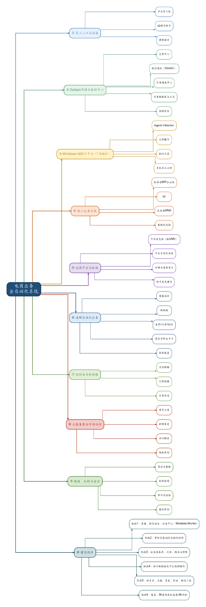

# 电商业务全自动化系统——项目总纲

- **文档版本：** V1.0
- **文档状态：** 已确认
- **当前阶段：** 阶段1——`agent-wechat` V1 入口与结构化 mention 已验证，Gateway 多项基础模块代码已实现，进入正式编排接线、任务与 Hermes 链路建设

## 背景与目标

电商业务横跨微信沟通、文件收集、ERP、平台后台、仓储、物流和报表。人工在多个窗口间重复录入、查询和回传，过程难追踪，异常也容易丢失。

项目目标是建立以 Debian 为权威控制中心、以 Windows AI 节点为执行端的自动化系统：员工在原微信会话提交任务，系统汇集上下文和附件，受控调用 Hermes 与 Skills，并将结果、状态和失败原因返回原会话，全程保留权限与审计记录。

## 项目范围

### 已确定的项目范围

- 以微信私聊和允许的群聊作为员工任务入口，结果返回原会话。
- 集中管理消息、上下文、任务批次、附件、文件、权限、日志和审计。
- 由 Windows AI 节点处理文档表格、浏览器、Windows 自动化及后续业务 Skills。
- 寄样、库存、订单、物流、分销链接和报表等业务按阶段建设。
- 不要求生产运行持续依赖 GitHub 在线。

### V1目标能力

- 接收微信私聊和群聊文本、引用消息及文件消息；其中私聊文本、群聊文本、引用消息、文件消息、ZIP 文件入口和文件获取已通过 `agent-wechat` V1 验证。合并转发消息当前可识别类型并获取发送人和外层标题，内部聊天记录展开与内部文件自动提取仍待开发；图片、Office、PDF、中文文件名和连续多附件等未覆盖场景仍待技术验证。
- 将同一意图的连续消息与附件合并为任务批次，避免逐条机械创建任务。
- 按优先级选择必要上下文，交由 Hermes 和授权 Skills 处理，并把结果返回原微信会话。
- 区分附件作为任务输入、直接保存和处理后归档，保留来源与结果关联。
- AI 节点离线或接口超时时，Debian 中已接收的消息、附件和任务不得丢失。
- 对用户、群、Skill 和文件操作实施权限检查，高风险动作需要人工确认。

## 当前固定技术基线

- Hermes 是唯一生产 Agent 框架。
- 不使用 OpenClaw。
- 模型计划使用 GPT-5.6 API。
- `agent-wechat` 计划部署在 Debian。
- Debian 是消息、上下文、任务、附件和审计的权威来源。
- Windows AI 节点负责 Hermes、Worker Bridge 和 Skills。
- 第一阶段不单独建设 OCR。
- `CF_filebrowser-enterprise` 是正式企业 File Service；FileBridge / `filebrowser-agentctl` 仅作为受控客户端，通过 File Service API 访问正式文件。
- FileBrowser Enterprise 与自动化主线并行推进；V1 Beta 核心服务端能力已实现，自动化对接和最终 Debian 部署仍待集成、待验证。

具体职责边界和决策原因分别见 [系统设计](./02_系统设计.md) 与 [技术决策记录](./05_技术决策记录.md)。

## 十个总体规划模块

| # | 模块 | 第一版定位 |
| --- | --- | --- |
| 1 | 员工入口与沟通 | 员工通过 AI 微信账号私聊或在允许的业务群内发起任务，结果返回原会话。 |
| 2 | Debian 存储与控制中心 | 承载微信接入、上下文、任务、附件、权限、日志和审计的权威状态。 |
| 3 | Windows AI 执行节点 | 一台起步、可扩展多台；运行 Hermes、Worker Bridge、Skills 和执行工具。 |
| 4 | 核心业务系统 | 按明确的数据职责使用旺店通 ERP、平台后台、S6 和旺店通 WMS。 |
| 5 | 电商平台与私域 | 规划覆盖快手、拼多多、天猫、京东、抖音、微信小店及后续私域平台。 |
| 6 | 高频自动化业务 | 分阶段建设寄样、做链接、库存/订单/物流、商品资料和经营报表。 |
| 7 | 端到端关联链路 | 连接消息、附件、任务、AI 执行、业务系统、结果回传和正式归档。 |
| 8 | 云服务器与外网访问 | **后续规划：** 提供加密中转或必要的 HTTPS 入口，具体隔离边界待确认。 |
| 9 | 数据、权限与安全 | 管理商品主数据、白名单、Skill 权限、高风险确认和全链路审计。 |
| 10 | 建设顺序 | 先打通可靠主链路，再按业务价值扩展平台和报表能力。 |

## 核心业务数据职责

| 系统 | 当前职责 |
| --- | --- |
| 旺店通 ERP | 电商库存、订单、物流和寄样订单。 |
| 平台后台 | 对应平台的专属状态。 |
| S6 | 财务、线下业务和对账。 |
| 旺店通 WMS | 仓库现场执行；前期不是主要自动化对象。 |

具体接口、字段和数据时效仍需在相应建设阶段验证。

## 设备与环境分工

| 环境 | 状态 | 职责 |
| --- | --- | --- |
| Debian 服务器 | **已确定** | 计划承载微信接入、上下文、任务、附件、文件服务、权限、日志和审计，并保存可恢复的权威状态。 |
| Debian 测试节点 `CF_wechat-lab` | **基础环境及 `agent-wechat` V1 入口验证已完成** | 运行在 Hyper-V 中，已验证微信登录、私聊/群聊文本、文件消息、ZIP 文件、引用消息、`sender`、`chatId` 和文件获取；合并转发消息已验证类型、发送人和外层标题识别。Gateway 尚未在该节点完成 Docker 构建或部署验证，控制面其余模块、Hermes Adapter 和其他业务服务仍待实施。 |
| 新 Windows AI 电脑 `AItest` | **基础环境已完成** | 当前用于 Codex、Git/GitHub 和局域网代理，后续运行 Hermes、Worker Bridge、GPT-5.6 API 调用、Skills 及文档、浏览器和 Windows 自动化。 |
| 当前开发电脑 | **已确定** | 并行承担 `CF_filebrowser-enterprise` V1 Beta 二次开发；该仓库交付正式企业 File Service。 |
| 正式存储服务器 `CFserver` | **已存在 / 待主线对接** | 提供正式存储；自动化访问仍须经过 File Service、权限检查和审计。 |
| 云服务器 | **后续规划 / 待确认** | 规划用于加密中转及必要的 HTTPS 反向代理，并与既有服务隔离。 |

## 六个建设阶段

1. **阶段 1：打通 V1 主链路。** 微信消息和附件 → Debian 持久化 → 上下文与任务中心 → Hermes Worker Bridge → Hermes 调用 GPT-5.6 → 结果返回原微信会话。
2. **阶段 2：** 寄样完整闭环与物流回传。
3. **阶段 3：** 旺店通库存、订单、物流与预警。
4. **阶段 4：** 快手做链接及平台高频操作。
5. **阶段 5：** 拼多多、天猫、京东、抖音、微信小店。
6. **阶段 6：** 报表、S6 查询及旺店通与 S6 对账。

阶段 1 基础测试环境已经完成：Windows AI 节点 `AItest` 与 Hyper-V Debian 测试节点 `CF_wechat-lab` 已具备固定局域网通信、SSH 管理、Docker/Compose 和受控代理出口。`agent-wechat` V1 微信入口及结构化 mention 已完成限定范围验证；合并转发消息已验证类型、发送人和外层标题识别，但内部聊天记录展开与内部文件自动提取仍待开发。`CF_agent-gateway` main commit `f0f0ea0cbcc1029104002b566912afabd23423c7` 已实现 Message Store 来源账号隔离、`event_id` 与来源物理消息双重幂等、`is_mentioned` / `is_self`、Identity Mapping、Employee Conversation Manager 所需的 Employee Workspace / AI Thread 与 Hermes Thread 绑定唯一性、Access Control 纯规则评估器及用户白名单 / 群策略 / Gateway 全局策略持久化，以及微信适配基础组件；当前全量 162 项测试通过。这些独立模块尚未通过 Adapter 到 Message Store 正式接线、Polling / Checkpoint 和 Admission Orchestrator 组成运行链路；Context Builder、Task Queue、Hermes / Worker Bridge 接入和端到端回传仍待实现。Gateway 已提供 Dockerfile 和 Compose 配置，但尚未完成镜像构建和部署验证；图片、Office、PDF、中文文件名、连续多附件、实时事件机制及合并转发内部解析增强也未宣称完成。模块代码已实现不等于正式接线、端到端运行或生产上线。环境配置详见[部署运维](./04_部署运维.md)，进度边界见[当前开发进度](./status/current-progress.md)和[agent-wechat V1 入口验证记录](./status/agent-wechat-validation.md)。

File Service 侧，`CF_filebrowser-enterprise` 已实现 V1 Beta 核心服务端能力；Share capability 前端 UI、剩余业务 Audit Action、最终 Debian 部署验收和 V1 Beta 最终 tag/candidate 仍待完成。代码实现不等于生产上线；V1 Beta 完成后，Gateway/Hermes 只通过稳定 File Service 契约进行对接。

## 总体规划图

[XMind 源文件](./图表与附件/电商业务全自动化系统-总规划.xmind) 是项目总蓝图；当其早期表述与后续确认的需求或 [技术决策记录](./05_技术决策记录.md) 不一致时，以后者为准。
