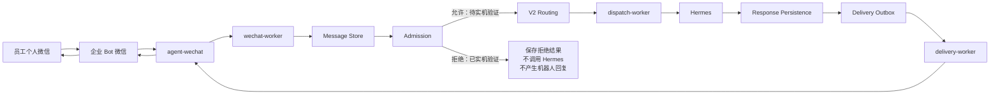
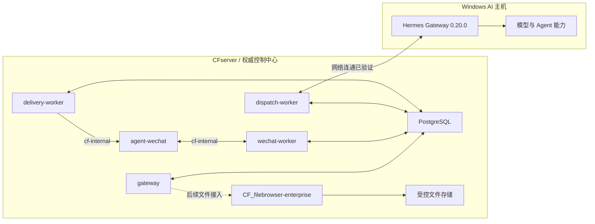
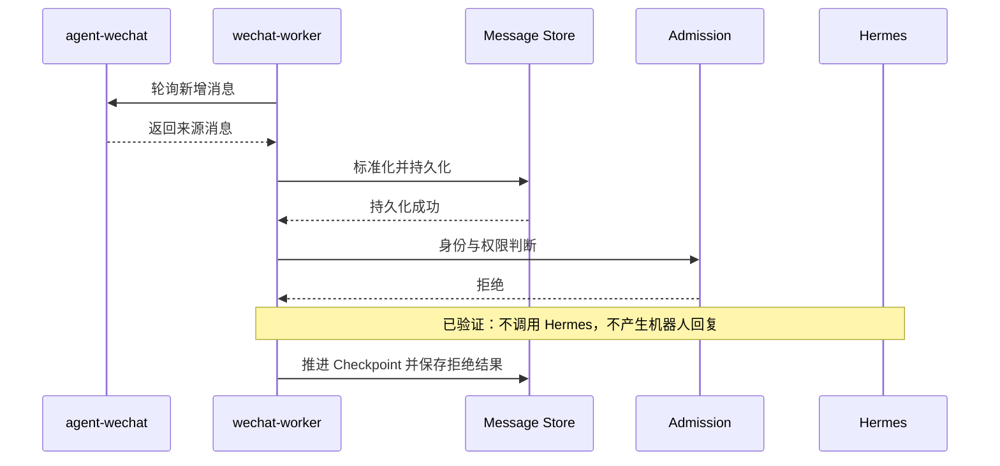

# 系统设计

> 状态日期：2026-08-13。本文件同时描述当前生产部署和目标行为。组件部署并保持 healthy 不等于授权后的端到端链路已经验收。

## 当前生产消息链路

图中从员工微信到 Admission 拒绝的生产路径已经实机验证。Admission Allowed 之后的 V2 Routing、Hermes 实际处理、Response Persistence、Delivery Outbox、`delivery-worker` 投递和微信收到回复均已部署或具备运行组件，但尚未以当前测试身份完成实机验证。

当前准确结论是：

> 微信消息发现、持久化、Checkpoint、未授权拒绝和 Hermes 网络连通已实机验证；授权后的完整 AI 回复闭环仍待验证。

较早的 V1 Staging 授权文本闭环只代表其特定日期和测试环境，不替代当前 CFserver 生产链路验收。

## 当前基础设施

- CFserver 上 PostgreSQL、`gateway`、`wechat-worker`、`dispatch-worker` 和 `delivery-worker` 五个 Gateway 服务均已部署并保持 healthy。
- `agent-wechat` 也部署在 CFserver，通过 `cf-internal` 容器网络向 Gateway 提供接口。
- CFserver 保存消息、Checkpoint、身份、权限、Workspace、AI Thread、路由、响应和投递的权威状态。
- Windows AI 主机运行 Hermes Gateway 0.20.0；CFserver 与 `dispatch-worker` 的网络访问已验证。
- Windows 登录启动项存在，但 AI 主机重启后 Hermes Gateway 没有可靠自动启动；人工启动后恢复。自启可靠性尚待收口。
- 文件存储在 CFserver 侧受控管理；正式文件能力后续接入 `CF_filebrowser-enterprise`。

## 组件职责

| 组件 | 负责 | 不负责 |
| --- | --- | --- |
| `agent-wechat` | 微信登录状态、消息读取、消息发送和 Gateway 接口 | 企业身份、权限、路由、AI 执行和权威业务状态 |
| `gateway` | 管理配置、身份、策略、Agent Profile、会话绑定和运行时控制 | 代替 Hermes 生成答案或直接操作业务系统 |
| `wechat-worker` | 3 秒轮询、标准化、Checkpoint、入站持久化和 Admission 触发 | 根据昵称猜测身份或绕过策略创建任务 |
| PostgreSQL | 保存 Message Store、Checkpoint、身份、权限、路由、响应和 Outbox 权威记录 | 保存凭证明文或由 Windows 本地状态覆盖 |
| `dispatch-worker` | 领取获准且完成 V2 Routing 的工作，调用 Hermes 并记录执行结果 | 派发被拒绝消息或自行放宽权限 |
| `delivery-worker` | 领取 Delivery Outbox 项并通过 `agent-wechat` 投递 | 在响应持久化前直接发送，或把执行成功等同于投递成功 |
| Hermes | Agent 执行、模型调用及后续 Skills 和工具选择 | 绕过 Gateway Admission、确认或 File Service |
| `CF_filebrowser-enterprise` | 企业文件访问、用户权限、Token/Share capability、WebDAV 与审计 | 允许 Gateway、Hermes 或 Skills 直连正式存储 |

## 微信入口与登录

`CF_agent-wechat` 使用 `docker/compose.cfserver.yaml` 部署。容器内部运行 Xvfb、fluxbox、dunst、WeChat 和 `agent-server`；生产配置为 `ENABLE_VNC=0`，不使用 VNC、noVNC、x11vnc、websockify 或宿主桌面 X11。

登录管理脚本和手机确认登录已实机通过。完全新设备经 SSH 展示二维码并扫码的场景尚未实机验证。底层部署与登录操作由 `CF_agent-wechat` 仓库维护，本仓库只记录架构边界和跨项目状态。

## Persist-first 与 Checkpoint

进入 Gateway 的员工消息遵循以下顺序：

- Persist-first 适用于进入 Gateway 的员工入站消息；权限只决定后续是否创建 AI 工作，不决定是否保留企业消息历史。
- 新消息持久化失败时不得进入 Admission 或 AI 执行链，也不得把该消息标记为已处理。
- 首次启用采用 `bootstrap_mode=latest`。当前已为 17 个现有聊天建立 Checkpoint，并把 151 条历史消息作为基线跳过。
- 基线跳过只建立同步高水位，不把历史消息写成新任务或调用 AI。
- 第一条新私聊身份发现消息已进入 Message Store，发送者和会话识别正确，Checkpoint 已推进。

## 身份、权限与 Admission

身份与权限顺序固定为：

1. 从平台、Bot 账号和稳定发送者 ID 定位 Source Identity。
2. 通过 Source Identity Mapping 得到 `enterprise_identity_id`。
3. 分别计算 User Access Policy 与 Gateway Access Policy。
4. 结合会话类型、结构化 mention、能力和风险形成 Admission 决定。
5. 只有 Admission Allowed 才解析 Workspace、AI Thread、Agent Profile 与后续路由。

当前测试发送者尚未建立 Enterprise Identity、Source Identity Mapping、两级 Access Policy、Agent Profile 和私聊 Conversation-AgentProfile Binding。因此当前验证止于 Admission Denied：消息保存，拒绝结果可追踪，Hermes 未被调用，机器人未回复。

昵称、备注、头像、群名或消息正文都不得用于自动合并企业身份或放宽权限。`enterprise_identity_id` 是 Gateway 内部权威身份主键；来源账号 ID 只作为映射输入。

## 物理微信会话与 AI 线程

Physical Conversation 是微信私聊或群聊窗口；Workspace 是企业身份拥有的逻辑工作区；AI Thread 是工作区内隔离上下文的逻辑线程；Agent Profile 定义获准使用的 Agent、模型和能力配置。它们不得混为一个 ID。

- 私聊线程以 Bot 账号和私聊会话为来源边界，并必须显式绑定 Conversation-AgentProfile，不能依赖隐式默认 Profile。
- 群聊线程以 Bot 账号、群会话和发送者为来源边界；同群不同员工的个人历史、任务、附件和结果必须隔离。
- 群聊进入 AI 链路时，除了身份和群策略允许，还要求原始结构化事实明确表示发送者 `@` 当前机器人。
- 不得从纯文本机器人名称、引用消息或上一条 mention 推断 `is_mentioned=true`。
- `enterprise_identity_id` 是身份、Workspace 与权限关联的权威主键；可选员工业务编号和来源账号 ID 都不能替代它。
- 一个 Enterprise Identity 拥有一个逻辑 Workspace，并可在其中拥有多个 AI Thread；拒绝消息不创建执行关系。
- `ai_thread_id` 是 Gateway 的稳定逻辑标识；Hermes Runtime Thread 标识可解绑或重建，不是系统权威主键。
- Allowed 路径与群聊在当前生产完成实测前不得宣称可用。2026-08-04 的 V1 Staging 群聊线程偏差只属于历史实现记录，不改变上述目标契约。

完整身份、Workspace 与线程规则见[员工工作区与 AI 会话线程设计](./design/employee-workspace-design.md)。

## 上下文选择与快照

构建 Hermes 输入时按以下优先级选择，并控制总量：

1. 当前消息。
2. 可获得的文字引用。
3. 当前任务批次附件及其元数据。
4. 同一员工在当前 AI Thread 内的最近消息。
5. 少量必要的群聊上下文。
6. 未完成的关联任务状态。

任务进入执行前生成不可变的 Context Snapshot，记录选入的消息、附件、任务状态、选择原因和版本。后续补充消息形成新快照版本，不改写已经开始执行的输入。窗口长度、截断和摘要规则仍待确认；当前生产尚未触发 Allowed 路径，快照生成与恢复仍待验收。

## 多消息与多附件任务批次

任务中心在同一 AI Thread 内聚合同一意图的相近消息和附件。显式完成、可识别的完整指令或超时可以触发收口；聚合窗口、跨时段补充和手动拆分规则仍待确认。

批次应支持多个消息与附件、补充、撤销、重复事件去重和歧义询问；收口后生成一个或多个可执行任务。批次 ID 与 Task ID 分离，避免把每条消息机械等同为一个任务。该节是目标设计，当前生产尚未完成授权路径与批次验收。

## CFserver 与 Windows AI 主机通信

- 两端通过公司内网 API 传递任务、状态和受控文件引用；大文件使用流式传输或 File Service，不以 Base64 填入普通任务 JSON。
- 调用应携带 `trace_id`、任务关联 ID、调用方身份、时效凭证和幂等键；具体传输鉴权与加密边界仍需按部署设计确认。
- Windows Worker 只能取得当前任务所需文件和 Skill 权限，不能挂载或扫描整个正式存储，也不能覆盖 CFserver 权威状态。
- 网络中断时 CFserver 继续持久化消息、任务和投递状态；Windows 恢复后按权威记录继续。
- 当前仅验证 CFserver 与 `dispatch-worker` 可访问 Hermes Gateway；真实 Dispatch、结构化载荷和文件传输仍待验证。

## V2 Routing 与 Hermes Dispatch

V2 Routing 在 Admission Allowed 后，根据 Conversation-AgentProfile Binding、任务所需能力、权限和 Provider 状态形成可追踪的路由决定。`dispatch-worker` 只能领取已获准并完成路由的工作。

Hermes Gateway 0.20.0 当前网络可达，但本轮未收到获准测试消息。因此以下项目仍待验证：

- Admission Allowed 是否产生预期 Workspace、AI Thread 和 Profile 绑定。
- V2 Routing 是否选择正确 Agent Profile 和 Hermes Provider。
- `dispatch-worker` 是否实际调用 Hermes。
- Hermes 是否处理测试消息并返回可持久化响应。

网络探测成功不等于 Hermes Dispatch 或 Agent 处理成功。

## Hermes 结构化输入输出

Hermes 输入使用版本化结构，至少关联 trace、任务、Enterprise Identity、Physical Conversation、Workspace、AI Thread、Agent Profile、权限约束、Context Snapshot 和附件引用；大文件只传受控引用与元数据。Hermes Runtime Thread 标识不得替代 Gateway 的 `ai_thread_id`。

输出至少区分完成、需要澄清、等待确认、可重试失败和最终失败，并携带面向用户的摘要、结构化动作结果、产物引用、错误分类和建议下一步。自由文本不能替代任务状态、文件记录或审计事件。当前只验证了网络连通，真实结构化输入输出仍待生产测试；详细事件契约见[Hermes 事件模型](./design/hermes-event-schema.md)。

## 响应持久化与 Delivery Outbox

响应链采用持久化后投递：

1. `dispatch-worker` 接收 Hermes 结果。
2. Gateway 保存 Response Persistence 记录。
3. 为目标 Bot 账号与原 Physical Conversation 创建 Delivery Outbox 项。
4. `delivery-worker` 领取 Outbox 项。
5. `agent-wechat` 向原微信会话发送。
6. Gateway 分别记录执行结果和投递结果。

`delivery-worker` 已部署并保持 healthy，但当前拒绝路径不会创建响应或 Outbox 项。Response Persistence、Delivery Outbox、失败重试、幂等投递和微信收到真实 AI 回复仍待实机验证。

## 附件生命周期

1. `agent-wechat` 提供来源消息、附件元数据和可用下载接口，`wechat-worker` 先登记来源与入站状态。
2. 附件元数据遵循 Persist-first；未授权消息可保留来源事实，但附件不得关联 AI 执行上下文或发送给 Hermes。
3. 获准附件进入受控临时区后校验哈希、大小、类型、安全限制和重复项，再关联任务批次及输入、参考或模板用途。
4. Windows Worker 通过受控 File Service 客户端取得当前任务所需的短期文件引用，在隔离工作区处理。
5. 输出回到 CFserver，登记产物类型、哈希、父文件和任务关系；需要时再进入 Delivery Outbox。
6. 经权限与归档规则确认后，原件和最终产物通过 `CF_filebrowser-enterprise` 进入正式逻辑位置；临时文件按保留策略清理。

图片、文件、引用消息、中文文件名、连续多附件、大小边界、失败重试、压缩包安全和当前生产端到端文件链路均待实机验证。第一阶段不建设独立 OCR。

## 状态机、幂等、重试与恢复

- 消息、任务批次、Task、Hermes 执行、Response Persistence 和微信投递分别记录状态，不用一个“成功”覆盖所有阶段。
- Task 的逻辑主状态为 `queued -> running -> succeeded / failed / cancelled`；聚合、等待确认、等待附件和待恢复使用批次状态或阻塞原因表达。
- 微信事件、Task 领取、业务写操作与投递分别建立幂等边界；“重试任务”不等于无条件重复业务动作。
- 只对可判定为暂时性且安全的错误自动重试；结果未知、部分成功或高风险操作转人工确认。
- 每次执行、重试、确认和投递追加记录，不覆盖历史审计事实。完整状态转换见[Task Queue 设计](./design/task-queue-design.md)。

## 核心数据对象

| 数据对象 | 核心用途与当前边界 |
| --- | --- |
| Bot Account、Conversation、Participant | 标识企业 Bot、物理会话和来源发送者 |
| Message、Checkpoint、Message Reference | 保存标准化消息、同步高水位和引用关系；当前入站与拒绝路径已验证 |
| Enterprise Identity、Source Identity Mapping、Access Policy | 建立权威身份与两级权限；当前测试发送者尚未配置 |
| Workspace、AI Thread、Conversation-AgentProfile Binding | 隔离员工逻辑上下文并绑定 Agent Profile；当前 Allowed 路径待验证 |
| Routing、Dispatch、Runtime Thread Binding | 保存路由与 Hermes 执行关联；当前仅网络连通已验证 |
| Response、Delivery Outbox、Delivery Attempt | 分离响应持久化与微信投递结果；当前生产待验证 |
| Attachment、File Reference | 关联来源消息、任务用途、受控文件引用和产物；当前生产文件链待验证 |
| Task Batch、Task、Task Attempt、Context Snapshot | 表达聚合、执行、重试和实际输入快照；当前生产授权链待验收 |
| Confirmation、Audit Event | 保存高风险确认与追加式审计事实 |

唯一键、索引、保留周期和拆表方式由对应 Gateway 设计与数据库 migration 管理。本表是总体数据边界，不代表每个 Allowed 侧对象已经在当前生产实机产生；PostgreSQL 已部署并保持 healthy。

## 文件能力边界

`CF_filebrowser-enterprise` 保持其既有项目状态和职责，不因本次微信运行时收口而改变。后续文件能力必须遵循：

- `CF_filebrowser-enterprise` 是唯一正式企业 File Service。
- Gateway、Hermes、Skills、FileBridge 和 `filebrowser-agentctl` 只能调用受控 File Service API。
- 正式文件访问必须通过用户权限、最小 Token capability、Share effective capability 和审计。
- 未授权消息可保留附件元数据，但附件不得进入 AI 工作区或发送给 Hermes。
- 不得直连、挂载或遍历正式存储，不得建设第二套 File Service。
- 第一阶段不建设独立 OCR；图片、文件、引用消息和企业资料接入在授权文本闭环后验证。

## 安全与可靠性

- Token、API Key 和数据库密码不得写入普通 YAML、Git、任务正文或普通日志。
- 运行凭证仅通过 root-only 文件、未提交的 `.env` 或受控密钥机制注入。
- PostgreSQL、Gateway 配置或策略变更前必须备份，并确认恢复路径可用。
- CFserver 是权威状态源；Windows AI 主机离线或重启不得造成已接收消息丢失。
- AI 执行成功与微信投递成功是两个状态，不能互相替代。
- 所有重试必须有幂等边界；结果未知或高风险操作转人工确认。
- Hermes Gateway 开机自启尚未可靠，健康检查必须独立覆盖 Windows AI 主机。

## 当前状态与下一步

组件状态、限制和严格的 18 步下一阶段顺序见[当前状态矩阵](./status/current-status.md)。当天生产证据见[微信运行时阶段收口记录](./status/2026-08-13-wechat-runtime-closeout.md)。

更详细的逻辑边界见[Gateway 架构](./architecture/gateway-architecture.md)、[微信与 Hermes 集成](./architecture/wechat-hermes-integration.md)、[Message Store 设计](./design/message-store-design.md)、[Access Control 设计](./design/access-control-design.md)和[员工工作区与 AI 会话线程设计](./design/employee-workspace-design.md)。这些专题中的历史 Staging 结论必须按其日期理解，不能覆盖本文件的当前生产状态。
