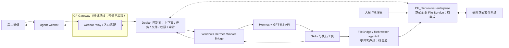
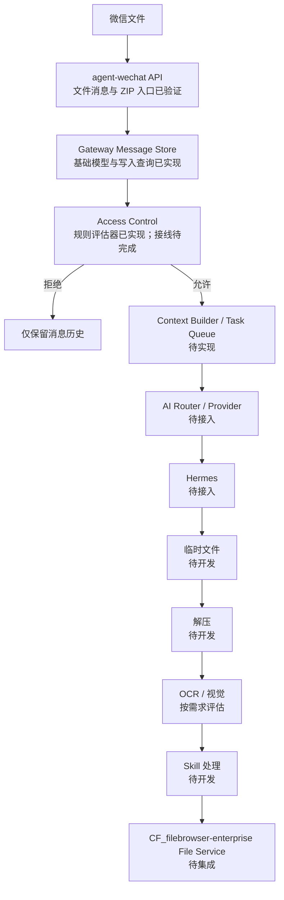

# 系统设计

> 本设计描述准备采用的实现边界。组件职责与权威来源为**已确定**；`CF_agent-gateway` main commit `f0f0ea0cbcc1029104002b566912afabd23423c7` 已落地 Message Store 来源账号隔离与双重幂等、Identity Mapping、Employee Workspace / AI Thread、Access Control 与微信适配等当前已确认基础模块，结构化 mention 和身份归属边界以当前验证与设计记录为准；正式编排接线、生产数据库与队列选型、接口字段、部署参数及端到端链路仍为**待实现 / 待确认**。`CF_filebrowser-enterprise` 的 V1 Beta 核心服务端能力**已实现**，自动化主线对接**待集成**，最终 Debian 部署**待验证**。上述代码实现均不代表端到端运行或生产上线。

## 总体架构与主链路

主链路是：接收微信事件和附件，校验来源并形成任务批次，固化上下文快照，排队派发给 Windows Worker，Hermes 调用授权 Skill，结果先回到 Debian 持久化，再由微信接入层发送到原会话。Debian 保持权威状态，Windows 节点可替换、可离线恢复。

CF Gateway 是本文对消息路由、安全隔离及其与 Debian 控制面衔接边界的架构称呼；[Gateway 架构](./architecture/gateway-architecture.md)、[Message Store](./design/message-store-design.md)、[Access Control](./design/access-control-design.md)、[Task Queue](./design/task-queue-design.md)和[员工工作区与 AI 会话线程设计](./design/employee-workspace-design.md)已形成设计基线。`CF_agent-gateway` 已实现 Python 3.12 + FastAPI 工程基础、Message Store 来源账号隔离与双重幂等、Identity Mapping、Employee Workspace、AI Thread、Hermes Thread 绑定唯一性、Access Control 纯规则评估器与三类策略持久化，以及微信适配基础组件；这不表示完整 Gateway、端到端链路或生产部署已经完成。

## 组件职责边界

| 组件 | 负责 | 不负责 |
| --- | --- | --- |
| `agent-wechat` | 微信登录态下的消息收发、可用元数据和附件获取 | 权威上下文、权限、任务状态、业务执行 |
| CF Gateway（逻辑边界） | 消息路由、安全隔离，并衔接微信适配与权威控制面 | AI 思考、业务决策、直接执行企业系统操作 |
| `wechat-relay` | 事件标准化、来源事实提取、去重、回传适配 | 决定企业身份、业务结果或直接放宽权限 |
| Identity Mapping | 以平台、来源账号和发信人稳定 ID 映射 `enterprise_identity_id` 及可选 `employee_id` | 创建或返回 `workspace_id`、根据昵称合并员工、授予任务或 Skill 权限 |
| Employee Conversation Manager | 在身份映射成功且 Access Control 允许创建 Task 后解析或创建 Employee Workspace / 员工工作区、AI Thread / AI 会话线程及来源绑定 | 为拒绝消息创建执行关系、为每名员工启动独立 Hermes 进程、扩大权限范围 |
| Context Builder | 按员工、线程、任务和权限检索有限消息并生成上下文快照 | 永久塞入全部群历史、跨员工混合个人上下文、执行业务动作 |
| 任务中心 | 批次收口、状态机、派发、幂等、重试、超时和恢复 | 直接控制微信客户端或业务界面 |
| `CF_filebrowser-enterprise`（正式企业 File Service） | 提供人员界面与受控 API，负责文件访问、Token/Share capability、Archive/Extract 安全和自身 Audit | 允许任何调用方绕过权限、capability、Audit 或 API 直接访问正式存储 |
| FileBridge / `filebrowser-agentctl` | 作为受控客户端传递文件引用并调用稳定 File Service API | 自行授权、扩大 capability、直接访问正式存储或成为第二套 File Service |
| Hermes Worker Bridge | Worker 心跳、领取任务、通过受控客户端传递文件引用、运行隔离、回报状态 | 成为任务和文件的权威来源，或绕过 File Service API |
| Hermes | 理解意图、规划步骤、选择授权 Skill、生成结构化结果 | 绕过确认、权限或 File Service |
| Skills | 封装文档处理、浏览器、Windows 或业务系统的确定性能力 | 自行扩大权限或保存密钥到仓库 |

截至 2026-08-01，`agent-wechat` V1 微信入口验证已经完成：微信登录、私聊文本、群聊文本、文件消息、ZIP 文件、引用消息、`sender` 识别、`chatId` 识别和文件获取均已验证；群聊结构化 mention 的三组对照样本也已验证。合并转发消息已验证类型识别、发送人获取和外层标题获取，但尚不能展开内部聊天记录或自动提取内部文件。

`CF_agent-gateway` main commit `f0f0ea0cbcc1029104002b566912afabd23423c7` 已实现：Message Store 来源账号隔离，`event_id` 与来源物理消息双重幂等，`is_mentioned` / `is_self` 标准化字段，Identity Mapping，Employee Workspace，AI Thread，Hermes Thread 绑定唯一性，Access Control 纯规则评估器，用户白名单、群策略和 Gateway 全局策略持久化，`agent-wechat` HTTP Client，微信消息标准化，媒体 JSON / Base64 解码，文本消息真实发送字段，以及微信系统消息解析；当前全量 162 项测试通过。

这些是独立代码能力，不是已经运行的主链路。Adapter 到 Message Store 正式接线、Polling 与 Checkpoint、Admission Orchestrator、Context Builder、Task Queue、Hermes 接入和端到端回传仍未实现；Worker Bridge、Skills、ERP/S6 接口、实时事件机制、合并转发解析增强和完整端到端联调也未完成。具体边界见[当前开发进度](./status/current-progress.md)和[agent-wechat V1 入口验证记录](./status/agent-wechat-validation.md)。

截至 2026-08-03，`CF_filebrowser-enterprise` 已实现 V1 Beta 核心服务端能力，但尚未完成 Share capability 前端 UI、全部业务 Audit Action、自动化主线对接、最终 Debian 部署验收或 V1 Beta 最终 tag/candidate。该实现状态不改变上述 Gateway、Hermes、Skills 或 ERP/S6 的现有进度。

## 微信消息获取方式

- **当前已验证：** 通过 `agent-wechat` API 读取微信消息及入口元数据。
- **当前已验证：** 当前机器人显示名为 `Bot_测试版` 时，从微信成员列表选择该机器人会得到 `isMentioned=true`；真实 `@` 其他成员或只复制 / 输入 `@Bot_测试版` 文字时该字段缺失。
- **固定标准化规则：** `is_mentioned = raw.get("isMentioned") is True`；字段缺失按 `false`。不得根据正文 `@`、`Bot_测试版`、旧名称 `1024`、引用消息或上一条 mention 推断或继承。
- **待研究：** WebSocket 实时事件的可用接口、事件范围、断线重连、去重和补偿机制。当前不得将 WebSocket 实时事件写成已完成能力。

## 物理微信会话与 AI 线程

Physical Conversation / 物理会话是微信中的群或私聊窗口；AI Thread / AI 会话线程是系统用于隔离上下文的逻辑标识，两者不是一一对应。Enterprise Identity / 企业身份是 Gateway 维护的稳定员工身份，Employee Workspace / 员工工作区是以该身份为所有者的顶层逻辑容器：

- **群聊线程键（已确定）：** `bot_account_id + group_chat_id + sender_id`。同群不同发信人默认隔离。
- **私聊线程键（已确定）：** `bot_account_id + private_chat_id`。
- `enterprise_identity_id` 是 Gateway 内部不可变的企业身份主键，也是身份、工作区和权限关联的权威主键。
- `employee_id` 是可空的公司员工编号、HR 编号或业务人员编号，不是 Gateway 内部主键，也不得用微信 `wxid` 代替。
- Identity Mapping 以 `source.platform + source.account_id + sender.id` 为输入，只输出 `enterprise_identity_id` 和可选 `employee_id`；展示名称不能用于授权或自动合并员工，也不由该模块创建或返回 `workspace_id`。
- Employee Conversation Manager 只在身份映射成功且 Access Control 允许创建 Task 后解析或创建 `workspace_id` 和 `ai_thread_id`。
- 消息被拒绝时继续保存消息和身份解析结果，但不创建 Task、不建立执行上下文，也不自动创建新的 AI Thread 执行关系。
- 一个 Enterprise Identity / 企业身份拥有一个逻辑 Employee Workspace / 员工工作区；一名员工可以在该工作区内拥有一个私聊线程和多个群聊来源线程。
- 一个 Hermes 服务承载多个 Employee Workspace / 员工工作区，不为每名员工部署独立 Hermes 进程。
- 不同员工的个人消息、任务和上下文默认隔离；企业知识、授权 Skills、文件和企业系统能力只能在当前权限范围内共享。
- 消息仍保留 Physical Conversation / 物理会话 ID，结果路由回原窗口；任务批次、上下文快照、员工身份、工作区和 AI Thread / AI 会话线程单独关联。
- Gateway 生成并保存稳定的 `workspace_id` 和 `ai_thread_id`，并以 `enterprise_identity_id` 关联工作区所有者。Hermes Runtime Thread / Hermes 运行时线程的 `hermes_thread_id` 可为空、可重建、可随 Provider 切换而变化，不是系统权威主键。
- 跨线程合并、代办或多人协同属于**后续规划**，必须有显式授权和业务规则。

Gateway / Debian 控制面是 Enterprise Identity / 企业身份、Employee Workspace / 员工工作区、AI Thread / AI 会话线程、消息、上下文、Task 和结果路由的权威来源。AI 机未来可提供按员工区分的 Hermes 工作台，但该界面是受控展示和操作入口，不是权威状态源，也不改变“一套 Hermes 服务 + 多个员工工作区 + 每个工作区多个 AI Thread”的关系。完整设计见[员工工作区与 AI 会话线程设计](./design/employee-workspace-design.md)。

## 上下文选择与快照

构建 Hermes 输入时按以下优先级选择，并控制总量：

1. 当前消息。
2. 可获得的文字引用。
3. 当前任务批次附件及其元数据。
4. 同一员工在当前 AI Thread / AI 会话线程内的最近消息。
5. 少量必要的群聊上下文。
6. 未完成的关联任务状态。

任务进入执行前生成不可变的上下文快照，记录选入的消息、附件、任务状态、选择原因和版本。后续补充消息形成新快照版本，不悄悄改写已开始执行的输入。窗口长度、截断和摘要规则为**待确认**。

## 多消息、多附件任务批次

任务中心先建立“聚合中”的批次，将同一 AI 线程内相近时间、同一意图的消息和附件关联。显式“发送完毕”、可识别的完整指令或聚合超时可触发收口；聚合窗口、跨时段补充和手动拆分规则为**待确认**。

批次必须支持：多个消息与附件、补充说明、撤销、重复事件去重、歧义询问，以及收口后生成一个或多个可执行任务。批次 ID 与执行任务 ID 分离，避免一条消息等于一个任务。

## 附件生命周期

1. `agent-wechat` 获取附件，`wechat-relay` 登记来源消息与下载状态。
2. 文件先进入 Debian 受控临时区；`CF_filebrowser-enterprise` File Service 计算哈希，校验大小、类型、安全限制和重复项。
3. 文件记录始终关联来源消息；只有获准消息才进一步关联任务批次和逻辑用途，不用文件名作为唯一标识。
4. Windows Worker 经 FileBridge / `filebrowser-agentctl` 调用 File Service API，取得短期授权的文件流或路径引用，在隔离工作区处理；该自动化链路当前**待集成**。
5. 输出回传 Debian，登记哈希、产物类型、父文件和任务；微信侧发送所需结果。
6. 经权限和归档规则确认后，原件与最终产物进入正式逻辑路径；临时文件按保留策略清理。

`agent-wechat` 的文件消息和 ZIP 文件入口已经完成 V1 验证，但图片、Office、PDF、中文文件名、连续多附件、大小边界和失败重试等场景仍为**待技术验证**。ZIP 文件能够进入微信入口不代表自动解压、内容解析或归档链路已经完成；压缩包解包限制、恶意内容检查和保留周期仍为**待确认**。

合并转发消息属于增强解析能力。当前只能识别该消息类型并取得发送人和外层标题，不能展开内部聊天记录或自动提取其中的文件；后续可在入口适配层增加 `forward parser`。这一限制不改变普通微信文件经 `agent-wechat` 进入后续 Hermes 处理链路的架构方向，也不代表 Hermes Adapter 已经实现。

文件处理目标顺序如下；Message Store、Identity Mapping、工作区 / 线程和 Access Control 已有独立代码实现，但正式编排接线尚未完成，图示流程仍未端到端运行：

该图表达未来功能处理顺序。所有消息和附件元数据先由 Message Store 保存，只有获准消息才创建 Task 并取得 Hermes 文件上下文；附件二进制长期保留由独立存储策略决定。实际实现仍必须经过 CF Gateway、Debian 权威控制面和 File Service 的权限与审计边界；第一阶段不建设独立 OCR。

## Debian 与 Windows AI 节点通信

- **已确定：** 两端通过公司内网 API 传递任务、状态和文件授权信息；大文件使用流式上传/下载或受控文件服务，不以 Base64 塞入任务 JSON。
- 所有调用携带 `trace_id`、`task_id`、调用方身份、时效凭证和幂等键；传输鉴权与加密方式待安全设计确认。
- Worker 只取得当前任务所需文件和 Skill 权限，不挂载或扫描整个正式存储。
- FileBridge / `filebrowser-agentctl` 只按稳定契约提交调用方身份、受控凭证、文件引用和请求关联标识；`effective` capability、权限判断和 Audit 记录均由 File Service 服务端负责，客户端不得自行推导或扩大权限。V1 Beta 完成后，Gateway/Hermes 只依赖稳定 File Service 契约。
- 网络中断时 Debian 继续持久化消息、附件和任务；Windows 恢复后续租或重新领取，不依赖本地未同步状态。

## 状态机、幂等、重试与恢复

Task 主状态统一为：

`queued → running → succeeded / failed / cancelled`

`已接收`、`聚合中` 属于任务批次状态，不属于 Task 主状态。`等待确认`、`等待附件` 和 `待恢复` 使用阻塞原因、附件状态或租约状态表达；满足条件后 Task 保持或回到 `queued`，再进入 `running`。可安全重试的执行失败结束当前 attempt 后回到 `queued`，只有不可重试或重试耗尽才进入终态 `failed`。

完整状态转换、重试和取消边界见[Task Queue 设计](./design/task-queue-design.md)。

- 微信事件按机器人账号与平台事件标识去重；缺少稳定事件标识时使用来源会话、发送人、时间、内容和附件指纹组合，具体键待验证。
- 业务写操作必须使用业务幂等键或先查后写；“重试任务”不等于无条件重复业务动作。
- 仅对可判定为暂时性且安全的错误自动退避重试；高风险、结果未知或部分成功时转人工确认。
- **已确定：** 每次执行、重试、确认和回传均追加记录，不覆盖历史审计事件；这是全系统目标契约，不表示 File Service 之外的所有业务 Audit Action 已实现。

## 初步核心数据表

以下是 V1 概念清单，不代表数据库产品或全部字段已经定稿。当前代码已实现 Conversation / Message / Attachment、企业身份、员工工作区、AI Thread 与 Hermes Thread 唯一绑定等基础实体或能力；Task、上下文快照和结果回传等仍待实现：

| 数据对象 | 核心用途 |
| --- | --- |
| `bot_account`、`chat`、`participant` | 微信机器人、Physical Conversation / 物理会话与来源发信人身份 |
| `enterprise_identity`、`source_identity_mapping` | Enterprise Identity / 企业身份及来源平台账号的显式映射 |
| `employee_workspace` | 以企业员工身份为所有者的顶层逻辑工作区 |
| `ai_thread`、`thread_source_binding` | 员工工作区内的稳定逻辑线程及其 Physical Conversation / 物理会话绑定 |
| `message`、`message_reference` | 原始消息、标准化内容和文字引用关系 |
| `file_record`、`message_attachment` | 文件元数据、哈希、逻辑路径、来源和关联 |
| `task_batch`、`batch_item` | 多消息、多附件聚合及收口状态 |
| `task`、`task_attempt` | 可执行任务、状态、租约、重试和 Worker |
| `context_snapshot` | 某次执行实际使用的消息、附件和状态版本 |
| `confirmation` | 高风险操作的请求、决定、人员和有效期 |
| `result_delivery` | 结果内容、目标会话、发送尝试和最终状态 |
| `audit_event` | 权限判断、文件访问、执行动作和状态变化 |

唯一键、索引、保留周期和拆表方式需在剩余附件场景、实时事件方式和消息边界验证后确定。

此处 `audit_event` 是 Gateway V1 概念对象，不等同于 `CF_filebrowser-enterprise` 的 Persistent Audit Store；两者后续通过稳定接口和关联标识衔接。

## Hermes 结构化输入输出

Hermes 输入应是版本化结构，至少包含 `trace_id`、`task_id`、`enterprise_identity_id`、可选 `employee_id`、`workspace_id`、`ai_thread_id`、可选 `hermes_thread_id`、来源 Physical Conversation / 物理会话、当前指令、上下文快照引用、附件引用、允许的 Skills、权限约束和确认状态。大文件只传引用和元数据。`hermes_thread_id` 只表示 Hermes Runtime Thread / Hermes 运行时线程绑定，不得替代 `ai_thread_id`。

输出至少区分：完成、需要澄清、等待确认、可重试失败和最终失败；包含面向用户的摘要、结构化动作结果、产物引用、错误分类和建议下一步。自由文本不能替代任务状态、文件记录或审计事件。

## 文件与权限安全边界

- Debian 的任务数据库是任务与文件引用关联的权威；`CF_filebrowser-enterprise` 是正式文件访问、capability 校验和自身 Audit 的权威 File Service。Hermes 与 Skills 使用最小授权、短时凭证和任务级工作区。
- 微信登录数据、API 密钥、Cookie 和业务系统凭证只在受控密钥机制中使用，不进入仓库、任务正文或普通日志。
- 文件下载、读取、写入、移动、覆盖和删除都要按身份、任务、逻辑路径与动作校验；高风险动作二次确认。
- 日志默认记录元数据和结果，不无条件复制文件正文或敏感字段；审计记录不可由普通 Worker 改写。
- Gateway、Hermes、Skills、FileBridge 和 `filebrowser-agentctl` 不得直接授予或取得绕过 File Service 的访问，也不得绕过文件权限、Token capability、Share capability 或 Audit。

## FileBrowser Enterprise、File Service 与文件系统

真实文件系统保存实际数据；`CF_filebrowser-enterprise` 同时提供人员访问界面和自动化受控 API，是唯一的正式企业 File Service。FileBridge / `filebrowser-agentctl` 是它的受控客户端，不是另一套 File Service。所有入口使用同一套身份、路径、capability 和 Audit 规则。

| 状态 | 当前边界 |
| --- | --- |
| **已确定** | Gateway、Hermes、Skills 和受控客户端只通过 File Service API 访问正式文件；V1 Beta 完成后，自动化主线只按稳定 File Service 契约集成。 |
| **已实现** | API Token hash-only 存储、旧 Token/Key V5 migration、迁移失败关闭和 Token 明文仅创建时一次性展示。 |
| **已实现** | Browse / Preview / Download 三权 UI，Archive / Extract 权限与文件系统安全，Share `configured` / `effective` capability 服务端契约，以及密码 Share Token 绕过关闭。 |
| **已实现** | Persistent Audit Store、Audit V3 migration、request-scoped Audit Recorder、API Token 创建/撤销/拒绝 Audit、管理员 `GET /api/audit`，以及 Audit 过滤、Cursor 和日志脱敏。 |
| **待集成** | Share capability 前端 UI；登录、用户、权限、Share 管理 Audit；核心文件和 Archive Audit Action；WebDAV / OnlyOffice Audit Action；FileBridge、Gateway 与 Hermes 对接。 |
| **待验证** | 最终 Debian 部署验收、共享存储布局与生产挂载、备份恢复、冲突处理，以及 V1 Beta 最终 tag/candidate。当前尚未正式生产部署。 |

Token 明文不落库且无法再次取回；Share 的 `configured` 表示配置值，`effective` 才是服务端计算的实际生效 capability，任何客户端都不得依据 `configured` 自行提权。Audit Store 和 Recorder 已实现只说明审计基础设施可用，不能据此宣称所有业务操作已经具备 Audit Action。实现依据和剩余项见[当前开发进度](./status/current-progress.md)。

## 待选技术项

| 项目 | 当前结论 |
| --- | --- |
| Debian 服务编程语言与 Web 框架 | **已实现基础：** `CF_agent-gateway` 使用 Python 3.12 + FastAPI；其他服务是否复用仍待确认。 |
| 任务队列产品 | **待定：** 需满足持久化、租约、延迟重试、可观测和离线恢复。 |
| 数据库产品与版本 | **已实现基础 / 生产待定：** SQLAlchemy 已支持 SQLite 自动建表和 PostgreSQL 配置兼容；生产数据库选型、版本、migration、备份与恢复仍待确认。 |
| 对象/文件存储实现 | **已确定：** 正式企业 File Service 使用 `CF_filebrowser-enterprise`；底层存储布局、冲突处理、生产挂载和备份恢复仍**待验证**。 |
| API 鉴权、证书与端口 | **待确认：** 纳入 Debian/Windows 部署边界评审。 |
