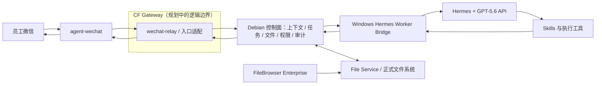
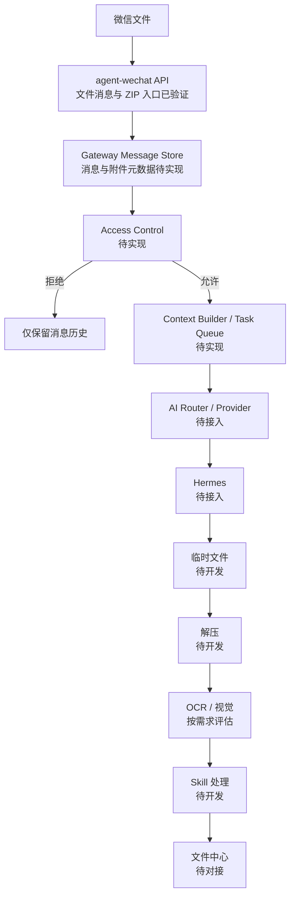

# 系统设计

> 本设计描述准备采用的实现边界。组件职责与权威来源为**已确定**；语言、数据库产品、队列产品、接口字段和部署参数仍为**待定 / 待确认**。

## 总体架构与主链路

主链路是：接收微信事件和附件，校验来源并形成任务批次，固化上下文快照，排队派发给 Windows Worker，Hermes 调用授权 Skill，结果先回到 Debian 持久化，再由微信接入层发送到原会话。Debian 保持权威状态，Windows 节点可替换、可离线恢复。

CF Gateway 是本文对消息路由、安全隔离及其与 Debian 控制面衔接边界的架构称呼；[Gateway 架构](./architecture/gateway-architecture.md)、[Message Store](./design/message-store-design.md)、[Access Control](./design/access-control-design.md)和[Task Queue](./design/task-queue-design.md)已形成设计基线，代码与部署仍待实施。Gateway 不预先限定为一个同名程序；其内部是否由 `wechat-relay` 和其他控制面服务分别承担，需在实现设计中确认。

## 组件职责边界

| 组件 | 负责 | 不负责 |
| --- | --- | --- |
| `agent-wechat` | 微信登录态下的消息收发、可用元数据和附件获取 | 权威上下文、权限、任务状态、业务执行 |
| CF Gateway（逻辑边界） | 消息路由、安全隔离，并衔接微信适配与权威控制面 | AI 思考、业务决策、直接执行企业系统操作 |
| `wechat-relay` | 事件标准化、来源映射、去重、回传适配 | 决定业务结果、直接放宽权限 |
| 上下文服务 | AI 线程映射、最近消息检索、上下文快照 | 永久塞入全部群历史、执行业务动作 |
| 任务中心 | 批次收口、状态机、派发、幂等、重试、超时和恢复 | 直接控制微信客户端或业务界面 |
| File Service | 文件登记、受控上传下载、逻辑路径、哈希、权限和审计 | 让 Hermes 任意遍历正式存储 |
| Hermes Worker Bridge | Worker 心跳、领取任务、传递文件引用、运行隔离、回报状态 | 成为任务和文件的权威来源 |
| Hermes | 理解意图、规划步骤、选择授权 Skill、生成结构化结果 | 绕过确认、权限或 File Service |
| Skills | 封装文档处理、浏览器、Windows 或业务系统的确定性能力 | 自行扩大权限或保存密钥到仓库 |

截至 2026-07-31，`agent-wechat` V1 微信入口验证已经完成：微信登录、私聊文本、群聊文本、文件消息、ZIP 文件、引用消息、`sender` 识别、`chatId` 识别和文件获取均已验证。合并转发消息已补充验证类型识别、发送人获取和外层标题获取，但尚不能展开内部聊天记录或自动提取内部文件。微信消息入口层技术可行；CF Gateway、Hermes Adapter、Hermes Agent、Worker Bridge、Skills、ERP/S6 接口、实时事件机制、合并转发解析增强和端到端联调仍未完成。具体边界见[当前开发进度](./status/current-progress.md)和[agent-wechat V1 入口验证记录](./status/agent-wechat-validation.md)。

## 微信消息获取方式

- **当前已验证：** 通过 `agent-wechat` API 读取微信消息及入口元数据。
- **待研究：** WebSocket 实时事件的可用接口、事件范围、断线重连、去重和补偿机制。当前不得将 WebSocket 实时事件写成已完成能力。

## 物理微信会话与 AI 线程

物理微信会话是微信中的群或私聊窗口；AI 线程是系统用于隔离上下文的逻辑标识，两者不是一一对应：

- **群聊线程键（已确定）：** `bot_account_id + group_chat_id + sender_id`。同群不同发信人默认隔离。
- **私聊线程键（已确定）：** `bot_account_id + private_chat_id`。
- 消息仍保留物理会话 ID，结果路由回原窗口；任务批次、上下文快照和发信人身份单独关联。
- 跨线程合并、代办或多人协同属于**后续规划**，必须有显式授权和业务规则。

## 上下文选择与快照

构建 Hermes 输入时按以下优先级选择，并控制总量：

1. 当前消息。
2. 可获得的文字引用。
3. 当前任务批次附件及其元数据。
4. 同一发信人的最近消息。
5. 少量必要的群聊上下文。
6. 未完成的关联任务状态。

任务进入执行前生成不可变的上下文快照，记录选入的消息、附件、任务状态、选择原因和版本。后续补充消息形成新快照版本，不悄悄改写已开始执行的输入。窗口长度、截断和摘要规则为**待确认**。

## 多消息、多附件任务批次

任务中心先建立“聚合中”的批次，将同一 AI 线程内相近时间、同一意图的消息和附件关联。显式“发送完毕”、可识别的完整指令或聚合超时可触发收口；聚合窗口、跨时段补充和手动拆分规则为**待确认**。

批次必须支持：多个消息与附件、补充说明、撤销、重复事件去重、歧义询问，以及收口后生成一个或多个可执行任务。批次 ID 与执行任务 ID 分离，避免一条消息等于一个任务。

## 附件生命周期

1. `agent-wechat` 获取附件，`wechat-relay` 登记来源消息与下载状态。
2. 文件先进入 Debian 受控临时区；File Service 计算哈希，校验大小、类型、安全限制和重复项。
3. 文件记录始终关联来源消息；只有获准消息才进一步关联任务批次和逻辑用途，不用文件名作为唯一标识。
4. Windows Worker 通过内网 API 取得短期授权的文件流或路径引用，在隔离工作区处理。
5. 输出回传 Debian，登记哈希、产物类型、父文件和任务；微信侧发送所需结果。
6. 经权限和归档规则确认后，原件与最终产物进入正式逻辑路径；临时文件按保留策略清理。

`agent-wechat` 的文件消息和 ZIP 文件入口已经完成 V1 验证，但图片、Office、PDF、中文文件名、连续多附件、大小边界和失败重试等场景仍为**待技术验证**。ZIP 文件能够进入微信入口不代表自动解压、内容解析或归档链路已经完成；压缩包解包限制、恶意内容检查和保留周期仍为**待确认**。

合并转发消息属于增强解析能力。当前只能识别该消息类型并取得发送人和外层标题，不能展开内部聊天记录或自动提取其中的文件；后续可在入口适配层增加 `forward parser`。这一限制不改变普通微信文件经 `agent-wechat` 进入后续 Hermes 处理链路的架构方向，也不代表 Hermes Adapter 已经实现。

规划中的文件处理顺序如下，所有步骤均不代表当前已经实现：

该图表达未来功能处理顺序。所有消息和附件元数据先由 Message Store 保存，只有获准消息才创建 Task 并取得 Hermes 文件上下文；附件二进制长期保留由独立存储策略决定。实际实现仍必须经过 CF Gateway、Debian 权威控制面和 File Service 的权限与审计边界；第一阶段不建设独立 OCR。

## Debian 与 Windows AI 节点通信

- **已确定：** 两端通过公司内网 API 传递任务、状态和文件授权信息；大文件使用流式上传/下载或受控文件服务，不以 Base64 塞入任务 JSON。
- 所有调用携带 `trace_id`、`task_id`、调用方身份、时效凭证和幂等键；传输鉴权与加密方式待安全设计确认。
- Worker 只取得当前任务所需文件和 Skill 权限，不挂载或扫描整个正式存储。
- 网络中断时 Debian 继续持久化消息、附件和任务；Windows 恢复后续租或重新领取，不依赖本地未同步状态。

## 状态机、幂等、重试与恢复

Task 主状态统一为：

`queued → running → succeeded / failed / cancelled`

`已接收`、`聚合中` 属于任务批次状态，不属于 Task 主状态。`等待确认`、`等待附件` 和 `待恢复` 使用阻塞原因、附件状态或租约状态表达；满足条件后 Task 保持或回到 `queued`，再进入 `running`。可安全重试的执行失败结束当前 attempt 后回到 `queued`，只有不可重试或重试耗尽才进入终态 `failed`。

完整状态转换、重试和取消边界见[Task Queue 设计](./design/task-queue-design.md)。

- 微信事件按机器人账号与平台事件标识去重；缺少稳定事件标识时使用来源会话、发送人、时间、内容和附件指纹组合，具体键待验证。
- 业务写操作必须使用业务幂等键或先查后写；“重试任务”不等于无条件重复业务动作。
- 仅对可判定为暂时性且安全的错误自动退避重试；高风险、结果未知或部分成功时转人工确认。
- 每次执行、重试、确认和回传均追加记录，不覆盖历史审计事件。

## 初步核心数据表

以下是 V1 概念清单，不代表数据库产品或字段已经定稿：

| 数据对象 | 核心用途 |
| --- | --- |
| `bot_account`、`chat`、`participant` | 微信机器人、物理会话与发信人身份 |
| `ai_thread` | 群/私聊到逻辑上下文线程的稳定映射 |
| `message`、`message_reference` | 原始消息、标准化内容和文字引用关系 |
| `file_record`、`message_attachment` | 文件元数据、哈希、逻辑路径、来源和关联 |
| `task_batch`、`batch_item` | 多消息、多附件聚合及收口状态 |
| `task`、`task_attempt` | 可执行任务、状态、租约、重试和 Worker |
| `context_snapshot` | 某次执行实际使用的消息、附件和状态版本 |
| `confirmation` | 高风险操作的请求、决定、人员和有效期 |
| `result_delivery` | 结果内容、目标会话、发送尝试和最终状态 |
| `audit_event` | 权限判断、文件访问、执行动作和状态变化 |

唯一键、索引、保留周期和拆表方式需在剩余附件场景、实时事件方式和消息边界验证后确定。

## Hermes 结构化输入输出

Hermes 输入应是版本化结构，至少包含 `trace_id`、`task_id`、来源线程、发起人、当前指令、上下文快照引用、附件引用、允许的 Skills、权限约束和确认状态。大文件只传引用和元数据。

输出至少区分：完成、需要澄清、等待确认、可重试失败和最终失败；包含面向用户的摘要、结构化动作结果、产物引用、错误分类和建议下一步。自由文本不能替代任务状态、文件记录或审计事件。

## 文件与权限安全边界

- Debian 的任务数据库与 File Service 是文件关联和权限判断的权威；Hermes 与 Skills 使用最小授权、短时凭证和任务级工作区。
- 微信登录数据、API 密钥、Cookie 和业务系统凭证只在受控密钥机制中使用，不进入仓库、任务正文或普通日志。
- 文件下载、读取、写入、移动、覆盖和删除都要按身份、任务、逻辑路径与动作校验；高风险动作二次确认。
- 日志默认记录元数据和结果，不无条件复制文件正文或敏感字段；审计记录不可由普通 Worker 改写。

## FileBrowser Enterprise、File Service 与文件系统

真实文件系统保存实际数据；File Service 是自动化访问正式文件的唯一受控业务接口；FileBrowser Enterprise 是面向人员的文件管理入口。两者可以访问同一受控存储，但必须遵循一致的身份、路径和审计规则，不能让 FileBrowser 或 Hermes 绕过 File Service 的业务权限。

FileBrowser Enterprise 当前在另一仓库并行二次开发，本仓库不得修改或重命名它。具体共享存储布局、冲突处理和权限映射为**待确认**。

## 待选技术项

| 项目 | 当前结论 |
| --- | --- |
| Debian 服务编程语言与 Web 框架 | **待定：** 以可维护性、并发模型、团队经验和部署成本评估。 |
| 任务队列产品 | **待定：** 需满足持久化、租约、延迟重试、可观测和离线恢复。 |
| 数据库产品与版本 | **待定：** 先确认数据模型、并发量、备份和恢复要求。 |
| 对象/文件存储实现 | **待定：** 需兼顾现有真实文件系统、FileBrowser 和受控内网传输。 |
| API 鉴权、证书与端口 | **待确认：** 纳入 Debian/Windows 部署边界评审。 |
