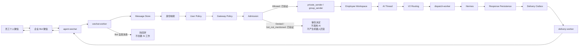
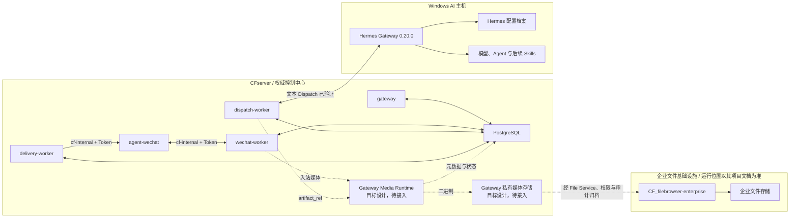
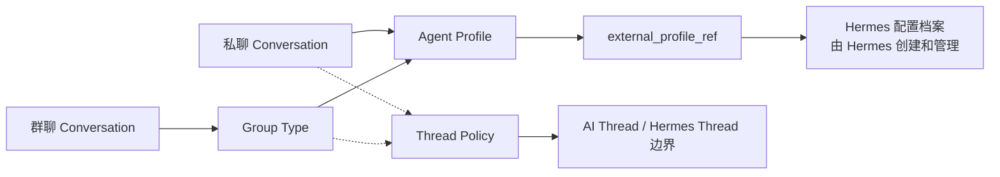
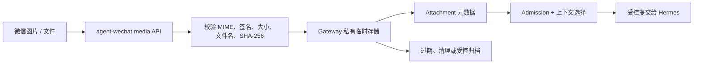
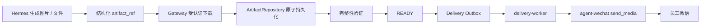

# 系统设计

> 状态证据截止：2026-08-14
>
> 最近复核：2026-08-21
>
> 本文件同时描述当前生产事实与后续目标设计；图和段落会明确区分“已实机验证”与“待接入”。企业级架构入口见[System Architecture](./architecture/system-architecture.md)。

## 当前生产文本链路

当前私聊和 `group_sender` 群聊授权文本闭环已实机验证。群聊真正 `@` 当前机器人时完成 Admission Allowed、V2 Routing、Hermes Dispatch、响应持久化、Outbox 与微信实际回复；普通群消息和引用消息未真正 `@` 时先持久化，再以 `bot_not_mentioned` 安全结束。机器人回复不会重新进入 AI 链路。

> 私聊和 group_sender 群聊的授权文本闭环已实机验证；媒体链路、引用上下文注入和完整宿主恢复仍待完成。

## 当前基础设施

- CFserver 上 PostgreSQL、`gateway`、`wechat-worker`、`dispatch-worker` 和 `delivery-worker` 五个服务均已部署并保持 healthy。
- `agent-wechat` 部署在 CFserver，通过 `cf-internal` 容器网络向 Gateway 提供受 Token 保护的接口。
- PostgreSQL 保存消息、Checkpoint、身份、权限、Workspace、AI Thread、路由、响应和投递的权威状态。
- Gateway 私有媒体存储、Attachment 与 Artifact 桥尚未接入；图中以目标设计标识，不代表已部署。
- Windows AI 主机运行 Hermes Gateway 0.20.0；文本请求处理已验证，但开机自启可靠性仍待收口。
- 正式归档文件后续通过 `CF_filebrowser-enterprise` 进入企业文件中心。

## 组件职责

| 组件 | 负责 | 不负责 |
| --- | --- | --- |
| `agent-wechat` | 微信登录状态、消息读取、文本发送、媒体读取接口和 Gateway 接口 | 企业身份、权限、路由、AI 执行和权威业务状态 |
| `gateway` | 管理身份、策略、会话绑定、外部 Profile 引用和运行时控制 | 创建或管理 Hermes 内部配置档案，代替 Hermes 生成答案 |
| `wechat-worker` | 3 秒轮询、标准化、Checkpoint、入站持久化和 Admission 触发 | 根据展示名称猜测身份或绕过策略创建任务 |
| PostgreSQL | 保存 Gateway 权威元数据、状态与审计关联 | 长期保存大文件 Base64 或由 Windows 本地状态覆盖 |
| `dispatch-worker` | 领取获准且完成 V2 Routing 的工作，调用 Hermes 并记录执行结果 | 派发被拒绝消息、盲重试结果不明的执行 |
| `delivery-worker` | 领取 Delivery Outbox 项并通过 `agent-wechat` 投递 | 在响应或 Artifact 就绪前直接发送 |
| Hermes | Agent 执行、模型调用、配置档案管理及后续 Skills | 绕过 Gateway Admission、Thread Policy、确认或 File Service |
| `CF_filebrowser-enterprise` | 企业文件访问、用户权限、Token/Share capability、WebDAV 与审计 | 代替 Gateway 保存普通聊天临时媒体，或允许组件直连正式存储 |

## 微信入口与登录

`CF_agent-wechat` 使用 `docker/compose.cfserver.yaml` 部署。容器内部运行 Xvfb、fluxbox、dunst、WeChat 和 `agent-server`；生产配置为 `ENABLE_VNC=0`，不使用 VNC、noVNC、x11vnc、websockify 或宿主桌面 X11。

登录管理脚本和手机确认登录已实机通过。完全新设备经 SSH 展示二维码并扫码的场景尚未实机验证。

文本读取和发送已支撑私聊、群聊实际回复。媒体 API 已返回真实 JPEG 字节并完成基础完整性校验；图片/文件 `send_media` 投递仍待接入和实机验证。底层操作由 `CF_agent-wechat` 仓库维护。

## Persist-first 与 Checkpoint

进入 Gateway 的员工消息遵循以下顺序：

1. `wechat-worker` 从 `agent-wechat` 读取来源消息。
2. 标准化来源事实并写入 Message Store。
3. 持久化成功后执行身份、两级策略和 Admission。
4. 保存 Admission、路由或安全结束结果，再推进相应 Checkpoint。
5. 只有 Allowed 消息才进入 Workspace、AI Thread 和执行链。

Persist-first 同时适用于文本、引用、图片和文件来源事实。当前已验证 17 个现有聊天建立 Checkpoint，`bootstrap_mode=latest` 将 151 条历史消息作为基线跳过；该策略只建立同步高水位，不把历史消息重新处理为任务。

## 身份、权限与 Admission

身份与权限顺序固定为：

1. 从平台、Bot 账号和稳定发送者 ID 定位 Source Identity。
2. 通过 Source Identity Mapping 得到 `enterprise_identity_id`。
3. 分别计算 User Access Policy 与 Gateway Access Policy。
4. 结合会话类型、结构化 mention、能力和风险形成 Admission 决定。
5. 只有 Admission Allowed 才解析 Workspace、AI Thread、Profile 引用与后续路由。

测试路径已覆盖未映射或未获准身份的安全拒绝，以及获准身份在私聊和 `group_sender` 群聊的 Allowed 路径。群聊只有原始结构化事实明确表示发送者 `@` 当前机器人时才允许进入 AI；纯文本名称、引用或上一条 mention 都不能替代这一事实。

昵称、备注、头像和群名仅用于展示，不参与身份自动合并或授权。

## 物理微信会话与 AI 线程

Physical Conversation 是微信私聊或群聊窗口；Workspace 是 Enterprise Identity 拥有的逻辑工作区；AI Thread 是工作区内的上下文线程；Hermes Runtime Thread 是外部执行侧会话绑定。它们不得混为一个 ID。

- 一个 Enterprise Identity 拥有一个逻辑 Employee Workspace。
- 私聊当前采用 `private_sender`，在 Bot 与私聊 Conversation 边界内复用上下文。
- 企业群聊当前默认采用 `group_sender`，以群 Conversation 和发送者组合隔离上下文。
- 同一员工的 Workspace 可跨私聊与群聊复用，但两种 Conversation 使用独立 AI Thread 和 Hermes Thread。
- 同一发送者在同一群内复用原 `group_sender` 上下文。
- `group_shared` 会改变上下文共享范围，只存在于代码或设计，必须单独审批并实机验证后才能启用。
- `ai_thread_id` 是 Gateway 权威逻辑标识；Hermes Thread 标识可绑定或恢复，不能反向覆盖 Gateway 状态。
- CFserver Gateway 应用服务 restart 后恢复上述持久化关系和会话复用已验证。

完整逻辑边界见[员工工作区与 AI 会话线程设计](./design/employee-workspace-design.md)；其中早期快照不替代本节的当前生产状态。

## Hermes 配置档案与 Thread Policy

Hermes 配置档案和 Thread Policy 解决不同问题：

| 概念 | 所有者 | 决定内容 |
| --- | --- | --- |
| Hermes 配置档案 | Hermes | AI 人格、模型与运行配置、技能和 `SOUL.md` |
| Agent Profile / `external_profile_ref` | Gateway 保存绑定与引用 | 当前 Conversation 应选择哪个 Hermes 配置档案 |
| Thread Policy | Gateway | 上下文由谁共享，以及 AI Thread 如何隔离或复用 |

Gateway 不自动创建 Hermes 配置档案，只校验、保存外部引用并在 V2 Routing 中选择。当前测试私聊与 AI 群均引用 `default`，但因 Thread Policy 与 Conversation 边界不同，两者的 AI Thread 和 Hermes Thread 相互独立。

## 上下文、引用与快照

目标上下文选择按必要性控制，候选来源包括当前消息、同一 AI Thread 最近消息、任务状态、已经受控持久化的附件，以及可明确取得的引用内容。执行前应形成可追踪的 Context Snapshot；窗口长度、截断和摘要规则由 Gateway 专题设计维护。

当前引用能力的准确边界是：

- 微信引用消息识别已验证。
- `reply_context` 持久化已验证。
- 引用类型消息的文本回复闭环已验证。
- 群聊引用但未真实 `@` 时按 `bot_not_mentioned` 安全拒绝。
- 被引用内容尚未自动注入 Hermes 请求。

因此“引用类型消息能回复”不得表述为“AI 已自动理解引用内容”。

## 多消息与多附件任务批次

目标设计是在同一 AI Thread 内聚合同一意图的相近消息和附件。显式完成、可识别的完整指令或超时可以触发收口；批次 ID 与 Task ID 分离，支持补充、撤销、去重和歧义询问。

聚合窗口、跨时段补充、Attachment 接入和多附件实机验收尚未完成。当前图片字节提取不能作为任务批次媒体能力已经完成的证据。

## CFserver 与 Windows AI 主机通信

- 文本 Dispatch 已通过内网实际调用 Hermes；调用关联 Gateway AI Thread、Profile 外部引用和 Hermes Runtime Thread。
- 媒体后续使用受认证上传或引用协议，不以 Base64 填入普通任务 JSON。
- 调用应携带脱敏关联 ID、时效凭证和幂等键；具体鉴权配置由对应项目仓库维护。
- Windows 执行侧只能取得当前任务所需的媒体或 File Service capability，不能挂载或扫描整个正式存储。
- 网络中断时 CFserver 继续保存消息和状态；恢复必须依据权威记录，不能猜测执行结果。

## V2 Routing 与 Hermes Dispatch

V2 Routing 在 Admission Allowed 后，根据 Conversation 绑定、Group Type、Thread Policy、Agent Profile 的 `external_profile_ref`、所需能力、权限和 Provider 状态形成可追踪决定。`dispatch-worker` 只能领取已获准并完成路由的工作。

当前私聊 `private_sender` 与群聊 `group_sender` 均完成真实 V2 Routing、Hermes Dispatch 和响应处理。Hermes 不可达时曾观察到连接超时、Dispatch 进入 `uncertain`、消息已进入系统但没有 AI 回复。人工启动 Hermes 后恢复健康；随后一次有备份、证据核对和 Guard 的受控恢复使原 Dispatch 第二次执行成功。

`uncertain` 表示无法根据单侧结果确认外部执行是否发生，不得等同为“可以自动重试”。正式管理能力仍待建设。

## Hermes 结构化输入输出

Hermes 文本输入至少关联任务、Enterprise Identity、Physical Conversation、Workspace、AI Thread、Profile 外部引用、Thread Policy、权限约束与当前消息。Hermes Runtime Thread 标识不得替代 Gateway 的 `ai_thread_id`。

未来媒体输入只传受控 Attachment 引用或采用受认证上传协议；出站媒体返回结构化 `artifact_ref`。自由文本、桌面 UI 状态或 Windows 文件路径不能替代 Attachment/Artifact 协议。

输出区分完成、需要澄清、等待确认、可重试失败、`uncertain` 和最终失败，并携带可持久化结果。详细历史事件契约见[Hermes 事件模型](./design/hermes-event-schema.md)，其版本快照不自动代表媒体协议已实现。

## 响应持久化与 Delivery Outbox

文本响应链采用持久化后投递：

1. `dispatch-worker` 接收 Hermes 结果。
2. Gateway 保存 Response Persistence。
3. 为原 Bot 账号与 Physical Conversation 创建 Delivery Outbox 项。
4. `delivery-worker` 领取 Outbox 项。
5. `agent-wechat` 向原微信会话发送。
6. Gateway 分别记录执行结果和投递结果。

私聊与 `group_sender` 群聊的文本链路已实机验证，机器人回复不会回环。媒体投递必须等待 READY Artifact；不能因文本 Outbox 已验证而宣称图片或文件投递已经完成。

## Media Runtime V2

### 当前图片发现能力

当前准确结论是：

> 微信图片可被读取和提取，媒体 AI 完整链路未接入。

已验证 `image/raw_type=3`、Message Store 与 Raw Payload 持久化、`agent-wechat` media API 返回真实 JPEG 字节，以及文件签名、大小和 SHA-256 校验。未明确 `@` 的群图片没有误触发 Hermes。

尚未完成 Attachment 元数据、Gateway 私有入站存储、Hermes 多模态提交、出站 Artifact 物化和微信媒体投递。

### 入站媒体桥

以下是目标设计，不是当前已部署链路：

要求：

- 下载、校验和存储具有幂等键；重复轮询不得产生重复文件。
- Attachment 保存来源消息、内容类型、大小、完整性摘要、存储引用、状态和生命周期，不保存长期大文件 Base64。
- 二进制保存在 CFserver 私有存储；未通过 Admission 的附件不得提交 Hermes。
- 普通聊天媒体自动过期；有业务归档要求的文件再经 `CF_filebrowser-enterprise` 转存。
- 下载失败、超限、损坏或不支持时保留明确状态和审计，不把部分文件标为可用。

### 出站 Artifact 桥

以下同样是目标设计：

要求：

- Gateway 必须从 Hermes 受认证下载，不使用桌面 UI、剪贴板或猜测 Windows 文件路径。
- 下载先进入临时状态；只有原子持久化和完整性校验成功后才能进入 `READY`。
- 只有 `READY` Artifact 可以创建媒体 Delivery Outbox；失败或部分下载不能投递。
- 下载、物化、Outbox、发送和回执均支持幂等、受控重试、完整性校验与审计。
- PostgreSQL 保存元数据和状态，不长期保存大文件 Base64。
- 文件回传微信完成后，是否归档到企业文件中心由业务保留策略决定。

## 状态机、幂等与恢复

- Message、Task、Dispatch、Response、Artifact 和 Delivery 分别记录状态，不用一个“成功”覆盖全链路。
- 只对结果明确且可证明安全的暂时错误自动重试；`uncertain`、部分成功或高风险动作转证据核对与受控恢复。
- 当前一次 `uncertain` 恢复使用了备份、证据核对和 Guard，但这是受控人工处置证据，不是常规运维接口。
- 应建设正式管理命令/API，记录操作人、原因、证据、Guard 结果和恢复结论；不得把人工直接改数据库作为日常路径。
- 每次执行、恢复和投递追加记录，不覆盖历史审计事实。

## 恢复验收层级

| 层级 | 当前状态 |
| --- | --- |
| CFserver Gateway 应用服务 restart | **已验证：** 未 recreate 容器、未重启 PostgreSQL 或宿主；持久化恢复、原 AI Thread 和原 Hermes 会话上下文复用 |
| Gateway 容器 recreate | **未验证** |
| PostgreSQL 重启 | **未验证** |
| CFserver 整机重启 | **未验证** |
| AI 主机重启与 Hermes 自动恢复 | **未验证** |

较低层级验证不能替代更高层级验收。Hermes 的 Windows 登录启动项存在，也不能替代进程健康、守护和自动恢复验证。

## 核心数据对象

| 数据对象 | 核心用途与当前边界 |
| --- | --- |
| Bot Account、Conversation、Participant | 标识企业 Bot、物理会话和来源发送者 |
| Message、Checkpoint、Message Reference | 保存标准化消息、同步高水位和引用关系；文本、引用和图片来源事实已验证 |
| Enterprise Identity、Source Identity Mapping、Access Policy | 建立权威身份与两级权限；测试允许和拒绝路径已验证 |
| Workspace、AI Thread、Runtime Thread Binding | 隔离逻辑上下文并关联 Hermes 会话；私聊与 `group_sender` 已验证 |
| Agent Profile、Group Type、Thread Policy | 保存 Profile 外部引用和上下文隔离策略；`group_shared` 未验证 |
| Routing、Dispatch、Response | 保存 V2 Routing、Hermes 执行与响应；文本路径已验证 |
| Delivery Outbox、Delivery Attempt | 分离投递与执行结果；文本投递已验证，媒体投递未验证 |
| Attachment、File Reference | 入站媒体元数据和受控文件引用；目标设计，尚未接入 |
| Artifact、ArtifactRepository | 出站产物、完整性和 READY 状态；目标设计，尚未接入 |
| Task Batch、Task、Context Snapshot | 表达任务聚合、执行和实际输入；多附件与引用注入待完成 |
| Confirmation、Audit Event | 保存高风险确认与追加式审计事实 |

唯一键、索引、保留周期和 schema 由对应项目仓库管理。本表只定义总体数据边界。

## 文件能力边界

- Gateway 私有媒体存储用于普通聊天媒体的受控暂存，不是第二套企业 File Service。
- `CF_filebrowser-enterprise` 是唯一正式企业 File Service；正式文件访问必须经过用户权限、最小 Token capability、Share effective capability 和审计。
- Gateway、Hermes、Skills、FileBridge 和 `filebrowser-agentctl` 不得直连、挂载或遍历正式存储。
- 普通聊天媒体按保留策略过期；确需业务归档的原件或产物再转存企业文件中心。
- 第一阶段不建设独立 OCR。

## 安全与可靠性

- Token、API Key 和数据库密码不得写入普通 YAML、Git、任务正文或普通日志。
- 运行凭证仅通过 root-only 文件、未提交的 `.env` 或受控密钥机制注入。
- PostgreSQL、Gateway 配置或策略变更前必须备份，并确认恢复路径可用。
- CFserver 是权威状态源；Windows AI 主机离线或重启不得造成已接收消息丢失。
- AI 执行成功、响应持久化、Artifact READY 和微信投递成功是独立状态。
- Hermes Gateway 需要独立进程健康监控、守护和告警。

## 当前状态与下一步

组件状态、证据边界和严格的 18 步下一阶段顺序见[当前状态矩阵](./status/current-status.md)。本轮生产证据见[2026-08-14 私聊、群聊及媒体验证记录](./status/2026-08-14-private-group-media-validation.md)。

更详细的稳定逻辑边界见[Gateway 架构](./architecture/gateway-architecture.md)、[微信与 Hermes 集成](./architecture/wechat-hermes-integration.md)、[Message Store 设计](./design/message-store-design.md)、[Access Control 设计](./design/access-control-design.md)和[员工工作区与 AI 会话线程设计](./design/employee-workspace-design.md)。版本化专题中的历史结论必须按其日期理解。
