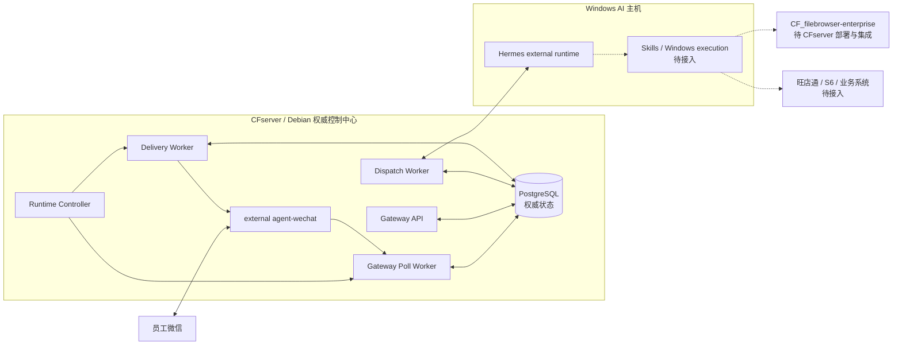
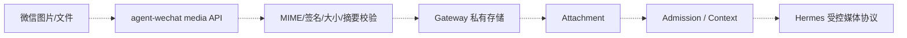
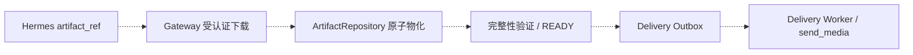

# 系统设计

> 状态日期：2026-09-04
>
> 本文描述当前生产文本链、已实现但未完全生产验收的 Gateway 能力，以及仍属目标设计的文件、媒体、Skills 和业务系统边界。

## 1. 总体架构

实线表示当前已部署文本链或控制关系；虚线表示待接入能力。agent-wechat 是外部 Compose 项目，不是 Gateway 内部模块；Hermes 位于 Windows AI 主机，不是 CFserver 服务。

## 2. 当前生产文本链

1. agent-wechat 提供来源消息。
2. Poll Worker 标准化来源事实并按 Checkpoint 读取。
3. 非 self 消息先写入 PostgreSQL Message Store。
4. Gateway 完成 Source Identity Mapping、User/Gateway Policy 和 Admission。
5. Allowed 后解析 Workspace、V2 AI Thread、Agent Profile 和 Thread Policy。
6. durable Dispatch 入队后由 Dispatch Worker 调用 Hermes。
7. Hermes 结果先持久化为 Response，再形成 Delivery Outbox。
8. Delivery Worker 通过 agent-wechat 投递原会话。
9. Bot self reply 被 Polling 受控跳过，避免回环。

Poll Worker 不直接调用 Hermes，也不内联 Delivery。Gateway API、Poll、Dispatch、Delivery 是四个独立应用进程，PostgreSQL 是第五个运行组件；external agent-wechat 另属独立项目。

## 3. 组件职责

| 组件 | 负责 | 不负责 |
| --- | --- | --- |
| `CF_agent-wechat` | forced QR、微信进程、auth/chats/messages、来源读取和发送 | 身份权限、AI Thread、Hermes 调用、权威状态 |
| Poll Worker | Polling、Checkpoint、Message Store、Admission 触发 | Hermes 执行和结果投递 |
| Gateway API | 身份、策略、会话、Profile、Admin 查询/恢复和 Runtime 状态 | 创建 Hermes 内部 Profile、生成 AI 答案 |
| PostgreSQL | Message、Admission、Thread、Context、Dispatch、Response、Delivery 和恢复审计 | 长期保存大文件 Base64、接受 AI 主机状态覆盖 |
| Dispatch Worker | 领取 durable Dispatch、调用 Hermes、保存明确结果或 `uncertain` | 对结果不明盲重试 |
| Delivery Worker | 领取 Outbox、发送原会话、保存 Attempt/Receipt | 重新执行 Hermes |
| Hermes | Agent、模型和外部配置档案 | 覆盖 Gateway 权威状态、绕过权限或 File Service |
| FileBrowser | 正式文件、权限、capability、WebDAV/OnlyOffice 和 Persistent Audit | 微信收发、Gateway 消息和任务编排 |

## 4. Persist-first 与 Checkpoint

- Message 持久化、Admission、Dispatch 和 Checkpoint 是独立事实。
- 首次 `LATEST` 建立高水位；恢复不得把已有环境重新视为首次 bootstrap。
- forced-QR 后 Local ID 可能回退。当前 Runtime 使用 generation、anchor、fingerprint 和 CAS 处理 rebase。
- 历史前缀作为新基线跳过，实时后缀只处理一次。
- self reply 不进入 Message/Admission/Dispatch，但推进 Checkpoint。
- 无法证明连续性时 fail closed，不手工降低 Checkpoint 或清空历史。

带日期的环境计数只存在于验证记录，不是设计常量。

## 5. 身份、权限和 mention

- `enterprise_identity_id` 是内部不可变身份主键；`employee_id` 是可空业务编号。
- 来源映射使用 platform、source account 和稳定 sender ID。
- 昵称、备注、群名、纯文本 `@`、引用或上一条 mention 不能形成授权。
- 私聊不要求 mention；群聊只有结构化事实为 true 才能进入 Allowed。
- 拒绝、未 mention 和系统消息仍保留可追踪结果，但不创建 AI 工作。

## 6. Workspace、Thread Policy 与实际实现

Physical Conversation、Employee Workspace、AI Thread 和 Hermes Runtime Thread 是四个不同对象。

### V2 当前路径

- `private_sender` key 包含来源、账号、物理私聊、sender identity、Profile revision 和 policy。
- `group_sender` key 包含来源、账号、物理群聊、sender identity、Profile revision 和 policy。
- `group_shared` 不包含 sender identity，只能在批准后使用。
- Gateway main 的 V2 `ThreadResolver` 与自动化测试证明同群不同 sender identity 使用不同线程。

### V1 compatibility path

V1 `build_group_thread_key` 只包含 source account 和物理群聊，忽略 sender，属于 whole-room 兼容行为。当前生产是 V2 Runtime，但 V1 代码仍存在，因此文档和运维必须显式核对 `v2_routing_enabled`，不能把 V1 行为误写成 V2 事实。

### 生产证据边界

真实群聊 `@` 文本已闭环，但现有证据没有同群两个发送者的对照记录。因此当前分类是：

- repository implemented；
- automated tests passed；
- deployed on V2 code line；
- same-group multi-sender production validation pending。

## 7. Agent Profile 与 Hermes

- Agent Profile 保存 Gateway 路由元数据和 `external_profile_ref`。
- Hermes 自行创建和管理配置档案。
- Profile revision 变化可以形成新的 V2 Thread generation。
- Gateway Dispatch 必须带稳定 idempotency key、AI Thread、Profile、sender identity 和可用能力信息。
- 当前文本调用成功；不要在当前文档硬编码无法由本次生产证据确认的 Hermes 版本。

## 8. Context Runtime

Gateway main 已实现：

- 只读 Thread Timeline；
- recent/range/search；
- identity-bound authorization；
- 版本化 Context Snapshot；
- Hermes `context.read` / `context.search` 工具边界。

Timeline 只投影成功的 durable Dispatch/Response 和已解析 Artifact reference。Snapshot 是调用方提供、可重建的摘要，不覆盖原消息与响应。跨线程或跨身份读取 fail closed。

这些能力已有自动化测试和 green CI，且随 Gateway Release 部署；本次生产 Closeout 未逐项演练全部读取、搜索和 Snapshot 场景。RAG、向量库、长期 Memory 与引用正文自动注入仍未完成。

## 9. Admin recovery

Gateway main 提供受认证的：

- Dispatch inspection；
- `retry-approved`；
- `mark-dead`；
- 基于持久化证据的 `confirm-success`。

恢复使用 CAS 与同事务 immutable audit，不能删除审计、手工修改 Dispatch、清空 Queue 或伪造 Response。已有一次带证据核对和 Guard 的生产恢复，但本次证据未证明每个 Admin 动作都已在生产执行。

## 10. Response 与 Delivery

Response、Delivery Outbox、Delivery Attempt/Receipt 分开保存。核心不变量：

- Response 未持久化不得发送。
- Delivery 失败不得重新调用 Hermes。
- 已有 Response 缺 Delivery 时走 reconciliation。
- `uncertain` 外部发送不得盲目重复。
- 文本链已生产验证；完整媒体投递未完成。

## 11. forced-QR 与重启

### Host/container/Runtime restart

agent-wechat 使用 `restart: "no"`。CFserver reboot、container recreate 或 Runtime restart 后不自动恢复；必须归档旧 Runtime 并执行 fresh QR。Archive 不得挂回 active Session。

真实 CFserver reboot 中 Gateway 核心恢复、agent-wechat 保持停止，但 Poll/Delivery 当时被观察为 running/healthy。因此 automatic boot stop gate 未验证；fresh QR 前必须通过 Runtime Controller `stop` 关闭组合 Poll/Delivery Gate。验证完成后，Controller `start` 同时准备、重建并启动两个受控 Worker。Dispatch Worker 不受 Controller 管理，可在组合 Gate 关闭时保持在线。

### AI host restart

CFserver 和 agent-wechat 不重启时微信 Session 保持，不需要 fresh QR。AI 主机恢复后必须核对 Hermes reachability、Controller 和 Queue。一次成功恢复不等于长期 watchdog/HA。

### Gateway-only deployment

不重建 agent-wechat 的 Gateway-only cutover 保持 authenticated Session，不需要 fresh QR。

## 12. Media Runtime 目标边界

### 入站

当前只验证图片发现和字节提取。Attachment 持久化、私有存储、Hermes 多模态和文件类型兼容性未完成。

### 出站

Gateway 仓库中的 Artifact/媒体数据结构和测试不能替代系统级集成与真实微信投递证据。

## 13. File Service 与 Skills

- Gateway 私有媒体存储只服务短期中转。
- `CF_filebrowser-enterprise` 是唯一正式 File Service。
- FileBrowser V1 Beta 已实现和自动化验证，但未部署、未迁移、未恢复演练、未真实 WebDAV/OnlyOffice 联调，也未接入本链。
- Skills、旺店通、S6 和企业知识库均通过虚线边界保留，不能画成当前生产实线。
- 第一阶段不建设独立 OCR。

## 14. 核心数据对象

| 数据对象 | 当前用途 |
| --- | --- |
| Message / Raw Payload / Checkpoint | 来源事实、连续性与幂等 |
| Identity / Mapping / Access Policy | 身份、允许范围与 Admission |
| Workspace / AI Thread / Route Snapshot | 上下文归属与 V2 路由 |
| Context Entry / Snapshot | 授权线程 Timeline 与派生摘要 |
| Dispatch / Recovery Audit | Hermes 执行、租约、结果不明和受控恢复 |
| Response / Delivery / Receipt | 生成结果与渠道投递 |
| Attachment / Artifact | 部分仓库实现存在；系统级媒体闭环未完成 |

表结构、索引和 migration 由组件仓库管理；本文只定义系统级边界。

## 15. 当前恢复不变量

1. 未持久化的员工消息不得进入执行。
2. 拒绝不删除消息。
3. 结果不明不自动重做。
4. 已有 Response 时不得重跑 Hermes；先诊断 Delivery。若需重启受控 Worker，通过组合 Poll/Delivery Gate 同时恢复二者。
5. 非 READY Artifact 不得投递。
6. fresh QR 前关闭 Gate。
7. Archive 不恢复为 active Session。
8. 不跨项目执行 `docker compose down` 或 `--remove-orphans`。
9. 不删除数据库行、手工改 Checkpoint、清空 Queue 或打印 Secret。

当前状态见[状态矩阵](./status/current-status.md)，带日期生产证据见[2026-09-03 Production Closeout](./validation/records/2026-09-03-enterprise-runtime-production-closeout.md)。
