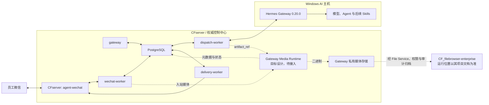

# 电商业务全自动化系统

> 状态日期：2026-08-14

本仓库是“电商业务全自动化系统”的总文档入口，维护总体架构、项目状态、跨仓库关系、运维索引、技术决策和路线图，不存放业务代码、生产配置、凭证或真实业务文件。

## 总体目标

员工通过微信提交文字与附件任务；CFserver 先保存消息并执行身份、权限、上下文和路由控制，再由 Windows AI 主机上的 Hermes 调用模型与获准能力，最后把可追踪的结果返回原会话。正式企业文件访问统一经过 `CF_filebrowser-enterprise` 的 File Service、权限检查与审计。

## 当前阶段

项目仍处于**阶段 1**，当前结论是：

> 私聊和 group_sender 群聊的授权文本闭环已实机验证；媒体链路、引用上下文注入和完整宿主恢复仍待完成。

当前生产已经覆盖获准与拒绝两条文本路径。私聊和明确 `@` 机器人的群聊均完成从消息发现、持久化、身份权限、V2 Routing、Hermes、响应持久化、Delivery Outbox 到微信实际回复的实机验证；普通群消息未明确 `@` 时只持久化并以 `bot_not_mentioned` 安全结束。最新证据见[2026-08-14 私聊、群聊及媒体验证记录](./status/2026-08-14-private-group-media-validation.md)。

## 项目组成

| 组件 | 职责 | 当前状态 |
| --- | --- | --- |
| `CF_agent-wechat` | 托管企业 AI 微信客户端，管理登录状态，读取和发送微信消息，并向 Gateway 提供接口 | **已部署并实机验证** |
| `CF_agent-gateway` | 轮询、Checkpoint、Message Store、身份与权限 Admission、Workspace、AI Thread、V2 Routing、Hermes Dispatch、响应持久化与 Delivery Outbox | **已部署，部分链路待验证** |
| Hermes Gateway | 执行 Agent、模型调用及后续 Skills/工具调用；管理 Hermes 配置档案 | **已部署，部分链路待验证** |
| PostgreSQL | 保存 Gateway 的权威消息、Checkpoint、身份、权限、路由、响应和投递状态 | **已部署，部分链路待验证** |
| `CF_filebrowser-enterprise` | 企业文件中心、用户权限、Token、分享、WebDAV、审计与 AI 文件访问基础设施 | **开发中**；本次不改变其既有状态 |
| Skills、OCR、旺店通/S6 集成 | 后续文档、业务系统和确定性自动化能力 | **规划中** |

详细状态、验证证据和限制见[当前状态矩阵](./status/current-status.md)。

## 当前生产拓扑

- `agent-wechat` 使用 `docker/compose.cfserver.yaml` 部署；生产设置 `ENABLE_VNC=0`，不使用 VNC、noVNC、x11vnc、websockify 或宿主桌面 X11。
- PostgreSQL、`gateway`、`wechat-worker`、`dispatch-worker`、`delivery-worker` 五个服务均已部署并保持 healthy。
- Gateway 与 `agent-wechat` 通过 `cf-internal` 容器网络通信。
- Hermes Gateway 0.20.0 运行在 Windows AI 主机；当前可访问，但开机自启可靠性仍未收口。
- Gateway 私有媒体存储及其媒体桥是待建设边界；正式归档文件后续接入 `CF_filebrowser-enterprise`。

## 已验证范围

- 登录管理脚本、手机确认登录、Gateway 内网通信与 Token 鉴权。
- 3 秒微信轮询、17 个 Checkpoint、`bootstrap_mode=latest` 跳过 151 条历史基线、新消息 Persist-first 和未授权安全拒绝。
- 私聊授权文本完整链路：身份映射、User Policy、Gateway Policy、Admission Allowed、`private_sender`、Workspace、AI Thread、Hermes Dispatch、Response Persistence、Delivery Outbox 和微信实际回复。
- 群聊明确 `@` 的 `group_sender` 完整文本链路；未明确 `@` 的普通群消息持久化但不调用 AI。
- 私聊与群聊 AI Thread、Hermes Thread 相互隔离；同一发送者在同一群内复用 `group_sender` 上下文。
- 机器人回复不回环；CFserver Gateway 应用服务 restart 后持久化恢复，并复用原 AI Thread 与 Hermes 会话上下文。
- 引用消息识别、`reply_context` 持久化及引用类型消息的文本回复链路；群聊引用但未真实 `@` 时安全拒绝。
- 微信图片识别为 `image/raw_type=3`、Message Store 与 Raw Payload 持久化、媒体 API 提取真实 JPEG 字节，以及签名、大小和 SHA-256 校验。
- Hermes 不可达故障的现象确认，以及一次带备份、证据核对和 Guard 的受控人工恢复。

## 尚未验证范围

- `group_shared` 上下文策略；当前仅 `group_sender` 经过实机验证。
- 自动把被引用内容注入 Hermes；“引用类型消息能回复”不代表 AI 已理解被引用内容。
- Attachment 元数据、Gateway 私有媒体存储、Hermes 入站多模态、出站 Artifact 物化及图片/文件回传微信。
- Gateway 容器 recreate、PostgreSQL 重启、CFserver 整机重启，以及 AI 主机重启后的 Hermes 自动恢复。
- Hermes Gateway 开机自启、守护、告警和 `uncertain` Dispatch 的正式管理能力。
- 完全新设备 SSH 二维码扫码登录。
- FileBrowser 与企业资料接入，以及 Skills、旺店通和 S6 业务自动化。

严格的 18 步后续顺序见[当前状态矩阵](./status/current-status.md#下一阶段顺序)。

## 文档目录

| 文档 | 内容 |
| --- | --- |
| [项目总纲](./00_项目总纲.md) | 总体目标、范围、组件定位、设备职责和建设阶段 |
| [功能需求](./01_功能需求.md) | 用户场景、系统行为、异常和验收边界 |
| [系统设计](./02_系统设计.md) | 当前文本链路、Profile/Thread Policy、媒体桥、状态与安全规则 |
| [开发规范](./03_开发规范.md) | 仓库、Git、数据和文档协作规则 |
| [部署运维](./04_部署运维.md) | 跨仓库生产运维索引、健康检查、备份和恢复边界 |
| [技术决策记录](./05_技术决策记录.md) | 当前有效技术决定、原因和影响 |
| [当前状态矩阵](./status/current-status.md) | 能力状态、实机证据、限制和下一步 |
| [当前开发进度](./status/current-progress.md) | 当前阶段、已完成范围和阻塞项 |
| [2026-08-14 私聊、群聊及媒体验证](./status/2026-08-14-private-group-media-validation.md) | 最新文本闭环、引用、图片发现、恢复风险和交接顺序 |
| [2026-08-13 微信运行时收口](./status/2026-08-13-wechat-runtime-closeout.md) | 上一阶段入口、Checkpoint 和未授权拒绝历史证据 |
| [架构专题](./architecture/ai-system-overview.md) | 总体架构及 Gateway、微信、Hermes、消息流和媒体专题导航 |
| [历史 V1 Staging 验证记录](./status/gateway-wechat-staging-validation.md) | 2026-08-04 特定 Staging 环境的历史验证证据 |
| [AI 协作入口](./AGENTS.md) | 本仓库对 Codex 和其他代码 AI 的固定约束 |

## 项目仓库

| 仓库 | 职责 |
| --- | --- |
| [`CF_ecommerce-automation-docs`](https://github.com/Tangbohu09527/CF_ecommerce-automation-docs) | 总体架构、状态、跨项目关系、运维索引和路线图 |
| [`CF_agent-wechat`](https://github.com/Tangbohu09527/CF_agent-wechat) | 微信客户端、登录管理、消息读取和发送 |
| [`CF_agent-gateway`](https://github.com/Tangbohu09527/CF_agent-gateway) | 企业消息、身份、权限、路由、执行派发、响应持久化与投递控制 |
| [`CF_filebrowser-enterprise`](https://github.com/Tangbohu09527/CF_filebrowser-enterprise) | 正式企业 File Service 和 AI 文件访问基础设施 |

所有项目仓库使用 `CF_` 前缀。业务跑通前使用 GitHub 私密仓库做中央版本管理；生产运行不得持续依赖 GitHub 在线。
