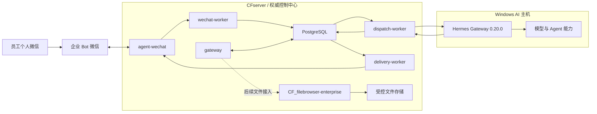

# 电商业务全自动化系统

本仓库是“电商业务全自动化系统”的总文档入口，维护总体架构、项目状态、跨仓库关系、运维索引、技术决策和路线图，不存放业务代码、凭证或真实业务文件。

## 总体目标

员工通过微信提交文字与附件任务；CFserver 先保存消息并执行身份、权限和路由控制，再由 Windows AI 主机上的 Hermes 调用模型与授权能力，最后把可追踪的结果返回原会话。正式文件访问统一经过 `CF_filebrowser-enterprise` 的 File Service、权限检查与审计。

## 当前阶段

当前仍处于**阶段 1**，已到“**微信入口和未授权安全链路完成，授权 AI 闭环待验证**”。截至 2026-08-13，准确结论是：

> 微信消息发现、持久化、Checkpoint、未授权拒绝和 Hermes 网络连通已实机验证；授权后的完整 AI 回复闭环仍待验证。

较早的 V1 Staging 授权文本闭环是特定日期与测试环境的历史证据，不能替代当前 CFserver 生产链路验收。当前状态以[状态矩阵](./status/current-status.md)和[2026-08-13 阶段收口记录](./status/2026-08-13-wechat-runtime-closeout.md)为准。

## 项目组成

| 组件 | 职责 | 当前状态 |
| --- | --- | --- |
| `CF_agent-wechat` | 托管企业 AI 微信客户端，管理登录状态、读取和发送微信消息，并向 Gateway 提供接口 | **已部署并实机验证** |
| `CF_agent-gateway` | 轮询、Checkpoint、Message Store、身份与权限 Admission、Workspace、AI Thread、V2 Routing、Hermes Dispatch、响应持久化与 Delivery Outbox | **已部署，部分链路待验证** |
| Hermes Gateway | 执行 Agent、模型调用及后续 Skills/工具调用 | **已部署，部分链路待验证** |
| PostgreSQL | 保存 Gateway 的权威消息、Checkpoint、身份、权限、路由、响应和投递状态 | **已部署并实机验证** |
| `CF_filebrowser-enterprise` | 企业文件中心、用户权限、Token、分享、WebDAV、审计与 AI 文件访问基础设施 | **开发中**；本次不改变其既有状态 |
| Skills、OCR、旺店通/S6 集成 | 后续文档、业务系统和确定性自动化能力 | **规划中** |

完整字段、限制和下一步见[当前状态矩阵](./status/current-status.md)。

## 当前生产拓扑

- `agent-wechat` 使用 `docker/compose.cfserver.yaml` 部署；容器内运行 Xvfb、fluxbox、dunst、WeChat 与 `agent-server`。
- 生产配置为 `ENABLE_VNC=0`，不使用 VNC、noVNC、x11vnc、websockify 或宿主桌面 X11。
- Gateway 栈的 PostgreSQL、`gateway`、`wechat-worker`、`dispatch-worker`、`delivery-worker` 五个服务均已部署并保持 healthy。
- Gateway 与 `agent-wechat` 通过 `cf-internal` 容器网络通信。
- Hermes Gateway 0.20.0 运行在 Windows AI 主机；CFserver 与 `dispatch-worker` 到它的网络已验证，但重启后的自动启动可靠性尚未收口。

## 已验证范围

- `agent-wechat` 登录管理脚本和手机确认登录已实机通过。
- Gateway Token 鉴权以及与 `agent-wechat` 的内部网络已验证。
- 微信每 3 秒轮询；17 个现有聊天已建立 Checkpoint。
- 首次启用以 `bootstrap_mode=latest` 将 151 条历史消息作为基线跳过，没有重新触发历史任务。
- 新私聊消息已进入 Message Store，发送者与会话识别正确，Checkpoint 正常推进。
- 未授权账号已被安全拒绝，没有调用 Hermes，也没有产生机器人回复。
- CFserver 与 `dispatch-worker` 均可访问 Windows AI 主机上的 Hermes Gateway。

## 尚未验证范围

- 测试发送者的 Enterprise Identity、Source Identity Mapping、两级访问策略、Agent Profile 和私聊会话绑定。
- Admission Allowed、V2 Routing、Hermes 实际处理、Response Persistence、Delivery Outbox 和微信收到 AI 回复。
- Hermes Gateway 在 Windows AI 主机重启后的可靠自启。
- 完全新设备 SSH 二维码扫码登录、群聊明确 `@` 机器人、图片、文件和引用消息。
- FileBrowser 与企业资料接入，以及 Skills、OCR、旺店通和 S6 业务自动化。

严格的 18 步后续顺序见[当前状态矩阵](./status/current-status.md#下一阶段顺序)。

## 文档目录

| 文档 | 内容 |
| --- | --- |
| [项目总纲](./00_项目总纲.md) | 总体目标、范围、组件定位、设备职责和建设阶段 |
| [功能需求](./01_功能需求.md) | 用户场景、系统行为、异常和验收边界 |
| [系统设计](./02_系统设计.md) | 当前生产链路、目标边界、数据流、状态与安全规则 |
| [开发规范](./03_开发规范.md) | 仓库、Git、数据和文档协作规则 |
| [部署运维](./04_部署运维.md) | 跨仓库生产运维索引、健康检查、备份和排障边界 |
| [技术决策记录](./05_技术决策记录.md) | 当前有效技术决定、原因和影响 |
| [当前状态矩阵](./status/current-status.md) | 组件部署、实机验证、限制和下一步 |
| [微信运行时阶段收口](./status/2026-08-13-wechat-runtime-closeout.md) | 当天完成、生产拓扑、验证证据、阻塞项和交接顺序 |
| [架构专题](./architecture/ai-system-overview.md) | 总体架构及 Gateway、微信、Hermes、消息流专题导航 |
| [历史 V1 Staging 验证记录](./status/gateway-wechat-staging-validation.md) | 2026-08-04 特定 Staging 环境的历史验证证据 |
| [AI 协作入口](./AGENTS.md) | 本仓库对 Codex 和其他代码 AI 的固定约束 |

## 项目仓库

| 仓库 | 职责 |
| --- | --- |
| [`CF_ecommerce-automation-docs`](https://github.com/Tangbohu09527/CF_ecommerce-automation-docs) | 总体架构、状态、跨项目关系、运维索引和路线图 |
| [`CF_agent-wechat`](https://github.com/Tangbohu09527/CF_agent-wechat) | 微信客户端、登录管理、消息读取和发送 |
| [`CF_agent-gateway`](https://github.com/Tangbohu09527/CF_agent-gateway) | 企业消息、身份、权限、路由、执行派发、响应持久化与投递控制 |
| [`CF_filebrowser-enterprise`](https://github.com/Tangbohu09527/CF_filebrowser-enterprise) | 正式企业 File Service 和 AI 文件访问基础设施 |

所有项目仓库使用 `CF_` 前缀。业务跑通前使用 GitHub 私密仓库做中央版本管理；生产运行不得持续依赖 GitHub 在线。
