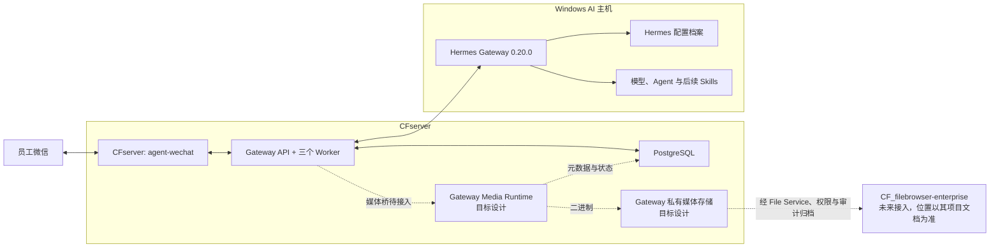

# 企业 AI 自动化系统总体架构

> 状态日期：2026-08-14。当前生产事实以[状态矩阵](../status/current-status.md)为准；较早 Staging 验证只作为其标注日期的历史证据。

## 架构目标

系统以微信作为员工入口，以 CFserver 上的 Gateway 和 PostgreSQL 作为消息、身份、权限、上下文、路由、响应和投递的权威控制中心，以 Windows AI 主机上的 Hermes 作为 Agent 执行层，以 `CF_filebrowser-enterprise` 作为正式文件与资料基础设施。

## 分层职责

| 层级 | 组件 | 当前边界 |
| --- | --- | --- |
| 微信入口 | `CF_agent-wechat` | 已部署 CFserver；负责登录、文本收发和媒体读取接口；`ENABLE_VNC=0` |
| 权威控制 | `CF_agent-gateway` + PostgreSQL | 五个服务 healthy；私聊和 `group_sender` 群聊授权文本闭环已验证 |
| Agent 执行 | Hermes Gateway 0.20.0 | 文本 Dispatch/Response 已验证；配置档案由 Hermes 管理；可靠自启和媒体待完成 |
| 临时媒体 | Gateway Media Runtime | 入站 Attachment 私有存储与出站 READY Artifact 属于目标设计，尚未接入 |
| 文件基础设施 | `CF_filebrowser-enterprise` | **开发中**；本次不改变既有验证结论，后续统一承载正式文件访问、权限和审计 |
| 业务能力 | Skills、旺店通、S6 等 | 规划中，必须经过 Gateway 和文件权限边界 |

## 当前运行边界

已实机验证：

- Persist-first、Checkpoint、历史基线跳过、未授权拒绝和群聊 `bot_not_mentioned`。
- 私聊 `private_sender` 与群聊 `group_sender` 从 Admission Allowed 到微信实际回复的文本闭环。
- Bot 回复防回环、Workspace 复用、私聊与群聊线程隔离，以及 CFserver Gateway 应用服务 restart 后上下文复用。
- 引用识别、`reply_context` 持久化和引用类型消息文本回复。
- 图片消息发现、Raw Payload、JPEG 字节提取及签名、大小、SHA-256 校验。
- Hermes 不可达故障现象和一次受控人工恢复。

尚未完成：

- `reply_context` 内容注入 Hermes。
- Attachment、私有媒体存储、Hermes 多模态、Artifact READY 和媒体投递。
- `group_shared`。
- 容器 recreate、PostgreSQL、CFserver 和 AI 主机重启恢复。
- Hermes 自启、守护、告警和正式 `uncertain` 管理。

> 私聊和 group_sender 群聊的授权文本闭环已实机验证；媒体链路、引用上下文注入和完整宿主恢复仍待完成。

## 架构原则

1. **Persist-first：** 员工消息先持久化，再做身份、权限和路由判断。
2. **拒绝默认：** 未授权或群聊未真实 `@` 的消息不调用 Hermes、不产生机器人回复。
3. **权威状态在 CFserver：** Windows AI 主机不得覆盖 Gateway/PostgreSQL 状态。
4. **Profile 与线程分离：** Hermes 配置档案决定人格和能力；Thread Policy 决定上下文共享。
5. **执行与投递分离：** Hermes 结果先持久化，再经 Delivery Outbox 投递。
6. **媒体先物化：** 入站先形成受控 Attachment，出站先形成 READY Artifact。
7. **统一正式文件边界：** 需归档文件只经 File Service、权限检查和审计。
8. **恢复分级验收：** 应用 restart 不能替代容器、数据库或宿主重启。
9. **结果不明不盲重试：** `uncertain` 必须证据核对、Guard 和受控恢复。

## 专题导航

- [企业 AI Gateway 架构](./gateway-architecture.md)
- [微信入口与 Hermes 集成](./wechat-hermes-integration.md)
- [agent-wechat 定位与职责](./wechat-agent.md)
- [消息与任务流程](./message-flow.md)
- [组件职责图谱](./component-map.md)
- [根系统设计与 Media Runtime V2](../02_系统设计.md#media-runtime-v2)
