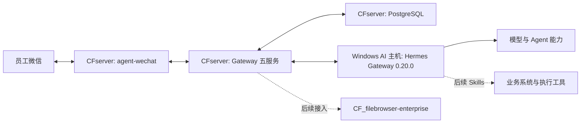

# 企业 AI 自动化系统总体架构

> 状态日期：2026-08-13。当前生产状态以[状态矩阵](../status/current-status.md)为准；较早 Staging 验证只作为历史证据。

## 架构目标

系统以微信作为员工入口，以 CFserver 上的 Gateway 和 PostgreSQL 作为消息、身份、权限、路由、响应和投递的权威控制中心，以 Windows AI 主机上的 Hermes 作为 Agent 执行层，以 `CF_filebrowser-enterprise` 作为正式文件与资料基础设施。

## 分层职责

| 层级 | 组件 | 当前边界 |
| --- | --- | --- |
| 微信入口 | `CF_agent-wechat` | 已部署 CFserver；负责登录、读取、发送和 Gateway 接口；`ENABLE_VNC=0` |
| 权威控制 | `CF_agent-gateway` + PostgreSQL | PostgreSQL、`gateway`、`wechat-worker`、`dispatch-worker`、`delivery-worker` 均 healthy |
| Agent 执行 | Hermes Gateway 0.20.0 | 网络连通已验证；真实授权消息处理和可靠自启待验证 |
| 文件基础设施 | `CF_filebrowser-enterprise` | 保持既有项目状态；后续统一承载正式文件访问、权限和审计 |
| 业务能力 | Skills、旺店通、S6 等 | 规划中，必须经过 Gateway 和文件权限边界 |

## 当前运行边界

已实机验证：3 秒轮询、17 个 Checkpoint、`bootstrap_mode=latest` 跳过 151 条历史基线、新私聊持久化、发送者/会话识别、Checkpoint 推进、未授权拒绝以及 CFserver/`dispatch-worker` 到 Hermes 的网络连通。

尚未验证：测试身份和来源映射、两级访问策略、Agent Profile、Conversation Binding、Admission Allowed、V2 Routing、Hermes 实际处理、Response Persistence、Delivery Outbox 和微信 AI 回复。

> 微信消息发现、持久化、Checkpoint、未授权拒绝和 Hermes 网络连通已实机验证；授权后的完整 AI 回复闭环仍待验证。

## 架构原则

1. **Persist-first：** 员工消息先持久化，再做身份、权限和路由判断。
2. **拒绝默认：** 未授权消息不调用 Hermes、不产生机器人回复。
3. **权威状态在 CFserver：** Windows AI 主机不得覆盖 Gateway/PostgreSQL 状态。
4. **执行与投递分离：** Hermes 结果先持久化，再经 Delivery Outbox 投递。
5. **明确群聊触发：** 群聊未来必须由发送者明确 `@` 当前机器人。
6. **统一文件边界：** 正式文件只经 File Service、权限检查和审计。
7. **规划不等于验证：** 服务 healthy 和网络可达不等于授权端到端闭环完成。

## 专题导航

- [企业 AI Gateway 架构](./gateway-architecture.md)
- [微信入口与 Hermes 集成](./wechat-hermes-integration.md)
- [agent-wechat 定位与职责](./wechat-agent.md)
- [消息与任务流程](./message-flow.md)
- [组件职责图谱](./component-map.md)
