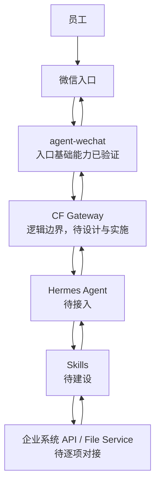

# 企业 AI 自动化系统总体架构

> 状态日期：2026-07-29。本文是总体架构视图；组件内部设计、安全边界和数据模型以[系统设计](../02_系统设计.md)为准，当前实施进度以[当前开发进度](../status/current-progress.md)为准。

## 架构目标

本系统面向企业电商高频业务，通过 **Agent + Skill + 企业系统接口** 实现受控自动化。员工从微信发起请求，系统在权限、任务和文件边界内完成理解、调用和结果回传，不将 AI 直接等同于业务执行权限。

## 状态标识

- **已验证：** 已完成明确范围内的技术验证，不等同于生产可用或端到端完成。
- **已确定 / 待实施：** 架构边界已经确定，组件或集成尚未完成。
- **待技术验证 / 待确认：** 需要通过实测或评审才能形成稳定结论。
- **后续规划：** 不属于当前已实现能力。

## 核心架构

主链路的目标是：员工在微信提交请求，`agent-wechat` 完成微信侧收发，CF Gateway 负责路由和安全隔离，Hermes 在授权范围内理解任务并选择 Skill，Skill 通过经批准的接口访问企业系统或文件服务，结果沿原链路返回原会话。

图中的 CF Gateway 是**规划中的逻辑网关边界**，不是已经存在的单一程序或已部署模块。其后续设计需要与 `wechat-relay`、上下文服务、任务中心、权限、日志和审计职责衔接，详细拆分见[系统设计](../02_系统设计.md)。

## 分层职责

| 层级 | 核心职责 | 当前状态 |
| --- | --- | --- |
| 员工与微信入口 | 提交业务请求、补充信息、接收结果或确认请求 | 业务入口已确定 |
| `agent-wechat` | 微信登录、联系人/聊天/消息读取、消息发送；附件接收为规划能力 | 部署和基础读写能力已验证；附件待技术验证 |
| CF Gateway | 消息路由、安全隔离，并衔接上下文、任务、权限和审计控制 | 待设计、待实施 |
| Hermes Agent | 理解意图、规划步骤、选择获授权的 Skill、生成结构化结果 | 生产 Agent 路线已确定；待接入 |
| Skills | 封装库存、订单、文件等可审计的确定性业务动作 | 体系待建设，具体 Skill 待逐项定义 |
| 企业系统与文件服务 | 提供受控业务数据、业务操作和正式文件访问 | 旺店通 ERP、旺店通 WMS、S6 与正式存储已存在；自动化接口待逐项验证和对接 |

## 控制中心与执行节点

- **Debian 权威控制中心：** 消息、上下文、任务、文件、权限、日志和审计的权威来源。`agent-wechat` 的生产部署位置计划为 Debian。
- **Windows AI 执行节点：** 计划运行 Hermes、Worker Bridge、Skills，以及文档、浏览器和 Windows 侧执行工具。
- **正式文件访问：** 自动化必须经过 File Service 的权限检查和审计。Hermes 与 Skill 不得任意遍历或直接改写正式存储。
- **FileBrowser Enterprise：** 企业文件中心的人员访问与管理入口，与自动化主线并行推进；它不替代 File Service 的自动化访问边界。

## 当前实现边界

当前已完成 `agent-wechat` 的部署、微信登录、联系人读取、聊天读取、消息读取和消息发送验证。以下能力仍不能表述为已经完成：

- CF Gateway 及其消息路由、安全隔离和控制面集成。
- Hermes、GPT-5.6 API、Worker Bridge 与微信链路的端到端接入。
- 库存、订单、文件等业务 Skills。
- 旺店通 ERP、旺店通 WMS、S6 和正式文件服务的自动化接口对接。
- 微信附件兼容性、文件自动处理、企业权限体系和完整审计闭环。
- 独立 OCR 与知识库处理链路；第一阶段不建设独立 OCR。

## 架构原则

1. **状态先落权威中心。** Windows 节点离线或更换时，不得丢失 Debian 已接收的消息、文件和任务。
2. **AI 负责理解与编排，Skill 负责业务动作。** Hermes 不绕过权限、确认或接口边界直接操作业务系统。
3. **最小授权。** 每个任务只获得所需的 Skill、数据和文件权限，高风险写操作需要人工确认。
4. **全链路可追踪。** 消息、任务、Skill 调用、系统接口、文件和结果回传使用关联标识记录状态和失败原因。
5. **规划不等于实现。** 未完成技术验证、接口对接或业务验收的能力，统一保持“待实施 / 待验证 / 后续规划”标识。
