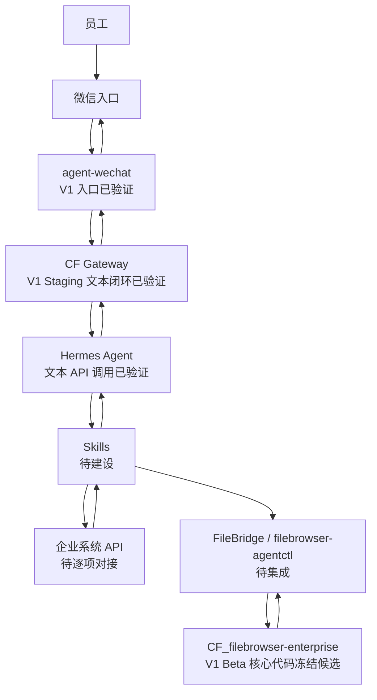
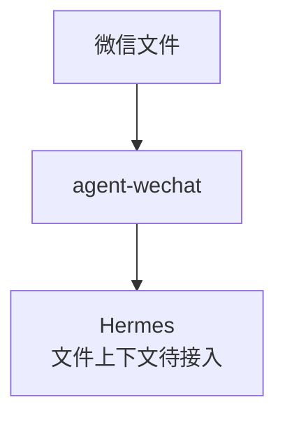

# 企业 AI 自动化系统总体架构

> 状态日期：2026-08-04。本文是总体架构视图；组件内部设计、安全边界和数据模型以[系统设计](../02_系统设计.md)为准，当前实施进度以[当前开发进度](../status/current-progress.md)为准。

## 架构目标

本系统面向企业电商高频业务，通过 **Agent + Skill + 企业系统接口** 实现受控自动化。员工从微信发起请求，系统在权限、任务和文件边界内完成理解、调用和结果回传，不将 AI 直接等同于业务执行权限。

## 状态标识

- **已验证：** 已完成明确范围内的技术验证，不等同于生产可用或端到端完成。
- **已实现基础：** 已完成明确范围内的代码实现，不等同于完整组件、部署或端到端完成。
- **已确定 / 待实施：** 架构边界已经确定，组件或集成尚未完成。
- **待技术验证 / 待确认：** 需要通过实测或评审才能形成稳定结论。
- **后续规划：** 不属于当前已实现能力。

## 核心架构

主链路的目标是：员工在微信提交请求，`agent-wechat` 完成微信侧收发，CF Gateway 负责路由和安全隔离，Hermes 在授权范围内理解任务并选择 Skill，Skill 通过经批准的接口访问企业系统或文件服务，结果沿原链路返回原会话。

图中的 CF Gateway 是逻辑网关边界，不等同于一个已生产部署的完整系统。V1 Staging 已完成真实微信文本从 Polling、Message Store、Identity / Permission Admission、Employee Workspace / AI Thread 到 Hermes API 和原微信会话回复的闭环，并验证 Runtime Thread Binding 与 self message 防回环。Context Builder、Task Queue、完整 Worker Bridge、Skill、图片 / 附件 / 文件链路和生产部署仍待建设。完整证据见[Gateway V1 Staging 验证记录](../status/gateway-wechat-staging-validation.md)。

## 分层职责

| 层级 | 核心职责 | 当前状态 |
| --- | --- | --- |
| 员工与微信入口 | 提交业务请求、补充信息、接收结果或确认请求 | 业务入口已确定 |
| `agent-wechat` | 微信登录、私聊/群聊文本、文件与 ZIP 消息、引用消息、入口标识与附件读取；识别结构化 mention 和合并转发消息的外层信息 | V1 微信入口及结构化 mention 已验证；合并转发内部解析、未覆盖格式和实时事件仍待开发、验证或研究 |
| CF Gateway | 消息路由、安全隔离，并衔接上下文、任务、权限和审计控制 | V1 Staging 文本闭环已验证；Context Builder、Task Queue、完整 Worker Bridge、Skill、文件链路和生产部署仍待完成 |
| Hermes Agent | 理解意图、规划步骤、选择获授权的 Skill、生成结构化结果 | V1 Staging 文本 API 调用与响应已验证；Skill 和生产运行待建设 |
| Skills | 封装库存、订单、文件等可审计的确定性业务动作 | 体系待建设，具体 Skill 待逐项定义 |
| 企业系统 | 提供受控业务数据和业务操作 | 旺店通 ERP、旺店通 WMS、S6 已存在；自动化接口待逐项验证和对接 |
| `CF_filebrowser-enterprise` | 作为唯一正式企业 File Service，提供人员入口、受控 API、文件 capability 与 Persistent Audit | V1 Beta 核心代码冻结候选；权限、API Token、Share 与 capability UI、Persistent Audit、WebDAV / OnlyOffice Audit 已实现并通过自动化测试，自动化接线和 Debian 验收待完成 |
| FileBridge / `filebrowser-agentctl` | 作为自动化侧受控客户端调用稳定 File Service API | 边界已确定；Gateway/Hermes 对接待集成、待验证 |

## 控制中心与执行节点

- **Debian 权威控制中心：** 消息、上下文、任务、文件、权限、日志和审计的权威来源。`agent-wechat` 的生产部署位置计划为 Debian。
- **Windows AI 执行节点：** V1 Staging 已运行 Hermes API；完整 Worker Bridge、Skills，以及文档、浏览器和 Windows 侧执行工具仍按阶段建设。
- **正式文件访问：** `CF_filebrowser-enterprise` 是唯一的正式企业 File Service，同时提供人员入口和受控 API。自动化必须经过其文件权限、Token capability、Share capability 和 Audit。
- **受控客户端：** FileBridge / `filebrowser-agentctl` 只调用 File Service API，不直接遍历或改写正式存储，也不自行授权。Gateway、Hermes 和 Skills 同样不得绕过该边界。

## 当前实现边界

当前已经完成 `agent-wechat` V1 微信入口验证，包括微信登录、私聊文本、群聊文本、文件消息、ZIP 文件、引用消息、`sender` 识别、`chatId` 识别和文件获取。群聊结构化 mention 的三组对照样本已验证，固定按 `raw.get("isMentioned") is True` 生成 `is_mentioned`，字段缺失按 `false`，不得从正文、名称、引用或历史 mention 推断。合并转发消息已验证类型识别、发送人获取和外层标题获取。微信消息入口层技术可行；当前消息读取采用已验证的 API 方式，实时事件机制仍待研究和开发。

V1 Staging 已在 Debian 13 的 `agent-wechat` Docker 与 Gateway Worker、Windows AI 主机 Hermes API 之间完成真实微信文本联调。已验证 Polling、Checkpoint、Message Store、Identity / Permission Admission、Employee Workspace / AI Thread、Hermes Dispatch / Response Relay、Runtime Thread Binding、`chatId + text` 回复和 `is_self=true` 防回环。详见[Gateway V1 Staging 验证记录](../status/gateway-wechat-staging-validation.md)。

目标群聊线程键仍为 `bot_account_id + group_chat_id + sender_id`。Gateway V1 当前 whole-room thread 行为是已知实现偏差，不代表设计变更；在修复并通过同群多员工隔离测试前，不能宣称群聊员工上下文隔离已经验收。

`CF_filebrowser-enterprise` 当前代码基线为 `feat/v1-integration` commit `f329de2fc6e9296ca949acab4873c30a83d5f5e7`。V1 Beta 核心代码已实现并通过自动化测试：Browse / Preview / Download 与 Create / Modify / Delete / Replace 权限语义、主要文件能力、API Token hash-only 与 migration，以及 Share capability UI、Browse / Preview 派生、Upload Share 强制 Create、密码三态和 credential-active hash 绑定均已覆盖。

Persistent Audit 已实现 Pending / Finalize / Recovery、RequestID、request-scoped Recorder、degraded 状态、管理员查询、过滤、分页、签名 Cursor 与防篡改；Action 覆盖 Token、登录、用户、权限、Share、核心文件、Archive、WebDAV 和 OnlyOffice。前端 17 个测试文件共 109 项测试、typecheck、lint、i18n、production build、`go vet`、`go test ./http` 和 `go test ./...` 已通过。

这些 File Service 代码与测试不代表自动化接线、Debian 或 migration 真实环境、真实 WebDAV / OnlyOffice、V1 Beta Candidate、Git tag、GitHub Release 或正式生产上线已经完成。

以下能力仍不能表述为已经完成：

- CF Gateway 的 Context Builder、Task Queue、完整 Worker Bridge、通用 AI Provider 路由和生产部署。
- 图片 / 附件 / 文件链路，以及 Worker Bridge、Skills 与微信链路的完整任务接入。
- 库存、订单、文件等业务 Skills 系统。
- 旺店通 ERP、旺店通 WMS、S6 接口，以及 FileBridge / `filebrowser-agentctl`、Gateway/Hermes 对稳定 File Service API 的自动化对接。
- 图片、Office、PDF、中文文件名、连续多附件等未覆盖入口场景，以及解压、文件自动处理、企业权限体系、Audit WORM、外部防篡改存档、Audit 管理前端 UI 和完整生产 retention 验收。
- File Service 的 Debian 与 migration 真实环境、备份恢复、升级回滚、Docker / Compose、Nginx / TLS / systemd、真实 WebDAV / OnlyOffice、V1 Beta Candidate、Git tag、GitHub Release 和正式生产上线。
- WebSocket 实时事件接入及其重连、去重和补偿机制。
- 合并转发内部聊天记录展开、内部文件自动提取及 `forward parser`。
- 独立 OCR 与知识库处理链路；第一阶段不建设独立 OCR。

## 微信消息入口能力边界

**已验证：**

- 文本消息，包括私聊文本和群聊文本。
- 文件消息、ZIP 文件和文件获取。
- 群聊消息。
- 引用消息。
- `sender` 识别；现有 V1 记录中的 `chatId` 识别继续有效。

### 合并转发消息

**当前支持：**

- 识别合并转发消息。
- 获取发送人。
- 获取外层标题。

**当前限制：**

- 未支持展开内部聊天记录。
- 未支持自动提取内部文件。

### 架构说明

合并转发属于增强解析能力，不是普通微信文件入口成立的前置条件。当前文件入口的架构方向保持不变：

后续可在入口适配层增加 `forward parser`，用于展开内部聊天记录和提取内部文件。该增强尚未实现，也不改变 Debian 权威控制中心、CF Gateway、File Service、权限和审计边界。

当前状态保持为：微信入口与 V1 Staging 文本 AI 闭环**已完成**；图片 / 附件 / 文件上下文、实时事件机制和合并转发解析增强**待开发**。文本闭环不代表文件、Skill 或完整业务链路已经接通。

## 架构原则

1. **状态先落权威中心。** Windows 节点离线或更换时，不得丢失 Debian 已接收的消息、文件和任务。
2. **AI 负责理解与编排，Skill 负责业务动作。** Hermes 不绕过权限、确认或接口边界直接操作业务系统。
3. **最小授权。** 每个任务只获得所需的 Skill、数据和文件权限，高风险写操作需要人工确认。
4. **全链路可追踪。** 消息、任务、Skill 调用、系统接口、文件和结果回传使用关联标识记录状态和失败原因。
5. **规划不等于实现。** 未完成技术验证、接口对接或业务验收的能力，统一保持“待实施 / 待验证 / 后续规划”标识。
6. **稳定 File Service 契约。** 自动化主线接入时，Gateway、Hermes 和 Skills 只能通过稳定 File Service API、用户权限、最小 API Token、Share `effectiveCapabilities` 和 Persistent Audit 访问正式文件；不得自行推导或放大授权，也不得直接访问正式存储。
