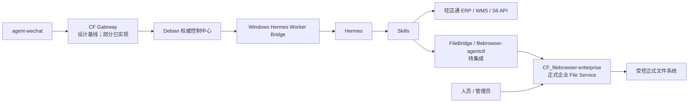

# 组件职责图谱

> 状态日期：2026-08-03。本文给出组件级职责摘要；详细边界见[系统设计](../02_系统设计.md)，实施状态见[当前开发进度](../status/current-progress.md)。

## 核心组件

| 组件 | 职责 | 当前状态 | 主要边界 |
| --- | --- | --- | --- |
| `agent-wechat` | 微信入口：登录、私聊/群聊文本、文件与 ZIP 消息、引用消息、`sender`、`chatId`、结构化 mention 和文件获取；合并转发外层识别 | V1 微信入口与结构化 mention 已验证；合并转发类型、发送人和外层标题已验证；实时事件机制待研究 | 不从正文、名称、引用或历史消息推断 mention；不展开合并转发内部记录或自动提取其内部文件；不负责 AI 思考、业务决策、ERP 操作、文件处理或 Skill 执行 |
| CF Gateway | 消息路由、安全隔离，并衔接上下文、任务、权限、日志与审计 | main commit `f0f0ea0cbcc1029104002b566912afabd23423c7` 已实现 Message Store、身份 / 工作区 / 线程、Access Control、策略持久化与微信适配基础，全量 162 项测试通过；正式接线、任务、Hermes 链路与部署待完成 | 逻辑边界不等于完整已部署单一程序，不决定业务结果 |
| Hermes | Agent 核心：理解意图、规划步骤、选择授权 Skill、生成结构化结果 | 生产 Agent 选型已确定；待接入 | 不绕过权限、人工确认、File Service 或 Skill 直接执行业务动作 |
| Skills | 封装库存、订单、文件、浏览器等确定性业务动作 | 体系待建设；具体能力待逐项定义和验收 | 不自行扩大权限，不在仓库保存凭证 |
| `CF_filebrowser-enterprise`（正式企业 File Service） | 企业文件中心的人员入口与受控 API；负责文件访问、Token/Share capability、Archive/Extract 安全和自身 Audit | V1 Beta 核心服务端能力已实现；Share capability 前端、剩余业务 Audit Action 待集成；最终 Debian 部署待验证 | 是唯一正式 File Service；不允许任何调用方绕过 API、权限、capability 或 Audit |
| FileBridge / `filebrowser-agentctl` | 代表自动化调用方访问稳定 File Service API | 客户端边界已确定；Gateway/Hermes 对接待集成、待验证 | 不自行授权、不直接访问正式存储、不依据 `configured` capability 放大权限，也不成为第二套 File Service |
| S6 | 财务、线下业务和对账数据 | 企业系统已存在；自动化接口待验证和对接 | 不默认作为电商库存的唯一数据源 |
| 旺店通 ERP | 电商订单、库存、物流和寄样订单业务数据 | 企业系统已存在；自动化接口待验证和对接 | 具体字段、权限、数据时效和写操作规则待确认 |
| 旺店通 WMS | 仓库现场执行 | 企业系统已存在；前期不是主要自动化对象 | 与 ERP、S6 的数据边界和接口待具体业务阶段确认 |

## 控制与执行关系

- Debian 保存消息、上下文、任务、文件、权限、日志和审计的权威状态。
- Windows AI 节点计划运行 Hermes、Worker Bridge 和 Skills，不以本地状态覆盖 Debian。
- CF Gateway 是对入口路由和安全控制职责的架构称呼；`CF_agent-gateway` 已实现 Message Store 来源账号隔离与双重幂等、Identity Mapping、Employee Workspace / AI Thread、Access Control 与策略持久化，以及微信适配基础组件；Adapter 正式接线、Polling / Checkpoint、Admission Orchestrator、Context Builder、Task Queue、Hermes 接入和部署仍待完成。
- `CF_filebrowser-enterprise` 同时承载人员入口和受控 API；FileBridge / `filebrowser-agentctl` 只按稳定契约提交调用方身份、受控凭证、任务和文件引用，由 File Service 服务端校验 Token、计算 Share `effective` capability、执行权限判断并记录 Audit。
- Share 的 `configured` 是配置值，`effective` 是服务端计算的实际生效 capability；客户端不得自行放大权限。V1 Beta 完成后，Gateway/Hermes 只按稳定 File Service 契约集成。

当前组件状态可概括为：微信入口层与结构化 mention **已验证**；`CF_agent-gateway` main commit `f0f0ea0cbcc1029104002b566912afabd23423c7` 的 Message Store、身份 / 工作区 / 线程、Access Control、策略持久化与微信适配基础**已实现**，全量 162 项测试通过；Adapter 正式接线、Polling / Checkpoint、Admission Orchestrator、Context Builder、Task Queue、Hermes / Worker Bridge、实时事件机制、合并转发解析增强和部署仍**待完成**，Skills 系统与 ERP/S6 接口仍**待开发或对接**。File Service 的 V1 Beta 核心服务端能力**已实现**，但其前端剩余项、业务 Audit Action 和自动化对接**待集成**，最终 Debian 部署与 V1 Beta candidate/tag **待验证**。这些基础不代表完整 Gateway、文件处理、完整审计闭环、端到端运行或生产上线。

## 企业系统接入原则

1. 先确认业务数据归属和接口口径，再建设对应 Skill。
2. 查询与写操作使用最小权限；高风险写操作必须人工确认。
3. API 不可用、结果不确定或部分成功时，记录状态并转人工处理，不将失败包装为成功。
4. 尚未验证的接口、字段、时效和权限不得写成已实现能力。
