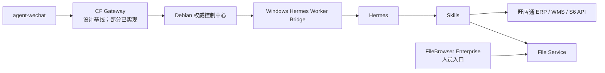

# 组件职责图谱

> 状态日期：2026-08-01。本文给出组件级职责摘要；详细边界见[系统设计](../02_系统设计.md)，实施状态见[当前开发进度](../status/current-progress.md)。

## 核心组件

| 组件 | 职责 | 当前状态 | 主要边界 |
| --- | --- | --- | --- |
| `agent-wechat` | 微信入口：登录、私聊/群聊文本、文件与 ZIP 消息、引用消息、`sender`、`chatId` 和文件获取；合并转发外层识别 | V1 微信入口已验证；合并转发类型、发送人和外层标题已验证；实时事件机制待研究 | 不展开合并转发内部记录或自动提取其内部文件；不负责 AI 思考、业务决策、ERP 操作、文件处理或 Skill 执行 |
| CF Gateway | 消息路由、安全隔离，并衔接上下文、任务、权限、日志与审计 | 设计基线已形成；工程基础和 Message Store Foundation 已实现，其余模块与部署待完成 | 逻辑边界不等于完整已部署单一程序，不决定业务结果 |
| Hermes | Agent 核心：理解意图、规划步骤、选择授权 Skill、生成结构化结果 | 生产 Agent 选型已确定；待接入 | 不绕过权限、人工确认、File Service 或 Skill 直接执行业务动作 |
| Skills | 封装库存、订单、文件、浏览器等确定性业务动作 | 体系待建设；具体能力待逐项定义和验收 | 不自行扩大权限，不在仓库保存凭证 |
| FileBrowser Enterprise | 企业文件中心的人员访问与管理入口 | 在独立仓库并行开发；本仓库不修改其实现 | 不替代自动化侧 File Service 的权限检查与审计 |
| File Service | 自动化访问正式文件的受控接口，负责登记、传输、逻辑路径、权限和审计 | 架构职责已确定；待实施和对接 | 不允许 Hermes 或 Skill 任意遍历正式存储 |
| S6 | 财务、线下业务和对账数据 | 企业系统已存在；自动化接口待验证和对接 | 不默认作为电商库存的唯一数据源 |
| 旺店通 ERP | 电商订单、库存、物流和寄样订单业务数据 | 企业系统已存在；自动化接口待验证和对接 | 具体字段、权限、数据时效和写操作规则待确认 |
| 旺店通 WMS | 仓库现场执行 | 企业系统已存在；前期不是主要自动化对象 | 与 ERP、S6 的数据边界和接口待具体业务阶段确认 |

## 控制与执行关系

- Debian 保存消息、上下文、任务、文件、权限、日志和审计的权威状态。
- Windows AI 节点计划运行 Hermes、Worker Bridge 和 Skills，不以本地状态覆盖 Debian。
- CF Gateway 是对入口路由和安全控制职责的架构称呼；`CF_agent-gateway` 已实现工程基础和 Message Store Foundation，内部其余模块拆分和部署方式尚未确定。
- FileBrowser Enterprise 与自动化主线可以连接同一受控存储，但必须遵循一致的身份、路径和审计规则。

当前组件状态可概括为：微信入口层**已验证**；Gateway 工程基础和 Message Store Foundation **已实现**；Identity Mapping、Employee Conversation Manager、Access Control、Context Builder、Task Queue、Hermes Adapter、实时事件机制和合并转发解析增强均**待开发**，Hermes Agent 接入、Skills 系统和 ERP/S6 接口也仍**待开发或对接**。这些基础不代表完整 Gateway、文件处理或企业业务链路已经贯通。

## 企业系统接入原则

1. 先确认业务数据归属和接口口径，再建设对应 Skill。
2. 查询与写操作使用最小权限；高风险写操作必须人工确认。
3. API 不可用、结果不确定或部分成功时，记录状态并转人工处理，不将失败包装为成功。
4. 尚未验证的接口、字段、时效和权限不得写成已实现能力。
