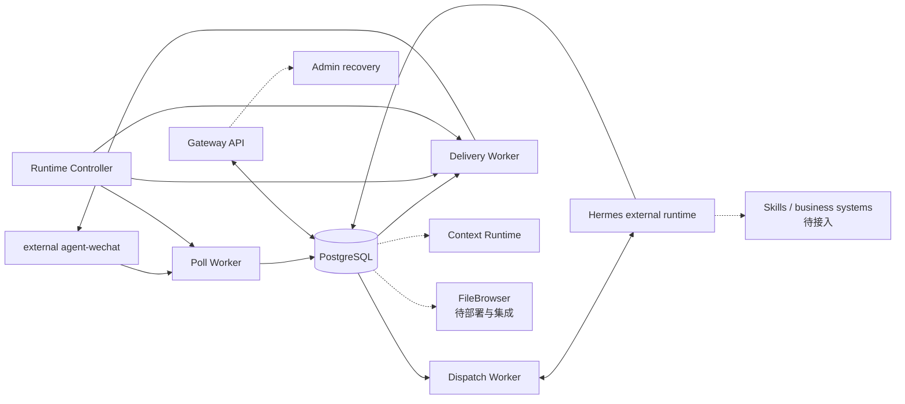

# 组件职责图谱

> 状态日期：2026-09-04

| 组件 | Repository implementation | Deployment / validation | Remaining boundary |
| --- | --- | --- | --- |
| Gateway API | 身份、策略、Profile、Admin 和 Runtime health 已实现 | 已部署；文本控制链通过 | 完整业务管理面与所有恢复动作未生产验收 |
| Poll Worker | Polling、Checkpoint generation/rebase、Persist-first 已实现 | 已部署；forced-QR 连续性通过 | 长期保留窗口和更多故障分支 |
| Dispatch Worker | durable Dispatch、Hermes、FIFO、`uncertain` 已实现 | 已部署；文本调用通过 | Skills、媒体和长期容量 |
| Delivery Worker | durable Outbox、Attempt、Receipt、reconciliation 已实现 | 已部署；文本投递通过 | 完整媒体投递 |
| PostgreSQL | revision `20260823_04` | healthy；业务链一致 | restore 演练 |
| Runtime Controller | v1 组合 stop/start Poll Worker 与 Delivery Worker；不控制 Dispatch | 已部署并使用 | automatic boot stop gate；无单 Worker 控制 |
| external agent-wechat | forced-QR R2 位于开放 PR 栈 | 行为已生产验证 | main promotion 与 CI |
| Hermes external runtime | 外部服务 | 文本执行及一次 AI host reboot reachability 通过 | watchdog、告警、容量、HA |
| Context Runtime | Timeline、Snapshot、search 和授权读取 | 实现/测试/部署代码存在 | 全能力生产演练、RAG/Memory |
| Admin recovery | inspect、retry-approved、mark-dead、confirm-success | 实现/测试/部署；一次受控恢复 | 每种动作生产演练 |
| Media Runtime | 部分 Artifact/媒体模型与测试 | 图片发现/读取通过 | 完整入站、推理、出站链 |
| FileBrowser | V1 Beta branch 实现和自动化验证完成 | 尚未部署 | migration、restore、WebDAV/OnlyOffice、Agent 集成 |
| Skills / 旺店通 / S6 | 未接入 | 未部署、未验证 | 后续实施 |

正式状态以[当前状态矩阵](../status/current-status.md)为准。
