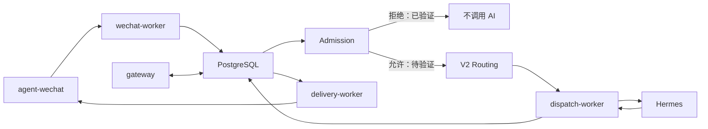

# 组件职责图谱

> 状态日期：2026-08-13。本表描述当前生产组件；历史 V1 Staging 结果不覆盖当前 CFserver 验收。

## 核心组件

| 组件 | 主要职责 | 当前状态 | 关键限制 |
| --- | --- | --- | --- |
| `agent-wechat` | 微信登录、消息读取、消息发送、Gateway 接口 | **已部署并实机验证** | `ENABLE_VNC=0`；完全新设备 SSH 二维码扫码待验证 |
| `gateway` | 身份、策略、Agent Profile、会话绑定和运行时控制 | **已部署，部分链路待验证** | 测试身份、策略、Profile 与绑定尚未配置 |
| `wechat-worker` | 3 秒轮询、Checkpoint、持久化和 Admission 触发 | **已部署并实机验证** | 当前只实测未授权拒绝路径 |
| PostgreSQL | Message Store、Checkpoint、身份、权限、路由、响应和 Outbox | **已部署并实机验证** | 变更前必须备份并验证恢复路径 |
| `dispatch-worker` | 领取获准路由工作并调用 Hermes | **已部署，部分链路待验证** | 仅网络连通，真实 Hermes Dispatch 待验证 |
| `delivery-worker` | 领取 Delivery Outbox 并投递微信 | **已部署，部分链路待验证** | 当前没有获准响应，Outbox 与真实回复待验证 |
| Hermes Gateway 0.20.0 | Agent 执行与模型调用 | **已部署，部分链路待验证** | 重启后未可靠自启；人工启动后恢复 |
| `CF_filebrowser-enterprise` | 正式 File Service、权限、Token、分享、WebDAV、审计 | **开发中** | 本次不改变其具体状态；自动化接入待后续完成 |
| Skills / OCR / 旺店通 / S6 | 业务与工具能力 | **规划中** | 尚未进入当前生产任务链 |

## 控制与执行关系

## 当前结论

Gateway 是由 API 服务、三个独立 Worker 和 PostgreSQL 共同构成的控制与运行边界，不是一个单进程服务。当前已完成微信入口和未授权安全链路验证；授权后的 Routing、Dispatch、响应持久化、Outbox 和微信回复仍待验证。

正式文件后续通过 `CF_filebrowser-enterprise` 接入。Gateway、Hermes、Skills 和受控客户端不得绕过 File Service、文件权限、capability 或审计。
