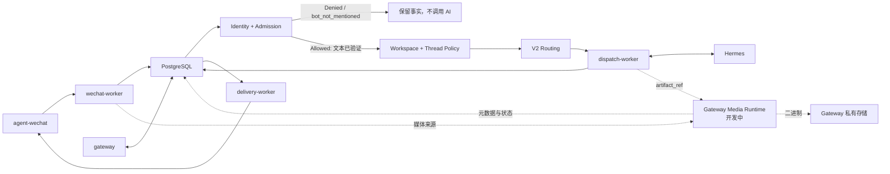

# 组件职责图谱

> 状态日期：2026-08-14。本表描述当前生产组件与明确的待建设媒体边界；状态只适用于各行列出的范围。

## 核心组件

| 组件 | 主要职责 | 当前状态 | 关键限制 |
| --- | --- | --- | --- |
| `agent-wechat` | 微信登录、消息读取、文本发送、图片读取和 Gateway 接口 | **已部署并实机验证** | 图片 `send_media` 与完全新设备扫码待验证 |
| `gateway` | 身份、策略、外部 Profile 引用、Thread Policy、会话绑定和运行时控制 | **已部署并实机验证**（文本范围） | 完整管理员能力、媒体 Runtime 与 `group_shared` 待完成 |
| `wechat-worker` | 轮询、Checkpoint、持久化和 Admission 触发 | **已部署并实机验证** | 入站 Attachment 与私有媒体存储尚未接入 |
| PostgreSQL | Message Store、Checkpoint、身份、线程、路由、响应和 Outbox | **已部署，部分链路待验证** | PostgreSQL 重启恢复未验收；不长期保存大文件 Base64 |
| `dispatch-worker` | 领取获准路由工作并调用 Hermes | **已部署，部分链路待验证** | 文本通过；媒体和正式 `uncertain` 恢复待完成 |
| `delivery-worker` | 领取 Delivery Outbox 并投递微信 | **已部署，部分链路待验证** | 文本通过；媒体 Artifact 与 `send_media` 待完成 |
| Hermes Gateway 0.20.0 | Agent 执行、模型调用和 Hermes 配置档案 | **已部署，部分链路待验证** | 自启、守护、告警、主机恢复、媒体和 Skills 待完成 |
| Gateway Media Runtime | 入站 Attachment、私有存储、出站 ArtifactRepository 与 READY 状态 | **开发中** | 尚未接入；当前 JPEG 读取与校验证据来自微信入口和消息入站 |
| `CF_filebrowser-enterprise` | 正式 File Service、权限、Token、分享、WebDAV、审计 | **开发中** | 本次不改变其具体状态；自动化接入待后续完成 |
| Skills / OCR / 旺店通 / S6 | 业务与工具能力 | **规划中** | 尚未进入当前生产任务链 |

## 控制与执行关系

## Profile 与上下文所有权

- Gateway 通过 Agent Profile 保存并选择 Hermes `external_profile_ref`，不创建 Hermes 配置档案。
- Hermes 配置档案拥有自身配置、技能与 `SOUL.md`。
- Thread Policy 决定 `private_sender`、`group_sender` 或经审批的 `group_shared` 上下文边界。
- 当前私聊和 AI 群均选择 `default`，但其 AI Thread 与 Hermes Thread 相互独立。

## 当前结论

Gateway 由 API 服务、三个独立 Worker 和 PostgreSQL 共同构成，不是单一常驻进程。私聊和 `group_sender` 群聊授权文本闭环已验证；图片读取不等于媒体进入 Hermes，也不等于图片能返回微信。

正式文件后续通过 `CF_filebrowser-enterprise` 接入。Gateway 私有媒体存储仅用于受控暂存，不能演变为第二套企业 File Service。
