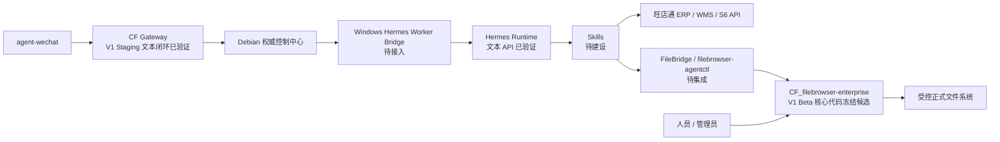

# 组件职责图谱

> 状态日期：2026-08-04。本文给出组件级职责摘要；详细边界见[系统设计](../02_系统设计.md)，实施状态见[当前开发进度](../status/current-progress.md)。

## 核心组件

| 组件 | 职责 | 当前状态 | 主要边界 |
| --- | --- | --- | --- |
| `agent-wechat` | 微信入口：登录、私聊/群聊文本、文件与 ZIP 消息、引用消息、`sender`、`chatId`、结构化 mention 和文件获取；合并转发外层识别 | V1 微信入口与结构化 mention 已验证；合并转发类型、发送人和外层标题已验证；实时事件机制待研究 | 不从正文、名称、引用或历史消息推断 mention；不展开合并转发内部记录或自动提取其内部文件；不负责 AI 思考、业务决策、ERP 操作、文件处理或 Skill 执行 |
| CF Gateway | 消息路由、安全隔离，并衔接上下文、任务、权限、日志与审计 | V1 Staging 文本闭环、Hermes 调度 / 响应回传和 self message 防回环已验证；群聊 whole-room thread 偏差待修复 | 逻辑边界不等于生产系统；Context Builder、Task Queue、完整 Worker Bridge、Skill、文件链路和生产部署仍待完成 |
| Hermes | Agent 核心：理解意图、规划步骤、选择授权 Skill、生成结构化结果 | V1 Staging 文本 API 调用与响应已验证；Skill 和生产运行待建设 | 不绕过权限、人工确认、File Service 或 Skill 直接执行业务动作 |
| Skills | 封装库存、订单、文件、浏览器等确定性业务动作 | 体系待建设；具体能力待逐项定义和验收 | 不自行扩大权限，不在仓库保存凭证 |
| `CF_filebrowser-enterprise`（正式企业 File Service） | 企业文件中心的人员入口与受控 API；负责 Permission、API Token、Share、Share capability UI、Persistent Audit、WebDAV 和 OnlyOffice | `f329de2fc6e9296ca949acab4873c30a83d5f5e7` 为 V1 Beta 核心代码冻结候选；Permission、API Token、Share、Share capability UI、Persistent Audit，以及 WebDAV 权限控制、read/write Audit 和安全上下文、OnlyOffice 保存权限控制、安全写入和 save Audit 已实现并通过自动化测试；真实 WebDAV 客户端联调、真实 OnlyOffice 服务联调、自动化接线与 Debian 验收待完成 | 是唯一正式 File Service；不允许任何调用方绕过 API、权限、capability 或 Persistent Audit |
| FileBridge / `filebrowser-agentctl` | 代表自动化调用方访问稳定 File Service API | 客户端边界已确定；Gateway/Hermes 对接待集成、待验证 | 不自行授权、不直接访问正式存储、不依据 `configured` capability 放大权限，也不成为第二套 File Service |
| S6 | 财务、线下业务和对账数据 | 企业系统已存在；自动化接口待验证和对接 | 不默认作为电商库存的唯一数据源 |
| 旺店通 ERP | 电商订单、库存、物流和寄样订单业务数据 | 企业系统已存在；自动化接口待验证和对接 | 具体字段、权限、数据时效和写操作规则待确认 |
| 旺店通 WMS | 仓库现场执行 | 企业系统已存在；前期不是主要自动化对象 | 与 ERP、S6 的数据边界和接口待具体业务阶段确认 |

## 控制与执行关系

下图描述目标控制与执行关系；当前真实微信文本已调用 Windows Hermes API 并返回原会话，但完整 Worker Bridge、Skills 和文件链路仍未接入。

- Debian 保存消息、上下文、任务、文件、权限、日志和审计的权威状态。
- Windows AI 节点计划运行 Hermes、Worker Bridge 和 Skills，不以本地状态覆盖 Debian。
- CF Gateway 是对入口路由和安全控制职责的架构称呼；V1 Staging 文本闭环已经从 Polling 串通 Hermes API 和原微信会话回复。Context Builder、Task Queue、完整 Worker Bridge、Skill、文件链路和生产部署仍待完成；验证证据见[Gateway V1 Staging 验证记录](../status/gateway-wechat-staging-validation.md)。
- `CF_filebrowser-enterprise` 同时承载人员入口和受控 API；Permission、API Token、Share 与 capability UI、Persistent Audit，以及 WebDAV 权限控制、read/write Audit 和安全上下文、OnlyOffice 保存权限控制、安全写入和 save Audit 已实现并通过自动化测试。真实 WebDAV 客户端联调和真实 OnlyOffice 服务联调仍待完成。FileBridge / `filebrowser-agentctl` 仍只按稳定契约提交调用方身份、最小凭证、任务和文件引用。
- Share 的 `configuredCapabilities` 是配置值，`effectiveCapabilities` 是服务端计算的实际生效 capability；Browse / Preview 由服务端派生，Upload Share 强制 Create，credential 与 active hash 精确绑定。自动化接入时 Gateway / Hermes / Skills 只能使用服务端 effective 结果并接受 Persistent Audit。

当前组件状态可概括为：微信入口、结构化 mention 和 V1 Staging 文本 AI 闭环**已验证**；Hermes Client、Dispatch、Response Relay、Runtime Thread Binding 和 self message 防回环均已运行。Context Builder、Task Queue、完整 Worker Bridge、Skill、图片 / 附件 / 文件处理、实时事件机制、合并转发解析增强和生产部署仍**待完成**，ERP/S6 接口仍**待开发或对接**。Gateway V1 whole-room thread 与既定 `group + sender` 隔离设计存在已知偏差。File Service 已进入 V1 Beta 核心代码冻结候选，自动化调用连接、真实客户端、Debian 和发布验收仍待完成；这些验证不代表完整企业业务自动化或生产上线。

## 企业系统接入原则

1. 先确认业务数据归属和接口口径，再建设对应 Skill。
2. 查询与写操作使用最小权限；高风险写操作必须人工确认。
3. API 不可用、结果不确定或部分成功时，记录状态并转人工处理，不将失败包装为成功。
4. 尚未验证的接口、字段、时效和权限不得写成已实现能力。
