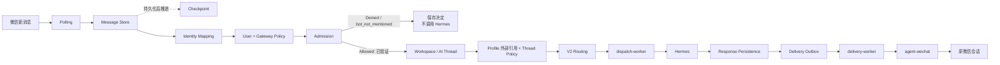
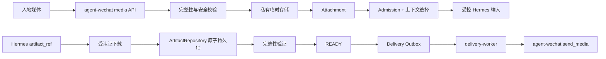

# 企业 AI Gateway 架构

> 状态日期：2026-08-14。本文描述 Gateway 当前生产拓扑、已验证文本范围和待建设媒体边界。

## Gateway 定位

CF Gateway 是企业消息、身份、权限、会话、Profile 外部引用、AI 路由、执行派发、响应持久化和结果投递的权威控制边界。消息进入并被保存，不代表发送者有权创建 AI 工作。

Gateway 不是单进程服务。当前 CFserver 部署包括：

- PostgreSQL
- `gateway`
- `wechat-worker`
- `dispatch-worker`
- `delivery-worker`

五个服务均已部署并保持 healthy。`agent-wechat` 同样运行在 CFserver，通过 `cf-internal` 容器网络与 Gateway 通信。

## 当前生产文本链路

当前生产已验证：

- 3 秒轮询、17 个 Checkpoint 和 `bootstrap_mode=latest` 跳过 151 条历史基线。
- 新文本、引用和图片来源事实进入 Message Store，Checkpoint 正确推进。
- 未授权账号安全拒绝；群聊未真实 `@` 时以 `bot_not_mentioned` 结束。
- 测试身份的 Enterprise Identity、Source Identity Mapping、两级 Access Policy 和 Admission Allowed。
- 私聊 `private_sender` 与群聊 `group_sender` 的 Workspace、AI Thread、V2 Routing、Hermes Dispatch、Response 和微信投递。
- Bot 回复不回环。
- CFserver Gateway 应用服务 restart 后复用原 AI Thread 与 Hermes 会话上下文。

## Persist-first

除入口确认并按防回环规则处理的 Bot 自发消息外，员工消息必须先写入 Message Store，再执行身份、权限和路由判断。

- 持久化失败不得进入 Admission 或执行链。
- 授权和未授权消息都属于受控企业消息历史。
- Admission 拒绝只阻止 AI 工作，不删除消息。
- 群聊 `bot_not_mentioned` 也是持久化后的可追踪安全结果。
- `bootstrap_mode=latest` 只建立首次同步高水位，不执行历史消息。
- 文本、引用和媒体来源事实都遵循这一顺序。

## Identity Mapping 与 Admission

Identity Mapping 以来源平台、Bot 账号和稳定发送者 ID 为输入，输出不可变的 `enterprise_identity_id`。昵称、备注、头像、群名或消息正文不得用于授权或自动合并身份。

Admission 组合 Source Identity Mapping、User Access Policy、Gateway Access Policy、会话类型、能力、风险和群聊结构化 mention。测试允许与拒绝路径均已验证，但这不代表所有正式员工、群和能力策略已经配置完成。

群聊不得根据纯文本机器人名称、引用或上一条消息推断 `is_mentioned=true`。

## Workspace、AI Thread 与 Thread Policy

只有 Admission Allowed 后，Gateway 才解析 Employee Workspace、AI Thread、Thread Policy 与 Agent Profile 外部引用。

- Physical Conversation 与 AI Thread 分离；原会话只用于来源和投递路由。
- 当前私聊采用 `private_sender`。
- 当前企业群聊默认采用 `group_sender`，以群 Conversation 与发送者组合隔离。
- 同一员工可复用 Workspace，但私聊与群聊 AI Thread 和 Hermes Thread 相互独立。
- 同一发送者在同一群中复用原 `group_sender` 上下文。
- `group_shared` 必须单独审批和验证，不能因物理群聊相同而隐式共享。
- `ai_thread_id` 是 Gateway 权威标识；Hermes Runtime Thread 只是外部绑定。

## Agent Profile 与 Hermes 配置档案

Gateway 的 Agent Profile 保存路由所需元数据与 `external_profile_ref`。Hermes 配置档案由 Hermes 自身创建和管理，拥有独立配置、技能和 `SOUL.md`。

- Gateway 不自动创建 Hermes 配置档案。
- Conversation 或 Group Type 选择 Agent Profile，再由 `external_profile_ref` 指向 Hermes 档案。
- Agent Profile 决定调用哪个配置档案；Thread Policy 决定上下文由谁共享。
- 当前测试私聊和 AI 群都引用 `default`，但线程彼此隔离。
- 外部引用缺失、冲突或不可用时必须停止派发并记录明确错误，不得隐式选择任意档案。

## V2 Routing、Dispatch 与投递

V2 Routing 在 Admission Allowed 后，根据 Conversation、Group Type、Thread Policy、Profile 外部引用、权限、能力和 Provider 状态生成可追踪决定。

文本链路已经验证：

1. `dispatch-worker` 领取获准且完成路由的工作。
2. Hermes 返回可持久化文本响应。
3. Gateway 保存 Response Persistence。
4. Gateway 创建 Delivery Outbox。
5. `delivery-worker` 通过 `agent-wechat` 返回原会话。
6. Gateway 分别记录执行和投递结果。

“文本投递通过”不能外推为媒体投递通过。

## uncertain Dispatch

Hermes 不可达时曾出现连接超时、Dispatch 进入 `uncertain`，且微信没有 AI 回复。Hermes 人工启动后恢复健康；一次带备份、证据核对和 Guard 的受控恢复使原 Dispatch 第二次执行成功。

`uncertain` 不能自动视为失败或未执行。正式能力必须：

- 查询 Gateway、Hermes、Response 和 Delivery 侧证据。
- 使用幂等 Guard 约束恢复。
- 通过受控命令/API记录决定和结果。
- 禁止无证据盲重试。
- 禁止把人工直接修改数据库作为常规运维。

## 引用消息

Gateway 已保存 `reply_context`，引用类型消息也能完成文本回复。群聊引用若没有真实 `@`，仍以 `bot_not_mentioned` 结束。

当前没有把被引用内容自动加入 Hermes 输入；因此引用类型回复成功不代表模型理解了引用正文。

## Media Runtime 边界

当前图片发现已验证到：`image/raw_type=3`、Message Store、Raw Payload、媒体 API JPEG 字节和签名/大小/SHA-256 校验。Attachment 与 Artifact 链路尚未接入。

上图是目标设计。二进制保存在 CFserver 私有存储，PostgreSQL 只保存元数据和状态；不长期存大文件 Base64。普通聊天媒体自动过期，需要归档的文件再经 `CF_filebrowser-enterprise` 转存。

完整设计见[系统设计的 Media Runtime V2](../02_系统设计.md#media-runtime-v2)。

## 文件与 Skills 边界

Gateway 私有媒体存储用于可靠中转，不是正式企业文件中心。`CF_filebrowser-enterprise` 是唯一正式 File Service；Gateway、Hermes、Skills 和受控客户端不得绕过用户权限、最小 capability 与审计。

第一阶段不建设独立 OCR。Skills 和业务系统接入在媒体、恢复和文件基础链路稳定后推进。

## 当前结论

> 私聊和 group_sender 群聊的授权文本闭环已实机验证；媒体链路、引用上下文注入和完整宿主恢复仍待完成。

下一阶段顺序见[当前状态矩阵](../status/current-status.md#下一阶段顺序)，生产证据见[2026-08-14 私聊、群聊及媒体验证记录](../status/2026-08-14-private-group-media-validation.md)。
