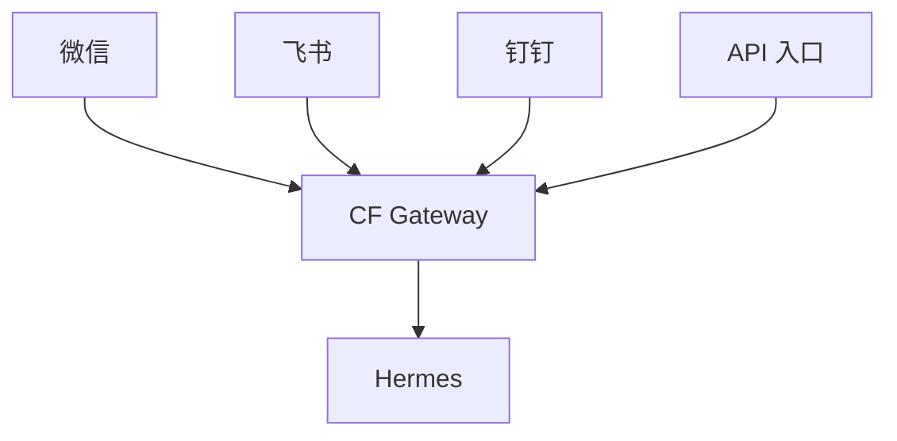
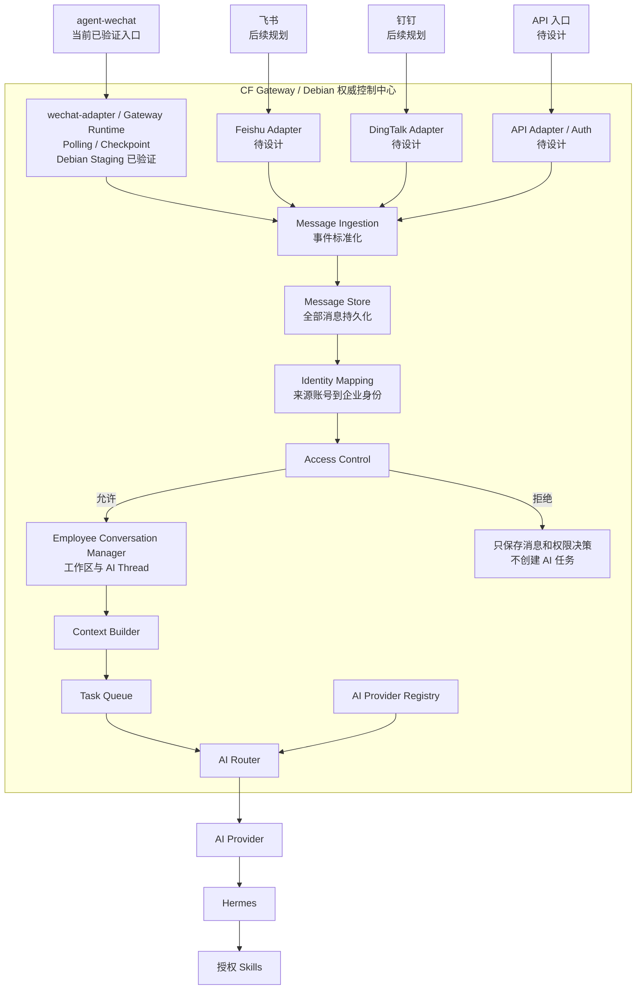
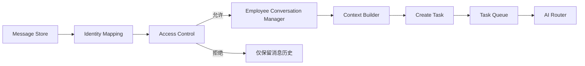
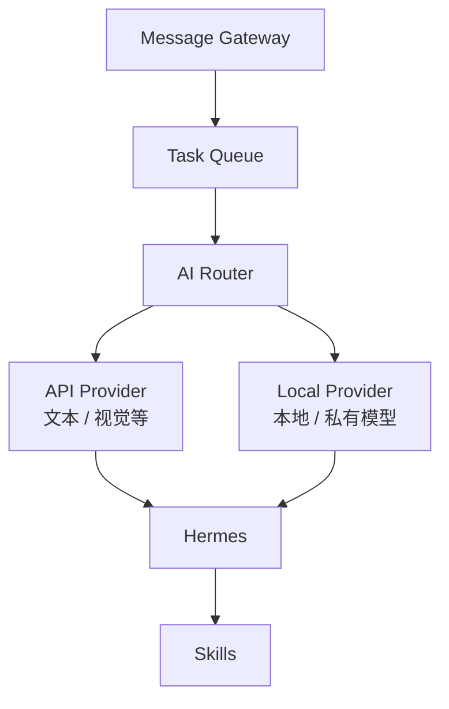

# 企业 AI Gateway 架构

> 状态日期：2026-08-03。本文定义企业 AI Gateway 的目标架构，并单独标记实际实现边界。`CF_agent-gateway` commit `587f59f feat: wire wechat polling runtime` 已在 Debian Staging 完成真实微信消息从 Polling / Checkpoint 到 Message Store、Identity Mapping、Access Control、Admission、Employee Workspace 和 AI Thread 的联调验证。验证链路止于 AI Thread；Context Builder、Task Queue、Hermes Runtime、AI 回复回传微信、Skill 执行链和生产部署均未完成。当前状态不代表生产上线或完整 AI Agent 闭环，详见[Gateway 微信 Debian Staging 验证记录](../status/gateway-wechat-staging-validation.md)。

## 1. Gateway 定位

CF Gateway 是企业 AI 消息中枢，也是消息入口、权威控制面和 AI 执行环境之间的安全与调度边界。机器人不是公开服务：消息能够进入 Gateway 并被保存，不代表该消息有权创建 AI 任务。

Gateway 包含 `Message Ingestion`、`Message Store`、`Identity Mapping`、`Access Control`、`Employee Conversation Manager`、`Context Builder`、`Task Queue`、`AI Router`、`AI Provider Registry` 和由 Provider / Task 状态组成的 `Runtime / Execution Status`。

这些模块共同管理：

- 消息及附件历史。
- Enterprise Identity / 企业身份、Employee Workspace / 员工工作区和 AI Thread / AI 会话线程。
- 用户、群、Skill 和任务权限。
- 按员工和 AI Thread / AI 会话线程隔离的 Hermes 受控上下文。
- 任务、队列、租约和结果状态。
- AI Provider 注册、运行状态和路由决策。

Gateway 不管理具体 AI 主机，不维护 AI 主机清单、GPU 节点心跳或主机级进程状态。本地 AI 主机、私有模型服务和云端模型 API 均通过 `AI Provider` 抽象接入；具体主机、容器、GPU 和服务实例由 Provider 自身的执行或运维层管理。

Gateway 的权威控制面位于 Debian。当前 `CF_agent-gateway` 已在 Debian Staging 与 `agent-wechat` 同机完成本文件所述入站链路验证，但生产部署尚未完成。Gateway 是逻辑架构边界，不预先限定为一个进程、一个容器或一种网关产品；内部模块后续可以拆分部署，但消息、权限、上下文、任务、队列和 Provider 路由的权威记录仍在 Debian。

## 2. 总体架构

面向入口和 Hermes 的简化关系如下：



Gateway 内部控制链路如下：



图中的飞书、钉钉、API 入口及多种 AI Provider 是目标扩展位置，不表示已经选型、部署或验证。详细设计分别见[Message Store 设计](../design/message-store-design.md)、[Access Control 设计](../design/access-control-design.md)、[Task Queue 设计](../design/task-queue-design.md)、[Hermes 事件协议](../design/hermes-event-schema.md)和[员工工作区与 AI 会话线程设计](../design/employee-workspace-design.md)。

## 3. Gateway 核心职责

Gateway 负责：

- 校验入口账号、来源平台和 Adapter 身份，隔离不同机器人账号和入口范围。
- 接收 Adapter 生成的标准消息，执行来源映射、基础结构校验和幂等去重。
- 在推进同步检查点前保存全部消息，形成企业统一消息历史。
- 把来源平台稳定账号映射到 Enterprise Identity / 企业身份；映射失败时保留消息但不创建员工 Task。
- 在消息持久化后执行 Access Control，决定是否创建 AI 任务。
- 为获准消息确定 Employee Workspace / 员工工作区和 AI Thread / AI 会话线程，再筛选必要上下文、创建任务并进入 Task Queue。
- 根据任务所需模态、模型、数据边界和能力，通过 AI Router 选择 AI Provider。
- 保存任务、队列、租约、Provider 运行快照、文件、权限决策和结果回传的权威状态。
- 在 Skill 执行前再次校验权限、高风险确认和任务状态。
- 将结果路由回原平台、原账号和原会话，并区分任务完成与回传成功。

Gateway 不负责：

- 代替 Hermes 理解自然语言、规划业务步骤或生成业务答案。
- 执行模型推理、管理模型进程或运维具体 AI 主机。
- 代替 Skill 执行 ERP、S6、平台后台、文件处理或 Windows 自动化。
- 根据昵称、群名、正文或文件名猜测企业身份和权限。
- 根据 Hermes Runtime Thread / Hermes 运行时线程反推或覆盖企业身份、工作区和 AI Thread / AI 会话线程归属。
- 绕过 File Service、人工确认或业务幂等规则直接访问正式文件和企业系统。

## 4. 消息接入

### 4.1 当前与未来来源

| 来源 | 接入组件 | 当前状态 |
| --- | --- | --- |
| 微信 | `agent-wechat` + `wechat-adapter` | `agent-wechat` V1 入口和结构化 mention 已验证；commit `587f59f` 已在 Debian Staging 验证 Gateway Runtime、Polling / Checkpoint、Message Store、权限准入及 AI Thread 建立，AI 回复回传编排未完成 |
| 飞书 | 平台 Adapter | 后续规划，未选型、未验证 |
| 钉钉 | 平台 Adapter | 后续规划，未选型、未验证 |
| API | API Adapter / 服务身份鉴权 | 后续规划，协议、鉴权和调用方范围待设计 |

所有入口都必须经过标准化、Message Store 和 Gateway 权限控制。API 入口是业务消息来源，与向外调用模型的 API Provider 不是同一概念；它也不是绕过用户、Skill、文件和审计权限的内部后门。

### 4.2 `agent-wechat` 职责

`agent-wechat` 是微信协议入口，不是 Gateway、Access Control 或 Hermes。

**负责：**

- 维持微信登录态并提供当前已验证的消息读取、发送和文件获取能力。
- 提供微信侧实际可获得的会话、发信人、消息类型、内容、引用和附件元数据。
- 按 Adapter 指定的目标会话发送结果。

**不负责：**

- 决定用户是否在企业白名单。
- 决定群是否启用 AI，或某条消息是否有权创建任务。
- 构建 Hermes 上下文、维护任务队列或选择 AI Provider。
- 分配 Skill、文件或企业系统权限。
- 保存权威任务状态，或直接调用 Hermes 和 Skills。

当前已验证范围以[agent-wechat V1 入口验证记录](../status/agent-wechat-validation.md)为准。当前机器人显示名为 `Bot_测试版` 时，成员列表选择该机器人会得到 `isMentioned=true`；成员列表选择其他成员 T 或只复制 / 输入 `@Bot_测试版 手工文字对照` 时该字段缺失。固定规则为 `is_mentioned = raw.get("isMentioned") is True`，字段缺失按 `false`。

### 4.3 Adapter 职责

每个入口平台使用独立 Adapter 隔离平台差异。Adapter 负责：

- 读取或接收平台原始消息，保存受控原始载荷引用并维护同步检查点。
- 把平台私有字段映射为统一的 `source`、`conversation`、`sender`、`message` 和 `attachments`。
- 提取平台明确提供的会话类型、发信人标识和结构化 mention 事实。
- 生成标准事件并提交 Gateway Message Store。
- 获取并登记平台附件，使用受控文件引用关联消息历史。
- 接收 Gateway 结果回传指令并调用平台发送接口。

Adapter 不自行授予权限，也不直接创建 AI 任务。Adapter / 标准化层只按平台结构化事实生成 `is_mentioned` 和 `is_self`；Access Control 消费这些事实，并根据权威策略形成 `user_allowed`、`group_allowed` 和 `permission_scope`。当前微信规则不得根据正文 `@`、机器人当前名称 `Bot_测试版`、旧名称 `1024`、引用消息或上一条 mention 推断或继承 `is_mentioned=true`。

## 5. Message Store

Gateway 是企业消息历史中心。所有成功进入 Gateway 的消息必须先保存，再进行权限判断，包括：

- 白名单用户的私聊和群聊消息。
- 非白名单用户的消息。
- 未启用 AI 群中的消息。
- 群内未 `@` 当前机器人的消息。
- 当前不支持建立任务的消息类型。

权限拒绝只阻止 AI 任务创建，不删除、不跳过消息历史。

当前验证边界为：commit `587f59f` 已在 Debian Staging 通过真实微信消息验证 Gateway Runtime、Polling / Checkpoint 与 Message Store 的正式入站链路。首次使用 `bootstrap_mode=latest` 会建立高水位而不消费历史消息；未知身份消息会保存到 Message Store，但不会创建 Employee Workspace 或 AI Thread。该验证不覆盖生产运行、长期稳定性或 AI 结果回传，详细证据见[Gateway 微信 Debian Staging 验证记录](../status/gateway-wechat-staging-validation.md)。

### 5.1 消息记录

标准消息记录至少保存：

| 字段 | 说明 |
| --- | --- |
| `id` | Gateway 中稳定的内部消息标识；重复投递不得产生重复消息历史 |
| `event_id` | 首次形成该消息记录的标准事件标识；同一逻辑事件重投时保持不变 |
| `source` | 平台、接入提供方、机器人或应用账号及原始事件标识 |
| `source_message_id` | 来源侧消息标识；与 Gateway 内部 `id` 分离，并在来源账号和会话范围内解释 |
| `conversation_id` | 原始物理会话标识，在来源平台和账号范围内解释 |
| `sender_id` | 平台侧稳定发信人标识 |
| `sender_name` | 平台提供的展示名称，不作为授权依据 |
| `is_mentioned` | 标准化的结构化 mention 来源事实；微信仅当原始 `isMentioned` 严格为 `true` 时为 `true`，字段缺失为 `false` |
| `is_self` | 标准化的消息是否由当前来源账号自身发送的事实，不作为企业身份或权限依据 |
| `message_type` | 标准消息类型，如 `text`、`file`、`reply`、`forward` |
| `content` | 标准化正文或外层标题；按数据分级和保留策略受控访问 |
| `timestamp` | 平台消息时间及 Gateway 接收时间，二者不得混为同一语义 |
| `reply_context` | 实际可得的引用消息标识、摘要和解析状态 |
| `attachments` | 附件标识、名称、类型、大小、哈希、获取状态和受控存储引用 |

`attachments` 保存结构化元数据和受控引用，不在消息记录中内嵌二进制、Base64 或任意主机路径。未授权消息的附件元数据仍属于消息历史，并保留获取或清理状态；附件二进制是否获取、长期落盘或归档由独立的存储、容量、安全和保留策略决定。未授权消息的附件不得进入 AI 任务工作区或发送给 Hermes，权限拒绝也不得被实现为删除消息或附件元数据。完整模型见[Message Store 设计](../design/message-store-design.md)。

### 5.2 持久化规则

- 原始载荷与标准消息分开保存，通过受控引用关联。
- 来源物理消息唯一性按来源账号隔离，相同来源消息标识不得跨机器人账号合并。
- `event_id` 幂等与来源物理消息幂等同时生效，任一重投都不得产生重复消息历史。
- Message Store 成功写入后才能推进入口同步检查点；保存失败时不得假装消息已接收完成。
- 重复投递关联同一 `id`，记录必要接收尝试，不重复创建任务或附件副本。
- 未授权消息和授权消息遵循明确的数据分级、访问审计和保留周期；具体周期待确认。
- 普通运行日志不等于消息历史库，不应重复输出完整敏感正文或附件内容。

## 6. Identity Mapping 与 Employee Conversation Manager

Identity Mapping 与 Employee Conversation Manager 是两个独立 Gateway 模块，分别位于 Access Control 前后。

### 6.1 Identity Mapping

Identity Mapping 的固定输入为 `source.platform`、`source.account_id` 和 `sender.id`，输出 `enterprise_identity_id` 和可选 `employee_id`。它不创建或返回 `workspace_id`。

`enterprise_identity_id` 是 Gateway 内部不可变的企业身份主键，也是身份、Employee Workspace / 员工工作区和权限关联的权威主键。`employee_id` 是可空的公司员工编号、HR 编号或业务人员编号，不是 Gateway 内部主键；展示名称、群名片、消息正文和微信 `wxid` 均不得代替它或用于自动合并来源账号。

无论映射成功、失败、冲突或已失效，身份解析结果都必须关联原消息记录。映射失败时消息继续保存在 Message Store，Access Control 按拒绝默认形成 `identity_unresolved` 等结果，不创建 Task、执行上下文或新的 AI Thread / AI 会话线程执行关系。

一个 Enterprise Identity / 企业身份可以显式绑定多个来源平台账号；一个来源账号在同一有效期内默认只能映射一个企业身份。映射变更必须记录操作者、原因、前后值、时间和有效期。

### 6.2 Employee Conversation Manager

Employee Conversation Manager 只处理 Identity Mapping 成功且 Access Control 明确允许创建 Task 的消息，负责：

- 以 `enterprise_identity_id` 定位或按受控规则创建 Employee Workspace / 员工工作区，解析 `workspace_id`。
- 在该工作区内定位或按受控规则创建稳定的 AI Thread / AI 会话线程，解析 `ai_thread_id`。
- 保存 AI Thread / AI 会话线程与 Physical Conversation / 物理会话的绑定。
- 向 Context Builder 和 Task Queue 提供 `enterprise_identity_id`、可选 `employee_id`、`workspace_id`、`ai_thread_id` 与原始路由信息。
- 记录可选 `hermes_thread_id` 的创建、失效和重绑定，但不把它作为权威主键。

身份映射失败或 Access Control 拒绝时不调用 Employee Conversation Manager 自动创建新的工作区、AI Thread / AI 会话线程或执行绑定；既有历史关系只按审计和保留规则继续存在。

微信私聊线程键仍为 `bot_account_id + private_chat_id`；群聊线程键仍为 `bot_account_id + group_chat_id + sender_id`。同群不同员工默认进入不同工作区和 AI Thread / AI 会话线程。一个 Hermes 服务可以承载多个员工工作区，每个工作区可以包含多个 AI Thread / AI 会话线程，不为每名员工部署独立 Hermes 进程。

Employee Workspace / 员工工作区是归属与隔离容器，不产生权限。工作区存在或为 `active` 不能扩大 Access Control 生成的 `permission_scope` 或 `allowed_skills`。完整模型见[员工工作区与 AI 会话线程设计](../design/employee-workspace-design.md)。

commit `587f59f` 已在 Debian Staging 验证 Message Store、Identity Mapping、Access Control、Admission 与获准后的 Employee Workspace / AI Thread 建立链路。未配置身份时消息保存成功，但不创建工作区或 AI Thread；已授权测试身份会创建 `employee_workspaces`、`ai_threads` 和 `thread_source_bindings`。本次验证创建的 AI Thread 尚未接入 Hermes Runtime，当前 `hermes_thread_id` 为空。

## 7. Access Control

Access Control 是 Gateway 的内部模块，不是 Gateway 的全部职责。它位于 Message Store 和 Identity Mapping 之后、Employee Conversation Manager、Context Builder 和任务创建之前。Identity Mapping 回答“这个来源账号对应哪个企业员工？”，Access Control 回答“这个员工的这条消息能否创建任务？”。权限决定由 Gateway 作出并强制执行，不由 Hermes 判断。

### 7.1 准入规则

| 会话类型 | 创建 AI 任务的条件 | 其他情况 |
| --- | --- | --- |
| 私聊 | 企业身份映射有效且发信人存在于有效白名单，即 `user_allowed=true` | 只保存消息，不创建任务 |
| 群聊 | `group_allowed=true` 且 `user_allowed=true` 且 `is_mentioned=true` | 只保存消息，不创建任务 |

其中 `group_allowed` 对应群策略中的 `group_enabled=true`，`user_allowed` 对应发信人白名单中的 `sender_allowed=true`。群聊任一条件为 `false` 或无法确认都拒绝创建任务。

当前微信入口只接受 `is_mentioned = raw.get("isMentioned") is True`；原字段缺失按 `false`。不得根据正文中的 `@` 字符、机器人当前名称 `Bot_测试版`、旧名称 `1024`、引用消息或上一条 mention 推断或继承 `true`。

### 7.2 拒绝处理

未通过准入检查的消息：

- 已经保存在 Message Store，并关联授权决策和策略版本。
- 已知的身份解析结果继续记录并关联原消息。
- 不构建 Hermes 上下文，不创建任务，不进入 Task Queue。
- 不自动创建新的 Employee Workspace / 员工工作区、AI Thread / AI 会话线程或执行关系。
- 不调用 AI Provider、Hermes、Skill、企业系统或任务级文件工作区。
- 是否发送固定拒绝提示及提示频率待运营规则确认；即使需要提示，也由 Gateway 使用固定受控文案处理，不调用 Hermes 生成拒绝内容。

访问拒绝是权限决策，不应伪装为消息格式错误。详细白名单、群、Skill 和 RBAC 设计见[Access Control 设计](../design/access-control-design.md)。

## 8. Context Builder

Gateway 的 Context Builder 只为通过准入检查并准备创建任务的消息构建 Hermes 输入。候选信息按以下优先级选择：

1. 当前消息。
2. 当前消息明确关联的 `reply_context`。
3. 当前任务批次的文件附件及其元数据。
4. 同一 AI 线程中与当前用户有关的最近必要历史消息。
5. 少量与当前意图直接相关的群聊上下文。
6. 未完成关联任务的必要状态。

构建规则：

- 不把完整私聊或群聊记录发送给 Hermes。
- 未授权消息虽然保存在 Message Store，但默认不进入 Hermes 上下文。
- 群聊按机器人账号、群会话和发信人隔离 AI Thread / AI 会话线程，避免不同员工串线。
- 员工 A 的私聊、群聊任务和未授权数据不得进入员工 B 的上下文。
- 只纳入当前任务权限允许读取的正文、附件和任务状态。
- 进入队列前生成不可变 `context_snapshot_ref`，记录选入项、选择原因和版本。
- 后续补充消息形成新快照或新批次，不悄悄改写正在执行的输入。

窗口长度、摘要、跨消息附件归属和授权批次规则仍待确认。截至 2026-08-03，Context Builder 尚未完成实现和 Staging 验证，不属于本次真实微信已验证链路。

## 9. Task Queue

Gateway 维护持久化 Task Queue。消息历史与任务是不同对象：所有消息都保存，只有通过权限和任务收口条件的消息才创建 Task。



Task Queue 至少保存任务标识、`enterprise_identity_id`、可选 `employee_id`、`workspace_id`、`ai_thread_id`、可选 `hermes_thread_id`、来源账号与 Physical Conversation / 物理会话、上下文快照引用、所需模态或模型能力、允许的 Skills、Provider 路由约束、优先级、队列状态、尝试次数、租约和关联 `trace_id`。同一 AI Thread / AI 会话线程默认有序执行，不同线程可在 Provider 容量和任务风险允许时并行。Task 主状态统一为 `queued`、`running`、`succeeded`、`failed`、`cancelled`；附件的 `pending` 等获取状态不属于 Task 状态。具体字段、转换、优先级和重试边界见[Task Queue 设计](../design/task-queue-design.md)，队列产品和容量参数待选型。

截至 2026-08-03，Task Queue 尚未完成实现和 Staging 验证，不属于本次真实微信已验证链路。

队列必须支持：

- 多任务排队和幂等入队。
- Provider 繁忙、限流、维护或不可用时继续持久化任务。
- 有期限领取租约，避免执行端失联后任务永久占用。
- 可判定安全的重试、延迟重试和人工接管。
- 结果未知或部分成功时停止自动重复业务写操作。

## 10. AI Provider 抽象

`AI Provider` 是 Gateway 面向 AI 执行环境的统一抽象。Provider 描述“可通过什么受控路径使用哪些模型和能力”，而不是一台具体主机。

### 9.1 API Provider

API Provider 表示通过外部或内部 API 提供模型能力，例如：

- OpenAI API。
- Anthropic API。
- DeepSeek API。

这些名称是架构兼容示例，不表示已经选型、接入或批准使用。当前生产模型计划仍以[技术决策记录](../05_技术决策记录.md)中的 GPT-5.6 API 基线为准；变更正式模型路线必须先更新技术决策。

### 9.2 Local Provider

Local Provider 表示企业本地或私有环境提供的模型能力，例如：

- 本地 AI 主机。
- 私有模型服务。
- 由内部平台管理的多个推理实例。

Gateway 不注册或调度 Local Provider 内部的具体主机。若 Local Provider 由多台主机组成，其节点发现、GPU 分配、进程健康和内部负载均衡由 Provider 自身负责，只向 Gateway 暴露统一能力和 Provider Runtime State。

### 9.3 后续 Provider

未来可以增加其他 Provider 类型，但必须保持统一注册、能力声明、鉴权引用、健康状态、路由约束、错误分类和审计边界。Provider 不得借扩展接口绕过 Access Control、Task Queue、Hermes、Skill 权限或 File Service。

## 11. AI Provider Registry

Gateway 维护 AI Provider Registry，用于发现可路由的 Provider，而不是管理 AI 主机。

每个 Provider 注册项至少包含：

| 字段 | 说明 |
| --- | --- |
| `provider_id` | Provider 稳定唯一标识 |
| `provider_name` | 运维展示名称，不作为凭证 |
| `provider_type` | `api`、`local` 或后续扩展类型 |
| `models` | Provider 声明可用的模型集合及版本 |
| `capabilities` | `text`、`vision`、工具调用、上下文上限等已确认能力 |
| `routing_tags` | 数据地域、隐私级别、环境或业务用途等路由标签 |
| `credential_ref` | 受控密钥引用，不包含实际 API Key 或密码 |
| `enabled` | 是否允许新任务路由到该 Provider |
| `policy_version` | 当前注册和路由策略版本 |

模型名称和能力必须来自实际配置与验证，不因 Provider 宣称支持就自动进入生产路由。Provider 注册变更必须可审计。

## 12. Provider Runtime State

Gateway 不维护单一 AI 状态，也不维护主机级节点注册表。它只保存 AI Router 所需的 Provider 级运行状态快照。

API Provider 示例：

```json
{
  "provider": "openai",
  "provider_type": "api",
  "model": "GPT",
  "status": "idle",
  "current_task_id": null,
  "started_at": null,
  "elapsed_seconds": 0,
  "queue_length": 0,
  "last_heartbeat": null,
  "last_status_update": "2026-07-31T08:00:00Z"
}
```

Local Provider 示例：

```json
{
  "provider": "local",
  "provider_type": "local",
  "node": "ai-node-01",
  "model": "Qwen",
  "status": "busy",
  "current_task_id": "task_example",
  "started_at": "2026-07-31T07:58:00Z",
  "elapsed_seconds": 120,
  "queue_length": 2,
  "last_heartbeat": "2026-07-31T08:00:00Z",
  "last_status_update": "2026-07-31T08:00:00Z"
}
```

示例仅说明结构。`node` 是 Local Provider 可选提供的诊断信息，不建立 Gateway 对该主机的管理关系。

Provider Runtime State 至少可包含：

| 字段 | 说明 |
| --- | --- |
| `provider` | 对应 `provider_id` |
| `provider_type` | `api`、`local` 或后续扩展类型 |
| `model` | 当前任务目标模型或 Provider 汇报的模型 |
| `status` | `idle`、`busy`、`error` 或 `maintenance` |
| `current_task_id` | 当前执行 Task；空闲或不适用时为 `null` |
| `started_at` | 当前 Task 或忙碌周期开始时间；不适用时为 `null` |
| `elapsed_seconds` | 当前 Task 已执行时长快照；不适用时为 `0` 或 `null` |
| `queue_length` | 当前可路由到该 Provider 的等待 Task 数量快照 |
| `last_heartbeat` | Provider / Worker 最近心跳；API Provider 不适用时可为 `null` |
| `last_status_update` | Gateway 最近确认该状态的时间 |
| `load` | Provider 级并发、限流、排队或容量摘要；格式随 Provider 能力定义 |
| `node` | Local Provider 可选诊断字段；Gateway 不据此维护节点注册表 |

`idle` 表示可以接受符合条件的新 Task；`busy` 表示当前达到该路由单元的执行容量；`error` 和 `maintenance` 均不接受新 Task。API 限流、Local Provider 内部节点故障或模型服务异常都应汇总为 Provider 级状态和错误。状态过期或无法读取时，AI Router 按 `error` 或不可调度处理，不能默认 `idle`。该状态用于判断是否空闲、展示当前任务和执行时长，以及决定新任务排队还是立即执行；它不是某台 AI 物理主机的状态表。

## 13. AI Router

AI Router 位于 Task Queue 与 AI Provider 之间，根据任务要求、权限和 Provider 状态选择执行路径。



逻辑路由示例：

| 任务需求 | 可选路由方向 | 说明 |
| --- | --- | --- |
| 文本理解与规划 | GPT API 等已批准的文本 Provider | 实际默认模型以技术决策和配置为准 |
| 图片理解 | 已验证的 Vision Provider | 当前图片入口和视觉处理仍未验证，不表示已可用 |
| 本地或私有处理 | Local Provider | 需满足数据边界、模型能力和运行状态要求 |

路由分为两步：

1. **资格过滤：** Provider 已启用、运行状态为 `idle` 或仍有明确可用容量，并满足任务所需模态、模型、上下文、工具、数据地域、隐私和权限约束。
2. **候选选择：** 在合格 Provider 中按策略优先级、容量、限流、成本、延迟和错误率选择；具体权重待压测和业务评审。

路由要求：

- 无合格 Provider 时任务留在队列，不自动降级到未批准的模型或外部服务。
- Provider 繁忙、限流或维护时支持排队和受控重试。
- Provider 故障时可在策略允许、输入兼容且业务动作安全的前提下重新路由。
- 写操作结果未知、部分成功或不具备幂等性时，不因 Provider 故障盲目重复执行。
- 新 Provider 完成身份、能力、安全、合规和健康验证后才可进入候选集合。
- Router 只处理已通过 Gateway 权限检查的任务，不改变 `permission_scope`、`allowed_skills` 或人工确认要求。

## 14. Hermes 与 Skills

Gateway 不执行 AI 任务。目标流程为：

```text
Message Gateway
  -> Task Queue
  -> AI Router
  -> AI Provider
  -> Hermes
  -> Skills
```

当前已验证链路只完成到 AI Thread 创建，`hermes_thread_id` 为空；Hermes Runtime 和 Skill 执行链尚未接入。下一阶段为 Gateway Hermes Adapter，且在完成结果持久化与回传编排前，不得表述为 AI 已回复微信。

Provider 是模型或 AI 执行能力的抽象，Hermes 仍是唯一生产 Agent。具体 Provider Adapter 和 Worker Bridge 如何把所选模型、凭证引用和任务交给 Hermes，仍待接口设计；该抽象不允许以 Provider 替代 Hermes 的 Agent 职责。

企业内目标是运行一套或少量统一 Hermes 服务，由 Gateway 下发不同 Employee Workspace / 员工工作区和 AI Thread / AI 会话线程的任务与上下文。Hermes Runtime Thread / Hermes 运行时线程可以按需创建或重建，但不能成为跨员工混合上下文或替代 Gateway 权威记录的依据。

Hermes 负责：

- 在 Gateway 提供的不可变上下文快照内理解请求和规划步骤。
- 使用 AI Router 选定且当前任务获准的 Provider / 模型。
- 从 Gateway 提供的 `allowed_skills` 中选择适用 Skill。
- 遵守 `authorization.permission_scope`、文件引用、确认状态和任务级限制。
- 向 Gateway 回报结构化完成、澄清、等待确认或失败结果。

Hermes 不负责：

- 判断用户是否在白名单、群是否启用 AI、消息是否真正 `@` 机器人。
- 决定消息是否保存或从企业消息历史中删除。
- 维护权威 Task Queue、Provider Registry 或 Provider Runtime State。
- 自行创建、合并或改变 Employee Workspace / 员工工作区和 AI Thread / AI 会话线程归属。
- 自行更换未获批准的 Provider、增加权限范围或扩大 `allowed_skills`。
- 直接访问生产权限配置、完整聊天历史或正式存储任意路径。

Skills 只接收 Hermes 在当前任务权限内发起的调用，并继续受 Gateway / 控制面的权限、确认、文件和审计约束。

## 15. 多入口与 Provider 扩展

微信、飞书、钉钉和 API 入口共享 Message Store、Identity Mapping、Access Control、Employee Conversation Manager、Context Builder、Task Queue 和 AI Router，但各入口 Adapter 独立处理平台差异。

新增消息入口至少需要验证稳定账号、会话、发信人、mention、消息唯一标识、附件和回传语义。新增 AI Provider 至少需要验证身份、模型能力、数据边界、凭证注入、限流、错误、状态和审计语义。

入口扩展与 Provider 扩展相互独立：增加飞书不要求更换 Provider，增加 Local Provider 也不改变微信权限规则。任何新入口或 Provider 在关键事实无法确认时都拒绝默认。

多入口线程绑定必须包含 `source.platform`、`source.account_id`、Physical Conversation / 物理会话和企业身份或稳定来源身份，避免跨平台 ID 冲突。不同来源账号只有经过显式身份映射才能归入同一 Enterprise Identity / 企业身份，默认不合并 AI Thread / AI 会话线程。

## 16. 安全与可靠性边界

- **消息先保存：** 授权与未授权消息都进入企业消息历史；持久化失败时不推进任务链路。
- **权限后分流：** Access Control 只决定是否创建任务，不决定是否保留消息。
- **身份与权限分离：** Identity Mapping 解析员工，Access Control 决定消息能否创建 Task；映射成功不代表获准执行。
- **工作区隔离：** 个人消息、任务和上下文默认按 Employee Workspace / 员工工作区和 AI Thread / AI 会话线程隔离。
- **上下文最小化：** Gateway 从消息历史中筛选必要且获准的内容，不把完整聊天记录发送给 Hermes。
- **队列权威：** Task Queue、租约和重试状态保存在 Debian，Provider 本地状态不能覆盖。
- **Provider 抽象：** Gateway 管理 Provider 路由，不管理具体 AI 主机或 GPU 节点。
- **故障可恢复：** Provider 故障不丢失 Debian 已保存的消息和队列任务，结果未知时避免盲目重放。
- **最小授权：** Provider 和 Hermes 只获得当前任务所需模型、文件、Skill 和数据权限。
- **全链路审计：** 消息、授权、上下文快照、入队、路由、Provider、Hermes、Skill 和结果回传使用关联标识记录。

## 17. 当前状态

| 项目 | 状态 |
| --- | --- |
| `agent-wechat` V1 微信入口 | **已验证**，包括当前三组结构化 mention 对照样本及 Debian Staging 真实微信消息入口，限现有验证记录范围 |
| 微信适配与 Gateway Runtime | **代码已实现并完成 Staging 真实联调** HTTP Client、微信标准化、媒体解码、系统消息解析及轮询 Runtime |
| Adapter 正式接线、Polling / Checkpoint | **Debian Staging 已验证**，真实微信消息已进入 Gateway Runtime；`bootstrap_mode=latest` 首次启动建立高水位且不消费历史消息 |
| Hermes 事件协议 | **设计基线，待实现前评审** |
| Gateway 架构 | **设计基线已形成** |
| `CF_agent-gateway` 工程基础 | **已实现** FastAPI、YAML 配置、JSON 结构化日志、SQLAlchemy engine / session、SQLite 自动建表和 PostgreSQL 配置兼容；本次 Debian Staging 使用 Python 3.13.5 |
| Message Store | **代码已实现并完成 Staging 真实联调**，未知身份消息保存成功且不会进入执行上下文 |
| Context Builder | **未完成**，目标设计已形成，尚未实现和验证 |
| Identity Mapping | **代码已实现并完成 Staging 真实联调**，来源微信 ID 已验证可绑定 Enterprise Identity |
| Employee Workspace / 员工工作区、AI Thread / AI 会话线程与 Hermes Thread 绑定 | **工作区、AI Thread 与来源绑定已完成 Staging 真实联调**；Hermes Runtime 未接入，当前 `hermes_thread_id` 为空 |
| Access Control | **代码已实现并完成 Staging 真实联调**，未知身份拒绝与已授权身份放行均已验证 |
| Admission | **代码已实现并完成 Staging 真实联调**，获准消息已验证可进入工作区与 AI Thread |
| Task Queue | **详细设计已形成，代码未实现** |
| AI Router、AI Provider Registry | **目标设计，尚未形成端到端路由** |
| Debian Staging 部署 | **已验证** Debian 13、Python 3.13.5，Gateway 与 `agent-wechat` Docker 容器同机运行；不代表生产部署完成 |
| Gateway Docker | **已提供 Dockerfile 和 Compose 配置**；本次 Gateway 使用 Python venv 运行，不构成 Gateway 容器部署验证 |
| Provider Runtime State | **目标设计，状态采集方式待确认** |
| 微信群结构化 mention | **入口已验证、标准化代码已实现**；字段缺失按 `false`，不做正文或名称推断 |
| Hermes Runtime / Gateway Hermes Adapter | **未完成**，AI Thread 已创建但 `hermes_thread_id` 为空；下一阶段为 Gateway Hermes Adapter |
| Worker Bridge、Skills | **待接入 / 待开发**，Skill 执行链未完成 |
| AI 回复回传微信 | **未实现** |
| Staging 联调验证版本 | **已验证** commit `587f59f feat: wire wechat polling runtime`，详见[验证记录](../status/gateway-wechat-staging-validation.md) |
| 生产部署 | **未完成** |
| 飞书、钉钉、API 入口 | **后续规划，未接入、未验证** |
| API Provider、Local Provider 扩展 | **架构兼容目标，尚未接入或验证** |

本文不改变 Debian 权威控制中心、Hermes 生产 Agent、GPT-5.6 API 计划和 File Service 受控文件访问等既有技术决定。完整系统边界以[系统设计](../02_系统设计.md)和[技术决策记录](../05_技术决策记录.md)为准。
