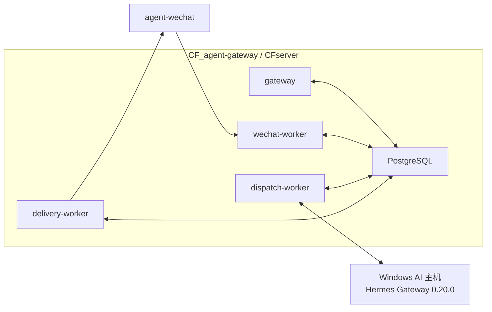
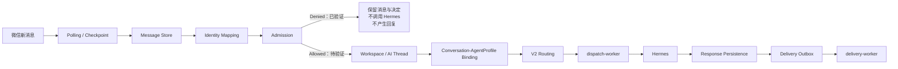

# 企业 AI Gateway 架构

> 状态日期：2026-08-13。本文描述 Gateway 当前生产拓扑和稳定逻辑边界。2026-08-04 的 V1 Staging 授权文本闭环是历史验证，不代表当前 CFserver 授权链路已完成。

## Gateway 定位

CF Gateway 是企业消息、身份、权限、会话、Agent Profile、AI 路由、执行派发、响应持久化和结果投递的权威控制边界。消息进入并被保存，不代表发送者有权创建 AI 工作。

Gateway 不是一个单进程服务。当前 CFserver 部署由以下五个服务组成：

- PostgreSQL
- `gateway`
- `wechat-worker`
- `dispatch-worker`
- `delivery-worker`

五个服务均已部署并保持 healthy。`agent-wechat` 同样运行在 CFserver，通过 `cf-internal` 容器网络与 Gateway 通信。

## 当前生产拓扑

Hermes 网络连通已验证。Windows 登录启动项存在，但主机重启后 Hermes Gateway 未可靠自动启动；人工启动后恢复。

## 当前消息链路

当前生产已验证：

- `agent-wechat` 内部网络与 Token 鉴权。
- 每 3 秒微信轮询。
- 17 个现有聊天建立 Checkpoint。
- `bootstrap_mode=latest` 将 151 条历史消息作为基线跳过。
- 新私聊进入 Message Store，发送者与会话识别正确，Checkpoint 推进。
- 未授权账号 Admission Denied，未调用 Hermes，未产生机器人回复。
- CFserver 与 `dispatch-worker` 到 Hermes Gateway 的网络连通。

当前尚未配置或验证：Enterprise Identity、Source Identity Mapping、User Access Policy、Gateway Access Policy、Agent Profile、私聊 Conversation-AgentProfile Binding、Admission Allowed、V2 Routing、Hermes 实际处理、Response Persistence、Delivery Outbox 和微信真实回复。

## Persist-first

除入口已经确认并按专门防回环规则处理的 Bot 自发消息外，进入 Gateway 的员工消息必须先写入 Message Store，再执行身份、权限和路由判断。

- 持久化失败不得进入 Admission 或执行链。
- 授权和未授权员工消息都属于受控企业消息历史。
- Admission 拒绝只阻止 AI 工作，不删除消息。
- Checkpoint 必须与持久化和处理结果保持一致，不得提前跨过尚未保存的新消息。
- `bootstrap_mode=latest` 的历史基线跳过是首次同步策略，不代表逐条持久化并执行历史消息。

## Identity Mapping

Identity Mapping 以来源平台、Bot 账号和稳定发送者 ID 为输入，输出不可变的 `enterprise_identity_id` 及可选业务 `employee_id`。

- 昵称、备注、头像、群名或消息正文不得用于授权或自动合并身份。
- Source Identity Mapping 缺失时，消息保留但 Admission 拒绝。
- Identity Mapping 不创建 Workspace、AI Thread 或 Agent Profile。

## Access Control 与 Admission

Admission 至少组合：

- Source Identity Mapping 是否存在且有效。
- User Access Policy 是否允许。
- Gateway Access Policy 是否允许。
- 会话类型、Bot 账号、能力和风险级别是否允许。
- 群聊是否提供发送者明确 `@` 当前机器人的结构化事实。

规则保持拒绝默认。不得根据展示名称、正文 `@` 字样、引用或上一条消息推断权限或 mention。

## Workspace、AI Thread 与会话绑定

只有 Admission Allowed 后，Gateway 才解析或创建 Employee Workspace 和 AI Thread，并应用 Conversation-AgentProfile Binding。

- `enterprise_identity_id` 是工作区所有者的权威身份主键。
- Physical Conversation 与 AI Thread 分离；消息仍保留原微信会话用于结果路由。
- 私聊必须显式绑定 Agent Profile。
- 同群不同员工的个人消息、任务、附件和结果不得串线。
- Hermes Runtime Thread 是可重建运行时绑定，不得反向覆盖企业身份或 AI Thread。

## V2 Routing

V2 Routing 在 Admission Allowed 与 Agent Profile 绑定完成后，根据所需能力、模型、权限和 Provider 状态生成可追踪决定。

- 无 Profile、绑定冲突或无可用 Provider 时不得隐式降级为任意 Agent。
- 路由决定必须关联身份、会话、AI Thread、Agent Profile 和策略快照。
- 当前组件已部署，但真实允许消息的 V2 Routing 尚未实机验证。

## Dispatch、响应与投递

- `dispatch-worker` 只领取获准且已完成路由的工作。
- Hermes 结果先写 Response Persistence，再创建 Delivery Outbox。
- `delivery-worker` 只从 Outbox 领取投递任务，并通过 `agent-wechat` 返回原 Bot 账号和原会话。
- AI 执行成功、响应持久化成功和微信投递成功是三个独立状态。
- 重试必须幂等；结果未知或高风险副作用需人工确认。

`dispatch-worker` 与 `delivery-worker` healthy 只证明服务运行，不证明真实授权消息的执行和投递已经通过。

## 文件与 Skills 边界

Gateway、Hermes、Skills、FileBridge 和 `filebrowser-agentctl` 不得直接访问正式文件存储。后续文件能力统一经过 `CF_filebrowser-enterprise` 的 File Service API、用户权限、最小 Token capability、Share effective capability 和审计。

未授权消息的附件元数据可以作为受控消息历史保留，但不得进入 AI 工作区或发送给 Hermes。第一阶段不建设独立 OCR。

## 当前结论

> 微信消息发现、持久化、Checkpoint、未授权拒绝和 Hermes 网络连通已实机验证；授权后的完整 AI 回复闭环仍待验证。

严格的下一阶段顺序见[当前状态矩阵](../status/current-status.md#下一阶段顺序)，生产证据见[微信运行时阶段收口记录](../status/2026-08-13-wechat-runtime-closeout.md)。
