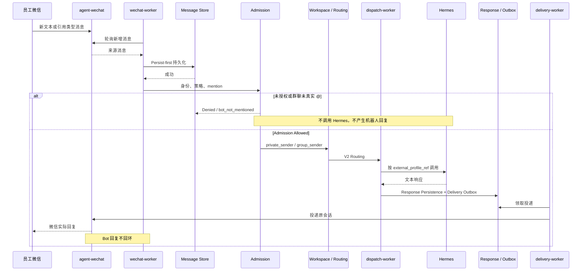
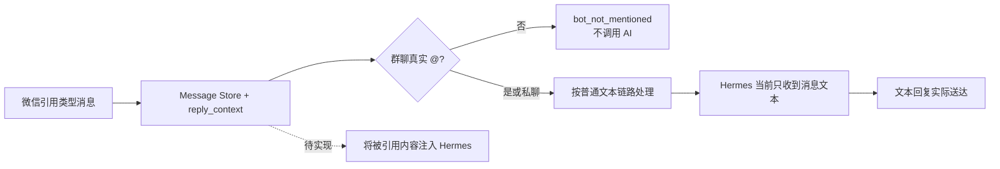
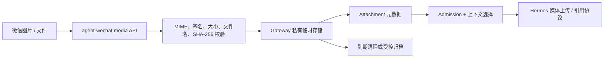
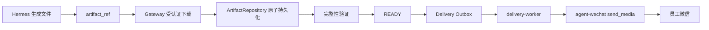

# 消息与任务流程

> 状态日期：2026-08-14。私聊与 `group_sender` 群聊授权文本闭环已实机验证；媒体图描述目标设计，不代表已经上线。

## 已验证文本流程

当前实测覆盖私聊和群聊两条 Allowed 路径，也覆盖未授权拒绝和群聊 `bot_not_mentioned`。CFserver Gateway 应用服务 restart 后，Gateway 复用原 AI Thread，Hermes 复用原会话上下文。

## 私聊与群聊线程

| 场景 | Admission | Thread Policy | 当前证据 |
| --- | --- | --- | --- |
| 获准私聊 | Allowed | `private_sender` | 完整文本闭环、上下文复用与实际回复已验证 |
| 获准群聊且真实 `@` | Allowed | `group_sender` | 完整文本闭环、同群同发送者复用与实际回复已验证 |
| 群聊未真实 `@` | `bot_not_mentioned` | 不创建 AI 工作 | 持久化且不调用 Hermes 已验证 |
| 群聊共享上下文 | 待单独审批 | `group_shared` | 尚未实机验证 |

同一员工可复用 Workspace，但私聊与群聊 AI Thread 和 Hermes Thread 相互隔离。Hermes 配置档案可以相同，Thread Policy 仍能保持会话边界。

## 引用消息流程

引用识别、`reply_context` 持久化和文本回复已经验证。虚线步骤尚未实现，不能声称 Hermes 已理解被引用内容。

## 入站媒体流程

当前只验证图片来源发现和字节提取。目标链路是：

当前已验证图片 `image/raw_type=3`、Message Store、Raw Payload、真实 JPEG 字节和完整性校验；Attachment、私有存储与 Hermes 媒体协议尚未接入。

## 出站 Artifact 流程

目标链路是：

只有 READY Artifact 可以进入媒体 Outbox。下载、物化、发送与回执分别幂等、重试和审计；不得通过桌面 UI、剪贴板或猜测 Windows 路径传输。

## 任务与企业业务

后续任务可以聚合同一 AI Thread 内的连续文字和多个 Attachment，再形成可执行 Task。Hermes 负责理解和编排，Skill 负责确定性操作；身份、策略、Profile、Skill 权限和必要人工确认必须始终生效。

正式归档文件统一通过 `CF_filebrowser-enterprise`；普通聊天媒体只在 Gateway 私有存储保留规定期限。

## 失败与恢复

- 持久化失败：不进入 Admission，不推进为已处理。
- Admission 拒绝或 `bot_not_mentioned`：保存决定，不调用 Hermes，不创建 Outbox。
- Hermes 明确失败：保存执行状态，不伪造响应。
- Dispatch `uncertain`：先核对证据与 Guard，不自动盲重试。
- 响应持久化失败：不绕过数据库直接发送微信。
- Artifact 未 READY：不得进入媒体投递。
- 投递失败：保留 Outbox 与 Attempt 状态，按幂等规则重试。
- 应用 restart 验证不能替代容器、数据库或宿主重启验收。
