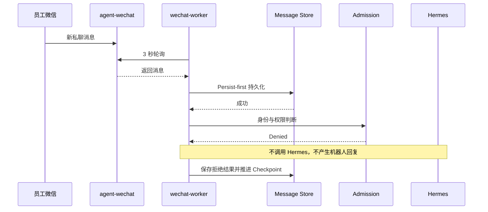

# 消息与任务流程

> 状态日期：2026-08-13。当前生产只实机验证到未授权拒绝；授权后的完整 AI 回复流程仍待验证。

## 当前已验证流程

首次启用以 `bootstrap_mode=latest` 为 17 个现有聊天建立 Checkpoint，151 条历史消息作为基线跳过。第一条新增私聊已完成消息持久化、发送者/会话识别、拒绝和 Checkpoint 推进。

## 授权后目标流程

```mermaid
flowchart LR
    M["已持久化消息"] --> AD["Admission Allowed"]
    AD --> W["Workspace / AI Thread"]
    W --> P["Conversation-AgentProfile Binding"]
    P --> R["V2 Routing"]
    R --> D["dispatch-worker"]
    D --> H["Hermes"]
    H --> RP["Response Persistence"]
    RP --> O["Delivery Outbox"]
    O --> DL["delivery-worker"]
    DL --> AW["agent-wechat"]
    AW --> E["员工微信"]
```

上述流程各组件已部分部署，但本轮未以获准身份触发，不能写成已实机验证。

## 企业业务示例

员工可以在后续获准链路中查询“`<PRODUCT_NAME>` 库存”或发起其他业务任务。Hermes 负责理解和编排，Skill 负责确定性操作；任何业务查询或写入都必须经过身份、策略、Agent Profile、Skill 权限和必要的人工确认。

## 群聊流程

群聊除了身份与策略允许，还必须由发送者明确 `@` 当前机器人。只有平台原始结构化 mention 事实为真时才可进入 AI 链路，不得根据纯文本名称、引用或上一条消息推断。

## 文件流程

图片、文件和引用消息在授权文本闭环之后验证。未授权消息的附件元数据可保存在受控历史中，但不得进入 Hermes。正式文件访问后续统一经过 `CF_filebrowser-enterprise`、用户权限、最小 capability 和审计。

## 失败与回传

- 持久化失败：不进入 Admission，不推进为已处理。
- Admission 拒绝：保存决定，不调用 Hermes，不创建 Outbox。
- Hermes 失败：保存执行状态，不伪造响应。
- 响应持久化失败：不直接绕过数据库发送微信。
- 投递失败：保留 Delivery Outbox 状态和重试记录。
- AI 执行成功与微信投递成功分别记账。
