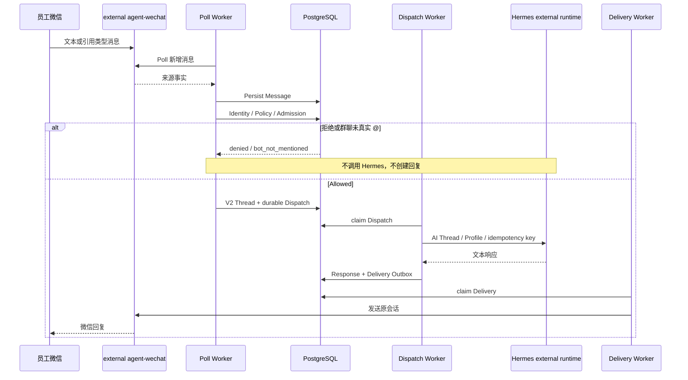
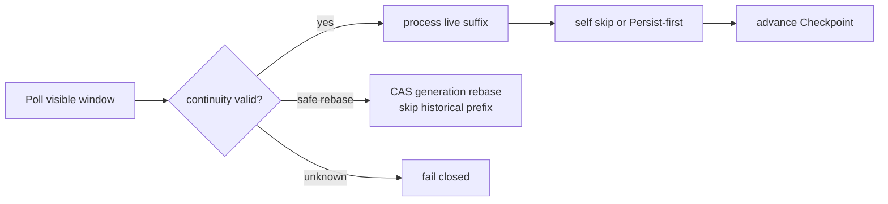
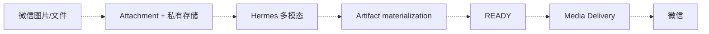

# 消息与任务流程

> 状态日期：2026-09-03

## 当前生产文本流程

Poll Worker 在 durable Dispatch 入队后结束该消息的入站处理，不直接调用 Hermes。Delivery Worker 也不内联于 Poll Worker。

## Thread Policy

| 场景 | 当前实现 | 生产证据 |
| --- | --- | --- |
| 私聊 | V2 `private_sender` | 文本闭环通过 |
| 群聊真实 `@` | V2 `group_sender`，key 包含 sender identity | 单一群聊闭环通过；同群多发送者隔离未单独验收 |
| 群聊未 `@` | `bot_not_mentioned` | 不调用 AI 已验证 |
| `group_shared` | 代码支持，默认不启用 | 未批准、未生产验证 |
| V1 compatibility | whole-room group thread | 不得当作 V2 生产策略 |

## Checkpoint 流程

forced-QR 后的 Local ID 回退、generation、历史前缀跳过、实时后缀单次处理、self skip 和无重复回复已经生产验证。

## 引用消息

引用结构和 `reply_context` 已保存，引用类型文本可以完成回复。群聊引用不替代真实 mention；被引用正文尚未自动注入 Hermes。

## 媒体与文件目标流程

虚线链路尚未系统级交付。图片来源字节可读取只证明 media discovery，不证明 Hermes 看图或文件回传。

## 失败与恢复

- Message 未持久化：不执行、不推进。
- `uncertain` Dispatch：使用 Admin inspection 和审计恢复，不盲重试。
- 已有 Response、缺 Delivery：只做 reconciliation，不再次调用 Hermes。
- agent-wechat stopped/logged_out：先关闭 Gate，执行 fresh QR，验证 API 后再恢复 Workers。
- Gateway-only deployment：不重建 agent-wechat，不需要 fresh QR。
- AI host reboot：不重启微信 Session，恢复后核对 Hermes reachability。

状态与证据见[当前状态矩阵](../status/current-status.md)和[Production Closeout](../validation/records/2026-09-03-enterprise-runtime-production-closeout.md)。
