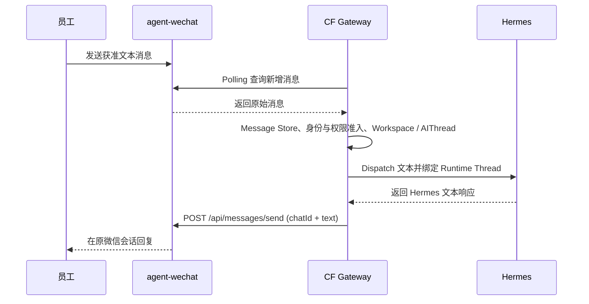
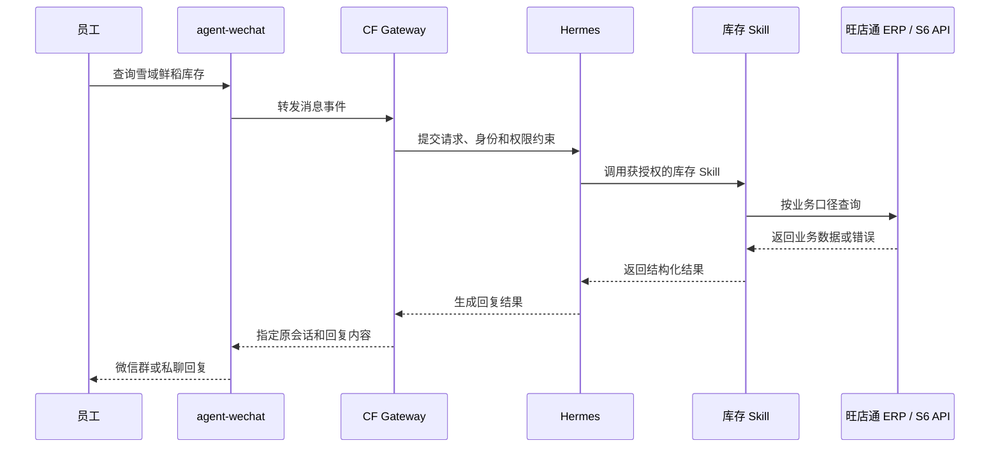
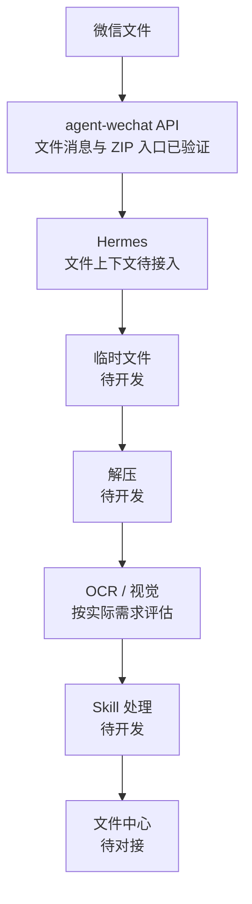

# 消息与任务流程

> 状态日期：2026-08-04。普通问答中的 V1 Staging 微信文本链路已完成；企业业务和文件处理图仍描述目标流程。Context Builder、Task Queue、完整 Worker Bridge、Skill、企业系统接口、图片 / 附件 / 文件处理、实时事件机制、合并转发解析增强和生产部署仍待开发、接入或验证。详见[Gateway V1 Staging 验证记录](../status/gateway-wechat-staging-validation.md)。

## 普通问答

### V1 Staging 已验证文本流程

`agent-wechat` 的私聊文本、群聊文本、引用消息、`sender` 和 `chatId` 识别已经验证；V1 Staging 已把真实微信文本经 Gateway 身份和权限准入、Employee Workspace / AI Thread、Hermes API 调用和 Response Relay 返回原会话。Polling 过滤 `is_self=true` 并推进 Checkpoint，避免机器人回复再次触发 Hermes。目标群聊线程仍按 `bot + group + sender` 隔离，但 Gateway V1 当前 whole-room thread 偏差待修复和复验。当前 API 读取方式已验证；WebSocket 实时事件仍待研究。

合并转发消息当前可识别类型并获取发送人和外层标题，但尚不能展开内部聊天记录。若后续需要将其内部消息作为 Hermes 上下文，应先增加 `forward parser`，再由控制面按身份、会话、任务和权限筛选；不得把未解析的内部记录写成当前可用上下文。

## 企业业务流程

以员工发送“查询雪域鲜稻库存”为例，目标流程如下：

### 数据口径边界

- 旺店通 ERP 是电商库存、订单、物流和寄样订单的当前职责系统。
- S6 负责财务、线下业务和对账；只有查询口径确实属于 S6 时才调用其接口。
- 旺店通 ERP、S6 的具体接口、字段、权限和数据时效均待验证。
- 库存 Skill 尚未实现。示例只说明目标调用关系，不表示已经可以查询真实库存。

### 执行约束

1. CF Gateway 和权威控制面先校验会话、发信人和允许的能力。
2. Hermes 只选择当前任务获授权的 Skill，不直接持有企业系统的任意操作权限。
3. Skill 通过明确接口查询或执行，并返回结构化结果和错误分类。
4. 查询结果先写入权威任务状态，再由 `agent-wechat` 返回原会话。
5. 写入、删除、改价、批量操作等高风险动作必须增加人工确认和幂等保护。

## 文件处理流程

### 未来流程

该流程是**未来流程，不代表当前完成**。当前仅验证文件消息和 ZIP 文件能够进入 `agent-wechat` 入口；Hermes 文件上下文接入、临时文件管理、自动解压、OCR / 视觉、Skill 处理和文件中心归档均未完成。图中省略了控制组件，实际实现仍须经过 CF Gateway、Debian 权威控制面和 File Service 的权限检查与审计，详细边界以[系统设计](../02_系统设计.md)为准。

合并转发内部文件的自动提取尚未支持，但这不影响上图所示的普通微信文件入口。合并转发的内部文件需要后续 `forward parser` 增强，不能按已完成的文件获取能力处理。

在进入实现前仍需确认：

- `agent-wechat` 对图片、Office、PDF、中文文件名、连续多附件和失败重试的兼容性。
- 压缩包大小、类型、解包路径、安全检查和恶意内容处理规则。
- 原件、过程产物、解析结果和最终文件的保留及关联规则。
- 是否确有 OCR 或视觉模型需求；第一阶段不建设独立 OCR。
- 知识库的业务范围、数据权限、更新方式和检索边界。
- 文件处理 Skill 的输入、输出、幂等性、失败分类和人工确认点。

## 失败与回传原则

- 任一环节失败都应返回明确状态，不伪造成功结果。
- 消息、任务、文件、Skill 调用和结果回传应使用可关联的 `trace_id` / `task_id`。
- Windows AI 节点离线时，Debian 已接收的消息、文件和任务不得丢失。
- 微信发送失败时保留待发送结果并按后续确定的策略重试或转人工处理。
