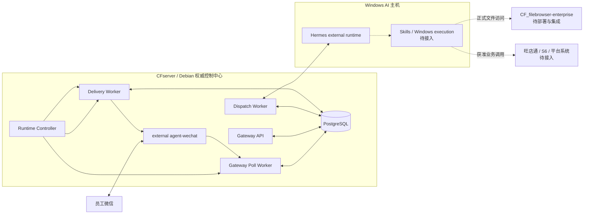

# System Architecture

> 中文名称：企业自动化系统总体架构
>
> 文档编号：ARC-001
>
> 文档状态：当前基线
>
> 状态日期：2026-09-04

## 1. 当前结论

企业消息与 AI 文本闭环基础已经完成生产交付。整个电商自动化项目仍未完成，下一工作面是 File Service、Hermes 可靠性、Skills 和业务系统集成。

## 2. 当前与未来拓扑



实线只表示当前部署文本链与控制关系。虚线节点不属于当前生产交付。

## 3. 部署边界

| 边界 | 当前组件 | 权威职责 |
| --- | --- | --- |
| CFserver | PostgreSQL、Gateway API、Poll/Dispatch/Delivery Worker、Runtime Controller、external agent-wechat | 消息、Checkpoint、身份权限、线程、Context、Dispatch、Response、Delivery、日志和审计关联 |
| Windows AI 主机 | Hermes external runtime | Agent 与模型执行；不覆盖 CFserver 权威状态 |
| File Service | `CF_filebrowser-enterprise` | 正式文件权限、capability、WebDAV/OnlyOffice 和 Persistent Audit；当前未部署 |
| Business integration | Skills、旺店通、S6 | 尚未接入 |

Gateway 有四个长期应用进程和 PostgreSQL。agent-wechat 是独立 Compose project，不能计入 Gateway 内部应用进程；Hermes 不在 CFserver。

## 4. 当前生产主链

```text
员工微信
  -> agent-wechat
  -> Poll Worker
  -> PostgreSQL Message / Admission / Dispatch
  -> Dispatch Worker
  -> Hermes
  -> PostgreSQL Response / Delivery Outbox
  -> Delivery Worker
  -> agent-wechat
  -> 原微信会话
```

Message、Admission、Dispatch、Response 和 Delivery 是分离状态。入口已收到、Hermes 已生成、Response 已持久化和微信已送达不能互相替代。

## 5. 安全结束分支

| 情况 | 行为 |
| --- | --- |
| Bot self reply | sink 前受控跳过并推进 Checkpoint |
| 身份/策略拒绝 | 保留消息与 Admission，不调用 Hermes |
| 群聊未结构化 `@` | `bot_not_mentioned`，不调用 Hermes |
| Dispatch `uncertain` | 停止自动重试，使用 Admin inspection 和受控恢复 |
| agent-wechat 未登录 | 组合 Poll/Delivery Gate 保持关闭，不执行 Controller `start` |

## 6. Thread 与 Context

- V2 `private_sender` 和 `group_sender` 由 Gateway `ThreadResolver` 生成版本化 key。
- V2 `group_sender` 包含 sender identity；自动化测试覆盖同群不同发送者隔离。
- V1 compatibility path 仍以物理群聊形成 whole-room thread。
- 当前生产使用 V2 代码线，但同群多发送者尚无单独生产对照证据。
- Context Runtime 的 Timeline、authorized read、Snapshot 和 search 已实现并测试；RAG、Memory 和引用正文注入未交付。

## 7. 运行与恢复

- Gateway repository branch authority：`main`，live tip 动态查询；2026-09-04 verified snapshot 为 `4f13039b86c60bc94340edb5468f0102d62d2dff`。
- Gateway Production Release Git authority：`b488cf452584e73bc9b752564bf90ea153aa8d18`；docs-only main 前进不表示生产重新部署。
- Database revision：`20260823_04`。
- Gateway P1 Release 使用 immutable image 和 Gateway 专属 `64m x 10` 日志策略。
- agent-wechat 使用 `restart: "no"`、fresh QR 和 `20m x 3` 日志策略。
- CFserver reboot 后 agent-wechat 保持停止，但 automatic boot stop gate 尚未验证；fresh QR 前必须通过 Controller `stop` 关闭组合 Poll/Delivery Gate，验证后再用 `start` 同时启动二者。
- Dispatch Worker 由 Gateway Release/Compose 生命周期独立管理，不属于 Controller v1 controlled services。
- AI host reboot 不重启 agent-wechat 时不需要 fresh QR；必须重新核对 Hermes reachability。
- Gateway-only deployment 不重建 agent-wechat，不需要 fresh QR。

## 8. 文件与媒体

当前已验证图片发现和字节提取，未交付完整媒体链。入站 Attachment、Gateway 私有存储、Hermes 多模态、出站 Artifact READY 和微信媒体回传仍是虚线边界。

`CF_filebrowser-enterprise` V1 Beta 已完成实现与自动化验证，但未在 CFserver 部署，也未完成迁移、备份恢复、真实 WebDAV/OnlyOffice 或 Agent 主链验收。

## 9. 恢复不变量

1. 非 self 消息先持久化。
2. 拒绝不删除历史。
3. `uncertain` 不盲重试。
4. 已有 Response 时不得重跑 Hermes；Delivery 诊断与受控 Worker 恢复必须遵守组合 Poll/Delivery Gate。
5. fresh QR 前关闭 Gate。
6. Archive 不能恢复为 active Session。
7. 不跨项目运行 Compose 清理命令。
8. 正式文件访问不绕过 File Service。

## 10. 相关文档

- [当前状态矩阵](../status/current-status.md)
- [消息与任务流程](./message-flow.md)
- [Gateway 架构](./gateway-architecture.md)
- [Deployment Guide](../deployment/deployment-guide.md)
- [Recovery Runbook](../operations/recovery-runbook.md)
- [2026-09-03 Production Closeout](../validation/records/2026-09-03-enterprise-runtime-production-closeout.md)
