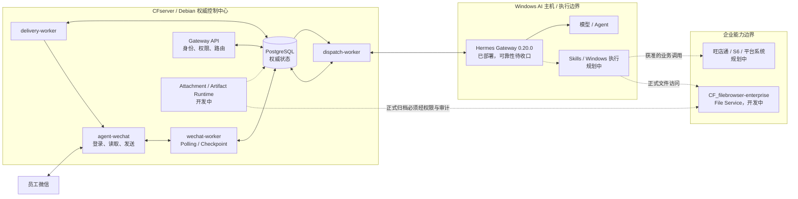

# System Architecture

> 中文名称：企业自动化系统总体架构
> 文档编号：ARC-001
> 文档状态：当前基线
> 最近复核：2026-08-21
> 运行证据截止：2026-08-14
> 适用阶段：阶段 1

## 1. 目的与边界

“电商业务全自动化系统”让员工从微信原会话提交请求，由 CFserver 先保存消息并执行身份、权限、上下文和路由控制，再由 Windows AI 主机上的 Hermes 处理获准请求，最后把可追踪的结果投递回原会话。

本文是企业级架构入口，回答组件如何协作以及信任边界在哪里。它不替代各组件仓库的实现、发布清单或命令，也不把目标设计描述成已经上线的能力。

当前统一结论是：

> 私聊和 `group_sender` 群聊的授权文本闭环已实机验证；媒体链路、引用上下文注入和完整宿主恢复仍待完成。

## 2. 企业总体架构

图中实线表示当前文本链路或已部署连接，虚线表示开发中或规划中的能力。`CF_filebrowser-enterprise` 的物理部署位置尚未由本仓库确认，不能从逻辑图推断它位于 CFserver。

## 3. 当前生产主链

### 3.1 入站与执行

1. `agent-wechat` 维护企业 Bot 微信登录状态并提供消息接口。
2. `wechat-worker` 每 3 秒轮询来源消息，标准化来源事实。
3. 非 self 消息先写入 Message Store，再推进后续判断；Checkpoint 与去重规则见[WeChat Runtime Design](./wechat-runtime-design.md)。
4. Gateway 依次完成 Source Identity Mapping、User Policy、Gateway Policy 和 Admission。
5. Admission Allowed 后解析 Employee Workspace、AI Thread、Thread Policy 和 Agent Profile 外部引用。
6. V2 Routing 形成获准执行工作，`dispatch-worker` 调用 Hermes。
7. Hermes 按其管理的配置档案执行模型与 Agent 逻辑，返回文本结果。

当前链路使用“获准执行工作 / Routing / Dispatch”描述。正式 Task Queue、Task Batch 和完整 Context Snapshot 仍是目标能力，不能因文本 Dispatch 已运行而宣称已经上线。

### 3.2 响应与投递

1. Gateway 先持久化 Hermes Response。
2. 响应持久化成功后创建 Delivery Outbox。
3. `delivery-worker` 领取 Outbox 项，通过 `agent-wechat` 投递到原物理会话。
4. Delivery Attempt 独立记录投递结果。

以下状态必须分开：

- Hermes 已生成响应。
- Gateway 已持久化响应。
- Outbox 已创建。
- 微信投递已成功。

任一较早状态都不能替代后续状态的成功证据。

### 3.3 安全结束分支

| 来源事实或决定 | 系统行为 |
| --- | --- |
| `is_self=true` | Polling 在 sink 前受控过滤，不创建 AI 工作；推进对应 Checkpoint 防止回环 |
| 身份未映射或策略拒绝 | 消息保留在 Message Store，保存拒绝决定，不调用 Hermes，不产生回复 |
| 群聊未真实 `@` 当前机器人 | 保存 `bot_not_mentioned`，不调用 Hermes，不产生回复 |
| Dispatch 结果不明 | 标记 `uncertain`，停止自动盲重试，进入证据核对与受控恢复 |

昵称、备注、群名、纯文本名称或引用关系均不是授权依据，也不能替代结构化 mention 事实。

## 4. 组件职责

| 组件 | 负责 | 不负责 |
| --- | --- | --- |
| `CF_agent-wechat` | 微信登录、消息与媒体来源接口、文本发送、Gateway Token 鉴权 | 企业身份、Admission、AI 路由、权威业务状态 |
| `wechat-worker` | Polling、标准化、Checkpoint、入站持久化和 Admission 触发 | 猜测身份、绕过策略创建执行工作 |
| Gateway API | 身份、策略、Conversation、Thread Policy、Profile 外部引用和运行控制 | 创建 Hermes 内部配置档案、替代 Hermes 生成答案 |
| PostgreSQL | 消息、Checkpoint、身份、策略、线程、路由、响应、Outbox 和审计关联的权威状态 | 长期保存大文件 Base64、接受 Windows 本地状态覆盖 |
| `dispatch-worker` | 领取获准工作、调用 Hermes、记录明确结果或 `uncertain` | 派发拒绝消息、对结果不明执行盲重试 |
| Hermes | Agent 与模型执行、Hermes 配置档案、后续 Skills 编排 | 覆盖 Gateway 权威状态、绕过 Admission 或 File Service |
| `delivery-worker` | 领取 Outbox、投递原会话、保存 Attempt | 在响应或 Artifact 就绪前直接发送 |
| `CF_filebrowser-enterprise` | 正式文件访问、用户权限、capability 和持久审计 | 代替 Gateway 保存普通聊天临时媒体 |
| Skills / 企业系统 | 在后续获准范围内执行确定性业务操作 | 自行扩权、绕过确认或直接访问正式存储 |

## 5. 状态与所有权

### 5.1 权威状态

CFserver/PostgreSQL 是消息、Checkpoint、身份、权限、Workspace、AI Thread、路由、响应、投递、文件引用、日志与审计关联的权威来源。Windows AI 主机离线、重启或更换时，不得以 Hermes 本地状态覆盖上述记录。

### 5.2 Hermes 所有权

Hermes 创建和管理配置档案、技能配置及其内部会话。Gateway 只保存并选择 `external_profile_ref`，同时保存 AI Thread 与 Hermes Runtime Thread 的绑定。Profile 决定人格与能力，Thread Policy 决定上下文由谁共享；两者不得混用。

### 5.3 文件所有权

- 普通聊天媒体的受控中转目标是 Gateway 私有媒体存储，并按保留策略清理。
- 入站媒体必须先完成校验、私有持久化和 Attachment 元数据，才可提交 Hermes。
- 出站文件必须先由 Gateway 原子物化并达到 Artifact `READY`，才可进入媒体 Outbox。
- 需要正式归档或后续业务访问的文件只能经 `CF_filebrowser-enterprise` File Service、权限检查和审计。
- PostgreSQL 只保存媒体元数据和状态，不长期保存大文件 Base64。

当前仅验证微信图片发现、JPEG 字节提取和完整性校验；Attachment、Hermes 多模态、Artifact 物化及微信媒体回传尚未完成。

## 6. 信任与网络边界

| 边界 | 控制要求 |
| --- | --- |
| 微信入口到 Gateway | `cf-internal` 网络可达与 Token 鉴权同时成立；网络可达不等于业务获准 |
| Gateway 到 Hermes | 只派发 Admission Allowed 且完成 V2 Routing 的工作；保存外部 Profile 引用与关联 ID |
| Hermes/Skills 到企业系统 | 按身份、能力、风险和人工确认实施最小权限；当前仍为规划能力 |
| 自动化到正式文件 | 只使用普通用户与最小权限 Token，经 File Service 和 Persistent Audit |
| 配置与秘密 | Token、API Key、密码、Cookie 和微信登录数据不得写入普通 YAML、Git、日志或截图 |

## 7. 当前能力矩阵

| 能力 | 当前状态 | 关键边界 |
| --- | --- | --- |
| 微信私聊授权文本 | 已部署并实机验证 | 从持久化、Admission、Hermes 到原会话回复 |
| 群聊 `group_sender` 文本 | 已部署并实机验证 | 只有真实 `@` 进入 AI；`group_shared` 未验证 |
| Gateway 五服务与 PostgreSQL | 已部署，部分链路待验证 | 应用 restart 已验证；recreate、数据库和宿主重启未验证 |
| Hermes 文本执行 | 已部署，部分链路待验证 | 自启、守护、告警和 AI 主机恢复未收口 |
| 引用消息 | 已部署，部分链路待验证 | 引用识别与持久化已验证；正文未注入 Hermes |
| 媒体 Runtime | 开发中 | 图片发现已验证；完整入站、出站链路未完成 |
| File Service 接入 | 开发中 | 唯一正式文件边界已确定；端到端接入未完成 |
| Skills、旺店通、S6 | 规划中 | 没有生产端到端证据 |

详细证据和下一步以[当前状态矩阵](../status/current-status.md)为准。

## 8. 恢复不变量

1. 非 self 消息未完成受控持久化时，不得把它推进为已处理。
2. Admission 拒绝不删除消息历史，也不产生 Hermes 调用。
3. Hermes 不可达不得造成已接收消息丢失。
4. `uncertain` Dispatch 不自动盲重试。
5. 响应未持久化不得绕过 Gateway 直接发送微信。
6. 非 `READY` Artifact 不得进入媒体投递。
7. 应用 restart、容器 recreate、数据库重启和宿主重启分别验收，不得相互替代。
8. 生产运行不持续依赖 GitHub 在线，部署必须具有可复现的离线发布输入。

## 9. 相关文档

- [WeChat Runtime Design](./wechat-runtime-design.md)
- [Deployment Guide](../deployment/deployment-guide.md)
- [Recovery Runbook](../operations/recovery-runbook.md)
- [Production Validation Checklist](../validation/production-validation-checklist.md)
- [系统设计](../02_系统设计.md)
- [技术决策记录](../05_技术决策记录.md)
