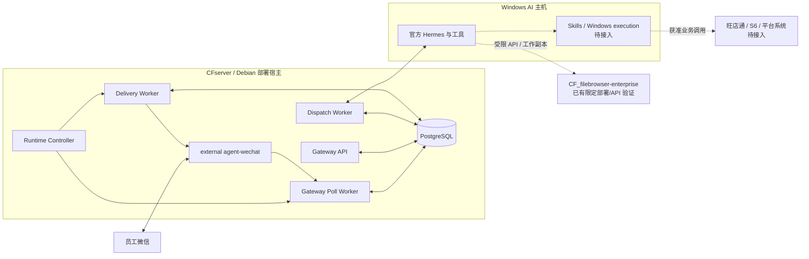

# System Architecture

> 中文名称：企业自动化系统总体架构
>
> 文档编号：ARC-001
>
> 文档状态：当前基线
>
> 状态日期：2026-10-20

## 1. 当前结论

整体目标是员工微信 → 微信入口 → Gateway 权限、上下文与任务 → 官方 Hermes 与工具 → 企业文件服务及后续业务系统 → 结果返回微信。AI 和员工共用 FileBrowser 唯一正式文件系统，文件场景沿用 [9 月 27 日业务需求](../requirements/file-workflows.md)。

PDF 正文/附件/摘要、后续同会话文字、PNG 实际读取描述与微信实收，以及单商品归档和正常商品 ZIP 出站已有实际证据。PNG 图片识别及微信图片收发满足当前业务要求。最后现场观察为 2026-10-19 北京时间 18:36，收发关闭、无在途、原 Bot 登录，随后临时授权撤销、临时密码删除。本轮未访问生产。10 月 11 日旧断点保留为历史，不再作为当前待执行计划。详见[最新固定证据](../validation/records/2026-10-20-overall-status-evidence.md)。

## 2. 当前与未来拓扑


```mermaid
flowchart LR
    U["员工微信"]

    subgraph CFS["CFserver / Debian 部署宿主"]
        AW["external agent-wechat"]
        PW["Gateway Poll Worker"]
        API["Gateway API"]
        CTL["Runtime Controller"]
        PG[("PostgreSQL")]
        DW["Dispatch Worker"]
        DLW["Delivery Worker"]
        PW <--> PG
        API <--> PG
        CTL --> PW
        CTL --> DLW
        DW <--> PG
        DLW <--> PG
    end

    subgraph AI["Windows AI 主机"]
        H["官方 Hermes 与工具"]
        SK["Skills / Windows execution<br/>待接入"]
        H -.-> SK
    end

    FB["CF_filebrowser-enterprise<br/>已有限定部署/API 验证"]
    BIZ["旺店通 / S6 / 平台系统<br/>待接入"]

    U <--> AW
    AW --> PW
    DW <--> H
    DLW --> AW
    H -. "受限 API / 工作副本" .-> FB
    SK -. "获准业务调用" .-> BIZ
```

实线表示已有部署证据的文本链与控制关系，不证明本轮实时在线。虚线表示完整范围仍需验收；FileBrowser 已有实际受限 API、单商品归档与正常 ZIP 出站，不从虚线推导“从未部署”。

## 3. 部署边界

| 边界 | 当前组件 | 权威职责 |
| --- | --- | --- |
| CFserver / Debian 部署宿主 | PostgreSQL、Gateway API、Poll/Dispatch/Delivery Worker、Runtime Controller、external agent-wechat、FileBrowser | 提供物理运行环境；消息和控制状态权威属于 `CF_agent-gateway` 与 PostgreSQL；最后现场观察截至 10 月 19 日 18:36，本轮未实时核验 |
| Windows AI 主机 | 官方 Hermes external runtime 与工具 | Agent、模型与工作副本执行；不覆盖 Gateway/PostgreSQL 权威状态 |
| File Service | `CF_filebrowser-enterprise` | AI 与员工共用的正式文件、权限、capability 和 Persistent Audit；已有部署和限定 API 验证，WebDAV/OnlyOffice 等独立联调待验收 |
| Business integration | Skills、旺店通、S6 | 尚未接入 |

Gateway 有四个长期应用进程和 PostgreSQL。agent-wechat 是独立 Compose project，不能计入 Gateway 内部应用进程；Hermes 不在 CFserver。

## 4. 已有历史验证的文本主链

```text
员工微信
  -> agent-wechat
  -> Poll Worker
  -> PostgreSQL Message / Admission / Dispatch
  -> Dispatch Worker
  -> 官方 Hermes 与工具
  -> PostgreSQL Response / Delivery Outbox
  -> Delivery Worker
  -> agent-wechat
  -> 原微信会话
```

Message、Admission、Dispatch、Response 和 Delivery 是分离状态。入口已收到、Hermes 已生成、Response 已持久化和微信已送达不能互相替代。

## 5. 安全结束分支

| 情况 | 行为 |
| --- | --- |
| Bot self reply | sink 前受控跳过并推进 Checkpoint |
| 身份/策略拒绝 | 保留消息与 Admission，不调用 Hermes |
| 群聊未结构化 `@` | `bot_not_mentioned`，不调用 Hermes |
| Dispatch `uncertain` | 停止自动重试，使用 Admin inspection 和受控恢复 |
| agent-wechat 未登录 | 组合 Poll/Delivery Gate 保持关闭，不执行 Controller `start` |

## 6. Thread 与 Context

- V2 `private_sender` 和 `group_sender` 由 Gateway `ThreadResolver` 生成版本化 key。
- V2 `group_sender` 包含 sender identity；自动化测试覆盖同群不同发送者隔离。
- V1 compatibility path 仍以物理群聊形成 whole-room thread。
- 历史生产使用 V2 代码线，但同群多发送者尚无单独生产对照证据。
- Context Runtime 的 Timeline、authorized read、Snapshot 和 search 已实现并测试；RAG、Memory 和引用正文注入未交付。

## 7. 运行与恢复

- Gateway main、候选分支、合并状态与精确 CI 见 [状态矩阵](../status/current-status.md)和 [10 月 20 日固定证据](../validation/records/2026-10-20-overall-status-evidence.md)；docs-only main 前进不表示生产重新部署。
- 9 月 3 日 P1 与 schema 是历史基线；9 月 17 日长任务回传是后续限定证据，两者不替代后续候选和当前现场核验。
- Gateway P1 Release 使用 immutable image 和 Gateway 专属 `64m x 10` 日志策略。
- agent-wechat 使用 `restart: "no"`、fresh QR 和 `20m x 3` 日志策略。
- 按契约 CFserver reboot 后 agent-wechat 应保持停止，但实际状态仍须检查；automatic boot stop gate 尚未验证，fresh QR 前必须通过 Controller `stop` 关闭组合 Poll/Delivery Gate，验证后再用 `start` 同时启动二者。
- Dispatch Worker 由 Gateway Release/Compose 生命周期独立管理，不属于 Controller v1 controlled services。
- AI host reboot 不重启 agent-wechat 时不需要 fresh QR；必须重新核对 Hermes reachability。
- Gateway-only deployment 不重建 agent-wechat，不需要 fresh QR。

## 8. 文件与媒体

入站 Attachment、Gateway 私有存储、内容读取、出站 READY Artifact 与 Delivery 仍是独立边界。PDF 与 PNG 已有真实读取/实收，正常商品 ZIP 完成从企业文件系统重新导出到微信实收，整包和 12 成员一致；此前意外 ZIP 入站超时仍为失败，完整 ZIP 入站未验收。PNG 字节变化原因未定位，原字节差异、重编码或单独 file 路由不再作为待修任务；企业原始资料和 ZIP 完整性要求保持。

FileBrowser 是唯一正式 File Service，已有受限 API 操作和一个商品 4 主图/8 详情实际归档、原包保留。客户端操作不等于全部模型选工具，一商品不等于全库。共享群收件、通用加工回存、迁移/restore、WebDAV/OnlyOffice 及完整审计关联仍分项验收；路径调整明确暂缓。

当前正式电脑仍使用项目插件与客户端。最终目标为服务端单一正式可复用入口、电脑仅官方 Hermes 加少量配置，无额外项目 EXE、手工复制插件、修改 Hermes 源码或项目专用常驻进程，也不依赖工作树、`.task-artifacts` 或旧回执。临时管理权撤销后的正式业务连续性须独立验收。另一个 Gateway 任务开发验证中；MCP 仅验证路线，PR23 已有原版官方 Hermes 纯配置发现、图文及隔离 ZIP 查询/导出证据，但每任务可信授权绑定缺失，未进入 Artifact/Response/微信交付，不能当整条业务或生产迁移，详见[部署指南](../deployment/deployment-guide.md#最终部署标准与候选边界)。当前拓扑不预设该路线已经采用。

可安排小批量资料与文件类 Skill 试点，不等待 ERP、全部部署、新 RAG 或自研 Runtime。Gateway Web 仍是后续规划。项目最后安排群聊/多人/连续交互、AI 按当前场景/问题/任务主动检索获准的完整聊天档案、向获准人员/群聊群发消息及附件。档案不局限 Hermes 历史或成功任务，授权档案完整不等于手机微信所有历史已采集。现有 Context API 不代表该需求已经交付。

## 9. 恢复不变量

1. 非 self 消息先持久化。
2. 拒绝不删除历史。
3. `uncertain` 不盲重试。
4. 已有 Response 时不得重跑 Hermes；Delivery 诊断与受控 Worker 恢复必须遵守组合 Poll/Delivery Gate。
5. fresh QR 前关闭 Gate。
6. Archive 不能恢复为 active Session。
7. 不跨项目运行 Compose 清理命令。
8. 正式文件访问不绕过 File Service。

## 10. 相关文档

- [当前状态矩阵](../status/current-status.md)
- [文件业务场景](../requirements/file-workflows.md)
- [2026-10-20 证据摘要](../validation/records/2026-10-20-overall-status-evidence.md)
- [2026-09-17 长任务回传](../validation/records/2026-09-17-gateway-long-task-acceptance.md)
- [消息与任务流程](./message-flow.md)
- [Gateway 架构](./gateway-architecture.md)
- [Deployment Guide](../deployment/deployment-guide.md)
- [Recovery Runbook](../operations/recovery-runbook.md)
- [2026-09-03 Production Closeout](../validation/records/2026-09-03-enterprise-runtime-production-closeout.md)
