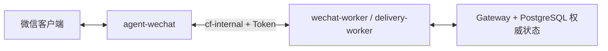

# agent-wechat 定位与职责

> 状态日期：2026-08-13。`agent-wechat` 是企业 AI 微信客户端和协议入口，不是 Gateway、Access Control 或 Hermes。

## 当前生产部署

- 已部署在 CFserver，使用 `docker/compose.cfserver.yaml`。
- 容器内部运行 Xvfb、fluxbox、dunst、WeChat 与 `agent-server`。
- 设置 `ENABLE_VNC=0`。
- 不使用 VNC、noVNC、x11vnc、websockify 或宿主桌面 X11。
- 登录管理脚本和手机确认登录已实机通过。
- 完全新设备经 SSH 展示二维码并扫码尚未实机验证。
- 与 Gateway 通过 `cf-internal` 容器网络通信，并执行 Token 鉴权。

## 负责范围

| 能力 | 当前边界 |
| --- | --- |
| 微信登录状态 | 维护客户端会话，提供受控登录管理 |
| 消息读取 | 向 `wechat-worker` 提供微信侧实际可得的会话、发送者、类型和内容 |
| 消息发送 | 按 Gateway 指定的 Bot 账号、目标会话和内容发送 |
| 文件入口 | 提供微信侧可得的附件与元数据；生产图片/文件/引用链路仍待验证 |
| 接口鉴权 | 接受 Gateway 内网请求并验证 Token |

## 不负责范围

- 不判断 Enterprise Identity、User Access Policy 或 Gateway Access Policy。
- 不决定 Admission、Agent Profile、V2 Routing 或 Skill 权限。
- 不直接调用 Hermes，不生成业务答案。
- 不保存 Message Store、Checkpoint、Workspace、AI Thread、Response 或 Delivery Outbox 的权威状态。
- 不直接访问正式企业文件存储。

## 与 Gateway 的边界

当前已验证 `agent-wechat` 与 Gateway 的内部网络、Token 鉴权、消息轮询和未授权拒绝路径。授权后的 Hermes 调用与微信 AI 回复尚未验证，不能归因于入口已完成。

底层部署和登录命令由 `CF_agent-wechat` 仓库维护；本仓库只保留总体职责和当前跨项目状态。
