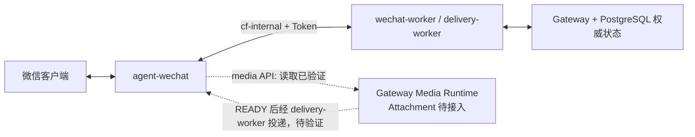

# agent-wechat 定位与职责

> 状态日期：2026-08-14。`agent-wechat` 是企业 AI 微信客户端和协议入口，不是 Gateway、Access Control 或 Hermes。

## 当前生产部署

- 已部署在 CFserver，使用 `docker/compose.cfserver.yaml`。
- 容器内部运行 Xvfb、fluxbox、dunst、WeChat 与 `agent-server`。
- 设置 `ENABLE_VNC=0`。
- 不使用 VNC、noVNC、x11vnc、websockify 或宿主桌面 X11。
- 登录管理脚本和手机确认登录已实机通过。
- 完全新设备经 SSH 展示二维码并扫码尚未实机验证。
- 与 Gateway 通过 `cf-internal` 容器网络通信，并执行 Token 鉴权。

## 负责范围

| 能力 | 当前边界 |
| --- | --- |
| 微信登录状态 | 维护客户端会话，提供受控登录管理 |
| 文本读取 | 已支撑私聊、群聊、引用类型和 Bot 防回环的生产验证 |
| 文本发送 | 已支撑私聊与 `group_sender` 群聊的实际回复 |
| 媒体读取 | 图片消息识别与 media API 提取真实 JPEG 字节已验证 |
| 媒体发送 | 提供后续 `send_media` 边界；图片和文件回传尚未实机验证 |
| 接口鉴权 | 接受 Gateway 内网请求并验证 Token |

## 当前媒体证据

`agent-wechat` 已提供来源图片的可读取字节，Gateway 已验证 JPEG 文件签名、大小和 SHA-256。这个结果只证明微信媒体能够被读取和提取。以下能力仍没有完成证据：

- Gateway 创建 Attachment 并持久化到私有媒体存储。
- Hermes 接收或理解图片。
- Hermes 生成的图片或文件回传微信。
- 文件消息和所有附件类型的兼容性。

## 不负责范围

- 不判断 Enterprise Identity、User Access Policy 或 Gateway Access Policy。
- 不决定 Admission、Agent Profile、Thread Policy、V2 Routing 或 Skill 权限。
- 不直接调用 Hermes，不生成业务答案。
- 不保存 Message Store、Checkpoint、Workspace、AI Thread、Response、Attachment、Artifact 或 Delivery Outbox 的权威状态。
- 不直接访问正式企业文件存储。
- 不通过桌面 UI、剪贴板或猜测 Windows 文件路径中转媒体。

## 与 Gateway 的边界

当前已验证登录、内部网络、Token 鉴权、消息轮询、文本回复、防回环和图片读取。完全新设备扫码、入站 Attachment、图片/文件 `send_media` 与媒体完整闭环仍待验证。

底层部署和登录命令由 `CF_agent-wechat` 仓库维护；本仓库只保留总体职责和跨项目状态。
