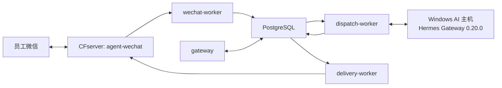
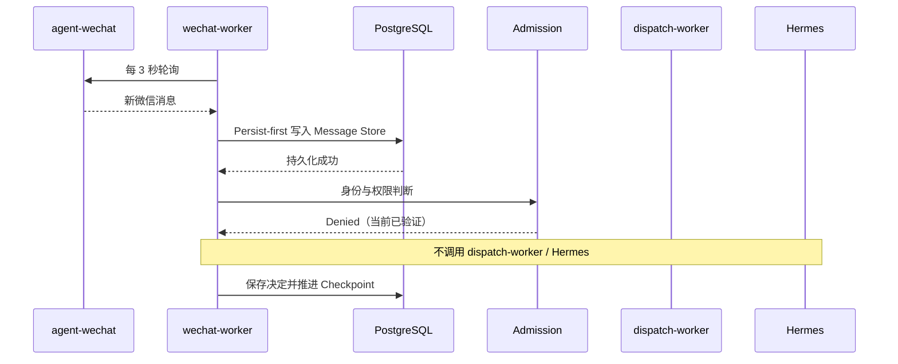

# 微信入口与 Hermes 集成架构

> 状态日期：2026-08-13。本文描述 `agent-wechat`、Gateway 三个 Worker、PostgreSQL 与 Hermes Gateway 0.20.0 的当前集成边界。

## 目标与范围

员工通过企业 Bot 微信提交请求。`agent-wechat` 维持微信客户端并提供消息接口；Gateway 先持久化消息，再执行身份、权限、会话和 V2 Routing；Hermes 处理获准请求；响应持久化后由 Delivery Outbox 返回原会话。

## 当前生产部署

Gateway 五服务均已部署并保持 healthy。`agent-wechat` 与 Gateway 通过 `cf-internal` 容器网络通信，并执行 Token 鉴权。

## `agent-wechat` 边界

`agent-wechat` 使用 `docker/compose.cfserver.yaml` 部署。容器内部运行 Xvfb、fluxbox、dunst、WeChat 和 `agent-server`；生产配置 `ENABLE_VNC=0`，不使用 VNC、noVNC、x11vnc、websockify 或宿主桌面 X11。

登录管理脚本与手机确认登录已实机通过。完全新设备 SSH 二维码扫码尚未实机验证。

它负责：

- 微信登录状态。
- 消息读取和发送。
- 提供微信侧会话、发送者、类型、正文和可得附件元数据。
- 接受 Gateway 指定的目标会话与回复内容。

它不负责身份映射、Admission、Agent Profile、V2 Routing、Hermes 调度或权威状态。

## 入站流程

当前为 17 个现有聊天建立 Checkpoint，并通过 `bootstrap_mode=latest` 安全跳过 151 条历史基线。新私聊消息已持久化，发送者与会话识别正确，Checkpoint 已推进。

## 授权后链路

Admission Allowed 后的目标顺序是：

1. 解析 Employee Workspace 与 AI Thread。
2. 应用私聊 Conversation-AgentProfile Binding。
3. 执行 V2 Routing。
4. `dispatch-worker` 调用 Hermes。
5. 保存 Response Persistence。
6. 创建 Delivery Outbox。
7. `delivery-worker` 通过 `agent-wechat` 投递原会话。

当前测试发送者尚未完成 Enterprise Identity、Source Identity Mapping、User Access Policy、Gateway Access Policy、Agent Profile 和会话绑定，因此以上授权链路尚未实机触发。

## Hermes 边界

Hermes Gateway 0.20.0 运行在 Windows AI 主机。CFserver 与 `dispatch-worker` 到 Hermes 的网络连通已经验证，但本轮没有真实获准消息进入 Hermes。

Windows 登录启动项存在，但 AI 主机重启后 Hermes Gateway 没有可靠自动启动；人工启动后恢复。网络连通、服务进程运行和真实 Agent 处理是不同验收项。

Hermes 负责：

- Agent 执行和模型调用。
- 在授权范围内选择后续 Skills 和工具。
- 返回可持久化的执行结果或明确失败。

Hermes 不负责：

- 绕过 Gateway 身份、策略、Agent Profile 或人工确认。
- 直接决定微信投递成功。
- 绕过 File Service 访问正式文件。

## 群聊与附件

- 群聊后续测试必须要求发送者明确 `@` 当前机器人，并以平台结构化 mention 事实为准。
- 不得从纯文本机器人名称、引用或上一条消息推断 mention。
- 图片、文件和引用消息在授权文本闭环通过后验证。
- 未授权附件不得进入 Hermes 上下文。
- 正式文件后续通过 `CF_filebrowser-enterprise` 的 File Service、权限和审计接入。

## 可靠性原则

- 消息先持久化，权限拒绝不删除消息历史。
- 响应先持久化，再创建 Delivery Outbox。
- AI 执行成功与微信投递成功分别记录。
- Worker 进程 healthy 不等于端到端业务成功。
- Token、API Key 和数据库密码不得写入普通 YAML。
- PostgreSQL 和配置变更前必须备份并确认恢复路径。

## 当前结论

> 微信消息发现、持久化、Checkpoint、未授权拒绝和 Hermes 网络连通已实机验证；授权后的完整 AI 回复闭环仍待验证。

下一阶段按[当前状态矩阵](../status/current-status.md#下一阶段顺序)执行，不得跳过身份、策略和 Agent Profile 直接宣称 AI 闭环通过。
