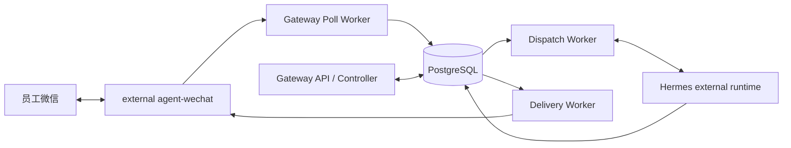
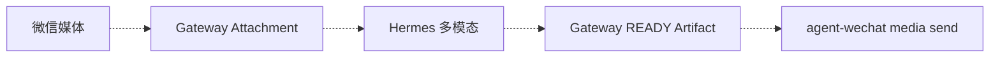

# 微信入口与 Hermes 集成架构

> 状态日期：2026-09-04

## 当前集成

agent-wechat 与 Gateway 通过 `cf-internal` 和 Token contract 通信。Hermes 在 Windows AI 主机，Gateway 不创建 Hermes Profile，只保存和选择 `external_profile_ref`。

## 文本链路

1. Poll Worker 保存来源消息并形成 Admission。
2. Allowed 后建立 V2 AI Thread、Route snapshot 和 durable Dispatch。
3. Dispatch Worker 调用 Hermes。
4. Gateway 持久化 Response 并创建 Delivery Outbox。
5. Delivery Worker 通过 agent-wechat 返回原会话。

私聊与真正 `@` 的群聊文本已生产闭环；未 `@` 群消息不会调用 Hermes。

## Thread 边界

V2 `group_sender` 包含 sender identity，并已由代码测试覆盖。同群多发送者尚缺真实生产对照证据。V1 compatibility path 的 whole-room thread 不能作为当前 V2 策略。

## Context 与恢复

Gateway Context Runtime 已实现线程 Timeline、Snapshot 和 search。Admin API 已实现 `uncertain` inspection 与受控恢复。它们有仓库/CI证据并随 Release 部署，但完整生产动作覆盖仍需留证。

Hermes 不可达时不得盲重试；已有一次受控恢复成功。AI host reboot 后 reachability 曾恢复，不代表 watchdog 和告警全部交付。

## Session 与发布

- CFserver/agent-wechat restart 需要 fresh QR。
- AI host reboot 通常不需要 fresh QR。
- Gateway-only deployment 不重建 agent-wechat，也不需要 fresh QR。
- fresh QR 前必须通过 Controller `stop` 关闭组合 Poll/Delivery Gate；验证后 `start` 同时恢复 Poll/Delivery。Dispatch Worker 由 Gateway Release/Compose 生命周期独立管理；automatic boot stop gate 未验证。

## 媒体与文件

虚线链路尚未系统级交付。正式归档未来经 `CF_filebrowser-enterprise`，不得让 Hermes 或 Gateway 绕过 File Service。

当前状态见[状态矩阵](../status/current-status.md)。
