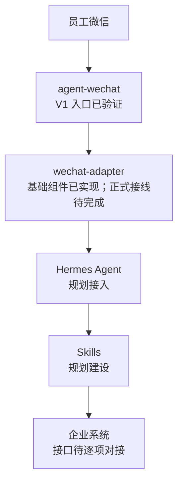
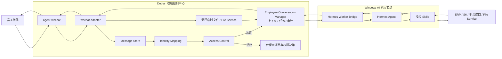
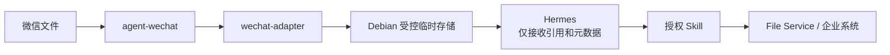

# 微信入口与 Hermes 集成架构

> 状态日期：2026-08-01。本文描述目标架构，不代表生产系统已经完成。`agent-wechat` V1 入口和结构化 mention 已验证；Gateway 已实现消息、身份、工作区 / 线程、Access Control 与微信适配等基础代码。Adapter 到 Message Store 正式接线、Polling / Checkpoint、Admission Orchestrator、Context Builder、Task Queue、Hermes 接入和端到端回传仍未实现。

## 目标与范围

本方案用于把员工微信中的文本、文件和可获得的引用上下文，转换为企业 AI 自动化系统可追踪、可去重、可授权的任务输入，再由 Hermes 选择获授权的 Skill 处理，并将结果返回原微信会话。

本文只定义微信入口到 Hermes 的组件关系和职责边界。消息事件字段、Polling 和文件处理细节见 [wechat-adapter 设计](../design/wechat-adapter-design.md)；员工工作区与线程隔离见[员工工作区与 AI 会话线程设计](../design/employee-workspace-design.md)；Debian 权威控制面、任务中心、File Service 和 Worker Bridge 的完整边界以[系统设计](../02_系统设计.md)为准。

## 当前验证与实现结论

`agent-wechat` V1 已完成以下入口能力验证：

- 微信登录。
- 私聊文本收发和群聊文本读取。
- 文件消息读取，以及 TXT、ZIP 和群文件获取。
- `sender` 和 `chatId` 识别。
- 引用消息和引用文件读取。
- 合并转发消息的外层类型、发送人和标题识别。
- 群内从成员列表选择当前机器人 `Bot_测试版` 时，原始 `isMentioned=true`。
- 群内从成员列表选择其他成员 T，或只复制 / 输入 `@Bot_测试版 手工文字对照` 时，`isMentioned` 字段缺失。
- `/api/ws/events` 可以建立连接，但尚未确认微信消息事件推送。

结构化 mention 的固定标准化规则为 `is_mentioned = raw.get("isMentioned") is True`，字段缺失按 `false`；不得根据正文 `@`、当前名称 `Bot_测试版`、旧名称 `1024`、引用消息或上一条 mention 推断或继承。

合并转发的内部聊天记录展开和内部文件自动提取尚未支持。V1 目标方案不依赖 WebSocket 实时事件，而是使用尚未实现的 Polling 获取新增消息。上述入口结论仅表示微信入口技术可行，不表示 Gateway 或端到端业务链路已经运行。验证边界见 [agent-wechat V1 入口验证记录](../status/agent-wechat-validation.md)。

`CF_agent-gateway` main commit `f0f0ea0cbcc1029104002b566912afabd23423c7` 已实现 Message Store 来源账号隔离与双重幂等、Identity Mapping、Employee Workspace、AI Thread、Hermes Thread 绑定唯一性、Access Control 纯规则评估器与三类策略持久化，以及 `agent-wechat` HTTP Client、微信标准化、媒体解码、文本发送字段和系统消息解析；全量 162 项测试通过。这些模块尚未通过 Admission Orchestrator 和正式 Adapter 接线组成运行链路。

## 总体架构

面向业务的简化关系如下：

`wechat-adapter` 是现有 CF Gateway 逻辑边界中的微信入口适配组件，对应系统设计中的 `wechat-relay / 入口适配` 职责。上图省略了控制组件，不表示 Adapter 可以绕过 Debian 权威控制面直接触发 Hermes 或企业系统。

目标控制链路如下：

生产部署位置仍以现有技术决定为准：`agent-wechat` 计划运行在 Debian；Debian 保存消息、上下文、任务、文件、权限、日志和审计的权威状态；Windows AI 节点计划运行 Hermes、Worker Bridge 和 Skills。

## 统一 Hermes 与员工逻辑隔离

企业内目标是运行一套或少量统一 Hermes 服务，不为每个员工部署独立 Hermes 进程。Gateway 为每个 Enterprise Identity / 企业身份维护独立 Employee Workspace / 员工工作区，每个工作区可以包含多个 AI Thread / AI 会话线程：

- 微信私聊线程键保持为 `bot_account_id + private_chat_id`。
- 微信群聊线程键保持为 `bot_account_id + group_chat_id + sender_id`。
- 同一群内不同员工发起的任务进入不同员工工作区和不同 AI Thread / AI 会话线程，不共享个人上下文。
- 企业知识、授权 Skills、文件资料和企业系统能力可以按权限共享，但其他员工的个人消息和任务历史不得混入当前上下文。

Gateway 生成稳定的 `workspace_id` 和 `ai_thread_id`。Hermes Runtime Thread / Hermes 运行时线程的 `hermes_thread_id` 可以为空或重新绑定，不是系统权威主键。Windows AI 节点未来可以按员工显示独立工作区与任务状态，但这属于目标界面，尚未实现；Gateway / Debian 控制面仍是权威状态源。

当前代码已实现 Employee Workspace、AI Thread 和 Hermes Thread 绑定唯一性，但 Admission Orchestrator 与 Hermes 接入未实现，尚未形成从入站消息自动建立或恢复运行时线程的端到端流程。

## 组件职责

### agent-wechat

**负责：**

- 微信协议接入和登录态下的消息收发。
- 读取私聊、群聊及可获得的微信消息元数据。
- 获取普通文件、群文件及其他已经验证可获取的附件。
- 提供群聊、`sender`、`chatId` 和引用上下文等入口信息。
- 将 Adapter 指定的结果发送回目标微信会话。

**不负责：**

- 业务意图判断、任务规划或业务结果判定。
- Hermes 的 Skill 选择、调用和执行控制。
- ERP、S6、平台后台或文件中心的业务逻辑。
- 企业身份授权、权威任务状态、正式文件归档或审计闭环。

### wechat-adapter

当前已实现的适配基础包括 `agent-wechat` HTTP Client、微信消息标准化、`is_mentioned` / `is_self`、媒体 JSON / Base64 解码、文本消息真实发送字段和微信系统消息解析。Adapter 到 Message Store 正式接线、Polling / Checkpoint 与结果回传编排仍未实现。

**负责：**

- 封装 `agent-wechat` 的消息读取、文件获取和结果发送 API。
- 按 V1 Polling 方案同步消息，并维护按账号、会话隔离的同步检查点。
- 将原始消息转换为版本化的统一事件，完成类型映射、来源标识和幂等去重。
- 登记附件来源和获取状态，把文件放入 Debian 受控临时区，并向后续环节提供文件引用。
- 将标准事件交给 Debian 控制面，由任务中心和 Worker Bridge 与 Hermes 通信。
- 接收受控的结果回传指令，调用 `agent-wechat` 返回原 `chatId`。

**不负责：**

- 理解业务意图、生成业务方案或选择 Skill。
- 把微信联系人直接认定为企业身份或业务权限主体。
- 绕过任务中心、权限检查、File Service 或审计直接调用 Hermes 和企业系统。
- 解析尚未支持的合并转发内部聊天记录或内部文件；该能力需要后续单独设计和验证。

### Hermes Agent

**负责：**

- 在 Gateway 下发的 Employee Workspace / 员工工作区和 AI Thread / AI 会话线程范围内处理任务。
- 在控制面提供的受控上下文内理解用户意图。
- 将请求规划为可执行步骤。
- 从当前任务允许的 Skills 中选择合适能力。
- 汇总 Skill 的结构化结果，生成回复、澄清请求或人工确认请求。

**不负责：**

- 根据微信昵称、来源账号或 Hermes Runtime Thread / Hermes 运行时线程自行创建、合并或改变员工工作区归属。
- 维护微信登录和消息同步检查点。
- 直接解析 `agent-wechat` 私有响应结构。
- 绕过 Skill、权限、高风险确认或 File Service 直接操作企业系统和正式文件。
- 用自由文本替代权威任务状态、文件记录或审计事件。

### Skills

Skills 封装确定性的企业能力，例如库存查询、订单处理、文档处理或平台操作。每个 Skill 必须声明输入、输出、所需权限、幂等规则、失败分类和人工确认点。具体 Skills 尚未完成定义、实现和验收。

### 企业系统

企业系统包括旺店通 ERP、旺店通 WMS、S6、各平台后台及正式文件服务。现有系统并不等于自动化接口已经可用；接口、字段、数据口径、账号权限和错误语义仍需逐项验证。正式文件访问必须经过 File Service、权限检查和审计。

## 入站与回传流程

### 目标入站消息流程

1. 员工在私聊或允许的群聊中发送文本、文件或引用消息。
2. `agent-wechat` 读取微信侧消息和当前可获得的元数据。
3. `wechat-adapter` 轮询新增消息，生成 `message_received` 标准事件；Message Store 在来源账号隔离范围内执行 `event_id` 与来源物理消息双重幂等并保存 Physical Conversation / 物理会话消息。
4. Identity Mapping 把稳定来源账号映射到 Enterprise Identity / 企业身份；映射失败时保留消息但不创建 Task。
5. Access Control 检查准入与权限；群聊必须同时满足 `group_allowed AND user_allowed AND is_mentioned`。
6. Employee Conversation Manager 为获准消息定位 Employee Workspace / 员工工作区及私聊或“群 + 员工”AI Thread / AI 会话线程。
7. Context Builder 关联有限上下文与附件，形成任务批次和不可变上下文快照，再由 Task Queue 持久化排队。
8. Worker Bridge 把受控任务、工作区、线程、文件引用和允许的 Skills 交给统一 Hermes 服务。
9. Hermes 理解意图、规划步骤并调用获授权的 Skill。
10. Skill 通过明确接口访问企业系统，并返回结构化结果或错误。

Adapter 不把全部群聊历史直接提交给 Hermes。上下文必须按 Employee Workspace / 员工工作区、AI Thread / AI 会话线程、Task 和权限筛选，群内不同员工的任务不得串线。

以上是目标流程。Polling / Checkpoint、Adapter 到 Message Store 正式接线、Admission Orchestrator、Context Builder 和 Task Queue 尚未实现，因此该入站链路尚未端到端运行。

### 目标结果回传流程

1. Hermes 返回完成、需要澄清、等待确认、可重试失败或最终失败等结构化结果。
2. Debian 控制面先更新权威任务状态和审计记录。
3. 控制面根据 Task 中保留的原平台、原账号、原 Physical Conversation / 物理会话、Employee Workspace / 员工工作区和 AI Thread / AI 会话线程生成回传指令。
4. `wechat-adapter` 调用 `agent-wechat` 发送接口，将结果返回原 `chatId`。
5. 发送结果和失败原因写回权威状态；发送失败不得被记录为任务回传成功。

结果显示在 Hermes 员工工作区中不能替代原微信路由。Task 完成与微信发送成功必须分别记录；前者表示结果已经由 Debian 持久化，后者才表示结果到达原微信窗口。

文本发送所需的真实请求字段已有代码实现，但控制面、Hermes、任务状态与 Adapter 之间的端到端回传编排尚未实现。

## 文件边界

目标文件流程为：

当前只验证到 `agent-wechat` 文件消息读取和部分文件获取。Adapter 临时文件管理、文件安全检查、Hermes 文件引用、Skill 处理和正式归档均为规划能力。文件名不能作为唯一标识；大文件不得直接放入事件 JSON；Hermes 不获得正式存储的任意路径访问权。

## 可靠性与安全原则

以下是目标原则。当前只已落地消息层的来源账号隔离与双重幂等，Checkpoint、任务、Skill 和回传的端到端可靠性仍待实现。

- **先持久化再派发：** 原始消息、标准事件、附件状态和同步检查点先写入 Debian 权威控制面，再进入 Hermes 任务链路。
- **端到端幂等：** 消息同步去重不替代业务幂等；消息事件、任务执行、Skill 写操作和结果回传分别维护幂等标识。
- **最小权限：** `sender` 和 `senderName` 只是微信入口身份信息，必须通过企业身份映射和权限检查后才能获得 Skill 或数据权限。
- **文件受控：** 微信附件先进入受控临时区，经过大小、类型、哈希和安全限制检查后才可供后续任务引用。
- **失败可见：** 微信离线、API 失败、文件获取失败、Hermes 失败和回传失败均保留明确状态，不伪造成功。
- **规划不等于实现：** WebSocket、合并转发内部展开、Hermes 接入和企业业务自动化在完成验证前均不得标记为生产可用。

## 当前建设状态

| 项目 | 状态 | 说明 |
| --- | --- | --- |
| 微信入口验证 | **已完成** | 已完成本文件所列 `agent-wechat` V1 与三组结构化 mention 样本验证，不等于生产验收 |
| 微信适配基础 | **代码已实现** | HTTP Client、微信标准化、`is_mentioned` / `is_self`、媒体 JSON / Base64 解码、文本发送字段和系统消息解析 |
| Adapter 到 Message Store | **未实现** | 正式写入接线尚未完成 |
| Polling / Checkpoint | **未实现** | 轮询周期、分页和保留窗口仍需结合 API 实测确认 |
| WebSocket Event 模式 | **后续研究** | `/api/ws/events` 可连接，但微信消息事件推送尚未确认 |
| Message Store | **代码已实现** | 来源账号隔离、`event_id` 与来源物理消息双重幂等；尚未接入 Adapter |
| Identity Mapping | **代码已实现** | 尚未通过 Admission Orchestrator 进入正式准入链路 |
| 员工工作区与 AI Thread | **基础代码已实现** | Employee Workspace、AI Thread 与 Hermes Thread 绑定唯一性已实现；Hermes 运行接入和恢复未完成 |
| Access Control 与策略 | **代码已实现基础** | 纯规则评估器及用户白名单、群策略、Gateway 全局策略持久化已实现；正式准入调用链未接线 |
| Admission Orchestrator | **未实现** | 已实现模块尚未串成运行链路 |
| Context Builder / Task Queue | **未实现** | 仍停留在目标设计 |
| Hermes 接入与端到端回传 | **未实现** | Hermes、Worker Bridge、任务协议和结果回传尚未端到端运行 |
| Skills 与企业系统 | **规划建设 / 待验证** | 具体 Skill 和企业接口待逐项设计、实现和验收 |
| Gateway 全量测试 | **162 项通过** | 对应 main commit `f0f0ea0cbcc1029104002b566912afabd23423c7` |
