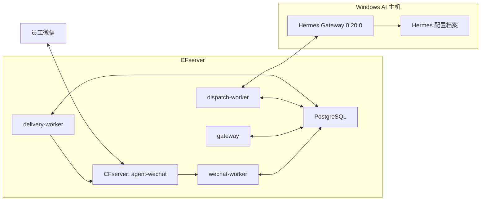
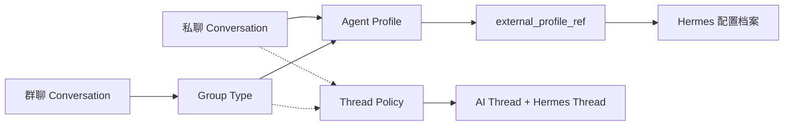
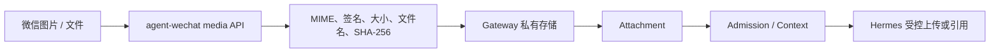
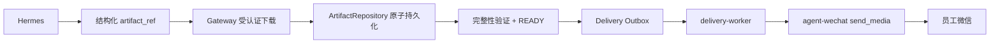

# 微信入口与 Hermes 集成架构

> 状态日期：2026-08-14。本文描述 `agent-wechat`、Gateway 三个 Worker、PostgreSQL 与 Hermes Gateway 0.20.0 的当前文本集成及待建设媒体接口。

## 目标与范围

员工通过企业 Bot 微信提交请求。`agent-wechat` 维持微信客户端并提供消息与媒体接口；Gateway 先持久化消息，再执行身份、权限、会话、Thread Policy 和 V2 Routing；Hermes 按外部配置档案引用处理获准请求；结果持久化后由 Delivery Outbox 返回原会话。

## 当前生产部署

Gateway 五服务均已部署并保持 healthy。`agent-wechat` 与 Gateway 通过 `cf-internal` 容器网络通信，并执行 Token 鉴权。

## agent-wechat 边界

`agent-wechat` 使用 `docker/compose.cfserver.yaml` 部署，生产配置 `ENABLE_VNC=0`。登录管理脚本与手机确认登录已实机通过；完全新设备 SSH 二维码扫码尚未实机验证。

它负责微信登录、消息读取、文本发送和媒体 API。图片读取已取得真实 JPEG 字节；入站 Attachment、Hermes 多模态和 `send_media` 回传不属于已验证范围。

它不负责身份映射、Admission、Profile 或 Thread Policy、V2 Routing、Hermes 调度和权威状态。

## 已验证文本集成

Admission Allowed 后的生产顺序是：

1. Gateway 解析 Employee Workspace 与 AI Thread。
2. Conversation 或 Group Type 选择 Agent Profile。
3. Agent Profile 的 `external_profile_ref` 指向 Hermes 配置档案。
4. Thread Policy 选择 `private_sender` 或 `group_sender` 上下文边界。
5. V2 Routing 形成决定，`dispatch-worker` 调用 Hermes。
6. Gateway 保存 Response Persistence 并创建 Delivery Outbox。
7. `delivery-worker` 通过 `agent-wechat` 投递原会话。

私聊和真正 `@` 的群聊均已完成上述文本链路。群聊未真实 `@` 时仍 Persist-first，但以 `bot_not_mentioned` 结束；Bot 回复不回环。

## Profile 与 Thread Policy

- Hermes 创建和管理配置档案，包括独立配置、技能和 `SOUL.md`。
- Gateway 只保存外部引用并选择，不自动创建 Hermes 配置档案。
- Profile 决定人格与能力，Thread Policy 决定上下文共享。
- 当前测试私聊和 AI 群都引用 `default`，但线程相互独立。
- 当前企业群聊默认 `group_sender`；`group_shared` 未实机验证。

## 引用消息边界

微信引用消息识别、`reply_context` 持久化和引用类型消息文本回复已验证。群聊引用未真实 `@` 时仍安全拒绝。

Gateway 尚未把被引用内容注入 Hermes。Hermes 当前能回复引用类型消息，不代表它已自动取得或理解被引用正文。

## 入站媒体集成

当前准确事实是：微信图片可读取和提取，媒体 AI 链路未接入。

目标接口：

当前已验证图片类型、Raw Payload、真实 JPEG 字节和完整性校验。私有存储、Attachment 和 Hermes 媒体协议待实现。

## 出站 Artifact 集成

目标接口：

PostgreSQL 只保存元数据和状态，不长期保存大文件 Base64。二进制保存在 CFserver 私有存储；普通聊天媒体自动过期，需正式归档时再转存 `CF_filebrowser-enterprise`。

整个链路必须支持幂等、受控重试、完整性校验和审计，不使用桌面 UI、剪贴板或猜测 Windows 文件路径。

## Hermes 可靠性边界

Hermes 文本执行已验证，但 Windows 登录启动项没有提供可靠自启保证。已观察到 Hermes 服务不可达时连接超时、Dispatch 进入 `uncertain` 且没有微信回复；人工启动后恢复。

一次带备份、证据核对和 Guard 的受控人工恢复已经成功。后续必须建设：

- Hermes 进程守护、健康监控和告警。
- `uncertain` 查询、证据核对与恢复命令/API。
- 幂等 Guard 和完整审计。
- AI 主机重启后的自动恢复验收。

不得把人工直接修改数据库作为常规运维方式。

## 恢复与安全原则

- CFserver Gateway 应用服务 restart 后持久化恢复及线程复用已验证；容器 recreate、PostgreSQL、CFserver 和 AI 主机重启未验证。
- 消息先持久化，拒绝不删除消息历史。
- Response 先持久化，再创建文本 Outbox。
- 媒体只有形成 READY Artifact 才能创建媒体 Outbox。
- AI 执行、响应、Artifact 和投递分别记录状态。
- Token、API Key 和数据库密码不得写入普通 YAML。
- 正式文件访问必须经过 File Service、权限和审计。

## 当前结论

> 私聊和 group_sender 群聊的授权文本闭环已实机验证；媒体链路、引用上下文注入和完整宿主恢复仍待完成。

下一阶段按[当前状态矩阵](../status/current-status.md#下一阶段顺序)执行，最新证据见[2026-08-14 私聊、群聊及媒体验证记录](../status/2026-08-14-private-group-media-validation.md)。
