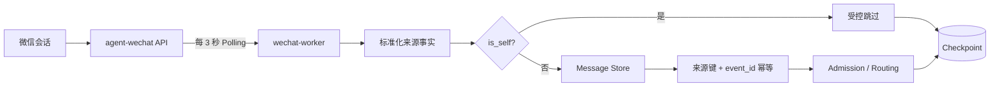

# WeChat Runtime Design

> 中文名称：微信运行时设计
> 文档编号：ARC-002
> 文档状态：当前设计基线
> 最近复核：2026-08-21
> 运行证据截止：2026-08-14

## 1. 设计目标

微信 Runtime 负责持续发现来源消息、保留来源事实、推进每个会话的同步位置，并在进程中断后从持久化状态恢复。它提供的是可恢复、可去重的入站基础，不承诺端到端 exactly-once，也不负责身份授权、Hermes 执行或业务幂等。

当前生产采用 Polling。Event/WebSocket 仍是待验证方向，不能作为当前恢复依赖。

## 2. 组件与状态



PostgreSQL 保存 Message Store、幂等约束和 Checkpoint。`agent-wechat` 只提供来源接口，不持有 Gateway 的权威同步状态。

## 3. Polling

- 当前轮询周期为 3 秒；该值是 2026-08-14 生产证据中的当前配置，不是跨版本永久常量。
- 每轮按来源账号和物理会话读取消息，不使用跨会话全局游标。
- 首次启用可按已批准配置使用 `bootstrap_mode=latest` 建立当前高水位，避免把启用前历史消息解释为新任务。
- `bootstrap_mode=latest` **只能用于首次建基线**。故障恢复或已有会话重新部署时使用它可能跳过未读消息，必须停止并按变更流程处理。
- API 分页失败、响应不完整或持久化失败时，不得用一个推测值越过未确认消息。

2026-08-14 的证据覆盖 17 个会话 Checkpoint，并以 `bootstrap_mode=latest` 跳过 151 条历史基线。数字只描述该次环境，不是容量、完整性或长期稳定性承诺。

## 4. Checkpoint

概念作用域是：

```text
sourceAccount + chatId -> last observed source position
```

Checkpoint 的职责是减少重复读取并提供恢复起点。它不是消息唯一约束，也不能替代 Message Store 幂等。

### 4.1 推进规则

| 消息类型 | 推进条件 |
| --- | --- |
| 非 self 消息 | 来源事实成功持久化，并保存该消息应有的受控处理结果后推进 |
| `is_self=true` | 在 sink 前确认并受控过滤后推进，防止机器人回复反复被读取 |
| API 或标准化失败 | 不推进越过该消息 |
| Message Store 失败 | 不推进越过该消息 |

self 分支是明确例外：机器人自发消息不进入 Message Store、Access Control、AI Thread 或 Hermes，但仍推进 Checkpoint。它是防回环规则，不是权限拒绝。

### 4.2 Checkpoint 与去重

发生“消息已经写入，但 Checkpoint 尚未提交”的崩溃时，恢复后允许重新发现同一消息。数据库唯一约束和事件幂等必须把重复读取归并到已有记录；不得依赖先推进 Checkpoint 来制造表面上的无重复。

## 5. `localId`

微信来源 `localId` 映射到 Gateway 的 `source_message_id` / `source.native_message_id`，作为来源物理消息幂等键的组成部分。当前规则是：

- 把 `localId` 视为不透明字符串。
- 不假设它在全局唯一。
- 不假设它可转换为数字。
- 不按数值或字典序推断先后。
- 不假设它跨账号、跨会话或跨设备稳定。
- 保留原始值，禁止用昵称、正文或时间戳替代原生 ID。

当前概念来源键为：

```text
platform + sourceAccount + chatId + localId
```

Gateway 内部 `message.id`、来源 `localId` 和 `event_id` 必须分离。`localId` 的排序、持续游标、分页边界和长中断稳定性仍需在 `agent-wechat` 的具体版本上实测，因此 Checkpoint 实现不得自行发明单调性。

## 6. At-least-once 语义

当前保证应严格表述为：

> 在上游仍保留消息、API 可读取且 Gateway 持久化可用的前提下，微信来源消息到 Message Store 采用 at-least-once discovery；重复发现由来源唯一键和 `event_id` 幂等吸收。

它不表示：

- 微信平台永久保留所有消息。
- 长时间离线后一定没有同步缺口。
- Hermes 或 Skill exactly-once 执行。
- 微信回复 exactly-once 送达。
- `uncertain` Dispatch 可以自动重试。

业务执行和投递分别依赖 Dispatch Guard、Response Persistence、Delivery Outbox 与 Delivery Attempt。结果不明的外部执行必须进入 `uncertain` 恢复流程。

## 7. 崩溃窗口与恢复

| 中断位置 | 恢复后预期行为 |
| --- | --- |
| 读取前或读取失败 | 从持久化 Checkpoint 继续轮询 |
| 已读取、未持久化 | 不推进 Checkpoint；恢复后重新读取 |
| 已持久化、未推进 Checkpoint | 可能重复读取；唯一约束返回已有消息，不重复创建来源事实 |
| 已保存拒绝或 `bot_not_mentioned`、未推进 | 重读后得到同一受控结果，不产生 Hermes 调用 |
| 已创建 Dispatch 且结果明确 | 按持久化状态继续，不创建第二次执行 |
| Dispatch 结果不明 | 保持 `uncertain`；核对 Hermes、Response 和 Delivery 证据后受控处理 |
| 上游保留窗口已越过 | 标记同步缺口，停止宣称连续完整；由负责人决定补偿或接受风险 |

恢复启动前必须确认：

1. 使用的是已有数据库和已有 Checkpoint，而不是空库。
2. 没有把 `bootstrap_mode=latest` 误用于恢复。
3. 来源账号、Bot 身份和 `chatId` 作用域没有变化。
4. 数据库唯一约束和 migration 与发布版本匹配。
5. Worker 时间与数据库时间可比较，内部时间统一为 UTC。

当前只验证 CFserver Gateway 应用服务 restart 后的持久化恢复和线程复用。Gateway 容器 recreate、PostgreSQL 重启、CFserver 整机重启、长时间断线与上游保留窗口恢复仍未完成生产验收。

## 8. 可观测性

每轮或每个会话至少需要以下脱敏指标或日志字段：

- 来源账号的脱敏引用和会话关联 ID。
- Polling 开始/结束 UTC 时间、耗时和结果分类。
- 读取数量、新增数量、重复数量、self 跳过数量和失败数量。
- Checkpoint 原值、提交结果和对应来源消息关联 ID；不得记录真实微信账号或正文。
- Message Store 写入结果和唯一约束命中。
- 同步延迟、连续失败次数和已确认的保留窗口缺口。

Checkpoint 停滞、Polling 连续失败、重复率异常上升或来源窗口缺口必须触发告警；阈值由发布清单配置，不在架构文档中臆造。

## 9. 验证要求

正式发布至少覆盖：

- 首次 `bootstrap_mode=latest` 建基线且不触发历史 AI 工作。
- 新私聊、群聊真实 `@`、未 `@`、self 回复和拒绝账号。
- 同一 `sourceAccount + chatId + localId` 重复返回时只形成一个来源消息事实。
- 持久化前中断、持久化后 Checkpoint 前中断和 Worker restart。
- 已有数据库恢复时不重新执行 bootstrap。
- 上游分页失败、短时断线和保留窗口缺口的显式处理。

执行记录使用[Production Validation Checklist](../validation/production-validation-checklist.md)，历史证据不替代目标版本的重新验证。

## 10. 相关文档

- [System Architecture](./system-architecture.md)
- [消息存储设计](../design/message-store-design.md)
- [微信 Adapter 设计快照](../design/wechat-adapter-design.md)
- [Recovery Runbook](../operations/recovery-runbook.md)
- [技术决策 D021-D023、D029、D031](../05_技术决策记录.md)
