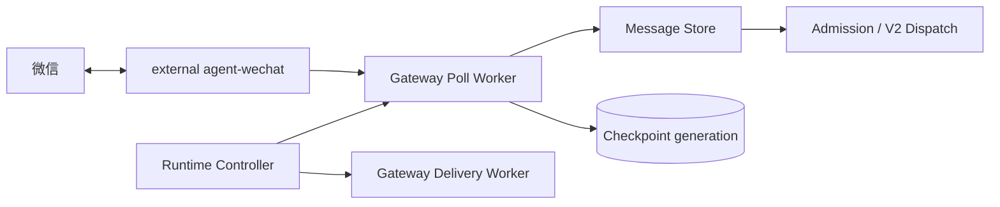

# WeChat Runtime Design

> 中文名称：微信运行时设计
>
> 文档编号：ARC-002
>
> 文档状态：当前基线
>
> 状态日期：2026-09-04

## 1. 目标

微信 Runtime 负责发现来源消息、保留来源事实、推进 Checkpoint，并在 forced-QR、进程中断和来源 Local ID 回退后避免历史重放与重复回复。它不负责身份授权、Hermes 执行或业务系统操作。

## 2. 当前组件

agent-wechat 与 Gateway 属于两个独立项目和 Compose ownership。两者通过 `cf-internal` 与 Token contract 通信。

## 3. forced fresh QR 契约

- agent-wechat 使用 `restart: "no"`。
- Host、container 或 Runtime restart 后必须 fresh QR。
- 旧 Runtime 在新启动前归档；Archive 不能挂回 active Session。
- 生产不使用 VNC/noVNC/x11vnc/websockify，`ENABLE_VNC=0`。
- API 6174 只绑定 loopback，并通过 `cf-internal` alias 提供给 Gateway。
- fresh QR 后必须验证进程、auth、chats 和 messages，随后才能恢复 Gate。

forced-QR R2 repository promotion 与 component documentation closeout 已于 2026-09-04 完成，branch authority 为 `main`，main CI 全部成功。仓库合并没有重新构建或部署生产镜像；forced-QR 真实生产行为仍以 2026-09-03 验收为准。

## 4. Polling 与 Persist-first

- 每个来源账号与物理会话独立维护 Checkpoint。
- self reply 在 sink 前跳过，但仍推进 Checkpoint。
- 非 self 消息先持久化，再执行 Admission 和 V2 Routing。
- Poll Worker 只入队 durable Dispatch，不直接调用 Hermes。
- 首次 `LATEST` 建基线；已有环境恢复禁止重新 bootstrap。

## 5. Local ID 与 generation

Local ID 是来源事实，不假设跨 Session 单调。forced QR 后发生回退时，Runtime 使用：

- generation；
- server-ID-first 或 content-free continuity anchor；
- checkpoint fingerprint；
- compare-and-swap rebase；
- generation-scoped fallback identity。

安全 rebase 将当前可见历史前缀作为新基线，不调用 Message Sink；随后实时后缀只处理一次。连续性无法证明时 fail closed，不手工降低 Checkpoint。

## 6. 已完成生产验收

- forced-QR 后 Local ID 回退。
- Checkpoint generation。
- 历史前缀跳过。
- 实时后缀只处理一次。
- 私聊普通前进。
- 空窗口实时后缀。
- self reply skip。
- 无重复回复。
- Queue 与业务链一致。

动态 Chat、Checkpoint 和历史消息数量仅属于带日期证据，不是长期配置。

## 7. Host reboot

真实 CFserver reboot 中：

- Docker 与 Gateway 核心恢复；
- agent-wechat 保持停止；
- 旧 Session 未恢复；
- Poll/Delivery 曾被观察为 running/healthy。

因此 automatic boot stop gate 未验证。Operator 必须先检查状态并通过 Runtime Controller `stop` 同时停止 Poll Worker 与 Delivery Worker，再运行 forced-QR 入口；验证完成后只能用 `start` 同时恢复二者。Dispatch Worker 由 Gateway Release/Compose 生命周期独立管理。

## 8. AI host 与 Gateway-only 变更

- AI host reboot 不重启 agent-wechat 时 Session 保持，不需要 fresh QR；恢复后核对 Hermes reachability。
- Gateway-only deployment 不重建 agent-wechat，Session 保持，不需要 fresh QR。
- 两者都不能外推为 agent-wechat restart 可以复用 Session。

## 9. 日志与证据

- agent-wechat：`json-file 20m x 3`。
- Gateway：`json-file 64m x 10`。
- 不记录 QR、Token、账号、会话 ID、消息正文或 Archive payload。
- 一次性 Archive/Release 路径只进入带日期 Closeout。

## 10. 未完成边界

- automatic boot stop gate。
- 上游长期消息保留窗口验证。
- 选定 Release Commit、构建输入与现场 Image ID 的 provenance。
- 文件/图片完整入站与出站链。
- Archive 长期保留和容量策略。
- 上游 API/schema 升级复验。

生产证据见[2026-09-03 Production Closeout](../validation/records/2026-09-03-enterprise-runtime-production-closeout.md)。
