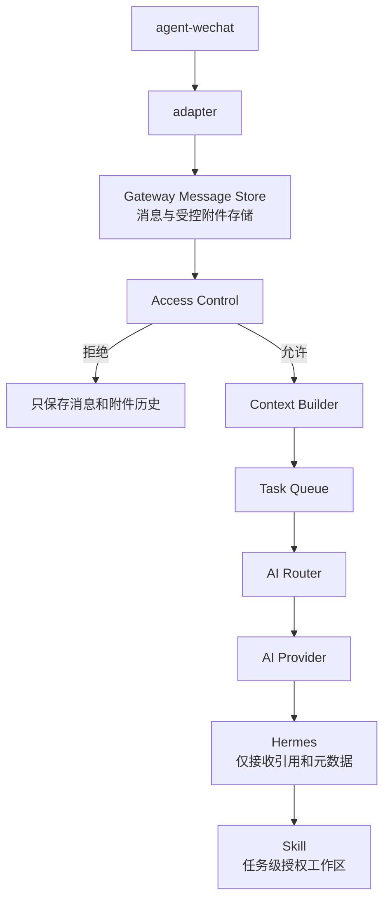

# Hermes 事件协议

> 状态日期：2026-08-01。本文是未来入口 Adapter、Gateway、AI Provider、Hermes Worker Bridge 与 Hermes Agent 之间的事件协议设计基线，不是实现说明。当前仅完成 `agent-wechat` V1 微信入口验证；Gateway、Adapter、Identity Mapping、员工工作区、Provider 路由、Hermes 接入、事件投递和端到端链路均尚未实现。

## 1. 目标与边界

本协议用于把不同消息入口转换为统一、可追踪、可扩展的事件，使 Hermes 不依赖微信或其他平台的私有字段。首个目标入口是 `wechat`，未来可接入 `feishu` 和 `dingtalk`，而不改变 Hermes 的核心事件消费逻辑。

协议只定义事件封装、事件类型、消息类型、授权与 Provider 运行快照、关联关系、文件引用和错误语义，不规定具体编程语言、队列产品、数据库、HTTP 路径或鉴权实现。所有消息先进入 Gateway Message Store；只有通过 Gateway 权限检查并进入 Task Queue 的任务才会路由到 AI Provider 和 Hermes。Hermes 不直接消费入口平台的原始载荷。

本文字段统一使用 `snake_case`，枚举值使用小写。上游原始字段和早期设计示例中的其他命名由 Adapter 在边界内完成映射，不进入 Hermes 标准事件。

## 2. 设计原则

- **平台无关：** 核心字段不使用 `chatId`、`sender`、`localId` 等微信专有名称。
- **消息先持久化：** 授权和未授权消息都先写入 Gateway Message Store；权限只决定是否创建 AI 任务。
- **权限前置：** Gateway 在 Context Builder 和 Task 创建前形成授权决定，Hermes 不判断用户、群或 Skill 权限。
- **Provider 抽象：** Gateway 路由 AI Provider，不管理具体 AI 主机，也不维护单一 AI 运行状态。
- **版本化：** 每个事件携带 `schema_version`；新增字段优先保持向后兼容。
- **不可变与幂等：** 已发布事件不原地修改；同一逻辑事件重投时保持相同 `event_id`。
- **因果可追踪：** 后续事件通过 `trace_id`、`causation_event_id`、`task_id` 等标识关联，不依赖到达顺序猜测关系。
- **权威标识分层：** Gateway 生成 `workspace_id` 和 `ai_thread_id`；`hermes_thread_id` 只是可空、可替换的运行时绑定。
- **文件只传引用：** 事件不携带文件二进制、Base64 内容、任意主机绝对路径或正式存储凭证。
- **未知即未知：** 缺失或未验证的信息使用 `null`、空数组或明确错误，不根据显示名、文件名或消息正文补造。
- **验证状态隔离：** 消息入口已验证不等于 Adapter、Hermes、Skill 或端到端业务能力已实现。

## 3. 基础事件模型

### 3.1 顶层封装

所有标准事件使用同一顶层封装。除表中允许为 `null` 的情况外，字段名必须存在，以便消费者稳定校验结构。

| 字段 | 类型 | 必填 | 语义 |
| --- | --- | --- | --- |
| `schema_version` | string | 是 | 协议版本，V1 设计值为 `1.0` |
| `event_id` | string | 是 | 标准事件的全局唯一标识；重复投递同一逻辑事件时不得变化 |
| `event_type` | string | 是 | 业务事件类型或错误事件类型，见第 4、8 节 |
| `source` | object | 是 | 原始入口、来源账号和事件生产组件 |
| `timestamp` | string | 是 | 事件生产时间，使用 UTC RFC 3339 格式；平台原始时间另存于 `context.source_timestamp` |
| `conversation` | object / null | 是 | 原始物理会话；账号级错误无法定位会话时可为 `null` |
| `sender` | object / null | 是 | 原始发起人；来源整体不可用且无法识别时可为 `null` |
| `authorization` | object / null | 是 | Gateway 生成的不可变授权快照；来源级错误无法形成身份事实时可为 `null` |
| `runtime` | object / null | 是 | Gateway AI Router 生成的 Provider / Task 运行与排队快照；尚未创建任务时可为 `null` |
| `message` | object / null | 是 | 当前消息、命令或结果摘要；不适用时为 `null` |
| `context` | object | 是 | 追踪、因果、任务、引用、转发、权限和错误等上下文 |
| `attachments` | array | 是 | 附件或产物引用；没有附件时使用空数组 `[]` |

建议结构如下。示例仅表达协议形状，标识和内容均为脱敏占位值：

```json
{
  "schema_version": "1.0",
  "event_id": "evt_01_example",
  "event_type": "message_received",
  "source": {
    "platform": "wechat",
    "provider": "agent-wechat",
    "account_id": "account_example",
    "producer": "wechat-adapter",
    "transport": "polling",
    "native_event_id": "native_event_example",
    "native_message_id": "native_message_example"
  },
  "timestamp": "2026-07-31T08:00:00Z",
  "conversation": {
    "id": "conversation_example",
    "type": "private",
    "thread_id": null
  },
  "sender": {
    "id": "sender_example",
    "display_name": "示例用户",
    "enterprise_identity_id": "enterprise_identity_example",
    "type": "human"
  },
  "authorization": {
    "user_allowed": true,
    "group_allowed": null,
    "is_mentioned": null,
    "permission_scope": ["scope_example"],
    "decision": "allowed",
    "reason_code": "allowed",
    "policy_version": "policy_example",
    "checked_at": "2026-07-31T08:00:00Z"
  },
  "runtime": null,
  "message": {
    "id": "message_example",
    "type": "text",
    "content": "查询示例内容",
    "raw_type": "source_specific_type"
  },
  "context": {
    "trace_id": "trace_01_example",
    "correlation_id": null,
    "causation_event_id": null,
    "source_timestamp": null,
    "batch_id": null,
    "workspace_id": null,
    "task_id": null,
    "context_snapshot_ref": null,
    "hermes_thread_id": null,
    "reply_to": null,
    "forward": null,
    "error": null
  },
  "attachments": []
}
```

### 3.2 `source`

| 字段 | 必填 | 说明 |
| --- | --- | --- |
| `platform` | 是 | 原始入口平台；当前设计值为 `wechat`，预留 `feishu`、`dingtalk` |
| `provider` | 是 | 实际接入提供方或连接器；微信当前计划使用 `agent-wechat`，其他平台待确定 |
| `account_id` | 是 | 当前平台中的机器人或应用账号标识；用于多账号隔离 |
| `producer` | 是 | 生成当前标准事件的组件，如 Adapter 或 Debian 控制面 |
| `transport` | 否 | 发现或接收事件的方式，如 `polling`、`webhook`、`event`；只记录事实，不代表所有方式已验证 |
| `native_event_id` | 否 | 上游原始事件或消息标识；不得单独假定为跨账号全局唯一 |
| `native_message_id` | 否 | 上游原始消息标识，对应 Message Store 的 `source_message_id`；与 Gateway 内部消息 ID 分离 |

`source.platform` 表示原始业务入口，不表示当前事件由该平台直接产生。例如 `command_request` 可以由 Debian 控制面生成，同时继续保留最初的 `wechat` 来源，`source.producer` 则记录实际生产组件。

### 3.3 `conversation`

| 字段 | 必填 | 说明 |
| --- | --- | --- |
| `id` | 是 | Adapter 归一化后的物理会话标识；必须在 `platform + account_id` 范围内稳定 |
| `type` | 是 | `private` 或 `group`；无法可靠识别时不得猜测，应产生 `invalid_message` |
| `thread_id` | 否 | Gateway 生成的 AI Thread / AI 会话线程标识，即 `ai_thread_id`；身份映射和线程建立前为 `null` |

`conversation.id` 表示 Physical Conversation / 物理会话，`conversation.thread_id` 表示 AI Thread / AI 会话线程，二者不能互换。标准事件不再用 `conversation.thread_id` 承载平台原生线程标识；平台私有字段保存在受控原始载荷或 Adapter 专属映射中。群聊仍须由控制面按机器人账号、群会话和发信人隔离上下文，具体规则以[系统设计](../02_系统设计.md#物理微信会话与-ai-线程)为准。

### 3.4 `sender`

| 字段 | 必填 | 说明 |
| --- | --- | --- |
| `id` | 是 | 平台侧发信人标识，在来源账号范围内解释 |
| `display_name` | 否 | 展示名称，只用于显示和辅助审计，不作为授权依据 |
| `enterprise_identity_id` | 否 | 权限系统完成映射后的企业身份；映射前为 `null` |
| `type` | 是 | `human` 或 `system` |

`sender.id` 只是入口身份，不自动获得企业权限。`sender.enterprise_identity_id` 只能由 Gateway Identity Mapping 根据权威映射填充；Adapter 不得依据显示名或消息正文填充该字段。微信 `wxid` 等平台标识保留在 `sender.id` 的来源作用域内，不得当作 `employee_id`。

### 3.5 `authorization`

`authorization` 是 Gateway Access Control 基于已持久化消息、入口事实和权威策略生成的不可变决策快照。权限检查发生在 Gateway，不由 Hermes、AI Provider 或模型提示词决定。

| 字段 | 必填 | 说明 |
| --- | --- | --- |
| `user_allowed` | 是 | 发信人是否存在于当前平台和机器人账号的有效白名单；无法确认时为 `false` |
| `group_allowed` | 是 | 群策略是否为 `group_enabled=true`；私聊为 `null`，群聊无法确认时为 `false` |
| `is_mentioned` | 是 | 群消息是否通过平台结构化数据明确 `@` 当前机器人；私聊为 `null`，群聊无法确认时为 `false` |
| `permission_scope` | 是 | Gateway 计算出的有效权限范围列表；拒绝或无有效权限时为空数组 |
| `decision` | 是 | `allowed` 或 `denied` |
| `reason_code` | 是 | 决策原因，如 `allowed`、`user_not_allowed`、`group_not_allowed`、`bot_not_mentioned` 或 `policy_unavailable` |
| `policy_version` | 是 | 本次判定使用的不可变策略版本 |
| `checked_at` | 是 | Gateway 完成判定的 UTC RFC 3339 时间 |

准入规则固定为：

- 私聊只有 `user_allowed=true` 才能创建 Task。
- 群聊只有 `user_allowed=true`、`group_allowed=true`、`is_mentioned=true` 同时成立才能创建 Task。
- 未通过准入的消息仍保存在 Gateway Message Store，但不进入 Context Builder、Task Queue、AI Provider 或 Hermes。

`permission_scope` 由用户、群、Skill 和风险策略共同约束。`context.allowed_skills` 是 Gateway 为具体 `command_request` 派生的 Skill 集合；Hermes 不得修改授权快照或扩大权限。详细规则见[Access Control 设计](./access-control-design.md)。

### 3.6 `runtime`

`runtime` 是 Gateway AI Router 为 Task 记录的 Provider / Task 运行与排队快照。它描述所选 AI Provider 和当前 Task 的执行关系，不表示 Gateway 管理具体 AI 主机，也不建立单一 AI 全局状态。

API Provider 示例：

```json
{
  "provider": "openai",
  "provider_type": "api",
  "model": "GPT",
  "status": "busy",
  "task_status": "running",
  "current_task_id": "task_example",
  "started_at": "2026-07-31T07:58:00Z",
  "elapsed_seconds": 120,
  "queue_length": 1,
  "queue_position": null,
  "last_heartbeat": null,
  "last_status_update": "2026-07-31T08:00:00Z"
}
```

Local Provider 示例：

```json
{
  "provider": "local",
  "provider_type": "local",
  "node": "ai-node-01",
  "model": "Qwen",
  "status": "busy",
  "task_status": "running",
  "current_task_id": "task_example",
  "started_at": "2026-07-31T07:58:00Z",
  "elapsed_seconds": 120,
  "queue_length": 2,
  "queue_position": null,
  "last_heartbeat": "2026-07-31T08:00:00Z",
  "last_status_update": "2026-07-31T08:00:00Z"
}
```

示例仅表达结构，不表示所列 Provider 或模型已经接入。`node` 是 Local Provider 可选提供的诊断信息，不形成 Gateway 对该主机的注册或管理关系。

| 字段 | 必填 | 说明 |
| --- | --- | --- |
| `provider` | 是 | AI Provider Registry 中的稳定 `provider_id` |
| `provider_type` | 是 | `api`、`local` 或后续扩展类型 |
| `model` | 是 | AI Router 为当前 Task 选择的模型标识 |
| `status` | 是 | Provider 状态：`idle`、`busy`、`error` 或 `maintenance` |
| `task_status` | 是 | Task 状态快照：`queued`、`running`、`succeeded`、`failed` 或 `cancelled` |
| `current_task_id` | 是 | 当前执行 Task；空闲或不适用时为 `null` |
| `started_at` | 是 | 当前 Task 或忙碌周期开始时间；不适用时为 `null` |
| `elapsed_seconds` | 是 | 当前 Task 已执行时长快照；不适用时为 `0` 或 `null` |
| `queue_length` | 是 | 当前可路由到该 Provider 的等待 Task 数量快照 |
| `queue_position` | 否 | 当前 Task 的零基队列位置；已经运行或不适用时为 `null` |
| `last_heartbeat` | 是 | Provider / Worker 最近心跳；API Provider 不适用时为 `null` |
| `last_status_update` | 是 | Gateway 最近确认该状态的 UTC RFC 3339 时间 |
| `node` | 否 | Local Provider 可选诊断字段；API Provider 或不暴露节点时为 `null` |

`idle` 表示 Provider 可以接受符合条件的新 Task；`busy` 表示当前达到该路由单元的执行容量；`error` 和 `maintenance` 均不接受新 Task。状态过期或无法读取时按 `error` 或不可调度处理，不能默认 `idle`。Gateway AI Router 可以重新选择符合策略的 Provider，但不得绕过数据边界、权限、模型批准或幂等规则。

`runtime` 是事件发生时的快照，不替代 Gateway 中的 Task Queue 和 Provider Runtime State 权威记录。Hermes 可以回报执行结果，但不能自行更换未获批准的 Provider、修改 Task 状态或改写路由事实。

### 3.7 `message`

| 字段 | 必填 | 说明 |
| --- | --- | --- |
| `id` | 是 | Gateway 内部消息 ID 或控制面生成的命令 / 结果消息 ID；平台侧消息 ID 位于 `source.native_message_id` |
| `type` | 是 | 统一消息类型：`text`、`file`、`image`、`voice`、`reply`、`forward` |
| `content` | 否 | 当前消息正文、外层标题、命令摘要或结果摘要；二进制内容不得放入此字段 |
| `raw_type` | 否 | 上游原始消息类型，供映射升级和排障使用；Hermes 不应依赖它执行业务逻辑 |

### 3.8 `context`

| 字段 | 适用范围 | 说明 |
| --- | --- | --- |
| `trace_id` | 全部可追踪事件 | 贯穿入口、任务、Hermes、Skill 和结果回传的链路标识 |
| `correlation_id` | 一组相关事件 | 关联同一业务意图、批次或结果链路 |
| `causation_event_id` | 后续事件 | 直接导致当前事件的前一事件 `event_id` |
| `source_timestamp` | 入站事件 | 平台提供的原始消息时间；不可用时为 `null` |
| `batch_id` | 命令及任务事件 | 多消息、多附件聚合批次标识 |
| `workspace_id` | 获准任务事件 | Gateway 生成的 Employee Workspace / 员工工作区稳定标识；身份未解析或未创建 Task 时为 `null` |
| `task_id` | 命令及任务事件 | Debian 任务中心生成的稳定任务标识 |
| `context_snapshot_ref` | `command_request` | Hermes 实际使用的不可变上下文快照引用 |
| `hermes_thread_id` | Hermes 执行相关事件 | Hermes Runtime Thread / Hermes 运行时线程绑定；尚未创建、已失效或待重绑时为 `null` |
| `allowed_skills` | `command_request` | 当前任务允许使用的 Skill 标识列表；空列表表示不可调用 Skill |
| `permission_ref` | `command_request` | 权限判断结果或短期授权的引用，不包含密钥 |
| `reply_to` | `reply` | 被引用消息的已知标识、摘要和解析状态 |
| `forward` | `forward` | 合并转发外层信息及内部展开状态 |
| `raw_payload_ref` | 入站及错误事件 | 受控保存的原始载荷引用，不直接内嵌原始敏感内容 |
| `error` | 错误事件 | 结构化错误详情，见第 8 节 |

事件顶层结构保持不变，工作区与线程标识复用现有对象：

- `sender.enterprise_identity_id`：Gateway 映射后的 Enterprise Identity / 企业身份。
- `context.workspace_id`：Gateway 生成的 Employee Workspace / 员工工作区 ID。
- `conversation.thread_id`：Gateway 生成的 `ai_thread_id`，不另设重复的顶层线程字段。
- `context.task_id`：Debian Task Store 生成的稳定 Task ID。
- `context.context_snapshot_ref`：当前 Task 实际使用的不可变上下文快照引用。
- `context.hermes_thread_id`：可选运行时绑定，允许为 `null`，不得作为企业权威主键。

`workspace_id`、`ai_thread_id` 和 Task 归属由 Gateway / Debian 控制面决定。Hermes、Worker Bridge 或 AI Provider 不得自行生成企业侧工作区与线程 ID，也不得用 `hermes_thread_id` 覆盖 `conversation.thread_id`。

### 3.9 `attachments`

每个附件对象至少遵循以下语义：

| 字段 | 必填 | 说明 |
| --- | --- | --- |
| `attachment_id` | 是 | 控制面生成的稳定附件标识 |
| `source_attachment_id` | 否 | 上游附件标识；不可用时为 `null` |
| `name` | 否 | 上游提供的原文件名，仅作元数据，不作为唯一键或存储路径 |
| `media_type` | 否 | 已确认的媒体类型；未知时为 `null`，不得只凭扩展名伪造 |
| `size_bytes` | 否 | 已确认的文件大小 |
| `sha256` | 否 | 文件成功获取并计算后的哈希；获取前或失败时为 `null` |
| `status` | 是 | `pending`、`available` 或 `failed` |
| `storage_ref` | 否 | Debian 受控临时存储或 File Service 的不透明引用；不是主机路径 |
| `purpose` | 否 | `input`、`reference` 或 `output`；由任务上下文确定 |

`status=available` 时才允许提供可用的 `storage_ref`。`status=failed` 时不得用空文件或失效引用继续执行依赖该附件的任务。这里的 `pending`、`available`、`failed` 是附件获取状态；Task 主状态独立使用 `queued`、`running`、`succeeded`、`failed`、`cancelled`。

## 4. 核心事件类型

| `event_type` | 生产者 | 含义 | 必要约束 |
| --- | --- | --- | --- |
| `message_received` | Gateway Adapter / Message Store | 原始消息已标准化并持久化，随后形成 Gateway 授权快照 | 授权和未授权消息都保存；拒绝消息不得创建 Task |
| `file_received` | Adapter / 受控文件环节 | 消息附件已成功获取、登记并进入受控消息附件存储 | `attachments` 至少包含一个 `available` 附件；是否可用于 Task 由授权决定 |
| `command_request` | Gateway / Debian 权威控制面 | 已授权 Task 出队并由 AI Router 选定 Provider 后，向 Hermes 发出的受控执行请求 | 必须为 `authorization.decision=allowed`，并包含 `workspace_id`、`ai_thread_id`、`task_id`、上下文、Provider runtime 和授权边界；`hermes_thread_id` 可为 `null` |
| `task_completed` | Debian 权威控制面 | Hermes / Skill 的完成结果已被控制面接收并持久化 | 只表示任务处理完成，不表示结果已经成功回传原会话 |

### 4.1 `message_received`

- 文本、文件提示、图片、语音、引用和合并转发都先归一化为此类事件。
- Gateway Message Store 保存所有消息；文件类消息可以先携带 `pending` 附件，文件实际可用后再产生 `file_received`。
- Access Control 把决定写入 `authorization`。拒绝消息保留历史但不创建 Task；允许消息才进入 Context Builder 和 Task Queue。
- Adapter 不直接触发 AI Provider、Hermes 或 Skill。

### 4.2 `file_received`

- 建议每个事件表示一个独立完成获取的附件，便于单文件重试、去重和审计；同一消息的多个文件通过同一 `trace_id` 和 `causation_event_id` 关联。
- 文件消息入口已验证不等于临时存储、文件安全检查或该事件已经实现。
- ZIP 文件入口已验证不等于自动解压或内部内容可用。

### 4.3 `command_request`

- 这是 Hermes 接受执行任务的唯一核心入站事件；Hermes 不直接消费平台原始消息或未经控制面处理的 `message_received`。
- `authorization.decision` 必须为 `allowed`；私聊通过发信人白名单，群聊同时通过群启用、发信人白名单和 `@` 机器人检查。
- `context.workspace_id` 和 `conversation.thread_id` 必须由 Gateway 填充；`context.hermes_thread_id` 在首次运行或重绑定前可以为 `null`。
- `message.content` 保存本次受控指令或摘要，完整上下文通过 `context_snapshot_ref` 获取。
- `allowed_skills`、`permission_ref`、`runtime` 和附件引用均由 Gateway 生成；缺失必要授权或 Provider 路由时不得执行。

### 4.4 `task_completed`

- 任务结果先由 Worker Bridge 回报 Debian，控制面持久化结果和审计记录后再形成此事件。
- `message.content` 可包含面向后续回传的结果摘要，结构化产物通过 `attachments` 引用。
- 回传 Adapter 仍需单独记录发送尝试和最终状态；不得把 `task_completed` 当作平台发送成功凭证。
- 失败、结果未知或等待人工确认不得伪装为 `task_completed`。

## 5. 消息类型与当前验证状态

下表状态只描述 `agent-wechat` V1 微信入口验证范围，不描述 Adapter 转换、Hermes 理解、Skill 处理或生产稳定性。

| `message.type` | 语义 | 当前状态 |
| --- | --- | --- |
| `text` | 普通文本消息 | **已验证：** 私聊文本和群聊文本入口 |
| `file` | 普通文件消息；文件本体使用 `attachments` 引用 | **已验证：** 文件消息、ZIP 文件和文件获取；其他格式及边界仍待技术验证 |
| `image` | 图片消息；图片本体使用 `attachments` 引用 | **未验证** |
| `voice` | 语音消息；音频本体使用 `attachments` 引用 | **未验证** |
| `reply` | 带引用关系的消息包装 | **已验证：** 引用消息入口；具体字段完整性仍需按实际样本固化 |
| `forward` | 合并转发消息包装 | **部分验证：** 仅外层类型、发送人和标题已验证；内部聊天记录和内部文件未验证、未支持 |

`reply` 和 `forward` 是结构类型，不应丢失当前消息正文或附件：

- `reply` 的当前正文放入 `message.content`，实际可得的被引用消息信息放入 `context.reply_to`。无法解析原消息标识时明确记录未解析，不通过相似文本猜测。
- `forward` 的外层标题可放入 `message.content`，`context.forward` 记录 `is_expanded=false` 及实际可得的外层信息。当前不得生成内部消息列表或内部文件引用。
- 无法映射的上游类型产生 `invalid_message`，不得强制映射为 `text`。

## 6. 多入口兼容设计

### 6.1 平台映射

| 统一语义 | `wechat` | `feishu` | `dingtalk` |
| --- | --- | --- | --- |
| 平台标识 | `source.platform=wechat` | `source.platform=feishu` | `source.platform=dingtalk` |
| 接入提供方 | 当前计划为 `agent-wechat` | 待选 Adapter / API | 待选 Adapter / API |
| 会话 | 映射到 `conversation` | 映射到 `conversation` | 映射到 `conversation` |
| 发信人 | 映射到 `sender` | 映射到 `sender` | 映射到 `sender` |
| 消息与附件 | 映射到 `message`、`attachments` | 映射到 `message`、`attachments` | 映射到 `message`、`attachments` |

`feishu` 和 `dingtalk` 仅表示协议预留的平台值，不表示已经选型、接入或验证。

### 6.2 兼容规则

1. 每个平台由自己的 Adapter 解释原始字段、签名、分页、回调和附件获取方式。
2. 核心事件不得新增微信专属顶层字段；原始载荷保存在受控存储，并通过 `raw_payload_ref` 关联。
3. `conversation.id`、`sender.id` 和 `message.id` 均在 `platform + account_id` 范围内解释，消费者不得假设它们跨平台唯一。
4. Hermes 依据统一的 `message.type`、任务上下文和授权信息工作，不依据 `raw_type` 分支业务逻辑。
5. 每个平台 Adapter 只提供身份、会话和 mention 的可验证事实；Gateway 统一计算 `authorization`。
6. `source.platform` 用于消息入口和结果路由，`runtime.provider` 用于 AI 执行路由，两者不得混淆。
7. 平台缺少群聊 mention 等关键事实时必须拒绝创建 Task，不得用其他平台字段模拟或默认放行。
8. 多入口 AI Thread / AI 会话线程绑定必须包含平台、来源账号、Physical Conversation / 物理会话和企业身份或稳定来源身份，避免跨平台、跨机器人账号发生 ID 冲突。
9. 一个来源账号只有经过 Gateway 权威映射才能写入 `sender.enterprise_identity_id`；不同来源账号不得由 Hermes 根据昵称自动合并。

## 7. 文件生命周期

目标主路径如下：



未授权附件仍作为企业消息历史保存在受控消息附件存储，但不会进入任务工作区。`AI Provider -> Hermes` 只传递当前 Task 获准的文件引用和元数据，不表示 Provider 或 Hermes 可以直接浏览 Debian 路径。

目标生命周期为：

1. `agent-wechat` 提供文件消息和当前可获取的来源元数据。
2. Adapter 提交标准化消息和附件元数据，Gateway Message Store 完成持久化并登记 `pending` 附件；Adapter 再按受控策略尝试获取文件。
3. 文件写入 Debian 受控消息附件存储，完成大小、类型、哈希和安全边界检查后标为 `available`，发布 `file_received`。
4. Access Control 形成授权快照；拒绝消息及附件保留历史，但不创建 Task。
5. 允许消息由 Context Builder 生成快照、创建 Task 并进入 Task Queue，AI Router 再选择 AI Provider。
6. Provider 路由把不透明 `storage_ref`、元数据和任务授权交给 Hermes，不传任意主机路径。
7. Hermes 将获授权的附件引用交给相应 Skill；Skill 产物重新登记、计算哈希并关联父附件和 Task。
8. 产物完成登记后才能回传或经 File Service 归档；临时文件按待确认的保留策略清理。

当前只验证到 `agent-wechat` 的文件消息、ZIP 文件和文件获取。Adapter 临时存储、`file_received`、安全检查、Hermes 文件引用、Skill 处理、产物登记和正式归档均为目标设计，尚未实现。

## 8. 错误事件

错误事件使用独立的 `event_type`，同时在 `context.error` 中提供统一详情。错误事件必须继承触发链路中已知的 `trace_id`、`conversation`、`sender`、`workspace_id`、`task_id`、`hermes_thread_id` 和 `causation_event_id`；确实无法取得的字段使用 `null`，不得补造。

### 8.1 最小错误类型

| `event_type` | 触发条件 | 目标处理 |
| --- | --- | --- |
| `source_unavailable` | 入口平台、账号、登录状态或上游服务不可用 | 停止推进同步检查点，记录可用性状态并有限重试或告警；不得宣称离线期间消息已完整补回 |
| `file_fetch_failed` | 已识别附件但获取、校验或写入受控临时存储失败 | 保留原消息和同一附件记录，标记 `failed`；依赖该文件的任务等待重试、澄清或人工处理 |
| `invalid_message` | 必填字段缺失、会话类型无法确认、消息类型不支持或标准化校验失败 | 保存受控原始载荷引用并隔离事件，不提交 Hermes，不强制伪装为已知类型 |
| `provider_unavailable` | 无符合任务、权限和数据约束的可用 AI Provider，或所选 Provider 变为不可用 | Task 保留在队列，按安全重试与路由策略等待、改选 Provider 或转人工；不得路由到未批准模型 |

### 8.2 `context.error`

| 字段 | 必填 | 说明 |
| --- | --- | --- |
| `code` | 是 | 与错误 `event_type` 一致的机器可读错误码 |
| `stage` | 是 | 发生阶段，如 `source`、`adapter`、`message_store`、`task_queue`、`ai_router`、`provider`、`hermes` 或 `skill` |
| `retryable` | 是 | 当前错误是否已被明确判定为可安全重试；未知时必须为 `false` |
| `safe_message` | 是 | 可用于日志或用户提示的脱敏摘要，不包含凭证和不必要的正文 |
| `attempt` | 否 | 当前尝试序号；不替代任务中心的完整重试记录 |
| `details_ref` | 否 | 受控诊断记录引用；不得直接内嵌 Cookie、Token、微信登录数据或完整敏感载荷 |

错误事件是失败事实，不等于自动重试命令。是否重试由权威控制面依据幂等性、风险、次数上限和人工接管规则决定。新的错误码可以在兼容版本中追加；消费者遇到未知错误码时必须保留并转入通用失败处理，不能当作成功。

访问拒绝属于 `authorization.decision=denied` 的策略结果，不是 `invalid_message`。拒绝消息保存在 Gateway Message Store，但不创建 Task，也不进入 AI Provider 或 Hermes。

## 9. 事件关联、幂等与顺序

典型成功链路为：

```text
message_received（全部消息先持久化）
  -> Access Control
     -> denied：只保存消息和授权决定
     -> allowed：Context Builder -> Create Task -> Task Queue
        -> AI Router -> AI Provider -> command_request
        -> Hermes -> task_completed
```

任一阶段都可产生错误事件并通过 `causation_event_id` 指向直接触发事件。

- `event_id` 标识一个不可变事实；网络重投保留相同值，新的状态变化使用新的 `event_id`。
- `trace_id` 贯穿整条处理链；`task_id` 只在任务建立后出现，不能代替入口事件标识。
- `correlation_id` 可关联同一批次的多条消息、多个附件和多个任务，但不定义处理顺序。
- 系统不得假设不同来源或不同分区的事件全局有序；任务状态以 Debian 权威记录和显式因果关系为准。
- 消息去重、文件获取幂等、任务执行幂等、Skill 业务写入幂等和结果回传幂等必须分别处理。

## 10. 版本与演进

- V1 设计版本为 `schema_version=1.0`；正式实现前仍需结合 `agent-wechat` 实际样本评审并固化。
- 新增可选字段或枚举值时，消费者必须容忍未知字段，并对未知枚举进入明确的兼容或隔离处理。
- 删除字段、改变既有字段含义或收紧已有取值属于不兼容变更，需要提升主版本并安排生产者、消费者升级顺序。
- Adapter 应保留原始载荷与转换版本，使映射规则升级后可以受控重放；重放不得重复触发已完成的业务写操作。
- 协议变更不得绕过 Debian 权威控制面、File Service、权限检查、人工确认和审计边界。

## 11. 当前状态结论

| 范围 | 状态 |
| --- | --- |
| `text`、`file`、`reply` 微信入口 | **已验证**，仅限现有验证记录所述范围 |
| `forward` 微信入口 | **部分验证**，仅完成外层识别 |
| `image`、`voice` 微信入口 | **未验证** |
| Hermes 事件协议 | **设计基线，待实现前评审** |
| Gateway `authorization` | **设计基线，待实现和验证** |
| AI Provider `runtime` | **设计基线，Provider 状态采集与路由待实现** |
| Employee Workspace / 员工工作区与 AI Thread / AI 会话线程字段 | **设计基线，Identity Mapping、运行时绑定和恢复待实现** |
| `wechat-adapter`、临时文件、事件投递 | **待开发** |
| Hermes、Worker Bridge、Skills 接入 | **待接入 / 待开发** |
| `feishu`、`dingtalk` 入口 | **协议预留，未接入、未验证** |

现有验证事实以[agent-wechat V1 入口验证记录](../status/agent-wechat-validation.md)为准，消息、任务、Gateway、权限和员工工作区边界分别见[Message Store 设计](./message-store-design.md)、[Task Queue 设计](./task-queue-design.md)、[企业 AI Gateway 架构](../architecture/gateway-architecture.md)、[Access Control 设计](./access-control-design.md)与[员工工作区与 AI 会话线程设计](./employee-workspace-design.md)，组件权威边界以[系统设计](../02_系统设计.md)为准。
