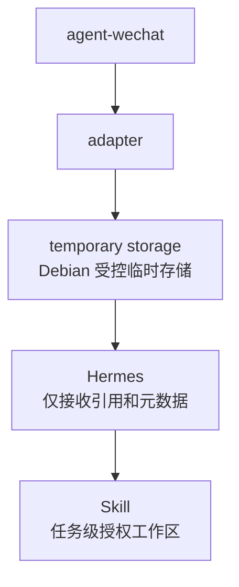

# Hermes 事件协议

> 状态日期：2026-07-31。本文是未来 `wechat-adapter`、Debian 权威控制面、Hermes Worker Bridge 与 Hermes Agent 之间的事件协议设计基线，不是实现说明。当前仅完成 `agent-wechat` V1 微信入口验证；Adapter、Hermes 接入、事件投递和端到端链路均尚未实现。

## 1. 目标与边界

本协议用于把不同消息入口转换为统一、可追踪、可扩展的事件，使 Hermes 不依赖微信或其他平台的私有字段。首个目标入口是 `wechat`，未来可接入 `feishu` 和 `dingtalk`，而不改变 Hermes 的核心事件消费逻辑。

协议只定义事件封装、事件类型、消息类型、关联关系、文件引用和错误语义，不规定具体编程语言、队列产品、数据库、HTTP 路径或鉴权实现。事件进入 Hermes 前仍必须经过 Debian 权威控制面的持久化、身份映射、权限检查、任务收口和上下文快照；Hermes 不直接消费入口平台的原始载荷。

本文字段统一使用 `snake_case`，枚举值使用小写。上游原始字段和早期设计示例中的其他命名由 Adapter 在边界内完成映射，不进入 Hermes 标准事件。

## 2. 设计原则

- **平台无关：** 核心字段不使用 `chatId`、`sender`、`localId` 等微信专有名称。
- **先持久化后派发：** 原始输入和标准事件先写入 Debian 权威状态，再生成 Hermes 执行请求。
- **版本化：** 每个事件携带 `schema_version`；新增字段优先保持向后兼容。
- **不可变与幂等：** 已发布事件不原地修改；同一逻辑事件重投时保持相同 `event_id`。
- **因果可追踪：** 后续事件通过 `trace_id`、`causation_event_id`、`task_id` 等标识关联，不依赖到达顺序猜测关系。
- **文件只传引用：** 事件不携带文件二进制、Base64 内容、任意主机绝对路径或正式存储凭证。
- **未知即未知：** 缺失或未验证的信息使用 `null`、空数组或明确错误，不根据显示名、文件名或消息正文补造。
- **验证状态隔离：** 消息入口已验证不等于 Adapter、Hermes、Skill 或端到端业务能力已实现。

## 3. 基础事件模型

### 3.1 顶层封装

所有标准事件使用同一顶层封装。除表中允许为 `null` 的情况外，字段名必须存在，以便消费者稳定校验结构。

| 字段 | 类型 | 必填 | 语义 |
| --- | --- | --- | --- |
| `schema_version` | string | 是 | 协议版本，V1 设计值为 `1.0` |
| `event_id` | string | 是 | 标准事件的全局唯一标识；重复投递同一逻辑事件时不得变化 |
| `event_type` | string | 是 | 业务事件类型或错误事件类型，见第 4、8 节 |
| `source` | object | 是 | 原始入口、来源账号和事件生产组件 |
| `timestamp` | string | 是 | 事件生产时间，使用 UTC RFC 3339 格式；平台原始时间另存于 `context.source_timestamp` |
| `conversation` | object / null | 是 | 原始物理会话；账号级错误无法定位会话时可为 `null` |
| `sender` | object / null | 是 | 原始发起人；来源整体不可用且无法识别时可为 `null` |
| `message` | object / null | 是 | 当前消息、命令或结果摘要；不适用时为 `null` |
| `context` | object | 是 | 追踪、因果、任务、引用、转发、权限和错误等上下文 |
| `attachments` | array | 是 | 附件或产物引用；没有附件时使用空数组 `[]` |

建议结构如下。示例仅表达协议形状，标识和内容均为脱敏占位值：

```json
{
  "schema_version": "1.0",
  "event_id": "evt_01_example",
  "event_type": "message_received",
  "source": {
    "platform": "wechat",
    "provider": "agent-wechat",
    "account_id": "account_example",
    "producer": "wechat-adapter",
    "transport": "polling",
    "native_event_id": "native_message_example"
  },
  "timestamp": "2026-07-31T08:00:00Z",
  "conversation": {
    "id": "conversation_example",
    "type": "private",
    "thread_id": null
  },
  "sender": {
    "id": "sender_example",
    "display_name": "示例用户",
    "enterprise_identity_id": null,
    "type": "human"
  },
  "message": {
    "id": "message_example",
    "type": "text",
    "content": "查询示例内容",
    "raw_type": "source_specific_type"
  },
  "context": {
    "trace_id": "trace_01_example",
    "correlation_id": null,
    "causation_event_id": null,
    "source_timestamp": null,
    "batch_id": null,
    "task_id": null,
    "context_snapshot_ref": null,
    "reply_to": null,
    "forward": null,
    "error": null
  },
  "attachments": []
}
```

### 3.2 `source`

| 字段 | 必填 | 说明 |
| --- | --- | --- |
| `platform` | 是 | 原始入口平台；当前设计值为 `wechat`，预留 `feishu`、`dingtalk` |
| `provider` | 是 | 实际接入提供方或连接器；微信当前计划使用 `agent-wechat`，其他平台待确定 |
| `account_id` | 是 | 当前平台中的机器人或应用账号标识；用于多账号隔离 |
| `producer` | 是 | 生成当前标准事件的组件，如 Adapter 或 Debian 控制面 |
| `transport` | 否 | 发现或接收事件的方式，如 `polling`、`webhook`、`event`；只记录事实，不代表所有方式已验证 |
| `native_event_id` | 否 | 上游原始事件或消息标识；不得单独假定为跨账号全局唯一 |

`source.platform` 表示原始业务入口，不表示当前事件由该平台直接产生。例如 `command_request` 可以由 Debian 控制面生成，同时继续保留最初的 `wechat` 来源，`source.producer` 则记录实际生产组件。

### 3.3 `conversation`

| 字段 | 必填 | 说明 |
| --- | --- | --- |
| `id` | 是 | Adapter 归一化后的物理会话标识；必须在 `platform + account_id` 范围内稳定 |
| `type` | 是 | `private` 或 `group`；无法可靠识别时不得猜测，应产生 `invalid_message` |
| `thread_id` | 否 | 平台原生线程标识或控制面逻辑线程标识；无此概念时为 `null` |

物理会话不等于 AI 线程。群聊仍须由控制面按机器人账号、群会话和发信人隔离上下文，具体规则以[系统设计](../02_系统设计.md#物理微信会话与-ai-线程)为准。

### 3.4 `sender`

| 字段 | 必填 | 说明 |
| --- | --- | --- |
| `id` | 是 | 平台侧发信人标识，在来源账号范围内解释 |
| `display_name` | 否 | 展示名称，只用于显示和辅助审计，不作为授权依据 |
| `enterprise_identity_id` | 否 | 权限系统完成映射后的企业身份；映射前为 `null` |
| `type` | 是 | `human` 或 `system` |

`sender.id` 只是入口身份，不自动获得企业权限。Adapter 不得依据显示名或消息正文填充 `enterprise_identity_id`。

### 3.5 `message`

| 字段 | 必填 | 说明 |
| --- | --- | --- |
| `id` | 是 | 当前平台消息标识或控制面生成的命令/结果消息标识 |
| `type` | 是 | 统一消息类型：`text`、`file`、`image`、`voice`、`reply`、`forward` |
| `content` | 否 | 当前消息正文、外层标题、命令摘要或结果摘要；二进制内容不得放入此字段 |
| `raw_type` | 否 | 上游原始消息类型，供映射升级和排障使用；Hermes 不应依赖它执行业务逻辑 |

### 3.6 `context`

| 字段 | 适用范围 | 说明 |
| --- | --- | --- |
| `trace_id` | 全部可追踪事件 | 贯穿入口、任务、Hermes、Skill 和结果回传的链路标识 |
| `correlation_id` | 一组相关事件 | 关联同一业务意图、批次或结果链路 |
| `causation_event_id` | 后续事件 | 直接导致当前事件的前一事件 `event_id` |
| `source_timestamp` | 入站事件 | 平台提供的原始消息时间；不可用时为 `null` |
| `batch_id` | 命令及任务事件 | 多消息、多附件聚合批次标识 |
| `task_id` | 命令及任务事件 | Debian 任务中心生成的稳定任务标识 |
| `context_snapshot_ref` | `command_request` | Hermes 实际使用的不可变上下文快照引用 |
| `allowed_skills` | `command_request` | 当前任务允许使用的 Skill 标识列表；空列表表示不可调用 Skill |
| `permission_ref` | `command_request` | 权限判断结果或短期授权的引用，不包含密钥 |
| `reply_to` | `reply` | 被引用消息的已知标识、摘要和解析状态 |
| `forward` | `forward` | 合并转发外层信息及内部展开状态 |
| `raw_payload_ref` | 入站及错误事件 | 受控保存的原始载荷引用，不直接内嵌原始敏感内容 |
| `error` | 错误事件 | 结构化错误详情，见第 8 节 |

### 3.7 `attachments`

每个附件对象至少遵循以下语义：

| 字段 | 必填 | 说明 |
| --- | --- | --- |
| `attachment_id` | 是 | 控制面生成的稳定附件标识 |
| `source_attachment_id` | 否 | 上游附件标识；不可用时为 `null` |
| `name` | 否 | 上游提供的原文件名，仅作元数据，不作为唯一键或存储路径 |
| `media_type` | 否 | 已确认的媒体类型；未知时为 `null`，不得只凭扩展名伪造 |
| `size_bytes` | 否 | 已确认的文件大小 |
| `sha256` | 否 | 文件成功获取并计算后的哈希；获取前或失败时为 `null` |
| `status` | 是 | `pending`、`available` 或 `failed` |
| `storage_ref` | 否 | Debian 受控临时存储或 File Service 的不透明引用；不是主机路径 |
| `purpose` | 否 | `input`、`reference` 或 `output`；由任务上下文确定 |

`status=available` 时才允许提供可用的 `storage_ref`。`status=failed` 时不得用空文件或失效引用继续执行依赖该附件的任务。

## 4. 核心事件类型

| `event_type` | 生产者 | 含义 | 必要约束 |
| --- | --- | --- | --- |
| `message_received` | 入口 Adapter | 原始消息已保存并成功转换为标准消息事件 | 只表示入口事实，不表示已创建任务或 Hermes 已处理 |
| `file_received` | Adapter / 受控文件环节 | 附件已成功获取、登记并进入受控临时存储 | `attachments` 至少包含一个 `available` 附件，并关联原 `message_received` |
| `command_request` | Debian 权威控制面 | 权限、任务批次和上下文快照完成后，向 Hermes 发出的受控执行请求 | 必须包含 `task_id`、`context_snapshot_ref`、授权边界和所需附件引用 |
| `task_completed` | Debian 权威控制面 | Hermes / Skill 的完成结果已被控制面接收并持久化 | 只表示任务处理完成，不表示结果已经成功回传原会话 |

### 4.1 `message_received`

- 文本、文件提示、图片、语音、引用和合并转发都先归一化为此类事件。
- 文件类消息可以先携带 `pending` 附件；文件实际可用后再产生 `file_received`。
- 转换成功后由控制面决定是否聚合、澄清、拒绝或创建任务，Adapter 不直接触发 Skill。

### 4.2 `file_received`

- 建议每个事件表示一个独立完成获取的附件，便于单文件重试、去重和审计；同一消息的多个文件通过同一 `trace_id` 和 `causation_event_id` 关联。
- 文件消息入口已验证不等于临时存储、文件安全检查或该事件已经实现。
- ZIP 文件入口已验证不等于自动解压或内部内容可用。

### 4.3 `command_request`

- 这是 Hermes 接受执行任务的唯一核心入站事件；Hermes 不直接消费平台原始消息或未经控制面处理的 `message_received`。
- `message.content` 保存本次受控指令或摘要，完整上下文通过 `context_snapshot_ref` 获取。
- `allowed_skills`、`permission_ref` 和附件引用必须按任务最小授权生成；缺失必要授权时不得执行。

### 4.4 `task_completed`

- 任务结果先由 Worker Bridge 回报 Debian，控制面持久化结果和审计记录后再形成此事件。
- `message.content` 可包含面向后续回传的结果摘要，结构化产物通过 `attachments` 引用。
- 回传 Adapter 仍需单独记录发送尝试和最终状态；不得把 `task_completed` 当作平台发送成功凭证。
- 失败、结果未知或等待人工确认不得伪装为 `task_completed`。

## 5. 消息类型与当前验证状态

下表状态只描述 `agent-wechat` V1 微信入口验证范围，不描述 Adapter 转换、Hermes 理解、Skill 处理或生产稳定性。

| `message.type` | 语义 | 当前状态 |
| --- | --- | --- |
| `text` | 普通文本消息 | **已验证：** 私聊文本和群聊文本入口 |
| `file` | 普通文件消息；文件本体使用 `attachments` 引用 | **已验证：** 文件消息、ZIP 文件和文件获取；其他格式及边界仍待技术验证 |
| `image` | 图片消息；图片本体使用 `attachments` 引用 | **未验证** |
| `voice` | 语音消息；音频本体使用 `attachments` 引用 | **未验证** |
| `reply` | 带引用关系的消息包装 | **已验证：** 引用消息入口；具体字段完整性仍需按实际样本固化 |
| `forward` | 合并转发消息包装 | **部分验证：** 仅外层类型、发送人和标题已验证；内部聊天记录和内部文件未验证、未支持 |

`reply` 和 `forward` 是结构类型，不应丢失当前消息正文或附件：

- `reply` 的当前正文放入 `message.content`，实际可得的被引用消息信息放入 `context.reply_to`。无法解析原消息标识时明确记录未解析，不通过相似文本猜测。
- `forward` 的外层标题可放入 `message.content`，`context.forward` 记录 `is_expanded=false` 及实际可得的外层信息。当前不得生成内部消息列表或内部文件引用。
- 无法映射的上游类型产生 `invalid_message`，不得强制映射为 `text`。

## 6. 多入口兼容设计

### 6.1 平台映射

| 统一语义 | `wechat` | `feishu` | `dingtalk` |
| --- | --- | --- | --- |
| 平台标识 | `source.platform=wechat` | `source.platform=feishu` | `source.platform=dingtalk` |
| 接入提供方 | 当前计划为 `agent-wechat` | 待选 Adapter / API | 待选 Adapter / API |
| 会话 | 映射到 `conversation` | 映射到 `conversation` | 映射到 `conversation` |
| 发信人 | 映射到 `sender` | 映射到 `sender` | 映射到 `sender` |
| 消息与附件 | 映射到 `message`、`attachments` | 映射到 `message`、`attachments` | 映射到 `message`、`attachments` |

`feishu` 和 `dingtalk` 仅表示协议预留的平台值，不表示已经选型、接入或验证。

### 6.2 兼容规则

1. 每个平台由自己的 Adapter 解释原始字段、签名、分页、回调和附件获取方式。
2. 核心事件不得新增微信专属顶层字段；原始载荷保存在受控存储，并通过 `raw_payload_ref` 关联。
3. `conversation.id`、`sender.id` 和 `message.id` 均在 `platform + account_id` 范围内解释，消费者不得假设它们跨平台唯一。
4. Hermes 依据统一的 `message.type`、任务上下文和授权信息工作，不依据 `raw_type` 分支业务逻辑。
5. `source.platform` 可用于结果路由和平台能力判断，但不能替代企业身份映射或权限检查。
6. 平台缺少某项能力时应保留 `null` 或产生明确错误，不用其他平台字段模拟。

## 7. 文件生命周期

目标主路径如下：



图中 `temporary storage -> Hermes` 表示受控文件引用进入任务上下文，不表示 Hermes 可以直接浏览 Debian 路径。实际访问仍须经过 Debian 控制面、File Service 或 Worker Bridge 的权限检查、短期授权和审计。

目标生命周期为：

1. `agent-wechat` 提供文件消息和当前可获取的来源元数据。
2. Adapter 保存原始消息，登记 `pending` 附件并尝试获取文件。
3. 文件写入 Debian 受控临时存储，完成大小、类型、哈希和安全边界检查后标为 `available`，发布 `file_received`。
4. 控制面把不透明 `storage_ref` 放入上下文快照；`command_request` 只携带引用、元数据和任务授权。
5. Hermes 将获授权的附件引用交给相应 Skill；Worker Bridge 在任务级隔离工作区解析引用，不暴露正式存储的任意路径。
6. Skill 产生的文件先作为新产物登记、计算哈希并关联父附件和任务，之后才能回传或经 File Service 归档。
7. 临时文件按待确认的保留策略清理；需要长期保存的原件和产物必须先通过权限、审计和正式归档规则。

当前只验证到 `agent-wechat` 的文件消息、ZIP 文件和文件获取。Adapter 临时存储、`file_received`、安全检查、Hermes 文件引用、Skill 处理、产物登记和正式归档均为目标设计，尚未实现。

## 8. 错误事件

错误事件使用独立的 `event_type`，同时在 `context.error` 中提供统一详情。错误事件必须继承触发链路中已知的 `trace_id`、`conversation`、`sender`、`task_id` 和 `causation_event_id`；确实无法取得的字段使用 `null`，不得补造。

### 8.1 最小错误类型

| `event_type` | 触发条件 | 目标处理 |
| --- | --- | --- |
| `source_unavailable` | 入口平台、账号、登录状态或上游服务不可用 | 停止推进同步检查点，记录可用性状态并有限重试或告警；不得宣称离线期间消息已完整补回 |
| `file_fetch_failed` | 已识别附件但获取、校验或写入受控临时存储失败 | 保留原消息和同一附件记录，标记 `failed`；依赖该文件的任务等待重试、澄清或人工处理 |
| `invalid_message` | 必填字段缺失、会话类型无法确认、消息类型不支持或标准化校验失败 | 保存受控原始载荷引用并隔离事件，不提交 Hermes，不强制伪装为已知类型 |

### 8.2 `context.error`

| 字段 | 必填 | 说明 |
| --- | --- | --- |
| `code` | 是 | 与错误 `event_type` 一致的机器可读错误码 |
| `stage` | 是 | 发生阶段，如 `source`、`adapter`、`temporary_storage`、`control_plane`、`hermes` 或 `skill` |
| `retryable` | 是 | 当前错误是否已被明确判定为可安全重试；未知时必须为 `false` |
| `safe_message` | 是 | 可用于日志或用户提示的脱敏摘要，不包含凭证和不必要的正文 |
| `attempt` | 否 | 当前尝试序号；不替代任务中心的完整重试记录 |
| `details_ref` | 否 | 受控诊断记录引用；不得直接内嵌 Cookie、Token、微信登录数据或完整敏感载荷 |

错误事件是失败事实，不等于自动重试命令。是否重试由权威控制面依据幂等性、风险、次数上限和人工接管规则决定。新的错误码可以在兼容版本中追加；消费者遇到未知错误码时必须保留并转入通用失败处理，不能当作成功。

## 9. 事件关联、幂等与顺序

典型成功链路为：

```text
message_received
  -> file_received（存在附件时，可有多个）
  -> command_request
  -> task_completed
```

任一阶段都可产生错误事件并通过 `causation_event_id` 指向直接触发事件。

- `event_id` 标识一个不可变事实；网络重投保留相同值，新的状态变化使用新的 `event_id`。
- `trace_id` 贯穿整条处理链；`task_id` 只在任务建立后出现，不能代替入口事件标识。
- `correlation_id` 可关联同一批次的多条消息、多个附件和多个任务，但不定义处理顺序。
- 系统不得假设不同来源或不同分区的事件全局有序；任务状态以 Debian 权威记录和显式因果关系为准。
- 消息去重、文件获取幂等、任务执行幂等、Skill 业务写入幂等和结果回传幂等必须分别处理。

## 10. 版本与演进

- V1 设计版本为 `schema_version=1.0`；正式实现前仍需结合 `agent-wechat` 实际样本评审并固化。
- 新增可选字段或枚举值时，消费者必须容忍未知字段，并对未知枚举进入明确的兼容或隔离处理。
- 删除字段、改变既有字段含义或收紧已有取值属于不兼容变更，需要提升主版本并安排生产者、消费者升级顺序。
- Adapter 应保留原始载荷与转换版本，使映射规则升级后可以受控重放；重放不得重复触发已完成的业务写操作。
- 协议变更不得绕过 Debian 权威控制面、File Service、权限检查、人工确认和审计边界。

## 11. 当前状态结论

| 范围 | 状态 |
| --- | --- |
| `text`、`file`、`reply` 微信入口 | **已验证**，仅限现有验证记录所述范围 |
| `forward` 微信入口 | **部分验证**，仅完成外层识别 |
| `image`、`voice` 微信入口 | **未验证** |
| Hermes 事件协议 | **设计基线，待实现前评审** |
| `wechat-adapter`、临时文件、事件投递 | **待开发** |
| Hermes、Worker Bridge、Skills 接入 | **待接入 / 待开发** |
| `feishu`、`dingtalk` 入口 | **协议预留，未接入、未验证** |

现有验证事实以[agent-wechat V1 入口验证记录](../status/agent-wechat-validation.md)为准，组件职责和权威状态边界以[系统设计](../02_系统设计.md)及[微信入口与 Hermes 集成架构](../architecture/wechat-hermes-integration.md)为准。
