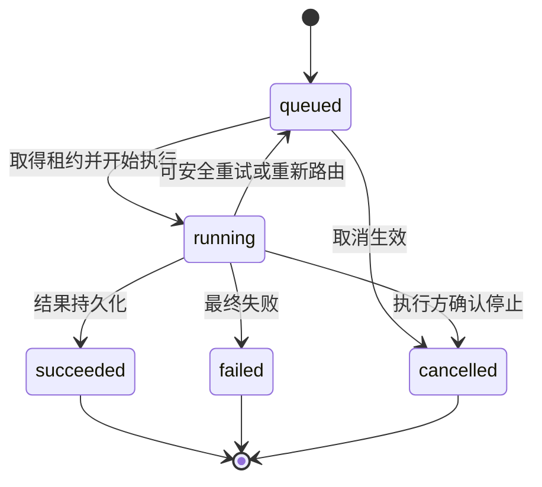

# Task Queue 设计

> 状态日期：2026-08-04。本文定义 CF Gateway 的目标 Task Queue / Task Store 设计基线。V1 Staging 已完成不经过本目标 Task Queue 的有限微信文本 Hermes 闭环；Task Queue、队列产品、数据库、调度参数、完整 Worker Bridge 和通用 AI Provider 路由尚未实现、选型或验证。文本闭环不得被解释为本设计已经落地。

## 1. 定位

Task Queue 是 Gateway 中已授权 AI 任务的持久化排队、调度和生命周期控制层。只有通过 Access Control 的消息才会在 Context Builder 形成不可变上下文快照后创建 Task。

目标流程为：

```text
Message Store
  -> Identity Mapping
  -> Access Control
  -> Employee Conversation Manager
  -> Context Builder
  -> Task Queue
  -> AI Router
  -> AI Provider
  -> Hermes
  -> Skills
```

Message Store 与 Task Store 必须分离：Message Store 保存所有消息，Task Store 只保存准入结果为 `allowed` 且满足任务收口条件的 AI 任务。未获准消息、群内未 `@` 当前机器人的消息以及只需留存但不执行的消息均没有 Task；不得用“创建一个拒绝 Task”代替权限审计。

Identity Mapping 以 `source.platform + source.account_id + sender.id` 为输入，只输出 `enterprise_identity_id` 和可选 `employee_id`，不创建或返回 `workspace_id`。只有身份映射成功且 Access Control 允许创建 Task 后，Employee Conversation Manager 才解析或创建 `workspace_id` 和 `ai_thread_id`。拒绝消息继续保存消息和身份解析结果，但不创建 Task、执行上下文或新的 AI Thread / AI 会话线程执行关系。

Task Queue 在逻辑上包含持久化 Task Store、优先级调度、线程顺序控制、领取租约、延迟重试、取消和执行审计。具体可由一个或多个组件实现，但 Debian 保存权威任务状态及 Employee Workspace / 员工工作区、AI Thread / AI 会话线程归属；Provider、Hermes 或 Windows Worker 的本地状态不得覆盖它。

## 2. 任务生命周期

### 2.1 统一主状态

V1 Task 主状态统一为：

| 状态 | 语义 |
| --- | --- |
| `queued` | Task 已持久化并等待调度；包括等待 `retry_at`、等待 Provider 容量或等待租约重新分配 |
| `running` | 执行方已取得有效租约，Task 正在使用选定 Provider / 模型执行 |
| `succeeded` | 最终结果已被 Debian 控制面接收并持久化；不等于结果已成功回传原会话 |
| `failed` | 已确认无法继续或重试已耗尽的最终失败 |
| `cancelled` | 取消已经生效，Task 不再继续执行 |

本文及相关设计不使用 `pending` 表示 Task 排队，也不使用 `success` 表示 Task 成功。`pending`、`available`、`failed` 可以出现在附件获取状态中，那是独立状态域，不属于 Task 生命周期。

### 2.2 状态转换



转换规则：

- Task 只有在消息已持久化、准入为 `allowed`、上下文快照已生成且 Task 记录写入成功后才能进入 `queued`。
- `queued -> running` 必须以原子领取或等效机制获得有期限租约，记录执行尝试和选定 Provider。
- 可重试执行失败不先写成终态 `failed`，而是结束当前 attempt、增加 `retry_count`、设置 `retry_at` 并回到 `queued`。
- `succeeded`、`failed`、`cancelled` 是终态；后续回传失败、审计补充或人工核对使用独立记录，不倒改 Task 终态。
- “等待确认”“等待附件”“Provider 限流”和“租约待恢复”使用 `blocked_reason`、附件状态、`retry_at` 或 attempt / lease 状态表达，不扩充或混用 Task 主状态。

## 3. Task 数据模型

### 3.1 `tasks` 核心实体

| 字段 | 语义 |
| --- | --- |
| `task_id` | Debian Task Store 生成的稳定任务 ID |
| `enterprise_identity_id` | Task 所属 Gateway 企业身份的不可变权威主键，也是身份、工作区和权限关联依据 |
| `employee_id` | 可空的公司员工编号、HR 编号或业务人员编号；不是 Gateway 内部主键，不使用微信 `wxid` 等来源标识代替 |
| `workspace_id` | Gateway 生成的 Employee Workspace / 员工工作区稳定 ID |
| `ai_thread_id` | Gateway 生成的 AI Thread / AI 会话线程稳定 ID，是任务顺序与上下文隔离依据 |
| `hermes_thread_id` | 可选的 Hermes Runtime Thread / Hermes 运行时线程绑定；可为 `null`、可重建，不是权威主键 |
| `source_message_id` | 触发本 Task 的 Message Store `messages.id`；这里表示“Task 的来源消息”，不是平台侧 `messages.source_message_id` |
| `source_conversation_id` | 来源 Physical Conversation / 物理会话 ID，用于追踪和结果路由；不替代 `ai_thread_id` |
| `source_account_id` | 来源机器人或应用账号 ID，与平台和物理会话共同确定回传作用域 |
| `requester_id` | 发起人的稳定入口身份或已解析企业身份引用 |
| `context_snapshot_id` | 本 Task 实际使用的不可变 Context Snapshot / 上下文快照 ID |
| `task_type` | 任务类别，如受控问答、文档处理或业务查询；具体枚举待业务设计 |
| `priority` | `low`、`normal`、`high` 或 `urgent` |
| `status` | `queued`、`running`、`succeeded`、`failed` 或 `cancelled` |
| `requirements` | Task 所需能力和数据约束的结构化对象，不绑定具体 Provider 或模型 |
| `selected_provider` | AI Router 选中的 `provider_id`；路由前为空，重新路由时当前值更新且历史保存在 attempt 中 |
| `selected_model` | 当前 attempt 选中的模型；路由前为空 |
| `queue_position` | 面向查询的队列位置快照；队列变化时可重新计算，不能作为权威排序键 |
| `created_at` | Task 成功持久化并进入 `queued` 的时间 |
| `started_at` | 首次进入 `running` 的时间；各次尝试开始时间另存于 attempt |
| `finished_at` | 进入终态的时间；非终态为空 |
| `elapsed_seconds` | 已执行耗时快照；运行中可由时间计算，终态时固化 |
| `retry_count` | 已安排的重试次数，不包含首次尝试 |
| `max_retry` | 允许的最大重试次数；按任务类型和风险策略确定 |
| `retry_at` | 下一次可参与调度的时间；无需延迟重试时为空 |
| `error_code` | 当前最终错误或最近一次 attempt 的规范错误码；无错误时为空 |
| `error_message` | 脱敏错误摘要；不得包含秘密、完整敏感正文或 Provider 原始凭证信息 |
| `result_reference` | 指向已持久化结构化结果、产物或结果摘要的不透明引用；未成功时可为空 |

还应保存：

- `trace_id`、`batch_id`、`source_platform` 和 `idempotency_key`。
- `authorization_decision_ref`、`policy_version`、`context_snapshot_ref`、`allowed_skills` 和有效权限范围引用；`context_snapshot_ref` 是传输或读取引用，不替代稳定的 `context_snapshot_id`。
- `task_timeout`、`blocked_reason`、`cancellation_requested_at` 和当前租约信息。
- 创建者、最后状态版本和乐观并发版本，防止并发调度覆盖较新状态。

`source_message_id + task_type + context_snapshot_id` 可参与生成任务幂等键，但最终组成需结合任务批次规则确认。同一 Message Store 消息可以没有 Task；多消息批次创建 Task 时，`source_message_id` 指向触发收口的主消息，其他消息通过批次项和上下文快照关联。

### 3.2 执行尝试

每次领取和执行应追加独立 attempt 记录，至少包含 `attempt_id`、`task_id`、attempt 序号、Provider、模型、当次 `hermes_thread_id`、租约、开始 / 结束时间、耗时、结果、错误、重试决定和重新路由原因。更新 `tasks.selected_provider` 或当前 `hermes_thread_id` 不得覆盖历史路由与运行时线程绑定事实。

结果回传使用独立 `result_delivery` 记录。Task `succeeded` 表示执行结果已在 Debian 持久化，不表示微信或其他入口已经发送成功。

`result_delivery` 必须保留 `enterprise_identity_id`、`workspace_id`、`ai_thread_id`、`task_id`、`source_message_id`、`source_platform`、`source_account_id` 和 `source_conversation_id`，并可保留 `employee_id`，确保结果从 Hermes 员工工作区仍能回到原 Physical Conversation / 物理会话。

### 3.3 线程顺序与并行

同一 AI Thread / AI 会话线程内的 Task 默认按 Gateway 确认的入队顺序执行。前一 Task 仍为 `running`，或其结果尚未完成权威上下文提交时，后一 Task 不得并发修改同一线程上下文。实现可以使用线程序号、线程级租约或等效的持久化顺序机制，具体方案待选型。

不同 Employee Workspace / 员工工作区或不同 AI Thread / AI 会话线程的 Task 可以并行，但必须同时满足 Provider 容量、任务风险、文件与企业系统并发限制。Hermes Runtime Thread / Hermes 运行时线程的本地并发能力不得绕过 Gateway 的线程顺序。

跨员工共享线程、共同 Task 或管理者接管属于后续规划；没有明确授权、参与者、共享范围和审计记录时不得自动合并顺序域。

## 4. 优先级

Task 优先级统一为：

| 优先级 | 典型来源 |
| --- | --- |
| `low` | 后台整理、可延后的批处理或低时效分析 |
| `normal` | 默认员工请求和普通业务查询 |
| `high` | 明确时效要求、阻塞业务流程或授权系统策略提升的请求 |
| `urgent` | 经受控规则或有权人员明确标记的紧急任务；不得由自然语言自行提权 |

优先级来源必须可审计，可以来自任务类型默认值、Gateway 策略、获准角色或人工调度操作。Hermes、模型和未经授权的用户文本不能自行提升优先级。

基本排序为：已到 `retry_at` 的 Task 中，先比较有效优先级，再比较 `created_at`，最后使用稳定 `task_id` 打破平局。调度器通过等待时长提升、各优先级保留容量或最大连续高优先级配额防止 `low` / `normal` 长期饥饿；具体老化窗口和配额须经容量测试确认。`urgent` 也受并发、权限和安全限制，不能抢占已开始且不可安全中断的业务写操作。

## 5. Provider 抽象

Task 只描述能力需求，不绑定 GPT、某台本地 AI 主机或具体模型。`requirements` 可包含：

```json
{
  "text": true,
  "vision": false,
  "long_context": true,
  "tool_use": true,
  "privacy_level": "internal",
  "latency_preference": "normal",
  "cost_preference": "balanced"
}
```

AI Router 结合 `requirements`、授权范围、数据地域、模型批准清单、Provider 能力和 Provider Runtime State，从以下抽象中选择：

- OpenAI Provider，当前优先用于计划中的 GPT API 路线。
- 其他经批准和验证的 API Provider。
- Local Provider，代表统一的本地或私有模型服务接口。

Provider 名称和模型只在路由后写入 `selected_provider` / `selected_model`，不得作为硬编码写入任务能力需求。没有满足能力、安全和权限约束的 Provider 时，Task 保持 `queued` 或按策略进入最终 `failed` / 人工处理，不能自动降级到未批准服务。

Gateway 使用 AI Provider Registry 和 Provider Runtime State 管理路由事实，不以 AI Node Registry 作为核心架构。Local Provider 内部的主机发现、GPU 分配、进程和负载均衡由 Provider 自身负责。

## 6. 执行状态

Task Queue 与 AI Router 读取 Provider Runtime State，决定 Task 立即领取还是继续排队。Provider 级运行状态统一为：

| 状态 | 语义 |
| --- | --- |
| `idle` | Provider 当前可以接受符合条件的新 Task，`current_task_id` 通常为空 |
| `busy` | Provider 当前达到本路由单元的执行容量或正在处理 `current_task_id` |
| `error` | Provider 当前发生错误，不接受新 Task，等待恢复、重试或重新路由 |
| `maintenance` | Provider 被运维策略置于维护状态，不接受新 Task |

Provider Runtime State 至少包含：

| 字段 | 语义 |
| --- | --- |
| `provider` | AI Provider Registry 中的稳定 `provider_id` |
| `model` | 当前 Task 使用的模型，空闲且无固定模型时可为空 |
| `status` | `idle`、`busy`、`error` 或 `maintenance` |
| `current_task_id` | 当前执行 Task；空闲或 Provider 不暴露单任务槽时可为空 |
| `started_at` | 当前 Task 或当前忙碌周期的开始时间 |
| `elapsed_seconds` | 当前 Task 已执行时长快照；无当前 Task 时为 `0` 或空 |
| `queue_length` | 当前可路由到该 Provider 的等待 Task 数量快照 |
| `last_heartbeat` | Provider / Worker 最近心跳；API Provider 不适用时可为空 |
| `last_status_update` | Gateway 最近确认该状态的时间；必须存在 |

`queue_length` 和 `elapsed_seconds` 是可重算快照，Task Store、attempt 和租约才是权威执行记录。状态过期时按 `error` 或不可调度处理，不能默认 `idle`。即使当前主要使用 GPT API，也必须记录任务执行状态，以判断是否空闲、展示正在处理的 Task、统计执行时长并决定新 Task 排队或立即执行。

未来 Hermes 员工工作台按 `workspace_id` 和 `ai_thread_id` 查询 Task，并至少展示 `queue_position`、`started_at`、`elapsed_seconds`、当前状态、选定 Provider 和模型。该工作台是受控视图，不是已实现功能；显示快照不得覆盖 Task Store、attempt 或租约中的权威事实。

该状态描述 Provider / Task 执行关系，不表示 Gateway 管理某台 AI 物理主机。Local Provider 可以提供节点诊断信息，但它是可选运维元数据，不形成 Gateway 节点注册表。

## 7. 重试、超时和取消

### 7.1 重试与超时

- 每个 Task 明确 `retry_count`、`max_retry`、`retry_at` 和 `task_timeout`；默认值按任务类型、Provider 错误类别和业务风险配置。
- 只有已判定为暂时性、输入仍有效且业务动作可安全重放的失败才自动重试。
- 超时结束当前 attempt，不自动证明业务没有发生；结果未知、部分成功或非幂等写操作进入人工核对，不盲目重放。
- 重试复用同一 `task_id` 和 `idempotency_key`，新增 attempt；不得因重试创建一份重复 Task。
- `retry_count >= max_retry`、不可重试错误或人工终止时进入最终 `failed`，并保存脱敏错误与处理建议。

### 7.2 Provider 失败与重新路由

Provider 失败后，仅在以下条件同时满足时重新路由：

1. 候选 Provider 满足原 Task 的能力、隐私、地域、成本和模型批准约束。
2. 上下文快照和附件引用与新 Provider 兼容且仍在有效期内。
3. 当前 attempt 尚未产生不可确认的外部副作用，或业务幂等机制能证明安全。
4. 重试次数、超时和策略允许继续。

重新路由追加 attempt 和路由审计，不修改原授权范围，不让 Hermes 自行选择未批准 Provider。

### 7.3 取消

- `queued` Task 可原子转为 `cancelled`，并从可领取集合移除。
- `running` Task 先记录取消请求并通知执行方；只有执行方停止或控制面确认租约失效且不会继续产生副作用后，才进入 `cancelled`。
- 无法安全中断的业务动作保留 `running` 或转人工核对，不能为响应取消请求而伪造 `cancelled`。
- 终态 Task 的后续取消请求只追加审计，不改写 `succeeded`、`failed` 或既有 `cancelled`。

## 8. 任务审计

Task 审计必须能够回答：

- 谁发起：来源账号、`requester_id`、`enterprise_identity_id`、可选 `employee_id` 和会话。
- 来源消息：`source_message_id`、批次中的其他消息和附件。
- 为什么允许：权限决策引用、策略版本、有效范围和 `allowed_skills`。
- Hermes 看到了什么：不可变 `context_snapshot_ref`、选入项和快照版本。
- 如何路由：每次 attempt 使用的 Provider、模型、路由原因和运行状态快照。
- 何时执行：创建、排队、开始、重试、取消、结束时间及执行时长。
- 产生什么：最终状态、结构化结果、产物和结果回传记录。
- 为什么失败：错误码、脱敏错误信息、超时、重试和人工处理决定。

状态变更、优先级调整、重新路由、取消和人工接管均追加不可变审计事件，并携带 `trace_id`、`task_id`、操作者 / 组件身份和时间。普通运行日志不得包含 API Token、密码、Cookie、微信登录数据、完整敏感上下文或真实业务附件。

Gateway 总体位置见[企业 AI Gateway 架构](../architecture/gateway-architecture.md)，消息边界见[Message Store 设计](./message-store-design.md)，员工归属见[员工工作区与 AI 会话线程设计](./employee-workspace-design.md)，准入规则见[Access Control 设计](./access-control-design.md)，事件字段见[Hermes 事件协议](./hermes-event-schema.md)。
