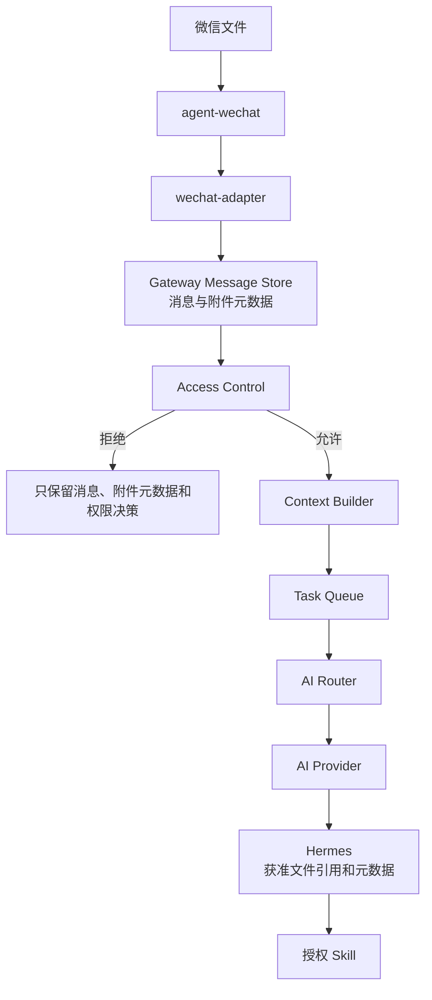
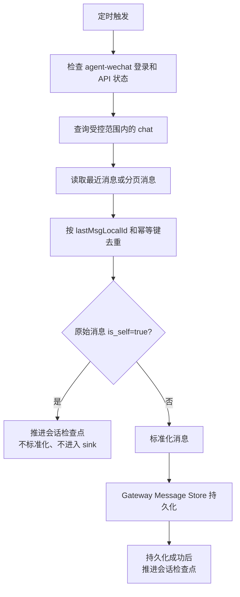

# wechat-adapter 设计

> 状态日期：2026-08-04。本文同时标记目标设计与当前代码边界。V1 Staging 已完成真实微信文本从 Polling、消息与权限控制、Employee Workspace / AI Thread 到 Hermes API 和原会话回复的闭环；`chatId + text` 出站和 `is_self=true` 防回环已验证。附件正式处理、Context Builder、Task Queue、完整 Worker Bridge、Skill 和生产部署仍未完成。详见[Gateway V1 Staging 验证记录](../status/gateway-wechat-staging-validation.md)。

## 设计定位

`wechat-adapter` 是 CF Gateway 逻辑边界中的微信入口适配组件。它封装 `agent-wechat` API，把微信原始消息和附件元数据转换为版本化标准事件并提交 Gateway。Message Store 持久化、Access Control、Context Builder、Task Queue 和 AI Router 均由 Gateway 负责；Adapter 不直接与 Hermes 通信。总体关系见[微信入口与 Hermes 集成架构](../architecture/wechat-hermes-integration.md)。

V1 使用 Polling，不依赖尚未确认的 WebSocket 微信消息事件。Adapter 不承担权威消息存储、入口授权、上下文构建、Task 创建、意图理解、任务规划、Skill 选择或 ERP 业务逻辑。

## 设计原则

- Adapter 分开提交受控原始载荷引用和标准化内容，Gateway Message Store 负责权威保存；转换失败时仍可追踪原始输入。
- 目标架构中，Gateway 先持久化、后做权限判断和派发；消息进入完整任务链前必须经过 Access Control、Context Builder、Task Queue 和 AI Router。当前 V1 文本闭环只实现有限 Hermes Dispatch / Relay，不代表后面三个目标组件已完成。
- 事件协议版本化，新增字段优先保持向后兼容。
- 同步去重、任务幂等、业务操作幂等和结果回传幂等分别处理。
- 只使用上游实际提供的信息，不根据 `senderName`、文件名或消息正文猜测身份和权限。
- 文件通过受控引用流转，不把大文件内容或不受控本地路径放入事件。

## 1. 输入模型

Adapter 从 `agent-wechat` 读取原始消息。当前设计关注以下字段；除已经实测固化的 `isMentioned` 外，其余字段的精确类型、空值规则和不同消息类型下的响应结构仍须继续基于实际 API 样本维护。

| 字段 | 用途 | 处理规则 |
| --- | --- | --- |
| `chatId` | 标识微信会话 | 原样保留为字符串语义；用于会话映射和回传，不能直接等同于 AI 线程 |
| `sender` | 标识微信发信人 | 原样保留；进入权限系统前只作为来源标识，不直接等同于企业员工身份 |
| `senderName` | 展示发信人名称 | 仅用于展示和辅助审计，不作为稳定键或授权依据 |
| `type` | `agent-wechat` 原始消息类型 | 保留原始值，再映射到统一消息类型；未知值不得强制映射为已知类型 |
| `content` | 文本、标题或上游提供的内容 | 按消息类型解释；在进入 Hermes 上下文前进行长度、格式和敏感信息边界检查 |
| `localId` | 微信侧本地消息标识 | 作为会话内同步检查点和去重键的核心部分；稳定性、排序和作用域仍需继续实测 |
| `reply` | 上游可获得的引用信息 | 仅提取实际存在的引用消息或引用文件信息；结构缺失时保持为空，不补造引用内容 |
| `isMentioned` | 上游结构化 mention 事实 | 仅按 `raw.get("isMentioned") is True` 生成 `is_mentioned`；字段缺失或不是布尔 `true` 时为 `false` |

除原始字段外，Adapter 可以从受控配置补充 `sourceAccount`、Adapter 接收时间和 Polling 批次标识。这些是采集元数据，不得冒充微信原始字段。

### 结构化 mention 实测

实测机器人微信显示名在本文脱敏记作 `机器人示例名`，三组对照结果为：

- 从微信成员列表真正选择 `@机器人示例名`：`isMentioned=true`。
- 从成员列表真正 `@` 群内其他成员 T：`isMentioned` 字段缺失。
- 只复制或输入 `@机器人示例名 手工文字对照`，未从成员列表选择机器人：`isMentioned` 字段缺失。

因此不得根据正文中的 `@` 字符、当前脱敏示例名 `机器人示例名`、旧脱敏示例名 `机器人旧示例名`、引用消息或上一条 mention 推断或继承 `is_mentioned=true`。

## 2. 标准事件模型

### 事件封装

统一入站事件名为 `message_received`。目标事件遵循[Hermes 事件协议](./hermes-event-schema.md)的 `snake_case` 字段和小写枚举。Adapter 提供来源事实、标准化消息、附件元数据和原始载荷引用；Gateway 持久化后追加 `authorization`，只有创建 Task 后才会出现 `runtime`。

以下 JSON 表示 Gateway 完成持久化和授权后的目标结构，不是已经运行的接口响应。示例中的 `authorization` 由 Gateway 生成，不由 Adapter 填写：

```json
{
  "schema_version": "1.0",
  "event_id": "evt_example",
  "event_type": "message_received",
  "source": {
    "platform": "wechat",
    "provider": "agent-wechat",
    "account_id": "account_example",
    "producer": "wechat-adapter",
    "transport": "polling",
    "native_event_id": "native_event_example",
    "native_message_id": "native_message_example"
  },
  "timestamp": "2026-07-31T08:00:00Z",
  "conversation": {
    "id": "conversation_example",
    "type": "private",
    "thread_id": null
  },
  "sender": {
    "id": "sender_example",
    "display_name": "示例用户",
    "enterprise_identity_id": null,
    "type": "human"
  },
  "authorization": {
    "user_allowed": true,
    "group_allowed": null,
    "is_mentioned": null,
    "permission_scope": ["scope_example"],
    "decision": "allowed",
    "reason_code": "allowed",
    "policy_version": "policy_example",
    "checked_at": "2026-07-31T08:00:00Z"
  },
  "runtime": null,
  "message": {
    "id": "message_example",
    "type": "text",
    "raw_type": "source_specific_type",
    "content": "示例消息",
    "is_mentioned": false,
    "is_self": false
  },
  "context": {
    "trace_id": "trace_example",
    "correlation_id": null,
    "causation_event_id": null,
    "source_timestamp": null,
    "batch_id": null,
    "task_id": null,
    "context_snapshot_ref": null,
    "reply_to": null,
    "forward": null,
    "raw_payload_ref": "raw_payload_example",
    "error": null
  },
  "attachments": []
}
```

### 字段语义

| 对象 | 必要内容 | 边界 |
| --- | --- | --- |
| `source` | 平台、上游组件、来源账号、采集方式和来源消息 ID | 来源账号来自受控配置；不能只用 `chatId` 区分多个微信账号 |
| `conversation` | `chatId` 和已确认的私聊/群聊类型 | 会话类型无法可靠确定时不得猜测；应进入待补全或错误状态 |
| `sender` | `sender`、`senderName`、可选企业身份映射 | 企业身份由权限系统解析，Adapter 不自行授予权限 |
| `message` | Gateway 内部消息 ID、统一类型、原始类型、正文或外层标题，以及标准化的 `is_mentioned` / `is_self` 来源事实 | `localId` 映射到 `source.native_message_id`；原始类型必须保留；不得从正文或名称推断 mention |
| `attachments` | 文件引用、名称、类型、大小、哈希和获取状态中实际可得的字段 | 未获取成功时不得生成可用文件引用；未知元数据保持为空 |
| `context` | 可获得的引用关系、合并转发外层信息 | 不包含未被 `agent-wechat` 展开的合并转发内部记录 |

`event_id` 和 Gateway 内部 `message.id` 使用稳定生成值，来源侧 `localId` 保存在 `source.native_message_id`。Message Store 已实现来源账号隔离下的来源物理消息幂等，并同时执行 `event_id` 幂等；相同来源消息标识不会跨来源账号合并。常驻 Worker / 串行轮询已实现并用于 V1 Staging，真实微信文本消息经 Polling 进入 Message Store 及后续准入链路；附件接线、`localId` 的排序与游标语义、重叠窗口、重启恢复、服务管理和长期稳定性仍须继续实现或实测。

示例中的 `authorization.is_mentioned=null` 表示私聊准入条件不适用；`message.is_mentioned=false` 是标准化来源事实。两者属于不同语义层，私聊授权快照的 `null` 不会改变原字段缺失按 `false` 标准化的规则。

### 引用上下文

当 `reply` 中确实存在可读取信息时，`context.reply_to` 可记录被引用消息标识、类型、文本摘要或附件引用。缺少稳定被引用消息标识时，应保留“引用存在”和实际可得内容，同时标记关联未解析，不把相似文本自动关联为原消息。

合并转发消息只在 `context.forward` 记录当前已验证可获得的外层标题、发送人和原始类型。内部消息列表和内部文件保持未解析状态。

## 3. 消息类型

统一消息类型使用小写枚举：

| 类型 | 含义 | 当前状态 |
| --- | --- | --- |
| `text` | 普通文本消息 | **已验证：** 私聊文本收发、群聊文本读取 |
| `image` | 图片消息 | **待技术验证** |
| `file` | 普通文件或群文件消息 | **已验证：** 文件消息读取，以及 TXT、ZIP、群文件和引用文件获取；其他格式与边界仍待验证 |
| `voice` | 语音消息 | **待技术验证** |
| `reply` | 带引用关系的消息包装 | **已验证：** 引用消息和引用文件；具体字段完整性仍需按样本固化 |
| `forward` | 合并转发消息包装 | **外层已验证：** 可识别类型、发送人和标题；内部聊天记录及文件未支持 |
| `system` | 微信系统消息 | **代码已实现：** 系统消息解析；尚未正式接线和端到端运行 |

`reply` 和 `forward` 表示消息结构，不应丢失其正文或附件。引用正文、引用文件和合并转发外层信息分别放入 `message`、`attachments` 和 `context`。尚未纳入协议的 `video` 或其他上游类型保留原始类型并产生 `invalid_message`，不得强制伪装为已知类型。

## 4. 文件流程



该流程是目标设计。当前已验证 `agent-wechat` 文件消息读取和部分文件获取；HTTP Client、微信标准化及媒体 JSON / Base64 解码已有代码实现。真实微信文本消息已完成 Hermes 闭环，但附件正式接线、落库与安全处理，以及 Context Builder、Task Queue、Hermes 文件上下文和 Skill 链路尚未完成，因此文件流程未端到端运行。

目标处理步骤：

1. Adapter 标准化原始文件消息，提交来源账号、`chatId`、`sender`、`localId`、原始载荷引用和附件元数据。
2. Gateway Message Store 先持久化消息和附件元数据，再允许后续 Access Control；保存失败时不得推进同步检查点。
3. Adapter 调用 `agent-wechat` 获取文件，按独立存储与安全策略写入 Debian 受控存储并更新同一附件记录。
4. 标准事件的 `attachments` 只携带不透明文件引用和已确认元数据，不携带文件二进制内容或任意主机路径。
5. Access Control 只决定是否创建 Task，不决定是否保留消息或附件元数据；附件二进制长期保留由独立策略决定。
6. 获准消息经 Context Builder 选择必要附件、创建 Task 并进入 Task Queue，AI Router 再选择 Provider。
7. Hermes 只能取得上下文快照中的获准文件引用并交给相应 Skill；Skill 输出重新登记后才能回传或归档。

文件获取失败时，消息事件仍应保留，附件状态标记为失败。依赖该文件的任务不得在缺失输入的情况下继续执行或伪造成功。ZIP 文件入口已验证不等于自动解压、安全检查或内部内容处理已经完成。

媒体 JSON / Base64 解码已实现仅表示适配层能够解析当前支持的载荷，不表示图片、Office、PDF、中文文件名、多附件、正式持久化或端到端文件处理已经验证。

## 5. V1 目标消息同步：Polling 模式

### 基本流程



Debian Staging 已通过 Polling Runtime 验证真实轮询及检查点。首次以 `bootstrap_mode=latest` 启动时，结果为：

```text
messages_seen: 256
messages_skipped_by_checkpoint: 256
messages_processed: 0
```

该结果本身只确认首次启动建立当前消息高水位、不消费历史消息。常驻 Worker / 串行轮询已实现并用于 V1 Staging，但重启恢复、服务管理、长时间稳定性、断线重连和完整分页边界仍待验证。V1 后续实现和验证仍遵循以下规则：

1. 定时查询配置允许或控制面授权的会话，不默认扫描并处理全部联系人和群。
2. 每个 `sourceAccount + chatId` 独立维护 `lastMsgLocalId`，不得使用跨会话的全局游标。
3. 获取检查点之后的新增消息；如果 API 只能返回最近窗口，则保留重叠读取窗口并依靠幂等键过滤重复消息。
4. Adapter 提交受控原始载荷引用和标准化消息，由 Gateway Message Store 先持久化消息，再形成授权快照。
5. Gateway 确认消息与必要来源引用已持久化后，Adapter 才更新同步检查点；Hermes 是否执行成功由 Task 状态负责，不阻塞消息游标。
6. 对 `is_self=true` 的机器人自发消息，Polling 在 sink 前过滤，不进入 Message Store、Access Control、AI Thread 或 Hermes，但仍推进 Checkpoint，避免回复回环。
7. Adapter 不执行 Access Control、Context Builder、Task 创建、AI Router、Hermes 或 Skill。

轮询间隔、API 分页参数、消息排序规则、历史保留窗口和 `localId` 是否单调递增尚需结合 `agent-wechat` API 实测确定。若 `localId` 是不透明标识，Adapter 只能按 API 返回顺序维护检查点，不得进行字符串或数值大小猜测。

### 去重与检查点

- Message Store 已实现来源账号隔离的来源物理消息幂等与 `event_id` 幂等；Polling 已验证 `bootstrap_mode=latest` 的首次高水位，仍需确定并验证如何用 `sourceAccount + chatId + localId` 维护持续读取游标和重叠窗口。
- `lastMsgLocalId` 用于减少重复读取，持久化唯一键用于防止重复入库，两者不能互相替代。
- 文件下载重试复用同一消息和附件记录，不重新创建业务任务。
- Adapter 重启后从已提交检查点继续；若上游保留窗口不足以覆盖中断期，记录同步缺口并转人工核对，不能宣称已经自动恢复全部消息。
- 新会话首次接入时必须显式选择“从当前开始”或“从指定历史范围补录”，避免无意处理全部历史消息。
- self message 过滤不以“持久化成功”为前提；它是 Polling 已确认来源事实后的受控跳过，并通过推进 Checkpoint 保证不会反复读取同一机器人回复。

## 6. V2 消息同步：Event 模式

`/api/ws/events` 当前可以建立连接，但尚未确认会推送微信消息事件。因此 Event 模式属于后续研究，不是 V1 依赖项，也不能标记为已实现。

进入开发前至少验证：

- 是否实际推送私聊、群聊、文件、引用和合并转发消息。
- 事件载荷能否稳定提供 `chatId`、`sender`、`localId`、消息类型和附件关联。
- 鉴权、心跳、断线重连、订阅恢复和多账号隔离方式。
- 事件顺序、重复投递、丢失窗口和服务重启后的补偿能力。
- WebSocket 事件与 Polling API 中同一消息的标识是否一致。

V2 即使采用 Event 模式，也只替换“发现新消息”的触发方式。标准化、持久化、幂等、文件处理、权限、任务和审计边界保持不变。建议在验证完成后保留低频 Polling 对账能力，是否采用纯 Event 或 Event + Polling 补偿须由实测结果决定。

## 7. Hermes 通信边界

Adapter 不把原始微信响应直接拼接成 Hermes Prompt，也不直接调用 Hermes。目标通信顺序是：

1. Adapter 提交版本化 `message_received` 事件和附件引用。
2. Gateway Message Store 先持久化全部消息，再由 Access Control、Context Builder、Task Queue 和 AI Router 完成准入、上下文、任务和 Provider 路由。
3. Worker Bridge 向 Hermes 提供 `trace_id`、`task_id`、当前指令、`context_snapshot_ref`、附件引用、允许的 Skills、权限约束和 Provider / Task 运行快照。
4. Hermes 返回结构化任务结果，不直接调用微信 API。
5. 控制面生成回传指令，Adapter 再通过 `agent-wechat` 向原 `chatId` 发送结果。

V1 Staging 已按以下真实契约完成文本响应回传：

```json
{
  "chatId": "chat_example",
  "text": "reply_example"
}
```

旧 `content` 字段已修复为 `text`。通用任务协议、鉴权、超时、完整 Worker Bridge、非文本回传和失败恢复仍待后续设计与实现。消息和任务边界分别见[Message Store 设计](./message-store-design.md)与[Task Queue 设计](./task-queue-design.md)。

## 8. 错误处理

| 场景 | 目标处理 | 禁止行为 |
| --- | --- | --- |
| 微信离线或登录失效 | 暂停消息派发，记录入口不可用状态并告警；恢复后从持久化检查点补拉，超出保留窗口时标记同步缺口 | 静默跳过离线期间消息，或在未验证补拉结果时宣称无丢失 |
| `agent-wechat` API 失败 | 保留当前检查点，对可判定为暂时性的错误进行有上限的退避重试；持续失败转告警或人工处理 | API 未成功时推进检查点，或无限快速重试 |
| 文件获取失败 | 保留消息和附件失败状态，按同一附件记录重试；依赖文件的任务等待重试、澄清或转人工 | 用空文件继续执行，或重复创建新的业务任务 |
| 重复消息 | 通过来源账号、`chatId`、`localId` 的幂等键拦截重复事件，并返回已有处理记录 | 重复触发 Hermes、Skill 写操作或结果回传 |
| 消息类型不支持或转换失败 | 保存脱敏原始记录、错误分类和转换版本，隔离该消息并提供后续重放能力 | 把未知类型伪装成 `TEXT` 或 `SYSTEM` 后继续处理 |
| Hermes 或 Worker 不可用 | 事件和任务继续保存在 Debian，按任务状态等待恢复或转人工 | 让 Adapter 直接调用企业系统作为绕行方案 |
| 微信结果发送失败 | 保留待发送结果和发送尝试，按后续确定的策略有限重试或转人工 | 把任务处理完成等同于微信回传成功 |

错误日志不得包含微信登录数据、Cookie、访问令牌、完整敏感正文或真实业务附件。排障所需原始记录应受权限和保留周期控制。

## 状态与后续工作

| 项目 | 状态 |
| --- | --- |
| 微信入口验证 | **已完成**，包括三组结构化 mention 对照样本 |
| 微信适配基础 | **V1 Staging 文本闭环已验证** HTTP Client、消息标准化、`is_mentioned` / `is_self`、Hermes Relay、`chatId + text` 出站和系统消息解析 |
| Adapter 到 Message Store | **Debian Staging 已验证真实微信文本入站**；`is_self=true` 在 sink 前过滤；附件正式处理未完成 |
| Polling / Checkpoint | **V1 文本范围已验证**：非 self 消息持久化后推进，self 消息受控跳过后推进；长期稳定性未验证 |
| 标准事件 Schema 固化 | **规划开发前评审** |
| Admission | **Debian Staging 已验证** Identity Mapping、Access Control、拒绝默认及授权后创建 Employee Workspace / AI Thread 的真实链路 |
| Context Builder / Task Queue | **未完成** |
| Hermes API Client / Dispatch / Response Relay | **V1 Staging 文本链路已验证**；完整 Worker Bridge 未完成 |
| Skill 执行链 | **未完成** |
| AI 回复回传微信 | **文本已验证**；图片、附件、文件和其他富媒体未完成 |
| 生产部署 | **未完成**；本次仅为 Debian Staging venv 部署验证 |
| WebSocket Event 模式 | **后续研究** |
| 合并转发内部解析 | **规划增强，尚未支持** |
