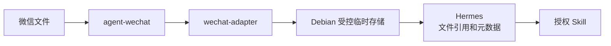
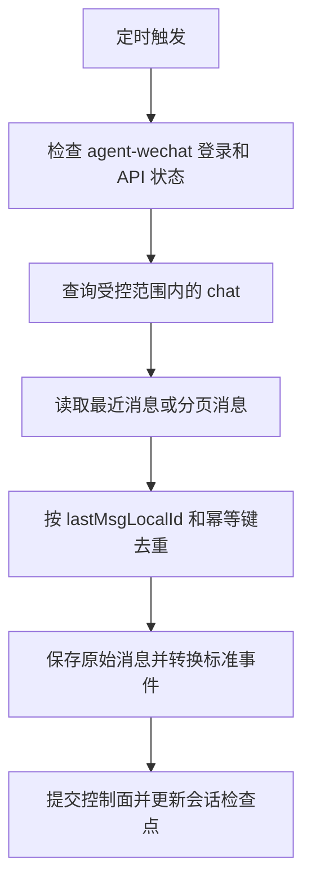

# wechat-adapter 设计

> 状态日期：2026-07-31。本文是未来 Adapter 的设计基线，不是实现说明。当前已完成 `agent-wechat` V1 微信入口验证；`wechat-adapter` 开发和 Hermes 接入均尚未完成。

## 设计定位

`wechat-adapter` 是 CF Gateway 逻辑边界中的微信入口适配组件。它封装 `agent-wechat` API，把微信原始消息转换为版本化标准事件，登记附件并通过 Debian 权威控制面与 Hermes 通信。总体关系见[微信入口与 Hermes 集成架构](../architecture/wechat-hermes-integration.md)。

V1 使用 Polling，不依赖尚未确认的 WebSocket 微信消息事件。Adapter 不承担意图理解、任务规划、Skill 选择或 ERP 业务逻辑。

## 设计原则

- 原始消息与标准事件分开保存，转换失败时仍可追踪原始输入。
- 先持久化、后派发；消息进入 Hermes 前必须经过来源、权限、任务和上下文控制。
- 事件协议版本化，新增字段优先保持向后兼容。
- 同步去重、任务幂等、业务操作幂等和结果回传幂等分别处理。
- 只使用上游实际提供的信息，不根据 `senderName`、文件名或消息正文猜测身份和权限。
- 文件通过受控引用流转，不把大文件内容或不受控本地路径放入事件。

## 1. 输入模型

Adapter 从 `agent-wechat` 读取原始消息。当前设计关注以下字段；字段的精确类型、空值规则和不同消息类型下的响应结构仍须在开发前基于实际 API 样本固化。

| 字段 | 用途 | 处理规则 |
| --- | --- | --- |
| `chatId` | 标识微信会话 | 原样保留为字符串语义；用于会话映射和回传，不能直接等同于 AI 线程 |
| `sender` | 标识微信发信人 | 原样保留；进入权限系统前只作为来源标识，不直接等同于企业员工身份 |
| `senderName` | 展示发信人名称 | 仅用于展示和辅助审计，不作为稳定键或授权依据 |
| `type` | `agent-wechat` 原始消息类型 | 保留原始值，再映射到统一消息类型；未知值不得强制映射为已知类型 |
| `content` | 文本、标题或上游提供的内容 | 按消息类型解释；在进入 Hermes 上下文前进行长度、格式和敏感信息边界检查 |
| `localId` | 微信侧本地消息标识 | 作为会话内同步检查点和去重键的核心部分；稳定性、排序和作用域仍需继续实测 |
| `reply` | 上游可获得的引用信息 | 仅提取实际存在的引用消息或引用文件信息；结构缺失时保持为空，不补造引用内容 |

除原始字段外，Adapter 可以从受控配置补充 `sourceAccount`、Adapter 接收时间和 Polling 批次标识。这些是采集元数据，不得冒充微信原始字段。

## 2. 标准事件模型

### 事件封装

统一入站事件名为 `message_received`。目标事件至少包含 `source`、`conversation`、`sender`、`message`、`attachments` 和 `context`，并携带协议版本、事件标识及采集时间。

以下 JSON 仅表示目标结构，不是已经运行的接口响应：

```json
{
  "schemaVersion": "1.0",
  "eventId": "wechat:<source-account>:<chat-id>:<local-id>",
  "eventType": "message_received",
  "receivedAt": "<adapter-received-at>",
  "source": {
    "platform": "wechat",
    "provider": "agent-wechat",
    "accountId": "<source-account>",
    "transport": "polling"
  },
  "conversation": {
    "id": "<chat-id>",
    "kind": "<PRIVATE_OR_GROUP_IF_CONFIRMED>"
  },
  "sender": {
    "id": "<sender>",
    "displayName": "<sender-name>",
    "enterpriseIdentityId": null
  },
  "message": {
    "id": "<local-id>",
    "type": "TEXT",
    "rawType": "<agent-wechat-type>",
    "content": "<message-content>"
  },
  "attachments": [],
  "context": {
    "reply": null,
    "forward": null
  }
}
```

### 字段语义

| 对象 | 必要内容 | 边界 |
| --- | --- | --- |
| `source` | 平台、上游组件、来源账号、采集方式 | 来源账号来自受控配置；不能只用 `chatId` 区分多个微信账号 |
| `conversation` | `chatId` 和已确认的私聊/群聊类型 | 会话类型无法可靠确定时不得猜测；应进入待补全或错误状态 |
| `sender` | `sender`、`senderName`、可选企业身份映射 | 企业身份由权限系统解析，Adapter 不自行授予权限 |
| `message` | `localId`、统一类型、原始类型、正文或外层标题 | 原始类型必须保留，便于升级映射和排障 |
| `attachments` | 文件引用、名称、类型、大小、哈希和获取状态中实际可得的字段 | 未获取成功时不得生成可用文件引用；未知元数据保持为空 |
| `context` | 可获得的引用关系、合并转发外层信息 | 不包含未被 `agent-wechat` 展开的合并转发内部记录 |

`eventId` 的建议组成是 `sourceAccount + chatId + localId`。该规则须在确认 `localId` 的稳定性和作用域后定稿；未经验证时不能仅用 `localId` 作为全局唯一键。

### 引用上下文

当 `reply` 中确实存在可读取信息时，`context.reply` 可记录被引用消息标识、类型、文本摘要或附件引用。缺少稳定被引用消息标识时，应保留“引用存在”和实际可得内容，同时标记关联未解析，不把相似文本自动关联为原消息。

合并转发消息只在 `context.forward` 记录当前已验证可获得的外层标题、发送人和原始类型。内部消息列表和内部文件保持未解析状态。

## 3. 消息类型

统一类型使用以下枚举：

| 类型 | 含义 | 当前状态 |
| --- | --- | --- |
| `TEXT` | 普通文本消息 | **已验证：** 私聊文本收发、群聊文本读取 |
| `IMAGE` | 图片消息 | **待技术验证** |
| `FILE` | 普通文件或群文件消息 | **已验证：** 文件消息读取，以及 TXT、ZIP、群文件和引用文件获取；其他格式与边界仍待验证 |
| `VIDEO` | 视频消息 | **待技术验证** |
| `VOICE` | 语音消息 | **待技术验证** |
| `REPLY` | 带引用关系的消息包装 | **已验证：** 引用消息和引用文件；具体字段完整性仍需按样本固化 |
| `FORWARD` | 合并转发消息包装 | **外层已验证：** 可识别类型、发送人和标题；内部聊天记录及文件未支持 |
| `SYSTEM` | 微信系统通知或会话状态消息 | **待技术验证** |

`REPLY` 和 `FORWARD` 表示消息结构，不应丢失其正文或附件。引用正文、引用文件和合并转发外层信息分别放入 `message`、`attachments` 和 `context`。无法映射的上游 `type` 应记录为不支持的原始消息并进入待分析状态，不能为了通过校验而误标为 `SYSTEM`。

## 4. 文件流程



该流程是目标设计。当前已验证的是 `agent-wechat` 文件消息读取和部分文件获取，Adapter 以后的环节尚未实现。

目标处理步骤：

1. Adapter 先持久化原始文件消息及来源账号、`chatId`、`sender` 和 `localId`。
2. Adapter 调用 `agent-wechat` 获取文件，使用受控生成的内部名称写入 Debian 临时区。
3. File Service 或规划中的受控文件处理环节登记原文件名、大小、媒体类型、哈希、获取状态和来源关联。
4. 标准事件的 `attachments` 只携带不透明文件引用和已确认元数据，不携带文件二进制内容或任意主机路径。
5. 控制面在权限检查和任务批次收口后，将文件引用放入 Hermes 的上下文快照。
6. Hermes 只能把获授权的文件引用交给相应 Skill；Skill 输出重新登记后才能回传或归档。

文件获取失败时，消息事件仍应保留，附件状态标记为失败。依赖该文件的任务不得在缺失输入的情况下继续执行或伪造成功。ZIP 文件入口已验证不等于自动解压、安全检查或内部内容处理已经完成。

## 5. V1 消息同步：Polling 模式

### 基本流程



V1 计划按以下规则实现：

1. 定时查询配置允许或控制面授权的会话，不默认扫描并处理全部联系人和群。
2. 每个 `sourceAccount + chatId` 独立维护 `lastMsgLocalId`，不得使用跨会话的全局游标。
3. 获取检查点之后的新增消息；如果 API 只能返回最近窗口，则保留重叠读取窗口并依靠幂等键过滤重复消息。
4. 先保存原始消息，再转换并持久化 `message_received` 事件。
5. 原始消息和标准事件持久化成功后更新同步检查点；Hermes 是否执行成功由任务状态负责，不阻塞消息游标。
6. 将标准事件交给上下文和任务控制面，不从轮询循环直接执行 Skill。

轮询间隔、API 分页参数、消息排序规则、历史保留窗口和 `localId` 是否单调递增尚需结合 `agent-wechat` API 实测确定。若 `localId` 是不透明标识，Adapter 只能按 API 返回顺序维护检查点，不得进行字符串或数值大小猜测。

### 去重与检查点

- 建议消息幂等键为 `sourceAccount + chatId + localId`，并在持久化层设置唯一约束；最终规则取决于 `localId` 稳定性验证。
- `lastMsgLocalId` 用于减少重复读取，持久化唯一键用于防止重复入库，两者不能互相替代。
- 文件下载重试复用同一消息和附件记录，不重新创建业务任务。
- Adapter 重启后从已提交检查点继续；若上游保留窗口不足以覆盖中断期，记录同步缺口并转人工核对，不能宣称已经自动恢复全部消息。
- 新会话首次接入时必须显式选择“从当前开始”或“从指定历史范围补录”，避免无意处理全部历史消息。

## 6. V2 消息同步：Event 模式

`/api/ws/events` 当前可以建立连接，但尚未确认会推送微信消息事件。因此 Event 模式属于后续研究，不是 V1 依赖项，也不能标记为已实现。

进入开发前至少验证：

- 是否实际推送私聊、群聊、文件、引用和合并转发消息。
- 事件载荷能否稳定提供 `chatId`、`sender`、`localId`、消息类型和附件关联。
- 鉴权、心跳、断线重连、订阅恢复和多账号隔离方式。
- 事件顺序、重复投递、丢失窗口和服务重启后的补偿能力。
- WebSocket 事件与 Polling API 中同一消息的标识是否一致。

V2 即使采用 Event 模式，也只替换“发现新消息”的触发方式。标准化、持久化、幂等、文件处理、权限、任务和审计边界保持不变。建议在验证完成后保留低频 Polling 对账能力，是否采用纯 Event 或 Event + Polling 补偿须由实测结果决定。

## 7. Hermes 通信边界

Adapter 不把原始微信响应直接拼接成 Hermes Prompt。目标通信顺序是：

1. Adapter 提交版本化 `message_received` 事件和附件引用。
2. Debian 控制面完成身份映射、权限校验、任务批次收口和上下文快照。
3. Worker Bridge 向 Hermes 提供 `traceId`、`taskId`、当前指令、上下文引用、附件引用、允许的 Skills 和权限约束。
4. Hermes 返回结构化任务结果，不直接调用微信 API。
5. 控制面生成回传指令，Adapter 再通过 `agent-wechat` 向原 `chatId` 发送结果。

任务协议、鉴权、超时、回传命令结构和 Worker Bridge 接口仍待后续详细设计与实现。

## 8. 错误处理

| 场景 | 目标处理 | 禁止行为 |
| --- | --- | --- |
| 微信离线或登录失效 | 暂停消息派发，记录入口不可用状态并告警；恢复后从持久化检查点补拉，超出保留窗口时标记同步缺口 | 静默跳过离线期间消息，或在未验证补拉结果时宣称无丢失 |
| `agent-wechat` API 失败 | 保留当前检查点，对可判定为暂时性的错误进行有上限的退避重试；持续失败转告警或人工处理 | API 未成功时推进检查点，或无限快速重试 |
| 文件获取失败 | 保留消息和附件失败状态，按同一附件记录重试；依赖文件的任务等待重试、澄清或转人工 | 用空文件继续执行，或重复创建新的业务任务 |
| 重复消息 | 通过来源账号、`chatId`、`localId` 的幂等键拦截重复事件，并返回已有处理记录 | 重复触发 Hermes、Skill 写操作或结果回传 |
| 消息类型不支持或转换失败 | 保存脱敏原始记录、错误分类和转换版本，隔离该消息并提供后续重放能力 | 把未知类型伪装成 `TEXT` 或 `SYSTEM` 后继续处理 |
| Hermes 或 Worker 不可用 | 事件和任务继续保存在 Debian，按任务状态等待恢复或转人工 | 让 Adapter 直接调用企业系统作为绕行方案 |
| 微信结果发送失败 | 保留待发送结果和发送尝试，按后续确定的策略有限重试或转人工 | 把任务处理完成等同于微信回传成功 |

错误日志不得包含微信登录数据、Cookie、访问令牌、完整敏感正文或真实业务附件。排障所需原始记录应受权限和保留周期控制。

## 状态与后续工作

| 项目 | 状态 |
| --- | --- |
| 微信入口验证 | **已完成** |
| `wechat-adapter` 代码 | **规划开发，尚未创建** |
| Polling API 参数和边界实测 | **规划验证** |
| 标准事件 Schema 固化 | **规划开发前评审** |
| Hermes / Worker Bridge 接入 | **规划接入** |
| WebSocket Event 模式 | **后续研究** |
| 合并转发内部解析 | **规划增强，尚未支持** |
