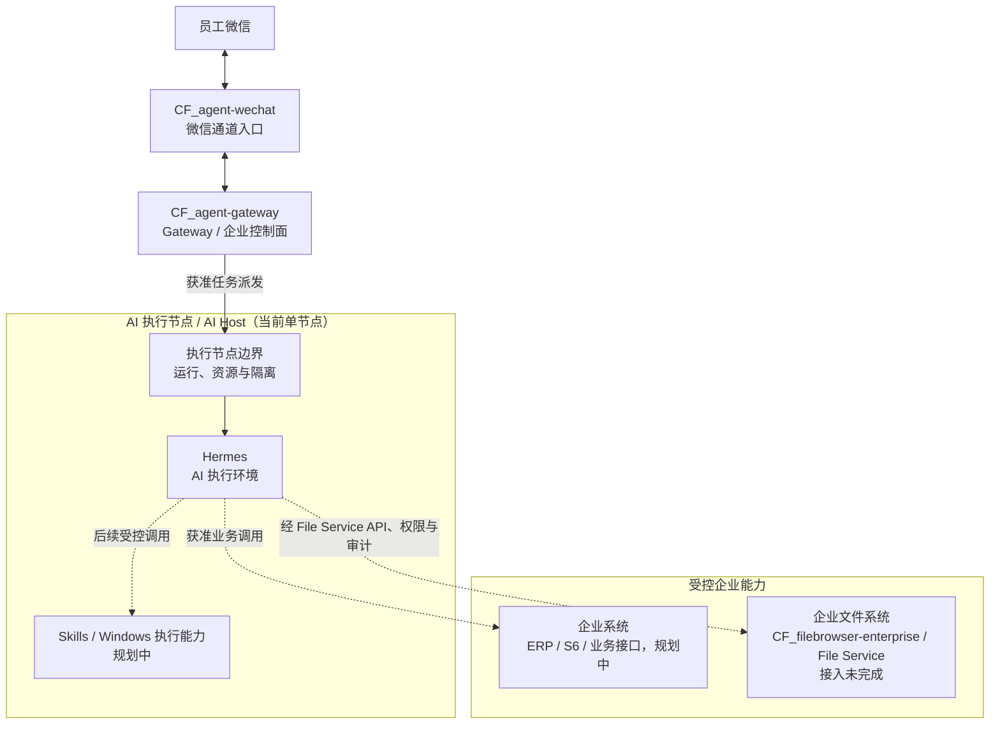

# 企业 AI 自动化系统整体架构

> 文档更新日期：2026-08-20
>
> 状态证据基线：2026-08-14
>
> 文档定位：系统级逻辑架构入口。图中的规划能力不代表已经部署、接入或验收；当前事实以[当前状态矩阵](../../status/current-status.md)为准。

## 统一逻辑架构

系统的稳定主链路是：员工从微信发起请求，经微信通道适配进入 Gateway；Gateway 完成消息接入、权限控制、任务分发和生命周期管理，再把获准任务派发到 AI 执行节点内的 Hermes；Hermes 后续在授权范围内调用 Skills、企业系统和企业文件服务。

实线只表示当前已验证授权文本链路中的主要关系；虚线表示后续受控接入，不能据此认定 Skills、企业系统或文件链路已经完成。AI 执行节点是部署与资源边界，Hermes 是其中的 AI 执行环境，两者不是两个相互独立的项目。

## 分层职责

| 层级 | 责任主体 | 稳定职责 | 当前边界 |
| --- | --- | --- | --- |
| 微信通道入口 | `CF_agent-wechat` | 维护微信登录与消息收发适配，把来源消息交给 Gateway | 文本入口与回复已验证；完整媒体收发未完成 |
| 企业控制面 | `CF_agent-gateway` | 消息入口、身份权限、上下文、任务分发和全生命周期状态管理 | 授权文本闭环已验证；媒体与完整恢复未完成 |
| AI 执行节点 | AI Host | 承载 Hermes、后续 Skills 和 Windows 侧执行能力 | 当前为单一 Windows AI 主机；多节点调度未实现 |
| AI 执行环境 | Hermes | 执行 Agent 与模型调用，管理 Hermes 配置档案并返回结果 | 文本执行已验证；可靠自启、媒体和 Skills 接入未完成 |
| 企业文件系统 | `CF_filebrowser-enterprise` | 提供唯一正式 File Service、文件权限与持久审计边界 | 角色已确定；Gateway/Hermes 端到端接入未完成 |
| 企业能力 | Skills、ERP、S6、业务接口 | 在获准身份、权限、确认和审计约束内执行确定性操作 | 规划中 |

四个核心组件的“负责 / 不负责”范围见[项目边界](./project-boundaries.md)。

## 核心数据流

### 消息与任务

1. `CF_agent-wechat` 读取员工微信消息并保留来源会话信息。
2. Gateway 先持久化消息，再执行身份映射、权限、真实 mention、上下文和路由判断。
3. 被拒绝的消息保留可追踪事实，但不调用 Hermes，也不产生机器人回复。
4. 获准消息形成可追踪任务和 Dispatch，再派发给当前 AI 执行节点中的 Hermes。

### AI 执行与结果

1. Hermes 按 Gateway 选择的外部配置档案执行当前任务。
2. Hermes 返回执行结果后，Gateway 先保存响应，再创建投递工作。
3. Gateway 经微信入口把结果送回原会话。
4. AI 执行、响应持久化和微信投递是独立生命周期状态，不能用一个“成功”代替整条链路。

### 文件与企业能力

1. 微信临时媒体先在 Gateway 边界形成受控 Attachment；当前只验证到图片发现、字节提取和完整性校验，持久化媒体桥尚未完成。
2. 需要长期归档或正式访问的文件，只能通过 `CF_filebrowser-enterprise` 的 File Service API、权限检查和持久审计处理。
3. Hermes 与 Skills 不得直接挂载、扫描或绕过正式文件存储。
4. ERP、S6 和其他业务系统只有在接口、权限、幂等、确认和回滚规则明确后才能接入。

## 当前完成边界

当前只可确认私聊和明确 `@` 机器人的 `group_sender` 群聊授权文本闭环已经实机验证。该结论不包含：

- `group_shared` 上下文。
- 被引用正文自动注入 Hermes。
- Attachment、Hermes 多模态、READY Artifact 和微信媒体回传。
- File Service、Skills 或企业系统端到端接入。
- Gateway 容器、数据库、CFserver 或 AI Host 的完整重启恢复。
- 多 AI 节点调度和故障切换。

状态分类见[V1 当前状态](../status/v1-current-status.md)，物理与目标部署关系见[生产部署拓扑](../deployment/production-topology.md)。

## 架构原则

1. **CFserver 保持权威：** 消息、身份、权限、任务、响应、文件引用、日志和审计状态不能由 AI 节点本地状态覆盖。
2. **Persist-first：** 员工消息先保存，再做准入和执行判断。
3. **控制与执行分离：** Gateway 决定是否执行及如何追踪，Hermes 负责实际 AI 执行。
4. **执行与投递分离：** Hermes 返回结果不等于员工已经收到结果。
5. **正式文件统一入口：** 文件访问必须经过 File Service、权限检查和审计，不建设第二套正式文件服务。
6. **规划不等于完成：** 单个服务存在、健康或局部验证，均不能外推为总架构已经完成。

## 相关文档

- [项目总纲](../../00_项目总纲.md)
- [系统设计](../../02_系统设计.md)
- [技术决策记录](../../05_技术决策记录.md)
- [项目边界](./project-boundaries.md)
- [V1 当前状态](../status/v1-current-status.md)
- [生产部署拓扑](../deployment/production-topology.md)
