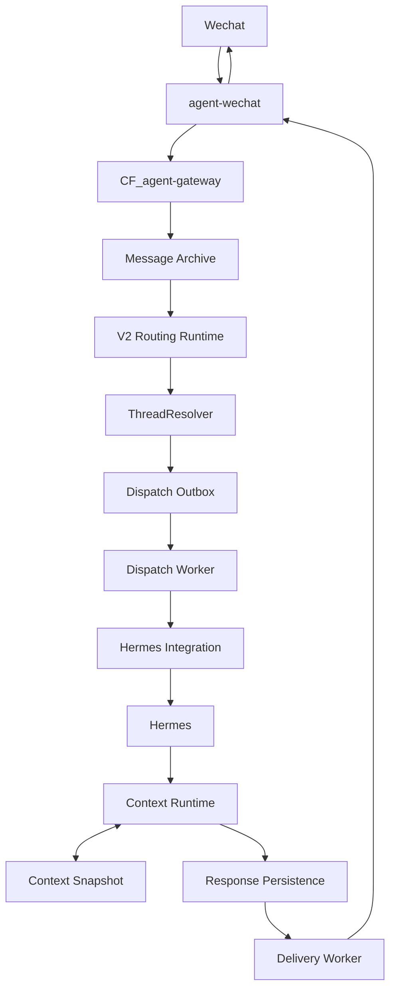

# CF_agent-gateway V2 Enterprise Runtime 架构总览

> [!WARNING]
> **文档状态：2026-08-11 V2 Enterprise Runtime 历史快照。**
> 本文保留该版本当日的架构与实现边界，不代表当前生产状态；正文中的“当前”“已发布”“已启用”等表述均按该版本和原 Staging 环境理解。当前生产事实以[当前状态矩阵](../../status/current-status.md)为准，正式系统架构以[System Architecture](../../architecture/system-architecture.md)为准。

> 适用版本：`v2-enterprise-runtime-20260811`
> 文档状态：与当前已发布版本一致
> 范围：运行时职责、数据流、权威边界与故障恢复原则

## 1. 文档目的

本文说明 `CF_agent-gateway` V2 Enterprise Runtime 的整体架构，供部署、运维和后续维护时确认组件职责与系统边界。本文只描述当前版本已经发布的能力，不定义新的 API 字段、数据库字段、队列实现或重试参数。

当前版本包含以下核心能力：

- Message Archive
- V2 Routing Runtime
- ThreadResolver
- Dispatch Outbox
- Dispatch Worker
- Hermes Integration
- Context Runtime
- Context Snapshot
- Response Persistence
- Delivery Worker
- Admin Archive API
- Docker/Systemd Deployment

## 2. 核心原则

### 2.1 职责分界

**Gateway 负责事实、权限和编排，Hermes 负责推理和工具选择。**

| 领域 | 责任组件 | 边界 |
| --- | --- | --- |
| 消息、上下文、任务、文件、权限、日志和审计事实 | `CF_agent-gateway` 及 Debian 控制中心 | 是系统权威来源，不由模型输出替代 |
| 企业身份 | Gateway 身份与权限域 | `enterprise_identity_id` 是内部身份主键 |
| 路由、线程归属、分发和投递状态 | Gateway Runtime | 由确定性的运行时编排管理 |
| 推理、回答生成、工具选择 | Hermes | 使用 Gateway 提供的已授权上下文和能力范围 |
| 微信协议收发与附件获取 | `agent-wechat` | 是渠道适配层，不是权限或业务事实权威 |
| 正式文件访问 | File Service | 必须经过权限检查和审计；Hermes 不得绕过 |

Hermes 的输出在经过 Gateway 的 `Response Persistence` 前只是执行结果，不自动成为可交付或可审计的系统事实。Hermes 也不得绕过 Gateway 的权限判断、人工确认要求或 File Service 直接访问正式文件。

### 2.2 权威性与派生数据

- Message Archive 保存消息事实，是后续路由、上下文重建和审计的依据。
- Timeline 表达按时间组织的事实记录；Context Snapshot 是由事实派生的上下文缓存，不是新的事实来源。
- 路由决定、线程关联、分发状态、响应记录和投递状态由 Gateway Runtime 管理。
- 渠道侧显示结果或模型内部状态不能反向覆盖 Gateway 中的权威事实。
- 生产运行不以 GitHub 持续在线为前提。

## 3. 总体架构

主链路按职责层表示如下：

```text
Wechat
  ↓
agent-wechat
  ↓
CF_agent-gateway
  ↓
Message Archive
  ↓
Routing Runtime
  ↓
ThreadResolver
  ↓
Dispatch Worker
  ↓
Hermes
  ↓
Context Runtime
  ↓
Response Delivery
```



图中的 `Response Delivery` 是响应持久化与渠道投递阶段的统称，当前由 `Response Persistence`、`Delivery Worker` 和 `agent-wechat` 的发送能力协作完成。`Context Runtime` 同时服务上下文读取、更新与 Snapshot 管理，因此它不是模型的长期记忆，也不意味着当前已经实现 Memory Runtime。

## 4. 模块职责

### 4.1 Wechat

- 用户交互渠道，承载消息输入和回复展示。
- 不保存 Gateway 的权限、路由、线程或任务权威状态。
- 渠道可达不等于业务处理成功，最终状态以 Gateway 中的持久化和投递记录为准。

### 4.2 agent-wechat

- 负责微信消息收发和附件获取。
- 将渠道事件交给 `CF_agent-gateway`，并执行 Gateway 下发的响应投递。
- 不负责企业权限判定、线程归属、模型推理或正式文件授权。
- 附件兼容范围以实际验证结果为准；附件获取不能绕过 File Service 的正式访问流程。

### 4.3 CF_agent-gateway

- 是 Debian 权威控制中心中的运行时入口和编排边界。
- 负责消息事实落库、身份与权限约束、路由、线程解析、任务分发、响应持久化、投递编排、日志和审计。
- 向 Hermes 提供已解析且已授权的执行上下文，不把权限决定交给模型自行推断。
- 当前版本的子组件包括 Message Archive、V2 Routing Runtime、ThreadResolver、Dispatch Outbox、Workers、Context Runtime、Response Persistence 与 Admin Archive API。

### 4.4 Message Archive

- 持久化 Gateway 接收到的消息事实，为路由、上下文、管理查询和审计提供依据。
- 将“收到消息”与后续“是否路由、是否执行、是否投递”分开记录，避免模型执行结果替代入口事实。
- 归档成功是继续编排的基础；归档失败时不应把未记录消息直接交给 Hermes。
- `Admin Archive API` 只读查询该事实层，不改变运行时状态。

### 4.5 V2 Routing Runtime

- 根据当前已配置的路由规则和 Gateway 持有的事实决定消息的处理方向。
- 将路由决定交给后续线程解析与分发阶段。
- 不承担模型推理，不允许 Hermes 反向改变既有权限边界。
- 路由无法完成时保留已归档消息，进入可诊断状态，而不是无记录地丢弃。

### 4.6 ThreadResolver

- 将已识别的企业身份和会话关系解析到 Gateway 管理的线程。
- 使用 `enterprise_identity_id` 作为内部身份关联的主键，不以微信昵称等易变渠道展示值替代内部身份。
- 维护渠道会话与内部线程的边界，避免不同身份或会话的上下文串联。
- 解析失败时不得构造未经确认的线程关系并继续分发。

### 4.7 Dispatch Outbox

- 承接 ThreadResolver 之后待分发给执行侧的工作，是 Gateway 与异步分发之间的持久化交接点。
- 使分发工作可以独立于入口请求生命周期被 Worker 获取和恢复。
- 保存的是 Gateway 编排状态，不是 Hermes 的记忆。
- 具体事务桥、重试次数和并发策略以当前实现为准，本文不新增实现承诺。

### 4.8 Dispatch Worker

- 获取待分发工作，检查其运行时状态，并通过 Hermes Integration 发起执行。
- 将已解析线程、当前上下文和授权边界带入执行流程。
- 负责执行侧编排，不负责替 Hermes 推理，也不允许绕过 Gateway 权限检查。
- Worker 停止不会改变已归档消息事实；恢复后依据 Gateway 已持久化状态继续处理或进入人工排障。

### 4.9 Hermes Integration 与 Hermes

`Hermes Integration` 是 Gateway 与 Hermes 的集成边界，负责在 Gateway 编排状态和 Hermes 执行之间传递请求与结果。本文不把当前集成描述为一个已经独立抽象的通用 remote transport。

Hermes 的职责是：

- 基于 Gateway 提供的当前线程上下文进行推理。
- 在允许的工具集合内选择工具并生成执行结果。
- 将结果返回 Gateway 管理的运行时链路。

Hermes 不负责：

- 决定或修改系统事实、企业身份和权限。
- 绕过人工确认或审计约束。
- 绕过 File Service 访问正式文件。
- 直接向 Wechat 投递未经 Gateway 持久化和编排的响应。

### 4.10 Context Runtime 与 Context Snapshot

- Context Runtime 管理当前线程执行所需的上下文，并在响应处理阶段维护相应的上下文状态。
- Context 只表示当前线程上下文；Timeline 表示事实记录；Snapshot 表示可重建的上下文缓存。
- Context Snapshot 用于降低重复构建上下文的成本，但不能覆盖 Message Archive 或 Timeline 中的事实。
- Snapshot 缺失或失效时，应以权威事实恢复，而不是将模型内部状态视为恢复来源。
- 当前能力不等同于长期 Memory；详细边界见 [Context Runtime](../context/context-runtime.md)。

### 4.11 Response Persistence

- 将 Hermes 返回并经 Gateway 运行时处理的响应记录为可审计、可投递的系统状态。
- 把“已生成响应”和“已成功送达渠道”分为两个阶段，便于识别生成失败与投递失败。
- 响应未完成持久化时，不应作为已成功交付处理。

### 4.12 Delivery Worker 与 Response Delivery

- Delivery Worker 获取待投递响应，并通过 `agent-wechat` 执行渠道发送。
- 记录或更新 Gateway 管理的投递结果，使运维人员能够区分待投递、已投递和失败状态。
- 投递失败不应重新触发 Hermes 推理；恢复以已持久化响应为基础。
- 渠道重试、并发和最终失败规则以当前实现和运维配置为准。

### 4.13 Admin Archive API

- 面向具备 `admin role` 的管理查询提供只读归档视图。
- 支持对 messages、timeline、threads 和 delivery 的受控查询。
- 不承担运行时写入、重放、修改权限或修改业务状态的职责。
- 详细范围见 [Admin API](../admin/admin-api.md)。

## 5. 端到端数据流

以下状态名称用于解释阶段，不代表数据库中的实际枚举值。

1. **渠道接收**：Wechat 消息由 `agent-wechat` 接收，附件由渠道适配层获取。
2. **消息归档**：消息进入 Gateway 后先写入 Message Archive，形成入口事实。
3. **路由判断**：V2 Routing Runtime 基于现有事实和规则确定处理方向。
4. **线程解析**：ThreadResolver 依据企业身份和会话关系确定内部线程。
5. **等待分发**：可执行工作进入 Dispatch Outbox，等待 Dispatch Worker 处理。
6. **执行编排**：Dispatch Worker 通过 Hermes Integration 向 Hermes 提供当前线程上下文和授权边界。
7. **推理执行**：Hermes 进行推理与工具选择，并把结果返回 Gateway 运行时。
8. **上下文处理**：Context Runtime 维护当前线程 Context，并按当前实现读取或更新 Context Snapshot。
9. **响应持久化**：Response Persistence 保存待交付响应及其运行时状态。
10. **渠道投递**：Delivery Worker 通过 `agent-wechat` 发送回复，并将投递结果留在 Gateway 的权威记录中。

管理查询通过 Admin Archive API 读取归档及关联状态，不参与上述写入主链路。

## 6. 失败与恢复边界

| 失败位置 | 保留的权威状态 | 恢复原则 |
| --- | --- | --- |
| `agent-wechat` 接入失败 | Gateway 只能确认已经实际接收到并归档的消息 | 先恢复渠道接入，再依据渠道与归档事实核对；不推测缺失消息 |
| Message Archive 写入失败 | 尚未形成可继续处理的入口事实 | 停止该消息后续编排，排除存储故障后按现有机制恢复 |
| Routing Runtime 或 ThreadResolver 失败 | 已归档消息仍然存在 | 修复规则、身份或会话问题后，从 Gateway 已持久化状态恢复 |
| Dispatch Worker 停止或 Hermes 调用失败 | 归档、线程和已持久化分发状态不受 Worker 进程生命周期影响 | 恢复 Worker 或 Hermes 连接；根据现有状态处理，避免凭空创建重复任务 |
| Context Snapshot 异常 | Message Archive、Timeline 等事实仍为权威来源 | Snapshot 作为缓存处理，可依据事实重建；不得用损坏缓存覆盖事实 |
| Response Persistence 失败 | Hermes 结果尚未成为可交付的持久化响应 | 修复持久化问题，不将该响应标记为已送达 |
| Delivery Worker 停止或渠道投递失败 | 已持久化响应及投递状态仍由 Gateway 管理 | 恢复投递链路，基于原响应处理；不要重新进行模型推理 |
| 数据库异常 | 依赖数据库的事实与编排能力不可可靠运行 | 优先恢复数据库并确认 migration 状态，再按部署顺序恢复 Gateway 与 Workers |

恢复操作、健康检查、日志与 heartbeat 检查见 [Runtime 运维](../operations/runtime-operations.md)。本文不规定未经实现验证的自动重试次数、超时值或幂等键。

## 7. 安全与权限边界

- 所有执行从已解析的 `enterprise_identity_id` 和当前权限上下文出发。
- 路由到 Hermes 不代表获得额外权限；工具执行仍受 Gateway 的权限和确认规则约束。
- 正式文件访问必须通过 File Service 完成权限检查与审计，渠道附件获取不替代该规则。
- Admin Archive API 是只读管理面，且仅限 `admin role`。
- 日志和审计记录属于 Debian 权威控制中心，不以 Hermes 的对话描述作为审计依据。
- 不得在日志、文档或配置示例中写入密钥、Cookie、访问令牌、微信登录数据或真实业务文件。

## 8. 当前状态与文档边界

本文适用于已发布版本 `v2-enterprise-runtime-20260811`，只确认第 1 节列出的能力。以下内容不应从本文推断：

- 未公开的 API 路径、请求字段或数据库结构。
- 特定消息中间件、队列协议或 outbox 表结构。
- 固定的重试次数、超时、并发、锁或幂等实现。
- Context Runtime 已经等同于 RAG、向量检索或长期 Memory。
- Hermes Integration 已经成为独立通用的 remote transport。

当前限制统一记录在 [当前限制](../status/current-limitations.md)，部署拓扑见 [Staging Debian 部署](../deployment/staging-debian.md)。当运行时边界发生变化时，应先更新根目录的 [技术决策记录](../../05_技术决策记录.md)，再同步本文。

## 9. 维护检查点

变更或排障时至少确认：

- 入口消息是否已经归档，且没有绕过 Message Archive 进入推理。
- `enterprise_identity_id`、会话与内部线程是否保持正确关联。
- 路由、Dispatch Outbox、Worker 与投递状态是否能按同一条消息追踪。
- Hermes 是否只获得已授权上下文与工具范围。
- 响应是否先持久化，再由 Delivery Worker 投递。
- Snapshot 是否仅作为缓存，事实是否仍可从权威记录恢复。
- 文件访问是否经过 File Service、权限检查和审计。
