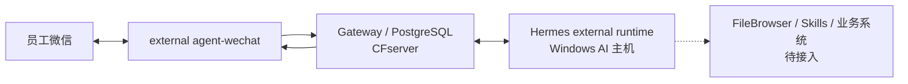

# 生产部署拓扑

> Compatibility entry，状态日期：2026-09-03
>
> 当前完整拓扑以[System Architecture](../../architecture/system-architecture.md)为准，操作以[Deployment Guide](../../deployment/deployment-guide.md)为准。

- Gateway V2/P1 与文本链已生产交付。
- agent-wechat Host/container/Runtime restart 后需要 fresh QR。
- Gateway-only deployment 与单独 AI host reboot 不需要重启微信 Session。
- FileBrowser、Skills、OCR、旺店通和 S6 不在当前生产实线。

分层状态见[当前状态矩阵](../../status/current-status.md)。
