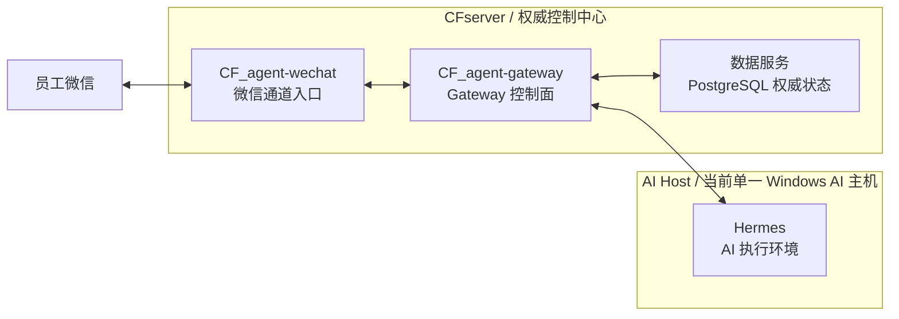
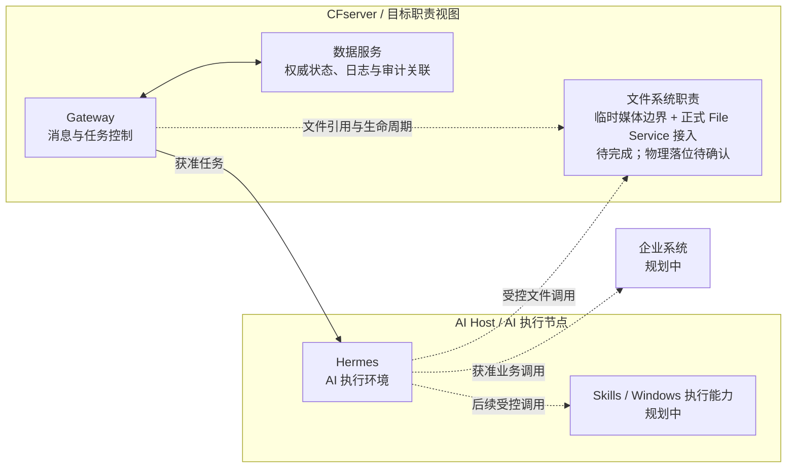
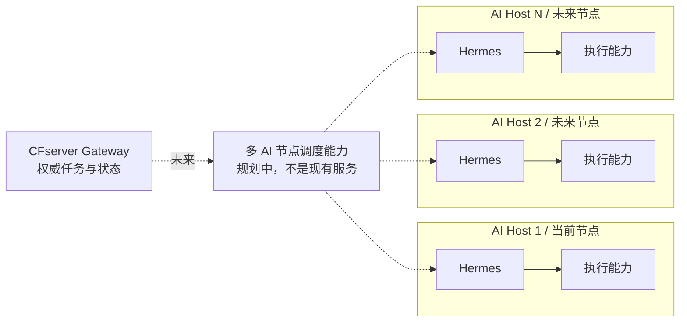

# 生产部署拓扑

> 文档更新日期：2026-08-20
>
> 状态证据基线：2026-08-14
>
> 文档定位：系统级部署摘要。本文严格区分“当前部署事实”“目标职责视图”和“未来多节点规划”，目标图不能作为已部署或已验收证明。

## 阅读口径

- **当前部署事实：** 只采用本仓库已有状态与实机记录。
- **目标职责视图：** 描述 CFserver、AI Host 最终应承担的能力边界；标为待完成的节点不代表已落位。
- **未来规划：** 多 AI 节点调度尚未设计、实现或验证。
- 正式 File Service 的职责已经确定，但其物理主机位置没有在本仓库形成新决定；不得据目标图声称它已部署到 CFserver。

## 当前部署事实

本图只放置当前已有部署证据的范围。CFserver 到 Hermes 的连线只表示限定范围内的授权文本 Dispatch/Response 已验证；Skills、文件系统目标职责和企业系统统一放在后续目标图中。

### CFserver 当前范围

| 能力域 | 当前职责 | 当前状态 |
| --- | --- | --- |
| 微信入口 | 承载 `CF_agent-wechat` 的微信登录、读取和回复适配 | 文本入口与回复已验证；完整媒体收发未完成 |
| Gateway | 承载消息入口、身份权限、上下文、路由、任务分发、响应和投递生命周期 | 授权文本闭环已验证；媒体与完整恢复未完成 |
| 数据服务 | 以 PostgreSQL 保存 Gateway 的消息、Checkpoint、身份、线程、路由、响应和投递权威状态 | 已部署；PostgreSQL 重启恢复尚未验收 |

### AI Host 当前范围

| 能力域 | 当前职责 | 当前状态 |
| --- | --- | --- |
| Hermes | 接收 Gateway 的获准 Dispatch，执行 Agent 与模型调用并返回结果 | 授权文本执行已验证；可靠自启、守护、告警、媒体和完整主机恢复未完成 |

## CFserver 目标职责视图

CFserver 的系统级目标职责可概括为 Gateway、文件系统和数据服务。以下是职责映射，不是当前完成状态：

文件系统职责包含两类不同边界：

1. **Gateway 私有媒体边界：** 用于聊天 Attachment/Artifact 的短期、受控中转，当前未完成，不能替代企业文件系统。
2. **正式企业 File Service：** 由 `CF_filebrowser-enterprise` 提供，正式文件访问必须经过权限检查和持久审计；当前端到端接入和物理部署位置均不能从本图推定。

如果后续正式决定把 File Service 固定物理部署到 CFserver，必须先更新[技术决策记录](../../05_技术决策记录.md)，再把本节改为当前部署事实。

## 未来多 AI 节点调度

当前只有一个 AI Host。未来拓扑是在 CFserver 权威控制面不变的前提下，把获准任务调度到多个相互隔离的 AI 执行节点：

多节点阶段至少需要另行定义节点身份、能力声明、健康状态、容量选择、任务亲和性、幂等、故障切换、离线恢复和审计。当前没有调度器完成证据，任何一个未来节点也不得以本地状态覆盖 CFserver 权威记录。

## 已确认与未确认边界

### 已确认

- CFserver 是消息、身份、权限、任务、响应、投递、日志和审计关联的权威控制中心。
- 当前 Gateway 数据服务和单一 AI Host 的授权文本链路已在限定范围内验证。
- AI Host 承载 Hermes，并作为后续 Skills 与 Windows 执行能力的运行边界。
- 正式企业文件访问只能经过 File Service、权限检查和审计。

### 未确认或未完成

- Gateway 私有媒体存储、Attachment/Artifact 和微信媒体投递。
- 正式 File Service 的物理部署位置及 Gateway/Hermes 端到端接入。
- Hermes 自启、守护、告警和 AI Host 重启自动恢复。
- Gateway 容器 recreate、PostgreSQL 重启和 CFserver 整机重启恢复。
- Skills、企业系统和多 AI 节点调度。

## 运维边界

- 本仓库不记录真实 IP、凭证、主机账户、Cookie、数据库密码或本地绝对路径。
- 生产运行不得持续依赖 GitHub 在线。
- AI 执行、响应持久化、Artifact READY 和微信投递必须分别观察和验收。
- 具体健康检查、备份与排障顺序见[部署运维](../../04_部署运维.md)。

## 相关文档

- [整体架构](../architecture/overall-architecture.md)
- [项目边界](../architecture/project-boundaries.md)
- [V1 当前状态](../status/v1-current-status.md)
- [当前状态矩阵](../../status/current-status.md)
