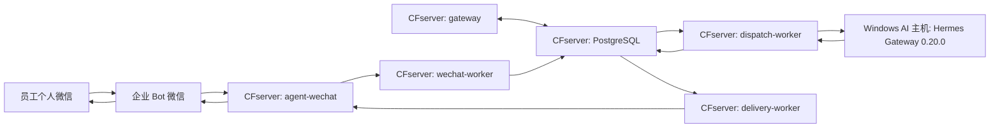

# 微信运行时阶段收口记录

> 日期：2026-08-13。本文面向项目管理与后续接手人员，仅记录跨仓库生产状态和验证边界，不复制各项目的底层部署命令。所有账号、地址、凭证与消息内容均使用脱敏描述。

## 当天完成

- 在 CFserver 收口 `CF_agent-wechat` 生产 Compose，使用 `docker/compose.cfserver.yaml`。
- 确认 `agent-wechat` 容器内部运行 Xvfb、fluxbox、dunst、WeChat 与 `agent-server`，并以 `ENABLE_VNC=0` 运行。
- 确认生产环境不使用 VNC、noVNC、x11vnc、websockify 或宿主桌面 X11。
- 登录管理脚本和手机确认登录已在实机通过；完全新设备经 SSH 展示二维码并扫码的场景尚未实机验证。
- 在 CFserver 启用 PostgreSQL、`gateway`、`wechat-worker`、`dispatch-worker` 与 `delivery-worker`，五个服务均保持 healthy。
- 验证 Gateway 与 `agent-wechat` 通过 `cf-internal` 容器网络通信，并验证 Token 鉴权。
- 验证微信常驻轮询周期为 3 秒，已为 17 个现有聊天建立 Checkpoint，并以 `bootstrap_mode=latest` 将 151 条历史消息作为基线安全跳过。
- 验证第一条新的私聊身份发现消息进入 Message Store，发送者与会话识别正确，Checkpoint 随后推进。
- 验证未配置企业身份与访问策略的账号被 Admission 安全拒绝，未调用 Hermes，未生成机器人回复。
- 恢复 Windows AI 主机上的 Hermes Gateway 0.20.0，并验证 CFserver 与 `dispatch-worker` 均可访问。

## 当前生产拓扑

CFserver 是消息、Checkpoint、身份、权限、路由、响应与投递状态的权威控制中心。Windows AI 主机承载 Hermes 执行层；它的本地状态不得覆盖 CFserver 权威状态。正式文件能力后续经 `CF_filebrowser-enterprise` 接入。

## 入口与登录管理

`CF_agent-wechat` 只负责微信登录态、消息读取、消息发送及向 Gateway 提供接口。日常登录由项目仓库中的登录管理脚本处理，生产不暴露浏览器远程桌面。登录操作细节以 [`CF_agent-wechat/docs/login-management.md`](https://github.com/Tangbohu09527/CF_agent-wechat/blob/main/docs/login-management.md) 为准。

## Gateway 运行结果

首次启用选择 `bootstrap_mode=latest`，先为 17 个现有聊天建立高水位，再跳过 151 条既有历史消息，避免历史消息被重新解释为新任务。随后出现的新私聊消息按 Persist-first 原则先进入 Message Store，再执行身份映射与 Admission；本次因身份与策略尚未配置而安全拒绝。

这条拒绝路径证明了以下边界：

- 新消息可以被持续发现、持久化和推进 Checkpoint。
- 未授权消息仍保留为受控企业消息历史。
- Admission 拒绝时不会调用 Hermes。
- 拒绝路径不会创建 AI 响应、Delivery Outbox 项或微信机器人回复。

## Hermes 状态

Hermes Gateway 0.20.0 运行在 Windows AI 主机。CFserver 与 `dispatch-worker` 到 Hermes 的网络连通已经验证。Windows 登录启动项已经存在，但 AI 主机重启后 Hermes Gateway 没有可靠自动启动；人工启动后恢复。因此“网络可达”已验证，“开机自启可靠”仍未收口。

## 当前阻塞项

- 测试发送者尚无 Enterprise Identity。
- Source Identity Mapping 尚未建立。
- User Access Policy 与 Gateway Access Policy 尚未配置。
- Agent Profile 尚未创建，私聊 Conversation-AgentProfile 尚未绑定。
- 因 Admission 尚未 Allowed，V2 Routing、Hermes 实际处理、Response Persistence、Delivery Outbox 与微信回复均未验证。
- 完全新设备 SSH 二维码扫码、群聊 `@` 机器人、图片、文件与引用消息尚待生产实测。
- Hermes Gateway 开机自启可靠性尚待收口。

## 下一阶段顺序

下一阶段严格按[当前状态矩阵](./current-status.md#下一阶段顺序)中的 18 步执行。不得跳过身份、策略和 Agent Profile 配置直接测试 AI；不得在第 13 步完成前宣称授权后的完整 AI 回复闭环已验证。

## 阶段结论

> 微信消息发现、持久化、Checkpoint、未授权拒绝和 Hermes 网络连通已实机验证；授权后的完整 AI 回复闭环仍待验证。
