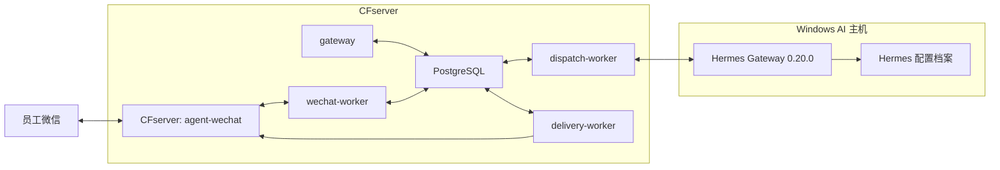

# 私聊、群聊及媒体验证记录

> 日期：2026-08-14。本文面向项目管理和后续开发，记录跨项目生产事实、证据边界和交接顺序；不包含真实账号、会话、消息、地址、凭证、文件摘要或底层数据库操作。

## 阶段变化

2026-08-13 的入口、Checkpoint、历史基线和未授权拒绝验证之后，本轮完成测试身份、权限、Profile 引用、私聊与群聊允许路径的实机验证，并开始验证引用与图片来源能力。

当前阶段结论：

> 私聊和 group_sender 群聊的授权文本闭环已实机验证；媒体链路、引用上下文注入和完整宿主恢复仍待完成。

## 当前生产拓扑

Gateway 与 `agent-wechat` 继续使用 `cf-internal` 容器网络。PostgreSQL 是消息、身份、权限、Workspace、AI Thread、路由、响应和投递的权威状态源；Hermes 负责 Agent 执行及其配置档案。

## 私聊授权文本闭环

已实际完成：

1. 员工私聊消息由 `agent-wechat` 读取并进入 Message Store。
2. Source Identity Mapping、User Policy 与 Gateway Policy 得出 Admission Allowed。
3. `private_sender` 路由解析 Employee Workspace、AI Thread 与 Agent Profile 外部引用。
4. `dispatch-worker` 调用 Hermes，Hermes 返回文本响应。
5. Gateway 保存 Response，创建 Delivery Outbox。
6. `delivery-worker` 通过 `agent-wechat` 把回复投递到原私聊。
7. Bot 回复未重新触发 AI。

CFserver Gateway 应用服务 restart 后，持久化状态恢复，并继续复用原 AI Thread 和 Hermes 会话上下文。

## 群聊 group_sender 闭环

已实际完成：

- 普通群消息没有真正 `@` 当前机器人时仍进入 Message Store，但以 `bot_not_mentioned` 结束，不调用 Hermes。
- 真正 `@` 当前机器人时 Admission Allowed，按 Group Type 选择 `group_sender`。
- 同一员工复用 Employee Workspace。
- 私聊和群聊使用独立 AI Thread 与 Hermes Thread。
- 同一发送者在同一群中继续复用原 `group_sender` 上下文。
- 群聊响应经 Response Persistence 和 Delivery Outbox 实际送达微信。
- 群聊 Bot 回复不回环。

`group_shared` 没有实机证据，不能因为实现或设计存在而标记完成。

## Hermes 配置档案与线程

Hermes 配置档案由 Hermes 自身创建和管理，每个档案拥有独立配置、技能和 `SOUL.md`。Gateway 不自动创建配置档案，只保存 Agent Profile 的 `external_profile_ref` 并在路由时选择。

Hermes 配置档案决定 AI 人格与能力；Thread Policy 决定上下文由谁共享。当前测试私聊和 AI 群都引用 `default`，但 AI Thread 和 Hermes Thread 保持隔离。

## 引用消息

已验证：

- 微信引用消息识别。
- `reply_context` 持久化。
- 引用类型消息的文本回复闭环。
- 群聊引用但没有真正 `@` 时按 `bot_not_mentioned` 安全拒绝。

尚未实现：把被引用内容自动注入 Hermes 请求。因此，本轮只证明引用类型消息可以走文本链路，不证明 Hermes 已自动理解引用内容。

## 图片发现与提取

已验证：

- 微信图片消息识别为 `image/raw_type=3`。
- Message Store 与 Raw Payload 保存来源事实。
- `agent-wechat` media API 返回真实 JPEG 字节。
- 文件签名、大小和 SHA-256 完整性校验通过。
- 群聊图片未真正 `@` 时没有误触发 Hermes。

当前准确结论：

> 微信图片可被读取和提取，媒体 AI 完整链路未接入。

尚未完成 Attachment 元数据、Gateway 私有存储、Hermes 媒体上传或引用、多模态理解、Artifact 下载与物化，以及图片/文件回传微信。

## Hermes 故障与受控恢复

Windows 登录启动项存在，但 Hermes Gateway 进程仍可能没有运行。已观察到：

- CFserver 到 Hermes 服务端口 8642 连接超时。
- Gateway Dispatch 进入 `uncertain`。
- 微信消息已经进入系统，但没有 AI 回复。
- 人工启动 Hermes Gateway 后健康恢复。

本轮完成过一次受控人工恢复：先备份，核对 Gateway 与 Hermes 侧证据，再使用 Guard 约束重试，原 Dispatch 第二次执行成功。该处理不能沉淀为人工直接改数据库的常规方式；需要正式管理命令/API、健康监控、守护和告警。

## 恢复边界

| 恢复层级 | 当前结论 |
| --- | --- |
| CFserver Gateway 应用服务 restart | 已验证；未 recreate 容器、未重启 PostgreSQL 或宿主，持久化恢复、AI Thread 与 Hermes 上下文复用 |
| Gateway 容器 recreate | 未验证 |
| PostgreSQL 重启 | 未验证 |
| CFserver 整机重启 | 未验证 |
| AI 主机重启与 Hermes 自动恢复 | 未验证 |

## 当前未完成范围

- Hermes 开机自启、守护、告警和正式 `uncertain` 管理。
- `reply_context` 内容注入 Hermes。
- 入站 Attachment、私有媒体存储与生命周期。
- Hermes 入站媒体协议与多模态理解。
- 出站 Artifact 下载、原子物化、`READY` 与媒体投递。
- 图片和文件收发实机验证。
- 完全新设备扫码和四个更高恢复层级。
- `group_shared`、FileBrowser、Skills、旺店通/S6 和正式授权推广。

## 下一阶段顺序

1. 收口 Hermes Gateway 开机自启、守护和告警。
2. 建设 `uncertain` Dispatch 正式管理与恢复命令/API。
3. 将 `reply_context` 注入 Hermes 请求。
4. 建设微信入站 Attachment 和私有媒体存储。
5. 定义并实现 Hermes 入站媒体上传/引用协议。
6. 实现 Hermes 出站 Artifact 下载和物化。
7. 实机验证微信图片发送。
8. 实机验证微信文件收发。
9. 实机验证完全新设备 SSH 二维码登录。
10. 验证 Gateway 容器强制重建恢复。
11. 验证 PostgreSQL 重启恢复。
12. 验证 CFserver 整机重启恢复。
13. 验证 AI 主机重启和 Hermes 自动恢复。
14. 验证 `group_shared` 策略。
15. 接入 FileBrowser 企业文件中心。
16. 建设 Skills Runtime。
17. 接入旺店通/S6 业务流程。
18. 分批授权正式员工和业务群。
