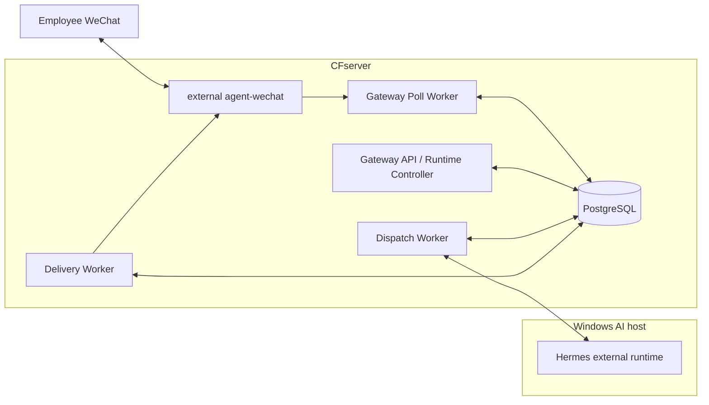

# Enterprise Runtime Production Closeout

> Evidence date: 2026-09-03
>
> Status: production closeout record for the enterprise message and AI text runtime
>
> Scope: system-level evidence summary only; no production account, message, credential, endpoint, database content or business data is included

## Purpose

This record closes the evidence gap between the August documentation baseline and the production Runtime delivered on 2026-09-03. It distinguishes repository implementation, automated validation, GitHub Actions, deployment and real production acceptance.

It does not declare the complete ecommerce automation program finished. File Service deployment, Skills and business-system integration remain pending.

## Component Git baselines

| Component | Git state on 2026-09-03 | Authority boundary |
| --- | --- | --- |
| `CF_agent-gateway` | `main`=`b488cf452584e73bc9b752564bf90ea153aa8d18`; Gateway PR #7 merged | Current Git authority; production-validated source commit is `f36c798294368263433f6132366ac9a864d9482b` |
| `CF_agent-wechat` | `main`=`92393bc2ae1d89dae9449fc131413979aa2fa2f2`; PR #1 head=`9cb7163cb226b4eed2581e11ff298e41f96226b6`; PR #4 head=`dc103c855e965524aa54325ce9c878321e3b1f3f`; both OPEN | forced-QR R2 behavior is production validated, but the implementation is not yet promoted to `main` |
| `CF_filebrowser-enterprise` | `main`=`4750a97cfdf5bd067e04b6b36bf9616f5ada836d`; `feat/v1-integration`=`48380c3f31cb37b01d0c05b8db0cfa49680a17f9` | V1 Beta implementation line; no production deployment authority |
| `CF_ecommerce-automation-docs` | start `main`=`c75a5b097da9687140289fba0f718ad2281e8710`; PR #7 start head=`aeac5f8905de35eca5398a8182dfce28b8a6210b` | Documentation closeout only |

Companion documentation work was OPEN at evidence time: Gateway PR #8 and WeChat PR #5. Neither is treated as merged component authority.

## Gateway production Release

| Field | Value |
| --- | --- |
| Git authority | `MERGED_MAIN_SHA` |
| Main SHA | `b488cf452584e73bc9b752564bf90ea153aa8d18` |
| Production-validated code SHA | `f36c798294368263433f6132366ac9a864d9482b` |
| Release label | `p1-observability-main-b488cf452584-20260903` |
| Image tag | `cf-agent-gateway:p1-observability-main-b488cf452584-20260903` |
| Image digest | `sha256:b9341ca7df6f952b4d81028c497574c1e22478e4408f98791a28bd9514b215f1` |
| Database revision | `20260823_04` |
| Runtime Controller | `/opt/cf-agent-gateway/deploy/wechat-runtime-control` |
| Long-running application identity | `10001:10001` |

No new P1 Git tag was created. Historical tag `v2-enterprise-runtime-20260901` remains a historical V2 baseline and is not the current P1 Git authority.

## Runtime topology

Final observed status: PostgreSQL, Gateway, Poll Worker, Dispatch Worker, Delivery Worker and agent-wechat healthy; Controller `ready=true`; `token_contract_valid=true`; outstanding queue work `0`; production online.

## Private and group text acceptance

- Private text completed the full WeChat -> agent-wechat -> Poll -> Message Store -> Admission -> Dispatch -> Hermes -> Response -> Delivery -> WeChat reply chain.
- A real structured group mention entered the allowed chain and produced an actual reply.
- An ordinary group message without a structured mention did not call AI.
- Bot self replies were skipped and did not create a reply loop.

### Thread-policy evidence boundary

Gateway `main` contains two paths:

- the V1 compatibility key is source account plus physical conversation and ignores the sender for group thread identity;
- the V2 `ThreadResolver` key includes sender identity for `group_sender`, with automated tests proving different senders in one group receive different V2 threads.

The deployed Runtime is the V2 code line. Production evidence proves a mentioned group text round trip, but the supplied evidence does not contain a dedicated two-sender, same-group isolation comparison. Therefore `group_sender` is classified as repository implemented, automated-test passed and deployed, while the multi-sender isolation behavior remains not separately production validated.

## Checkpoint and live-suffix acceptance

The production validation covered:

- Local ID fallback after forced QR;
- Checkpoint generation;
- historical-prefix skip;
- live suffix processed once;
- normal private forward progress;
- empty-window live suffix;
- self reply skip;
- no duplicate reply;
- queue and business-chain consistency.

Dynamic Message, Checkpoint and queue row counts belong only to dated evidence and are not maintained as current-status facts.

## forced-QR acceptance

The observed R2 production contract includes:

- Compose project and container `cf-agent-wechat`;
- `restart: "no"`;
- API port 6174 bound to loopback only;
- external `cf-internal` network with alias `cf-agent-wechat`;
- `ENABLE_VNC=0` and no VNC/noVNC/x11vnc/websockify path;
- agent-wechat log policy `json-file`, `20m x 3`;
- read-only Token mount;
- fresh QR after Host, container or Runtime restart.

The observed agent-wechat Image ID was `sha256:7ee0309980b7d03b747b40c6c04cbaeafe2d8fc01fc9429810cbc7571ebbf720`. This record does not bind that Image ID to an exact source SHA because a complete build mapping was not supplied.

## CFserver reboot acceptance

Observed after a real CFserver reboot:

- Docker recovered automatically and storage mounted normally.
- Gateway core and PostgreSQL recovered.
- agent-wechat remained stopped because `restart: "no"`.
- the previous WeChat Session did not recover automatically.
- Poll and Delivery Workers were observed running/healthy before the operator closed the Gate.
- the operator explicitly stopped the Gateway Gate, performed fresh QR, verified auth/chats/messages, then restored the Workers.

Consequently, automatic boot stop gate is not validated. The safe Host reboot flow is: inspect status, explicitly stop the Gate, run the approved forced-QR entry, verify the WeChat APIs, then restore the Workers. An Archive is evidence, not an active Session restore source.

## AI host reboot acceptance

The CFserver and agent-wechat did not restart. The WeChat Session remained valid and no fresh QR was required. Hermes TCP reachability recovered, the Controller returned ready, and the queue remained empty.

This proves one real reachability recovery. It does not prove that the Hermes watchdog, all startup faults, long-term alerting, monitoring, capacity or high availability are complete.

## Gateway-only cutover acceptance

Multiple controlled Gateway cutovers did not recreate the agent-wechat container and preserved the authenticated WeChat Session. A Gateway-only deployment does not require fresh QR.

This result must not be extrapolated to an agent-wechat container/Runtime restart, which still requires fresh QR.

## Context and Admin recovery classification

- Context Timeline, authorized reads, snapshots, search and Hermes context tools are implemented on Gateway main and covered by automated tests/green main CI. Their full production behavior was not separately exercised in this evidence run.
- Admin inspection and audited `retry-approved`, `mark-dead` and evidence-backed `confirm-success` exist on Gateway main and are tested. One controlled production recovery with evidence review and a Guard succeeded; the supplied evidence does not prove that every Admin recovery action was production-exercised.

## P1 observability acceptance

Gateway uses Docker `json-file` logging with `max-size=64m` and `max-file=10`. This policy is Gateway-specific and must not be copied to agent-wechat.

Observed with a real old Checkpoint at startup:

- one continuity WARNING;
- one failed Chat INFO summary;
- one failed Cycle INFO summary.

Steady-state observation reported zero duplicate continuity signatures, repeated target WARNINGs, repeated failed Chat INFO, routine idle/history Chat INFO, routine Cycle INFO, poll-cycle-start INFO, routine httpx/httpcore/Alembic INFO, ERRORs and violations.

The dated capacity model was 517,295,964 bytes over seven days, about 70.48 MiB/day, with an estimated 8.17 days against a 576 MiB safety budget. Per-service configured maximum is 640 MiB; six Compose services have a theoretical maximum of 3.75 GiB. These calculations belong to Gateway only.

## Database and queue safety result

- database revision matched `20260823_04`;
- Controller readiness and Token contract were valid;
- the business chain and queue were consistent;
- outstanding queue work was zero;
- no duplicate reply was observed.

No real PostgreSQL restore exercise is claimed.

## Rollback and offline evidence

| Evidence | Reference |
| --- | --- |
| Rollback Release | `/opt/cf-agent-gateway.rollback-p1-f36c7982-20260903T095347Z-2837839` |
| Offline image archive | `/srv/storage/cf-agent-backups/gateway-wechat-r2/20260825T085214Z/cf-agent-gateway-p1-observability-main-b488cf452584-20260903-image.tar.gz` |
| Archive SHA-256 | `4176edf164f678086ce1231898ff6942b166046ab94118305e2172580eca4f24` |
| Final evidence | `/srv/storage/cf-agent-backups/gateway-wechat-r2/20260825T085214Z/FINAL-P1-RELEASE-p1-observability-main-b488cf452584-20260903.txt` |
| Evidence Run ID | `20260903T095347Z-2837839` |

These one-time paths belong only to this dated closeout. Reusable Runbooks use variables and path patterns.

## FileBrowser boundary

V1 Beta core implementation and automated validation are complete on `feat/v1-integration`. Permission, Token, Share, Archive, WebDAV, OnlyOffice and Persistent Audit code/tests and shared-host Docker assets exist; the corresponding branch CI succeeded.

FileBrowser is not deployed on CFserver, has no production Candidate/Tag, has not completed migration/backup/restore/rollback acceptance, has not completed real WebDAV or OnlyOffice integration, and is not connected to WeChat, Gateway, Hermes or the enterprise-file main chain.

## Items not validated

- General AI Provider routing and Skill execution.
- 旺店通、S6 and other business-system automation.
- FileBrowser production deployment and recovery.
- Enterprise knowledge base/RAG and independent OCR.
- Full inbound file/image understanding and outbound Artifact delivery.
- Automatic injection of quoted content into Hermes.
- Same-group multi-sender production thread isolation and `group_shared`.
- PostgreSQL restore.
- agent-wechat automatic boot stop gate.
- Hermes long-term watchdog, alerting, capacity and high availability.
- Production employee authorization rollout and complete business permission matrix.
- Long-term Archive and backup retention, which remain external operations responsibilities.

## Next operational priorities

1. Review the three documentation PRs without treating unmerged component docs as main authority.
2. Resolve the WeChat PR stack and current CI failures before main promotion.
3. Complete FileBrowser CFserver deployment and restore acceptance.
4. Close Hermes watchdog/startup/monitoring evidence.
5. Run a two-sender same-group thread-isolation production test.
6. Complete quoted context, media/file bridges, Skills and business-system integrations.

This list is a recommendation, not an immutable plan or a new technical decision.
